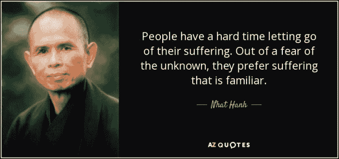

# 我今天被恐惧吞噬了

> 原文：<https://medium.com/swlh/i-was-consumed-by-fear-today-ecdb6b5dbca3>

在我的创业旅程、**中，偶尔我会让恐惧战胜我。**

我会感觉很暴躁，没有心流。

当它发生时，我永远也不能找到原因。

可能是因为我今天早上没有冥想，和一些朋友进行了一次不太愉快的谈话(我发现这越来越有害)，睡眠不足，或者我的博客没有我想象的那么快增长。

我根本无法集中注意力。**我试图专注于工作，摆脱它，但我做不到。**

我听说企业家会变得非常孤独。我想我现在感觉到了。

我想吐，但是吐不出来。

我看着我的女儿们，但我非但没有感激和高兴，反而感到非常害怕。

恐惧使我下沉，我努力保持漂浮，但我越挣扎，我越下沉。

直到一天快结束的时候，我才开始感觉好些。

> 我认为时间是有帮助的。不去想它会有帮助。走进大自然会有所帮助。

我很幸运，在晚上晚些时候遇到了一位经验丰富的企业家，我和他分享了我的感受。

他向我保证他去过那里，这是旅程的一部分。

虽然他告诉我的我已经知道了，但谁说这有关系。

我不确定你是否和你亲近的人有过类似的经历，但是我妻子告诉我她会告诉我很多次类似的事情，我从来不会听，但是当别人说的时候，我会跟着说。

我从来没有意识到，事实上，我甚至没有意识到她告诉我类似的事情。我会责怪她没有早点告诉我。

**也许这是一个认知问题如果你主观上认为没有经历过同样经历的人给你一些建议，你的大脑甚至不会听或意识到。但是当你尊敬的人告诉你一些事情的时候，你只是下意识的赞同并跟随。**

我想这就像你的父母告诉你做一些事情，而你却做了完全相反的事情。

我想成为一名企业家的原因之一是与我的女儿们分享我的经历，教她们克服恐惧，勇敢地生活。

我想确保我自己先面对这些问题，这样我就可以给我的女儿们适当的建议，而不仅仅是告诉她们总是走安全的路线。

> ***这位经验丰富的企业家告诉我要持之以恒，要有恒心，要有耐心。***

那天快结束的时候，我稍微好了一点，做了一些冥想，这也很有帮助。

我认为这是因为我们的大脑是如何工作的，**在困难时期，我们很容易陷入推断未来的陷阱**。

我也碰巧看到了雷伊·达里奥的这个很棒的视频。它提醒我，我只是在经历一个企业家生命中普通的一天。

## 这篇文章发表在 [The Startup](https://medium.com/swlh) 上，这是 Medium 最大的创业刊物，有+398，714 人关注。

## 在此订阅接收[我们的头条新闻](http://growthsupply.com/the-startup-newsletter/)。

