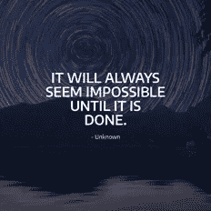
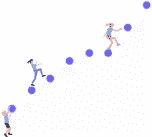

# 我在内容和社交方面从 0 到 100%。以下是我学到的。

> 原文：<https://medium.com/swlh/i-went-from-0-to-100-on-content-social-heres-what-i-learnt-c20c7ef836ca>

## 我的旅程从认为它们听起来都被高估，到每天制作内容和发推特。

Photo by [Simon Migaj](https://unsplash.com/photos/j2skX7Pw4vQ) on Unsplash

如果一年前你问我对社交媒体和内容营销的看法，我会这样回答。

> 当然，社交对于和朋友保持联系很重要——但仅此而已。
> 
> 内容？花几个小时写一堆文字或者制作一个视频对我有什么用？

我认识一些生活在社交媒体中的人，我也听到了很多我应该这样做的理由。

我忽略了，很长一段时间没有听——我对它毫无兴趣。

最终，我屈服了。

> 我决定从 0 到 100%依赖社交媒体和内容。

我开始在 Twitter 上开玩笑，在 Medium 上编故事，在 Instagram 上#gramming，最近，在 YouTube 上向其他人展示如何设计。

我仍处于旅程的早期阶段，但我已经开始看到成果，最近我的粉丝达到了 15，000 人。这是我到目前为止学到的东西。

## 创建内容需要大量的时间和精力

我从来不认为创作内容需要付出很多努力。

因此，我开始了我的第一次冒险，写了一篇名为**营销反思的博客。**

它最终不太像营销，更像是“灵感”的引用，但我最终花了很多时间在内容创作上。

> 在过去的 240 多天里，我几乎每天都会发布 4-5 条引文。

An example of one of my quotes. Credit to Simon Migaj for the photo.

虽然事后看来我的努力有点极端，但我讲这个故事是有原因的。

> 创建内容需要非常非常长的时间，尤其是当你试图定期发布内容的时候。

如果你想创造一些好的内容，确保给自己足够的时间来实现它。

## 如果你想要成长，你需要与他人互动

我发现我的成长只有一部分来自于发布我自己的内容。

> 走出去和与他人互动迅速贡献了我的大部分观众的增长。

Interact with others if you want to grow your audience! [Undraw.co.](http://undraw.co)

我做了一个例行公事:寻找好的内容，留下深思熟虑的评论，喜欢高质量的帖子，与优秀的人联系。

那意味着大量的辛苦工作。

> 我知道我不能永远扩大这种努力，但在早期，它确实帮助我增加了我的观众。

如果你想增加观众，试着和你的观众以及你感兴趣领域的其他人交流。你可能会发现他们会对你有所回应。

## 尝试去发现你的观众喜欢什么

我读了**很多**那些拥有大量读者的故事，最终淹没在一系列经常相互矛盾的提示中。

One of these tips should work! [Undraw.co](http://undraw.co)

我遵循了一些提示，这导致了一些文章蓬勃发展，另一些崩溃。到目前为止，我流传最广的一篇文章是关于我把任何提示都扔出窗外，然后在不到一个小时的时间里写一篇自己的文章。

> 我注意到没有明确的“赢家”技巧或成功规则，所以我决定尝试一下。

我主要通过在 Twitter 上发布我的想法来做到这一点。如果我发现一个特定的想法得到了大量的参与，那么我就有了一个很好的基础来将其扩展到一篇文章或视频中。

> 每个人都有不同的背景和不同的受众——你需要找出他们喜欢什么。

如果你试图创造伟大的内容，找到一种方法，让你试验，并为你的观众找到“正确的”内容。

## 写文章是令人畏惧的，但也是我最有收获的练习

我最近的练习就是写文章，比如这篇！

我已经发表了大约 30 篇文章，并且进入了一些主要的媒体出版物(UX 星球&写作合作社)。

Plus, I find writing enjoyable. [Undraw.co](http://undraw.co)

我发现写作尤其具有挑战性，因为单词是非常字面化的东西。

“写错了”就无处可躲。

> 没有什么可以用语言来掩饰的。另外，有很多人不害怕让你知道他们是否认为你错了。

也就是说，写作是我迄今为止最有收获的旅程。我有过工作机会，自由职业，Twitter 上有数百次分享，人们说他们刚刚读了我的文章。

> 如果你想“获取内容”,考虑一下写作是否可以成为你内容腰带中的另一个工具——对我来说，这是一个至关重要的工具。

## 结果需要时间——但结果可能会很棒

创建内容的早期可能会令人沮丧。

> 在内容上投入了大量的时间，却发现只有 10 到 15 个人参与其中，这可能是很困难的。

虽然我的文章不再面对这个问题，但这花了很长时间。刚开始制作视频，自己又面临这个问题。

> 你不能一开始就让自己止步不前——我们都必须从某个地方开始

我决定重新规划我的目标，用稍微不同的眼光看待事情。当时，我把我的 2000 万观众视为 10K 的 20%，而不是 10 万观众的 2%。

Slow and steady wins the race. [Undraw.co](http://undraw.co)

如果我一直认为“太大了”，我可能会放弃。

但是，隧道的尽头有光明。

正如我上面提到的，写作给我带来了很多机会，上个月，我写的文章获得了 17000 次阅读，赚了我的第一笔钱。

> 上个月，我的文章被阅读了 17000 次，从其中一些文章中赚了钱，并在 Twitter 上产生了 12 万多个印象。

如果你开始的时候没有太多的观众，记住你不会失去什么，我们都必须从某个地方开始。你只需要为之努力。

## 谢谢——如果你喜欢这篇文章，请告诉我！

内森·奥尔索普是来自澳大利亚悉尼的产品经理/设计师。这篇文章最初出现在我的[博客上。](http://nathanallsopp.com/blog/from-0-100-on-content-social-heres-what-i-learnt)

## 这篇文章发表在《T4》杂志《创业》(The Startup)上，这是 Medium 最大的创业刊物，有 306792 人关注。

## 在这里订阅接收[我们的头条新闻](http://growthsupply.com/the-startup-newsletter/)。

