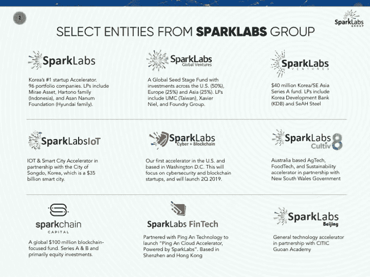
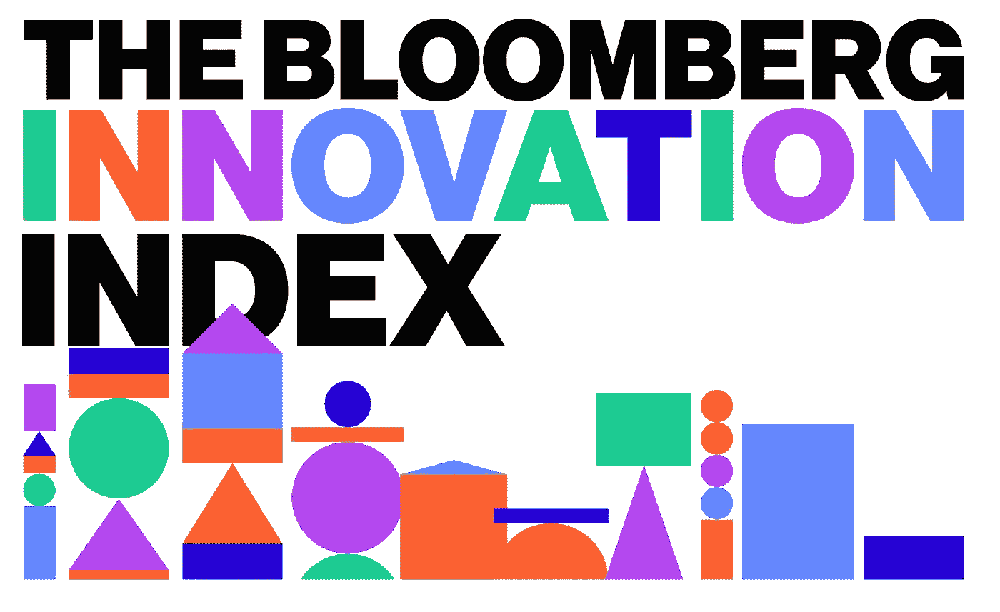
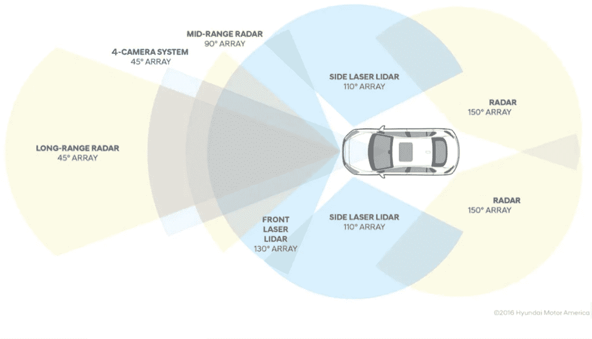
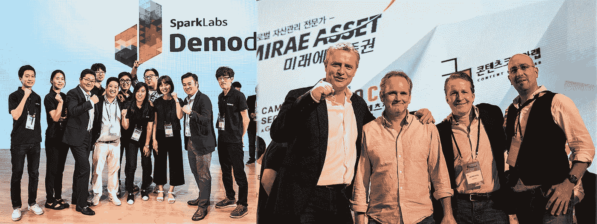

# 我希望我知道如何戒掉你，韩国

> 原文：<https://medium.com/swlh/i-wish-i-knew-how-to-quit-you-south-korea-a618caeb73b4>

( [*原载于朝鲜日报*](http://it.chosun.com/site/data/html_dir/2018/11/26/2018112602733.html) *，这是南韩最大的报纸，我在那里有每月专栏*

自从 2012 年我在首尔与 Han joo Lee 和 Jimmy Kim 共同创立了我们的第一个加速器韩国 SparkLabs 以来，我们已经小心翼翼地将我们的加速器从亚洲扩展到北京、台北、香港和悉尼。最近，我们在亚洲以外的地方发展到了马斯喀特、阿曼和华盛顿特区，明年我们希望在欧洲建立我们的第一家分公司。我们的全球种子基金[spark labs Global Ventures](http://www.sparklabsglobal.com)自 2014 年初以来一直很活跃，我们 70 项投资中的大部分都在美国。总体而言， [SparkLabs Group](http://www.sparklabsgroup.com) **已经投资了 6 大洲的 200 多家公司**，随着我们继续加强我们作为创新生态系统建设者和投资者的角色[，我们的增长](https://www.slideshare.net/bernardmoon/sparklabs-group-overview-11-2018)将出现在现有和新兴的创业热点地区。

8 accelerators, 3 venture capital funds, 6 co-working locations in Seoul, and more news to come

我个人被认为是硅谷(加州帕洛阿尔托)的联合创始人。由于我在 SparkLabs Global 上更加活跃，我看到我们的身份在亚洲和美国之间分裂，并越来越全球化，**但南韩仍然是我们身份的支柱**。不管我们喜欢与否，它仍将是 SparkLabs 身份的重要组成部分，因为韩国在全球舞台上仍然举足轻重。

彭博连续五年将南韩列为世界上最具创新力的国家。自 20 世纪 90 年代末以来，它一直是韩国在宽带、移动和无线技术领域的领导者，但它也在区块链和加密领域开辟了新的领导道路。

韩国的企业领袖三星、LG、现代、SK 等继续影响着全球经济市场。更重要的是，他们活跃在为韩国的未来做好准备的关键行业:移动、电池/能源、汽车和电信。

Hyundai Motors Autonomous Driving Research

除了韩国的创新领导地位，一个同样重要的因素是这个国家的影响力文化。美国的全球领导地位从来不仅仅依靠其经济实力，而是与其文化帝国主义相结合。例如，它从来不仅仅是麦当劳在全球的扩张，而是从 20 世纪 70 年代开始销售美国的生活方式和快餐文化。然后是 20 世纪 90 年代出售美国咖啡的星巴克

McDonald’s Japan’s “Big America” campaign

在全球范围内，尤其让欧洲人沮丧的是，他们对咖啡的标准更高。好莱坞一直是美国最强大的软实力，美国流行音乐是第二大软实力。最近，自 20 世纪 90 年代以来，职业体育的影响，如 NBA 和[迈克尔乔丹](https://www.slamonline.com/kicks/michael-jordan-global-impact/)的影响，增加了美国在世界舞台上的领导地位。

在亚洲及更远的地方，韩国已经成为美国文化帝国主义的小弟弟。从韩国流行音乐到电影、电视节目、美容产品到食物，韩国的文化影响力在过去的十年里已经遍及亚洲，甚至影响了美国文化的某些方面。

*PSY performing “Gangnam Style” with MC Hammer at the 2012 American Music Awards*

Kpop 的明星从[少女时代](http://girlsgeneration.smtown.com/) (2010)到[大爆炸](https://lifestyle.abs-cbn.com/articles/6972/chalk/in-focus-why-the-boys-of-bigbang-are-still-the-kings-of-k-pop/) (2011)到 Psy (2012)到[两次](http://twice.jype.com/) (2015)到[权志龙](https://www.facebook.com/gdragon/) (2016)到 BTS (2017)到[黑粉](http://www.ygfamily.com/artist/main.asp?LANGDIV=K&ATYPE=2&ARTIDX=70) (2018)都是韩国影响地区内外的创作型音乐人才的代表。BTS 登上了《时代》杂志 2018 年 10 月 22 日的封面，时代将他们命名为“下一代领导者”之一**(**[**“BTS 如何接管世界”**](http://time.com/collection-post/5414052/bts-next-generation-leaders/) **时代)。**

亚洲各地、世界各地的亚裔社区以及阿根廷和智利等随机国家都在虔诚地观看韩剧。**[**【太阳的后裔**](https://www.hulu.com/series/descendants-of-the-sun-21d3967a-6112-45b1-a1fc-068d717e9ece) **】，由 KBS 打造，是 2016 年国内#1 的节目**。**

**韩国仅在科技领域或创意产业上的实力不足以让它成为一个国家，但这两者结合在一起，让它超越了其重量级。它成为一个充满活力和影响力的国家。这就像阿博特和科斯特洛的表演，比这两位喜剧演员单独表演要有趣得多。或者，如果只有史蒂夫·乔布斯或史蒂夫·沃兹尼亚克，苹果就不会成立。**团队有乘数效应，国家的影响力也有乘数效应**。韩国只是世界上少数几个具有经济和文化影响力的国家。**

****

**At the end of DemoDay7 in Seoul. Included in pictures are Jimmy Kim (Co-founder at SparkLabs Group), Eugene Kim (Co-founder), HanJoo Lee (Co-founder), Frank Meehan (Co-founder), Jay McCarthy (Co-founder) and Rob DeMillo (Venture Partner)**

**这就是为什么随着 SparkLabs 集团的持续发展，韩国仍将是我们的一大支柱。这就是为什么我们欣然接受成为韩国非官方创新大使的角色。如果不是这样，那我们就太傻了，因为我们的团队真的相信，至少在未来十年甚至更长时间内，韩国都将在全球发挥重要作用。**

****

**SparkLabs Korea’s DemoDay11 on June 21, 2018**

****

## **这篇文章发表在 [The Startup](https://medium.com/swlh) 上，这是 Medium 最大的创业刊物，拥有+393，714 名读者。**

## **在这里订阅接收[我们的头条新闻](http://growthsupply.com/the-startup-newsletter/)。**

****