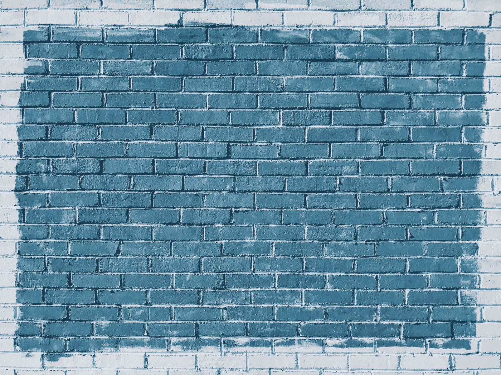

# 我不会称之为作家的阻滞本身

> 原文：<https://medium.com/swlh/i-wouldnt-call-it-writer-s-block-per-se-d36380847ea3>

## 当你没有那么投入的时候你会怎么做:去做。

Photo by [Patrick Tomasso](https://unsplash.com/photos/QMDap1TAu0g?utm_source=unsplash&utm_medium=referral&utm_content=creditCopyText) on [Unsplash](https://unsplash.com/search/photos/block?utm_source=unsplash&utm_medium=referral&utm_content=creditCopyText)

但最近我一直坐在这里，盯着空白的屏幕，试图找出如何开始。手知道它们应该做什么，但是大脑有点模糊。

所以我对自己说，因为我听到一点点自我对话是件好事，“尼克，写吧。仅此而已。”

因为当你真正开始的时候，就真的是这样了。我知道这是事实，因为我去年大部分时间都是这么做的。当我没有东西可写的时候，我就写了。

或者当我觉得卡住了，我就写。

或者根本想不出点子的时候，我就写。

公式很简单:没有感觉？动手吧。

现实是，不是每天都是你最好的一天。有些日子会比其他日子好，个别结果会有所不同。但在大多数日子里，你通常都必须灌注泵，尤其是当你感觉不舒服、睡眠不足、压力大或者生活中遇到许多障碍时。

老实说，你可以只是吹掉它，不去做，不去寻找绕过障碍的方法。那可能有用。那很简单。但是又一天过去了，你没有写作，没有开始或完成那个项目。但那不是很原创。

此外，任何人都不能-做某事。很时尚。真正的挑战是在最困难的时候坐下来，当它看起来不起作用的时候。做好工作。

在那些充满挑战的日子里，你只是没有那么投入。这意味着你的能量很低，你的创造性思维不如它应该的那样敏锐，而且你情绪过度紧张。还有什么可写的？整个世界都已被书写。至少看起来是这样。

最好的办法是去 meta，把你的思想放在挑战上。写下你的感受和经历，确保你用明确的词语描述。是什么阻碍了你？

这样做的好处是，你可以客观地看待你的感受，它是如何表现出来的，并试图解决你最初是如何陷入这种困境的困惑。

我过去几年的日记里充满了这样的条目。这是非常有益的内心工作，让你能够确定原因和结果，可以帮助你在下次像这样的发作时避开。因为，这才是真正的目标:意识、识别和操作。

虽然你可能会花上几千字来谈论这个话题，但这绝对是值得的，因为你在学习。你在学习什么行得通，什么行不通，什么行不通。你正在学习什么激励你，什么给你能量，什么像吸血鬼一样把能量从你身上吸走。

这种学习的好处是你可以把它应用到生活的其他领域。如果你有一份白天的工作，有时你会感觉不到。没关系。这是人类的正常进程，尽管我们的雇主(因此，我们)并不总是这样看。出于某种原因，我们喜欢将我们的人性与我们的工作分开，好像我们是没有感觉或没有需求的机器，至少从朝九晚五开始，或者更糟。

但我们不是机器。

我们是人类，人类拥有强大的情感，在我们已知的宇宙中似乎没有其他生物拥有的情感。这些情绪经常成为我们行为的驱动力，如果我们想每天前进一点点，就必须学会掌握它们。这种精通来自于在你不想做的时候做工作，并反思这种经历。记笔记，你以后会需要的。

这是最简单的自我提升方式，你不需要用手册来描述。尽管实体书店(以及虚拟书店)的书架上堆满了可以推荐一些策略的书籍，但我发现，如果你只是专注于如何随着时间的推移提高自己，你会做出一些小的改变，这些改变最终会积累成大的红利。

但问题就在这里。没有什么能给我们提供我们所寻求的即时满足感。相反，我们获得的收益看起来几乎察觉不到，因为它们很少在行为的剧烈波动中表现出来。而是这里一点，那里一点。

举个例子，我目前发现自己的不适。我刚从繁忙的周末回来，在那里我在四天内打了五场曲棍球比赛。这是巨大的身体和精神压力。再加上我现在的日常工作压力很大，我住的太平洋西北部现在是仲冬，在过去的几个月里，我的生活非常忙碌。我发现自己在我现在的地方，这应该不是一个小的奇迹。

那么我能做什么呢？

我现在可以做几件简单的事情让火车回到正轨。

首先，我可以有规律的睡眠。仅此一项就能创造奇迹扭转局面。如果你想了解所有的科学知识，最近的研究表明，睡眠经常被忽视，但对我们自身最基本的功能来说却非常重要。睡眠不足导致睡眠剥夺，它会慢慢地从里到外腐蚀你。缺乏睡眠会导致各种无意识的决策，以及你的身体、思想和能力的退化，最终你会被送进医院。所以当你可以的时候，最好去睡觉。

第二，我可以恢复我的日常生活。我的日常生活被打乱了一段时间，这造成了一些认知失调。我们的大脑和身体受到日常生活的熏陶。当你的大脑和身体想要回到原来的常规或者走向新的体验时，我正在经历这种不和谐，而我的大脑拒绝为这两者支付转换成本。所以我被困住了，直到我有所行动。把以前的结构放回原位会给我足够的动力让我重新回到游戏中，除非新的结构更令人满意。考虑到它并没有给我的生活带来太多的改善，这个选择似乎显而易见。

第三，我可以确保我得到足够的营养。当你饿的时候吃东西，而不是因为你觉得你应该吃。倾听你的身体，它往往比你的大脑更了解这里。充足的食物和正确的食物种类将确保我得到我需要的功能。

最后，我可以确保我有足够的休息时间。我对自己了解的一件事是，我很内向，在激烈的活动后，我需要一些恢复时间，尤其是那些我经常参加社交活动的活动。通过确保我调整自己的工作节奏，并给自己提供在任务之间恢复的机会，我会更快地回到游戏中。

这里没有火箭科学。只是一些简单的修正，我知道这是解决这个难题的正确方法。我只需要实施它们，几天后，我会发现我曾经减弱的创造力正在恢复，我的想法会变得轻松而清晰。最重要的是，工作将开始流动。

在那之前，我知道我会继续奋斗。在这种时候事情就是这样。

在你只是不想做，但你知道你应该做的日子里，你可以转向内在找到主题并继续下去。自省会帮助你更好地了解自己，平衡身体的输入和输出。只要你能做到，就去做，并坚持下去，你会发现即使你并不热衷于此，你也可以写作——或者画画，或者创建电子表格——无论你热衷于什么。

试试看。结果会让你吃惊的。

如果你喜欢这个故事，[注册我的电子邮件](http://www.storyofthewind.com/join/)以获得我写的所有故事，包括每月的综述和其他好东西。如果这是太多太快的承诺，至少你可以通过分享这个故事来打动你的朋友。

感谢阅读！

## 这篇文章发表在[《创业](https://medium.com/swlh)》上，这是 Medium 最大的创业刊物，有 291，182+人关注。

## 订阅接收[我们的头条新闻](http://growthsupply.com/the-startup-newsletter/)。

