# 我和莎士比亚一起钓过埃隆·马斯克。然后我把它搬上了舞台。

> 原文：<https://medium.com/swlh/i-wrote-a-17-000-word-shakespearean-roast-of-elons-moronic-bore-hole-82a089ab98f>

## 介绍[被困埃隆豪宅](https://powertrain.press/collections/frontpage/products/trapped-in-elons-mansion)。主要人物:埃隆·马斯克、格莱姆斯、阿泽莉亚·班克斯、杰伊·Z、杰瑞特·沃克、挪威公主、证券交易委员会委员等等。

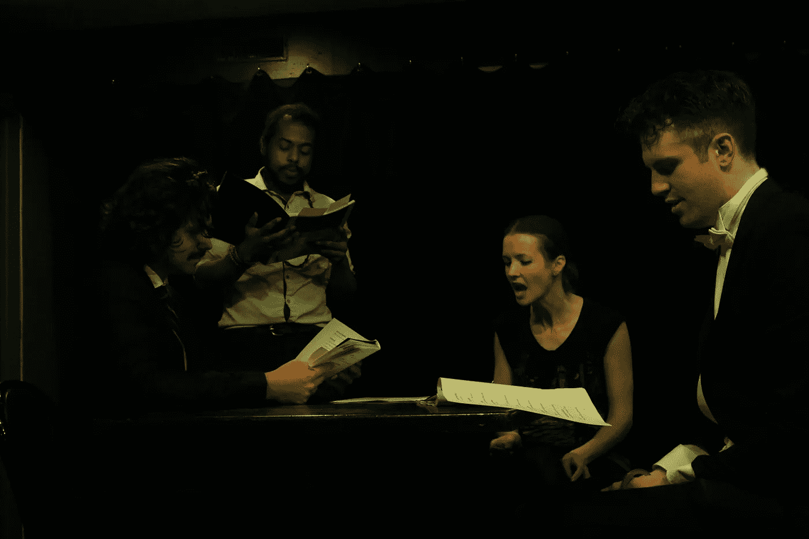

The SEC Commissioner, Jay Z, Grimes, and Elon Musk. (Full paperback + PDF [here](https://powertrain.press/collections/frontpage/products/trapped-in-elons-mansion).) 📸👉 Hannah Judge

去年 12 月，埃隆·马斯克和我在 Twitter 上吵了一架。马斯克的爪牙们嘲弄了我、我的朋友贾勒特和我们共同的挚爱:莎士比亚。

我们称埃隆被误导了。他反过来称我们为[白痴](https://twitter.com/elonmusk/status/941500121564332032)。

好吧好吧，火箭人。你这次惹错了剧作家。

这是一个关于一系列愚蠢的推文如何产生 2018 年最佳(阅读:唯一)抑扬格五步喜剧的故事。这是一个关于一个笑话如何像病毒一样传播，失去控制，并占领了一座城市的故事。以及我的生活。这是一个关于格莱姆斯的故事。这是一个关于阿泽利亚银行的故事。这是一个关于伊隆·马斯克(Elon Musk)嗑药的故事，他躲在钻孔里，用电锯追着女士们跑，在推特上发微博说自己进了监狱，最终被杰伊·Z 和挪威公主救出。

这也是我如何采用一种生硬的、古老的文学形式(诗剧)并将其塑造成当代形式的故事。这是一个通过清理一个裂缝小屋来解决作家瓶颈的故事。这是一个关于业余演员成功完成“*2018*事件”的故事，他们如何避开几乎确定的灾难，以及——也许是最重要的——向狂热的讨厌莎士比亚的隧道爱好者埃隆·马斯克复仇。

事不宜迟…

# 被困在埃隆的豪宅里:离演出开始还有 12 个月。

> [乔·贝果(JOE BAGEL)在他的地下室里醉醺醺地发推文给埃隆(ELON)，他在圣诞节假期里无聊透顶。]

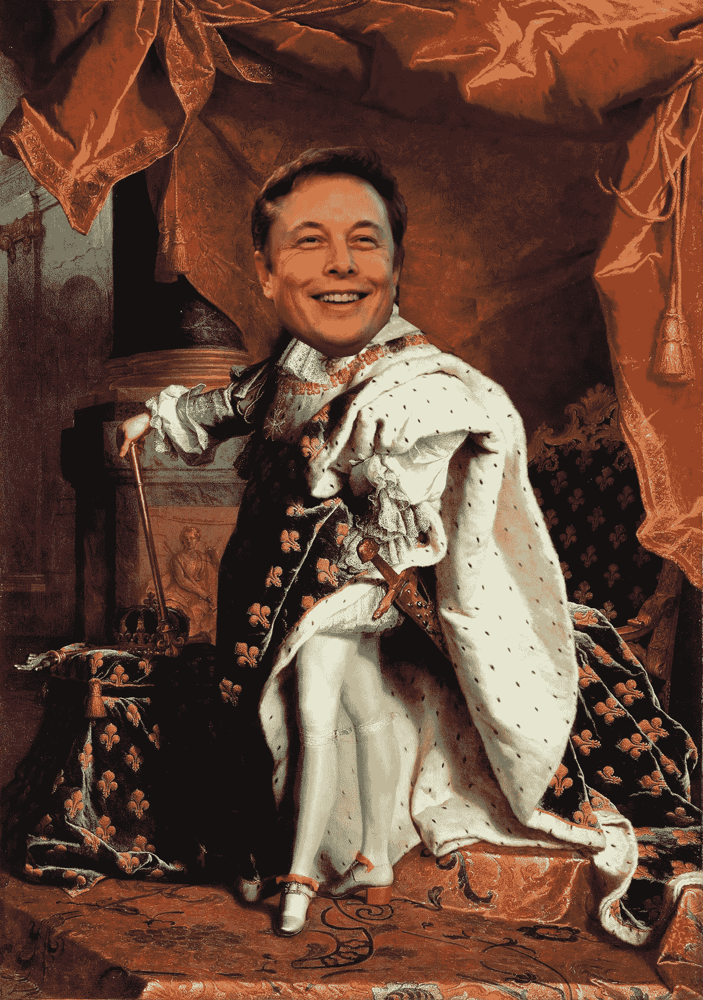

2017 年 12 月 14 日，埃隆·马斯克发火了。

他愤怒的对象？不是别人，正是美国最著名的交通专家贾勒特·沃克。沃克刚刚对马斯克的隧道挖掘初创公司 *The Boring Company 进行了严厉(但措辞礼貌)的抨击。无聊公司还没有在洛杉矶建造出它的巨型隧道。但它正忙于宣传其“公共交通”解决方案，该方案承诺在城市地下分流单人汽车。*

What Elon promised in December 2017.

在媒体发现伊隆恶作剧的一年前，杰瑞特·沃克就参与了此案。**[**2017 年他要求伊隆**](https://twitter.com/humantransit/status/941552769357438981?lang=en) **:** 与其建造专为乘坐单人交通工具出行的精英们设计的隧道……为什么不为*地铁*修建隧道——每列火车可以容纳 1000 多人？？？🤔**

**这似乎是一个合理的问题。即使是在最华丽的隧道里，最聪明的汽车也永远无法像公共交通一样运送那么多的人，那么高效，那么便宜。诚然，这不是世界上最性感的争论。贾勒特正在做一个合乎逻辑的、不可靠的论证。他认为只有书呆子才会注意到。**

**但随后，他引发了亿万富翁野兽:**

**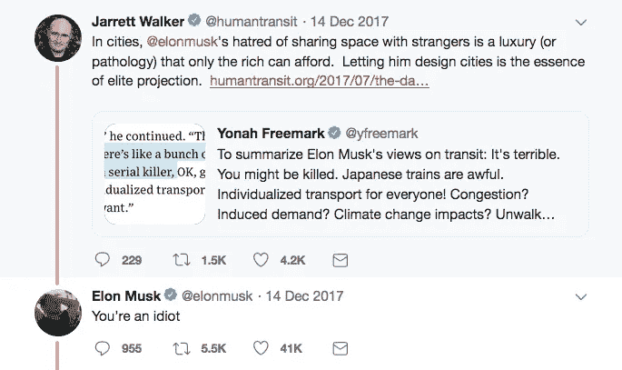**

**…之后埃隆很快就道歉了。**

**…但在一个粉丝的催促下，他加倍下注。**

**这是埃隆·马斯克在接下来的 12 个月里犯下的众多错误中的第一个。他会称一名救援潜水员为“pedo”。因[欺诈](https://www.nytimes.com/2018/09/29/business/tesla-musk-sec-settlement.html)被起诉。和乔·罗根一起抽一根卷得不好的大麻烟。并且失去他无人监管的推特特权。**

**但我在乎什么？我不在乎名人八卦。当然，除非那些名人开始侮辱我的英雄。埃隆侮辱了我的两个人:我的交通英雄，杰瑞特·沃克。我的文学英雄，**

> **威廉他妈的莎士比亚。**

**埃隆现在不只是说贾勒特是个白痴。或者一个“[人类猫模因](https://twitter.com/elonmusk/status/943875606130782208)”。他开始嘲笑贾勒特的莎士比亚研究博士学位——这是他在成为交通规划师之前获得的。**

**最糟糕的是？**伊隆斥吟游诗人为“** [**烂小说**](https://twitter.com/elonmusk/status/943911396177096704) **”。真是个混蛋！****

**立刻，我知道我必须反击。对抗埃隆。对抗他那些几乎不识字的 techbro 马屁精。但是我怎样才能报仇呢？**

**这个机会要过好几个月才会出现…**

**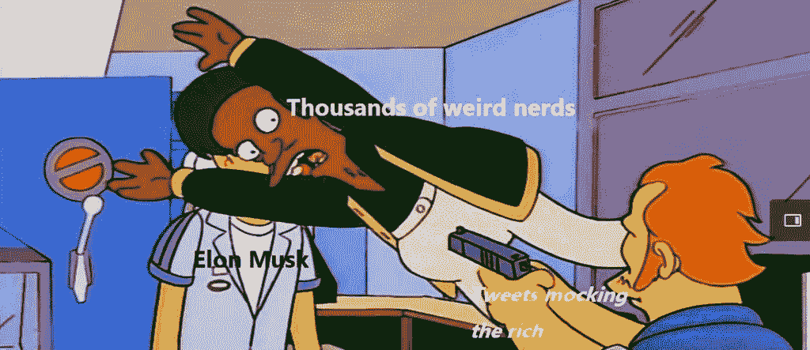**

## **🚇🔥抄[节略剧](/@bagelboy/trapped-in-elons-mansion-a-cybercomedy-in-shakespearean-verse-5dfa7363b68b)。或者[获取 PDF +平装](https://powertrain.press/collections/frontpage/products/trapped-in-elons-mansion)🚇🔥**

# **被困在埃隆的豪宅里:离演出开始还有 6 个月。**

> **乔·百吉饼出场了，他正在清理一个蒙特利尔的破棚屋，这样他终于可以拥有一个写作工作室了。]**

**在我的日常工作、写作研讨会和对伟大的加拿大小说的半心半意的尝试之间，我和五十个朋友一起度过了 2018 年的夏天。**

**我的朋友奥斯汀、埃文和杰森刚刚租下了高原上一个巨大的两层楼的场地/工作室。这是蒙特利尔最高档化的街区——那里的高级酒吧、咖啡馆和音乐会场所都已经[歇业了。当男孩们听说有一个便宜的租赁时，他们抓住了这个机会:他们将经营高原上唯一的(也许是最后的)DIY 艺术家空间，离莱昂纳德·科恩的房子只有几个街区。](/@bagelboy/a-young-gentrifiers-guide-to-mile-end-living-ec064e1cadb5)**

**下班后和周末，我们都会去帮男孩们把多年来积累的垃圾堆出来。(它被一位前体育酒吧大亨用作储藏空间。)**

**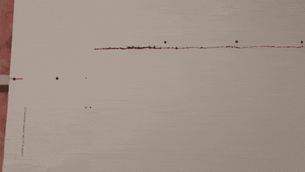**

**Austin making studio doors.**

****

**Evan fixing the sink.**

**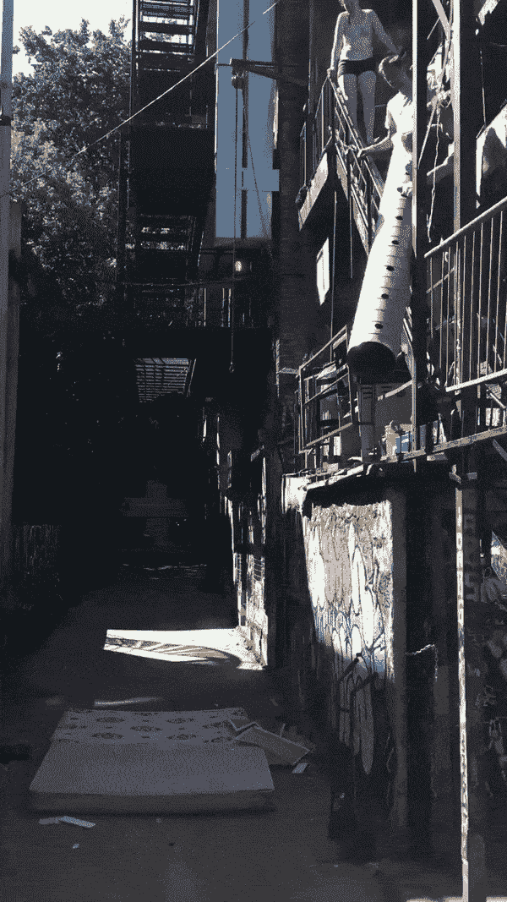**

**Austin & Evan passing me a big ass pipe.**

**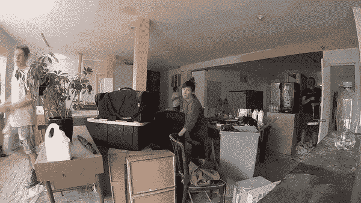**

**Whole crew painting.**

**我们总共搬了超过 10 辆 U 型车的垃圾，带着椅子、冰箱、桌子以及其他任何东西，艰难地在这座四层楼的大楼里走来走去。然后，每个人都油漆，焊接，锯，比萨饼将他们的方式到终点线。**

**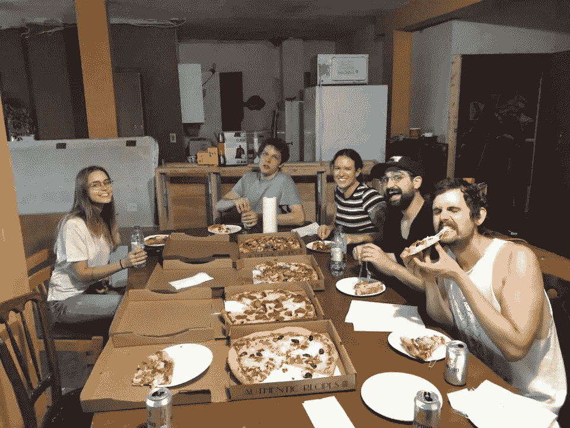**

**🍕📡🍕**

**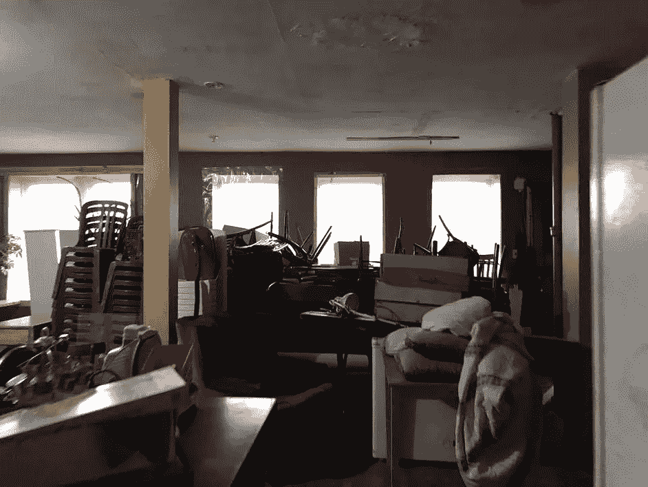****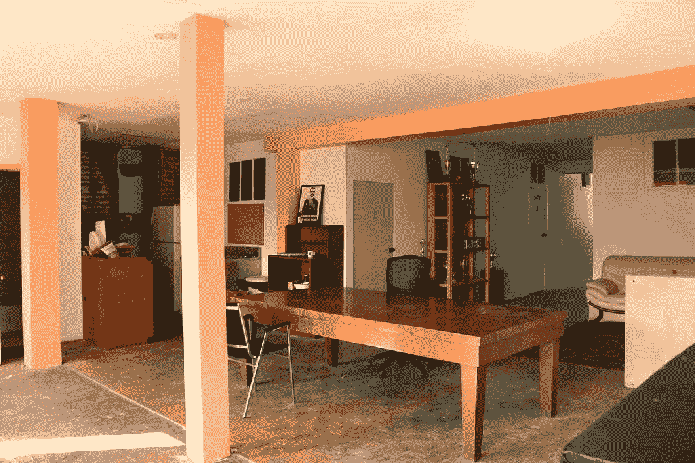**

**[**Satellite City**](https://www.kijiji.ca/v-view-details.html?adId=1398896838): before and after.**

**该说的都说了，该做的都做了，我得到了一个工作室。**

**Desk. Macbook. Double IPA. The playwright trifecta.**

# **被困在埃隆的豪宅里:离演出开始还有 3 个月。**

> **[乔·百吉在他的工作室里醉醺醺地发着莎士比亚的微博。]**

**在夏季的垃圾堆之间，我正在处理另一堆困难的东西:威廉·莎士比亚戏剧集。我一直是一个超级粉丝，但由于某种原因，今年夏天我开始像患有抑扬格五音步症一样弹奏。我读得不够快。《泰特斯·安德洛尼克斯》、《哈姆雷特》、《错误的喜剧》、《仲夏夜之梦》、《无事生非》、《特洛伊罗斯与克瑞西达》。**

**然后在 8 月份[当说唱歌手 Azealia Banks 出现在埃隆·马斯克的豪宅与流行歌星 Grimes 合作时，她陷入了一个人质的境地，在那里她连续几天无法逃离埃隆](https://www.vox.com/2018/8/16/17692700/azealia-banks-elon-musk-grimes-explained)——我得出了一个自然的结论:**

**我需要用莎士比亚的诗句写一个关于这个的剧本。**

**我从摄影棚的冰箱里拿了些啤酒，开始拍摄第一场戏:**

**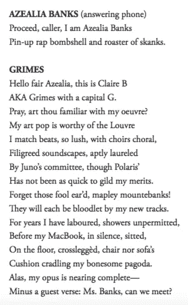**

**然后，一旦我有了它，我就[把它发在推特上](https://twitter.com/mtlbagelboy/status/1031747303755984896)看看人们是怎么想的。普遍的反应是积极的:**

**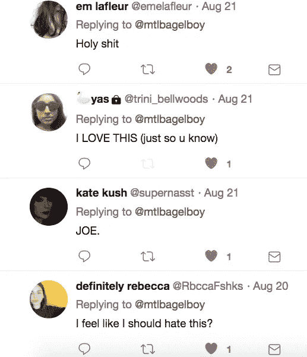**

**好吧。我发现了一些东西…也许吧。**

**但是我如何从一个 250 字的片段变成一部完整的剧本呢？**

**(在那之前，我从未完成过比短篇小说或博客文章更长的作品。)**

**答案让我自己都感到内疚:[我策划了一场脸书活动](https://www.facebook.com/events/231401911059606/#)。将该剧安排在 11 月 2 日上演。然后我邀请了 50 个朋友来。其中一个问她是否可以出演，我说可以。现在狗屎是真实的。**

****游戏开始，伊隆。****

## **⚡️🚀👌[埃隆·马斯克不想让你读这篇文章](http://elonsmansion.com/play.pdf)👌🚀⚡️**

# **被困在伊隆的豪宅里:离演出开始还有一个月。**

> **乔·百吉饼，睡眠不足，最近刚和女友分手，正疯狂写作，试图赶上最后期限。]**

****

**接下来的几个月极其痛苦。我醒来，写作，去工作，写作，去工作室，写作，去咖啡馆，写作，回家，写作，所有这些都是在我空闲的时候阅读莎士比亚来寻找灵感。**

**我会给我的朋友福恩、乔里和埃琳娜发短信，告诉他们剧中的片段，看看他们对我的笑话和情节有何看法。然后我会去长跑和散步，找出改进的方法。随着 11 月 2 日的临近，我知道我不会赶上最后期限了，我感到压力很大。我的女朋友告诉我放弃这部戏…它不太受欢迎。虽然我知道我在开一个*玩笑，但这个玩笑一天比一天真实。有消息称，一个名叫贝果的莎士比亚迷正在写一部关于埃隆·马斯克的复仇剧。50 个被邀请的朋友已经膨胀到 1000 人“参加”脸书。如果我退出，那将是一个巨大的尴尬。***

**所以我把剧推到了 12 月 14 号。(迄今为止，埃隆反贾勒特的推文已经有一年了。)我完成了最后的场景。我问奥斯汀和埃文我是否可以预订楼下的场地。他们说“当然”。**

**写作结束了。但事实证明:写剧本是最容易的部分。**

**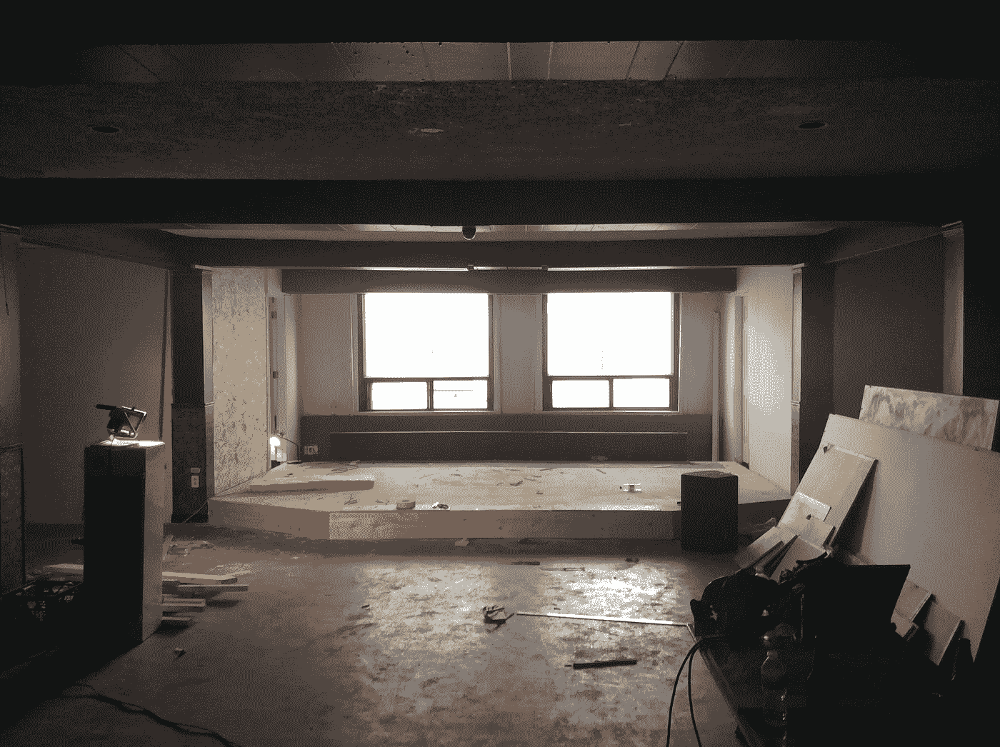**

**[**The Diving Bell**](https://www.facebook.com/divingbellsocial/)(sister venue of Satellite City) mid-construction.**

# **被困在埃隆的豪宅里:离演出开始还有两周。**

> **[乔·百吉饼出场了，他拔掉了自己的头发，拼命想找到 11 个演员来上演一场朗读会，一把电锯，一台能在 10 天内印出 300 本书的印刷机？？？]**

**事实证明，举办一场“戏”的阶段性阅读，需要的不仅仅是一场戏。它需要演员。它需要*剧本。*这需要*的道具。*需要*舞台指示。这需要排练。*需要*售票。*并且需要*书籍。***

**我一直打算把“戏剧”(舞台阅读)作为我完成“戏剧”(书)的动力，我会把它送给每一个来的人。**

> **书籍！我现在要成为一名真正的作家了！**

**当然，我完全没有印刷书籍的经验——而分阶段阅读正在快速逼近。我打了几个绝望的电话给印刷商，其中一个同意提前 10 天印刷我的书。但是他们说我必须在那天给他们拿到文件。**

**因此，我又绝望地打电话给经营蒙特利尔出版社的朋友。他们给我安装了一个 InDesign 模板，我花了好几个小时研究它，直到我找到一个可行的东西。几天后，我拿到了校样。(我问我是否可以做一些小改动——印刷工人笑了又笑。)尽管如此，证明还是有效的。我会及时拿到我的书。**

**所有剩下的？给我找几个演员。**

**[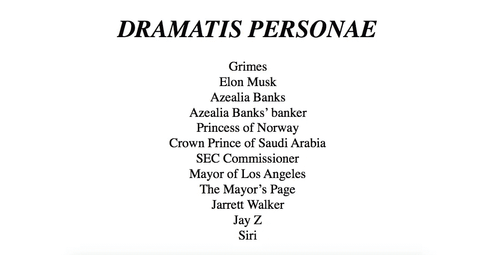](https://powertrain.press/collections/frontpage/products/trapped-in-elons-mansion)

😅🙌 Get the abridged play [here](/@bagelboy/trapped-in-elons-mansion-a-cybercomedy-in-shakespearean-verse-5dfa7363b68b). Orrrrr buy the full [PDF + papery paperback](https://powertrain.press/collections/frontpage/products/trapped-in-elons-mansion). 🙌😅** 

**当你在写你的第一部剧本时，你只是顺其自然。你不会真的担心你的戏有 12 个不同的角色。直到你的阶段性阅读前两周。你没有任何排练，你必须找到 12 个不同的人来背诵完美的抑扬格五音步。**

**在之前的几周里，我把我的外向朋友灌醉，强迫他们加入我的表演。福恩是第一个上船的，和格莱姆斯一样。然后伊恩，作为我的洛杉矶市长:**

**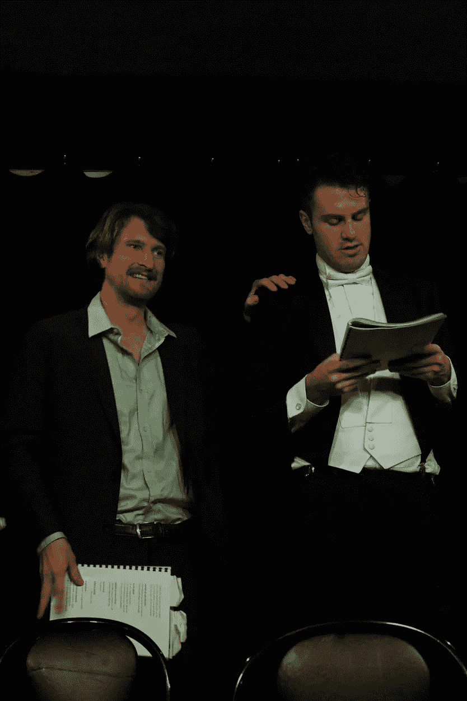****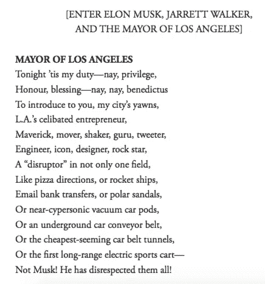

📸👉 Hannah Judge** 

**汤姆会是市长的听差。菲尔，阿泽利亚银行的银行家。我请纪尧姆扮演他作为证交会委员的最佳克里斯托弗·沃尔兹形象——他做到了。**

**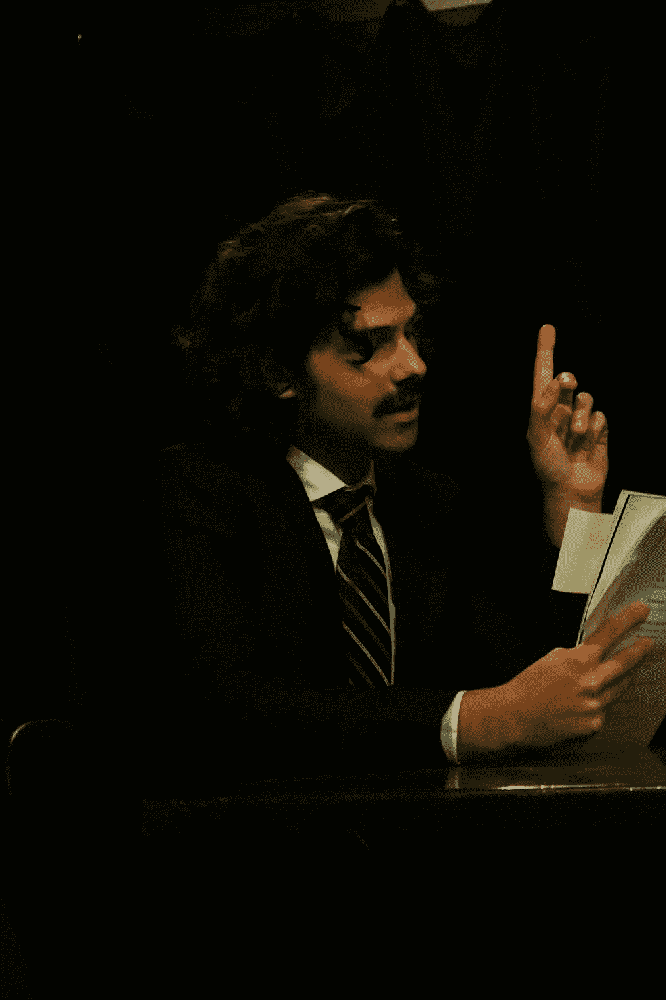****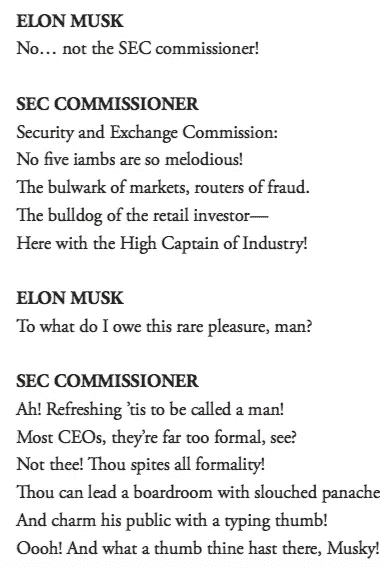

📸👉 Hannah Judge** 

**然后他的女朋友苏珊娜报名成为我的迷人的挪威公主。我的老朋友法布里斯会是沙特酋长。克里斯将成为 Jay Z。这让我们有:Azealia 银行，Siri，和 Jarrett 沃克投。(当然，我会成为埃隆。)**

**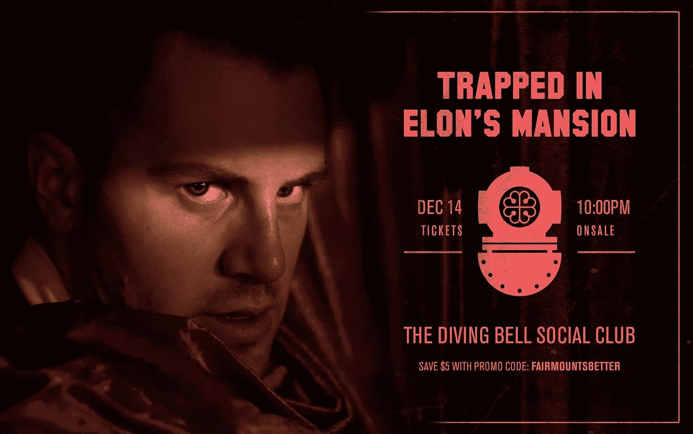**

**Photo by Mat MacQuarrie of [Deskfire](http://www.deskfire.co/). We sold out tickets in just three days.**

**Siri 从天堂落入了我的手中:一位名叫 Ellana 的 slam 诗人女神/文案/模特在脸书上给我发了一个好友请求——表面上看起来很兴奋，因为一个名叫 Bagel 的人将要主持一场对 Elon Musk 的网络经济烧烤。**

> **(她说她和 PayPal 黑手党成员约会过。也许她也有仇要报。)**

**我问 Ellana 她是否想成为 Siri，我们见面喝了一杯，进行了一次排练，她把它赶出了地球轨道。**

******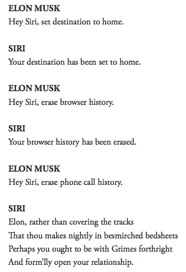****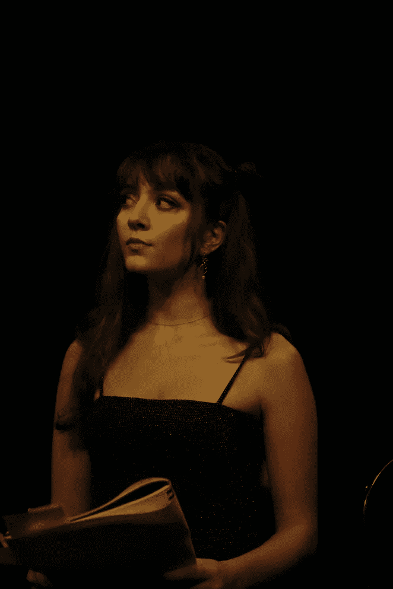**

**📸👉 Hannah Judge**

**现在是时候找到我们的杰瑞特·沃克了。我们的英雄。我们不切实际的奇迹。我在一个蒙特利尔演员 facebook 群中发了一个帖子，几个小时后加布里埃尔出现在我的工作室:**

**你好，杰瑞特·沃克。**

**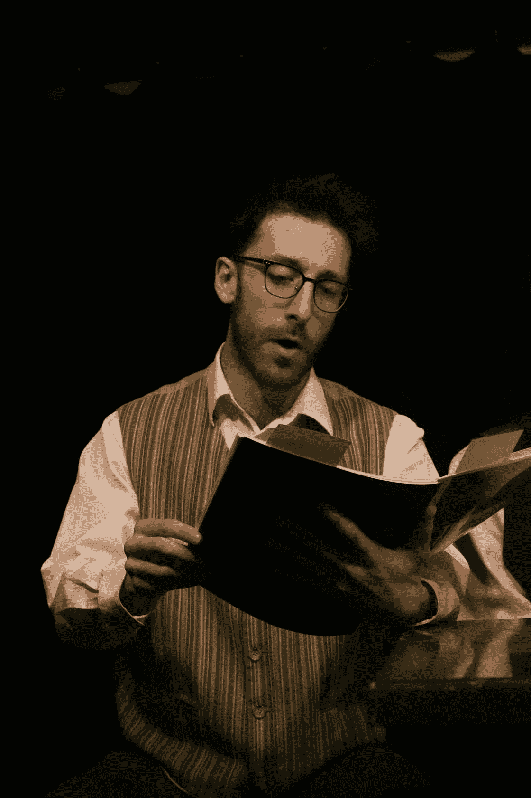****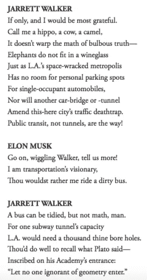

(He was so, so perfect.) 📸👉 Hannah Judge** 

## **寻找阿泽利亚**

**离表演时间还有两天。我们已经卖完了所有的票。人们会来的。然而，我们仍然没有任何人是 Azealia 银行。**

**我绝望了。我在做噩梦:游戏之夜的景象，贿赂观众替身并朗读阿泽利亚的部分。我问一个在公园扮演莎士比亚的女演员(“跟我的经纪人说吧”，她说)。)我问过共同的朋友。我问一位出演过*的女演员，你怕黑吗？我问了一个老熟人。我甚至问过阿泽莉亚本人。***

**我们进行了几次没有阿泽莉亚演员的排练——我的演员们开始紧张了。*我们会有一个完整的演员阵容吗？？？？游戏之夜会是一个无法挽救的烂摊子吗？？？*然后，不知从哪里冒出来一位名叫安娜的职业摔跤手，她从以太中出现并说她有兴趣。**

**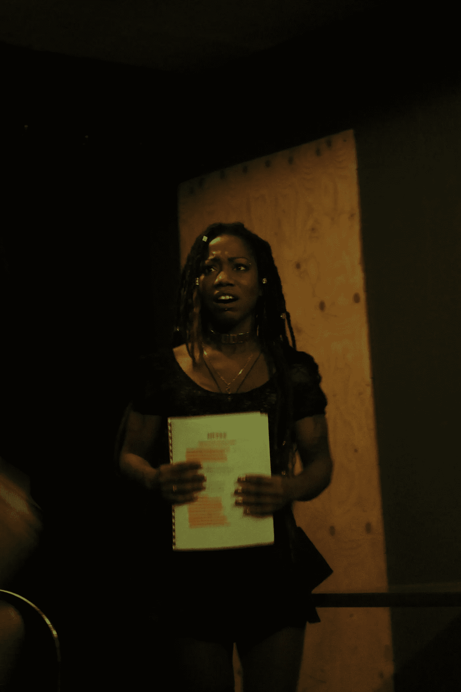**

**Our star!!!! **Buy the book…** [**plz???**](https://powertrain.press/collections/frontpage/products/trapped-in-elons-mansion) **😘** (📸👉 Hannah Judge)**

# **被困在埃隆的豪宅里:离演出开始还有 24 小时。**

> **[输入 JOE BAGEL，向宜家订购椅子，跳上出租车去印刷厂，拿起燕尾服，跑到 STAPLES 打印剧本，试图找到 JAY Z 的替代品？？？？]**

**墨菲定律指出:“任何可能出错的东西都会出错。”**

**乔·百吉的定律说:“任何事情都有可能是对的——不会是对的。”**

**离演出还有 24 小时，我的演员们像苍蝇一样倒下了。天灾困扰着我的污垢——我不得不投另一个。我的意中人 Jay Z 前一天晚上给我发信息，暗示我应该找一个替代者。**

**屎屎屎屎屎屎屎屎。**

**那天晚上，我和我的朋友劳伦一起喝酒，闷闷不乐地谈论我的戏剧是如何偏离轨道的。**

**“所以……你只需要一个女演员？”劳伦催促道。**

**“是啊——但台词超级拜占庭，因为这是他妈的莎士比亚，哟。”**

**“啊。酷毙了。所以让我来吧。我在大学时是个戏剧小子。这完全是我的专长。”**

**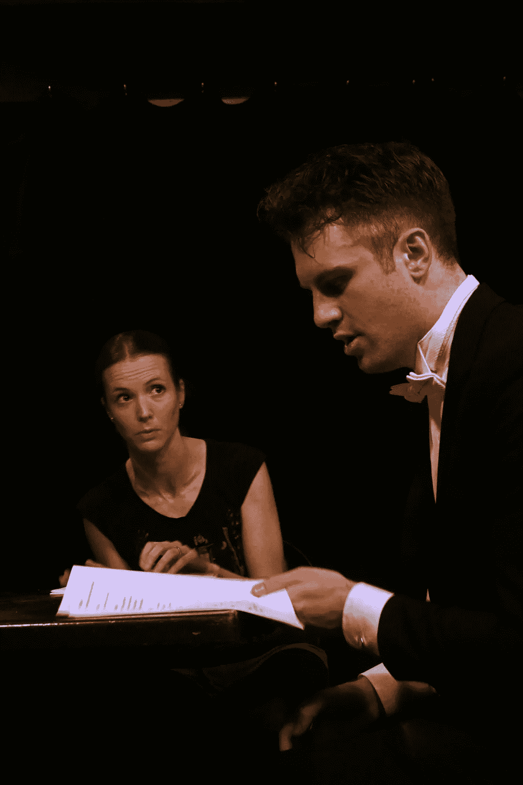****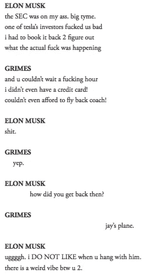

Lauren swooped in to save the day as Claire Boucher. My favourite part: where our iambic pentameter degenerates into txtspeak. (📸👉 Hannah Judge)** 

**和劳伦喝完酒后——格莱姆斯最终确定了演员阵容——我出发去参加一个当地戏剧节目的电台采访。然后我手机就没电了。于是我找了一家咖啡馆，拿出笔记本电脑，接了电话。我的电池电量只有 10%……面试官完成了介绍。9%……她问了第一个问题。8%… 7%…**

**我们结束了采访，几乎没有多余的电压。非常顺利。这导致其他渠道采用我们的诗句-玩裂纹的故事，包括邪教蒙特利尔:**

**[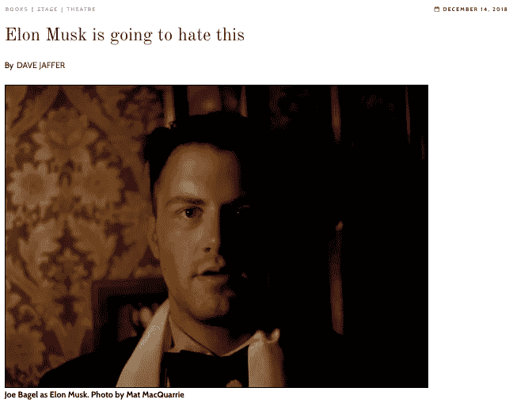](https://cultmtl.com/2018/12/elon-musk-joe-bagel-staged-reading-montreal/?fbclid=IwAR2zrdaqq3XItwQ8Ak7H_HP2Ev9M-v6RyTkGqI2zuZDS31AI4vmjDcxfz9g)**

**不过有一个小问题——在门票售罄的演出前，有人向我索要额外的门票。朋友。同事。当地传说。我是个唯唯诺诺的人，所以我继续往前开，多开了一堆座位…比会场的座位还多。👀**

**所以我打电话给当地的椅子租赁点。我需要 60 把额外的椅子，持续两个小时。一家公司向我报价 400 美元。另一个给我报价 450 美元。无耻的敲诈者！我咬紧牙关，**从宜家花了 650 美元买了** 60 把椅子。**

**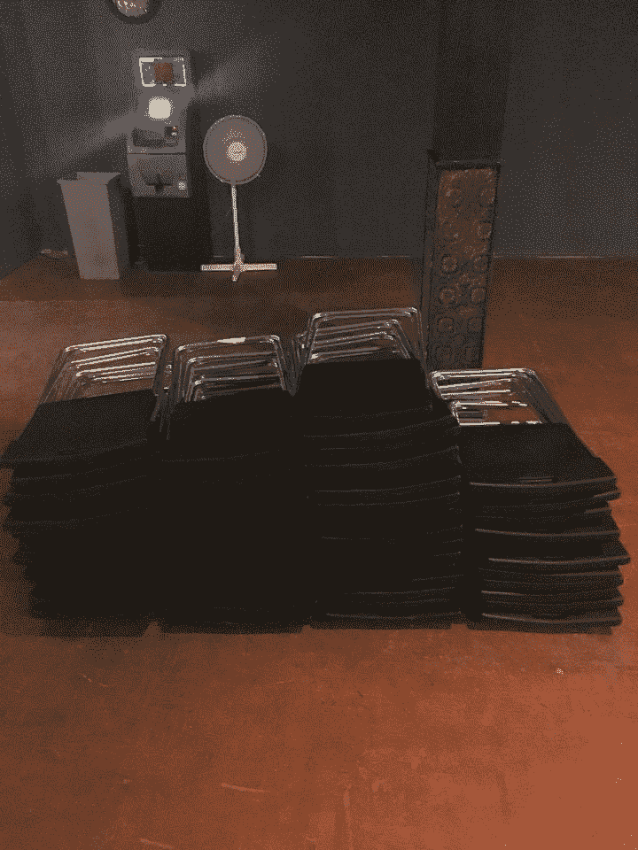**

**Help pay for these chairs lmao: buy a book [here](https://powertrain.press/collections/frontpage/products/trapped-in-elons-mansion).**

# **被困在埃隆的豪宅里:离演出开始还有 12 个小时。**

> **[输入乔百吉饼，信用卡完全刷爆了，还在拼命找他的杰伦 Z 替代。]**

**椅子。燕尾服。场地。龙舌兰酒。免费百吉饼。出租车。书籍。还有脚本的打印件(我付给 Staples 400 多美元的打印件——价值 100 美元的打印件根本没到，因为打印机没纸了，他们的收条机坏了。)**

**我已经山穷水尽了。狂躁。处于精神崩溃的边缘。椅子已经到了，书也收拾好了，燕尾服刚刚熨好，我差不多有足够的剧本熬过这个晚上了。但是我还是没有 Jay Z。**

**我在蒙特利尔演员的 facebook 上发了最后一个万福玛利亚帖子，希望出现圣诞奇迹。**

**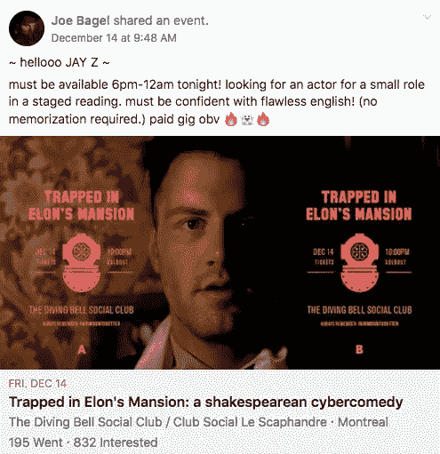****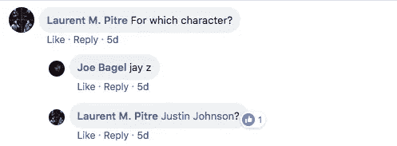**

**原来，贾斯汀就住在潜水钟的隔壁。他出现了，我们看了他的台词，然后，嗯…**

# **他可以做一个完美的 Jay Z 的形象。**

****

****Justin as Jay Z:** cast hours before showtime. He ended up being the funniest actor in the whole damn play. (Photo by Hannah Judge)**

# **被困在埃隆的豪宅里:离演出开始还有 30 分钟。**

> **[乔·贝果(JOE BAGEL)走进后台，带着几分醉意，正在组装电锯，查看舞台指示。]**

**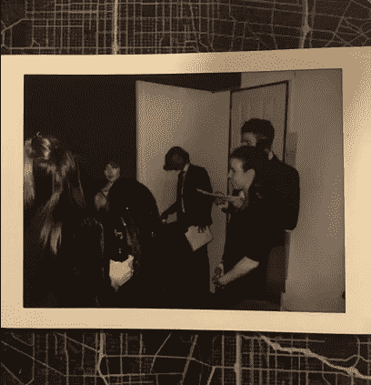****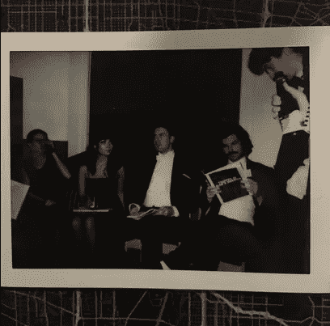****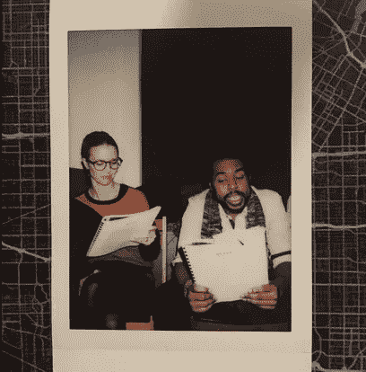****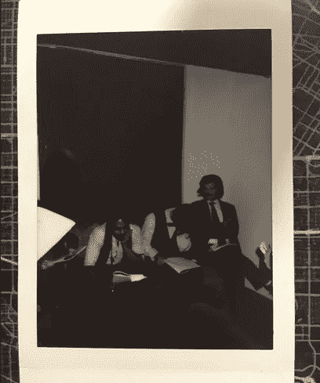**

**我们终于有了所有的演员。令人难以置信的是，他们正在钉线。化学反应就在那里。除了一个问题:因为一切都是在最后一刻，我们从来没有机会过舞台说明。**

**人们已经在街区周围排队，等待开门。这是我第一次在后台告诉我的演员们如何坐，如何站，如何做手势。找人做灯光——直到尼亚姆自告奋勇。**

**会场开始爆满。那会是座无虚席。**

**(我们最终即兴创作了舞台说明。)**

**[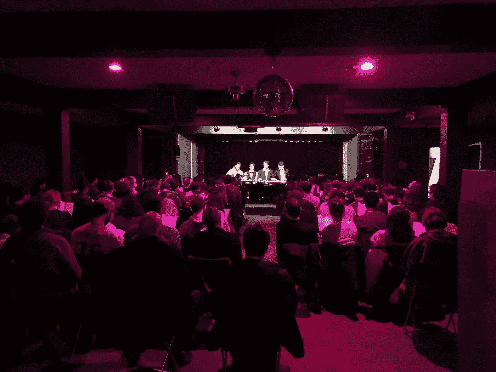](https://powertrain.press/collections/frontpage/products/trapped-in-elons-mansion)

[Free abridged play](https://powertrain.press/collections/frontpage/products/trapped-in-elons-mansion) 👈🔥👉 [Actual (unabridged) paperback + PDF](https://powertrain.press/collections/frontpage/products/trapped-in-elons-mansion)** 

**本来可能是一场火车事故，结果却成了一场令人捧腹的即兴闹剧。所有出错的线路。舞台方向混乱的所有毫秒。他们最终让一切都变得更加有趣。**

**30 分钟后，表演进行得非常完美。**

**直到 Siri 拿来了我的电锯。**

**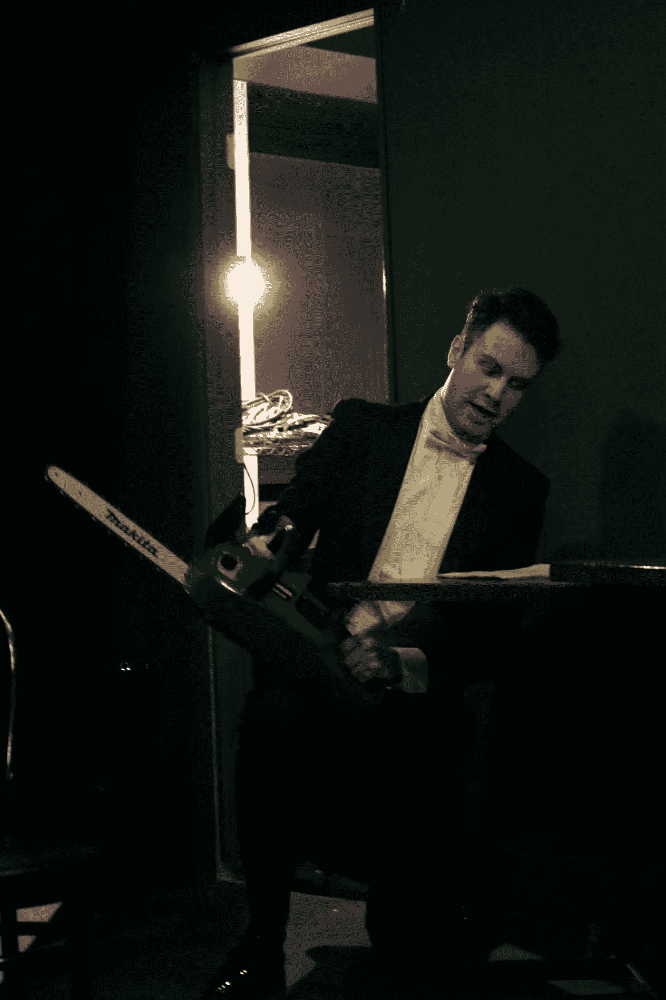**

**📸👉 Hannah Judge**

**在我的剧本中有一个场景，幻觉中的电锯狂人埃隆·马斯克在他的豪宅周围追逐阿泽莉亚·班克斯——误以为她是沙特酋长。**

**我忘了告诉阿泽利亚的一个舞台方向？事实上，为了登上舞台… **我要把门踢开。****

**当门在空中飞的时候，我才意识到我的疏忽。它会袭击阿泽利亚吗？我刚起步的剧作家生涯已经结束了吗？**

**奇迹般地，门掉进了窗帘里。**

****

**I am such a fucking idiot.**

**之后都是一帆风顺。就在地铁关闭之前，我们按时完成了。一场持续 1 小时 45 分钟、座无虚席的精彩演出。**

**我们甚至有时间获得长达一分钟的起立鼓掌！**

**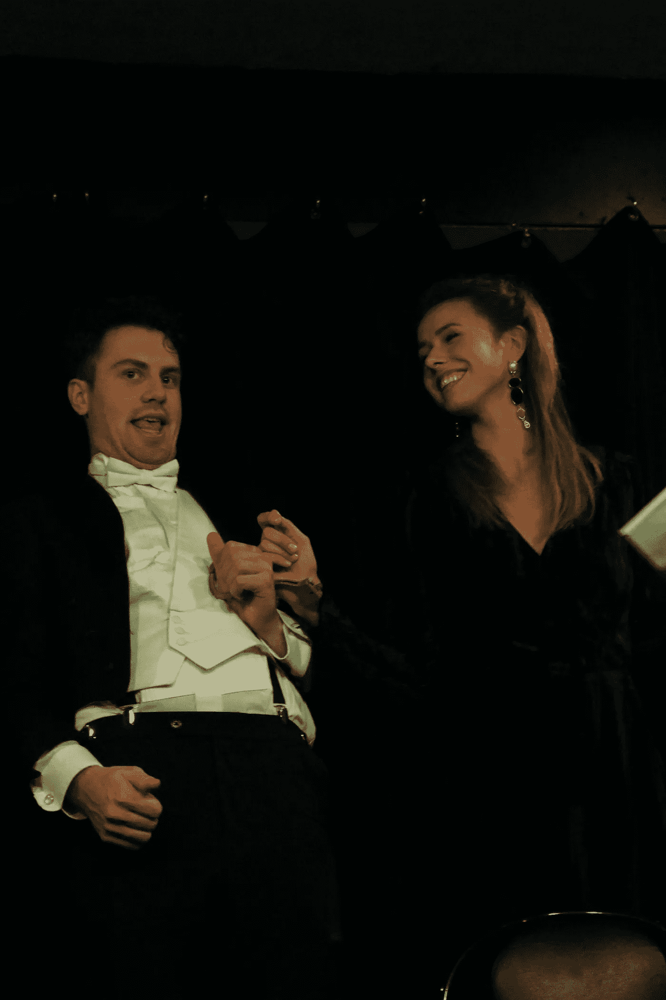**

**Elon Musk and the Blemish of Umblemishment (Suzanne, Princess of Norway.) 📸👉 Hannah Judge**

# **被困在埃隆的豪宅:后显示**

> **[乔·百吉饼出现了，病态的宿醉，在卫星城的沙发上醒来，周围全是空的香槟、格兰菲迪和野火鸡。]**

**我们做到了。**

**经过几个月无休止的工作，写作、组织、修改、排练、练习……一切都结束了。这本书在人们手中。这出戏获得了巨大的成功。**

**不知何故，我的朋友们非常信任我，同意了——剧本看不见！！！—在初次登台的剧作家的戏剧中扮演角色。不知何故，这不是一场灾难。不知何故，尽管我给他们强加了疯狂的时间限制，他们还是成功地完成了。**

**戏演完后，我们一拥而上来到卫星城。我们一直跳舞到凌晨 4 点。**

**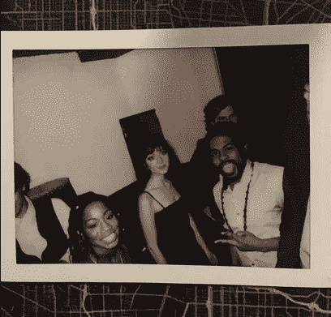****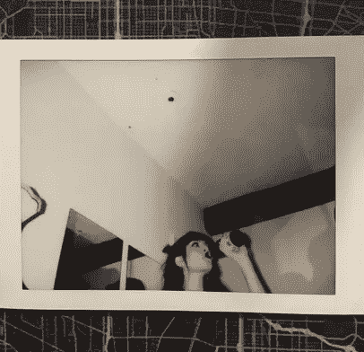**

**下午两点我在沙发上醒来。大多数人都已经离开了。我收集了所有的空瓶子，并开始检查推特。**

**从此:剧炸了！！！！💥💥💥**

**[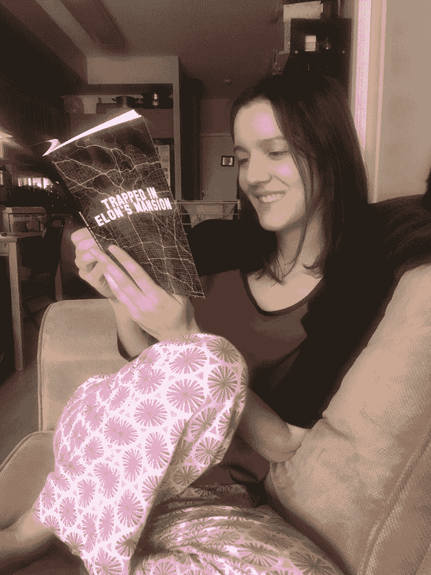](https://powertrain.press/collections/frontpage/products/trapped-in-elons-mansion)

[dis could be u](https://powertrain.press/collections/frontpage/products/trapped-in-elons-mansion) 💘** 

**就在我的戏结束后几天，埃隆·马斯克就“推出”了他臭名昭著的钻孔技术，这对我很有帮助。当其他 Twitter 账户在用 140 个字符或更少的字符抨击埃隆时…**

**…我准备了一部 17000 字的 [**剧本**](https://powertrain.press/collections/frontpage/products/trapped-in-elons-mansion) 。**

**时机再好不过了。都市学家推特对此赞不绝口:**

****我们不仅从《洛杉矶时报》自己的交通记者那里获得了一份联合签名……****

**我们得到了杰瑞特·沃克本人的闪亮代言！！！😱**

**总之…埃隆·马斯克:**我的剧本>你的隧道。****

****😘**👉获取书籍+ PDF [此处](https://powertrain.press/collections/frontpage/products/trapped-in-elons-mansion)。或者读节略剧，免费上[媒](/@bagelboy/trapped-in-elons-mansion-a-cybercomedy-in-shakespearean-verse-5dfa7363b68b)。**

**[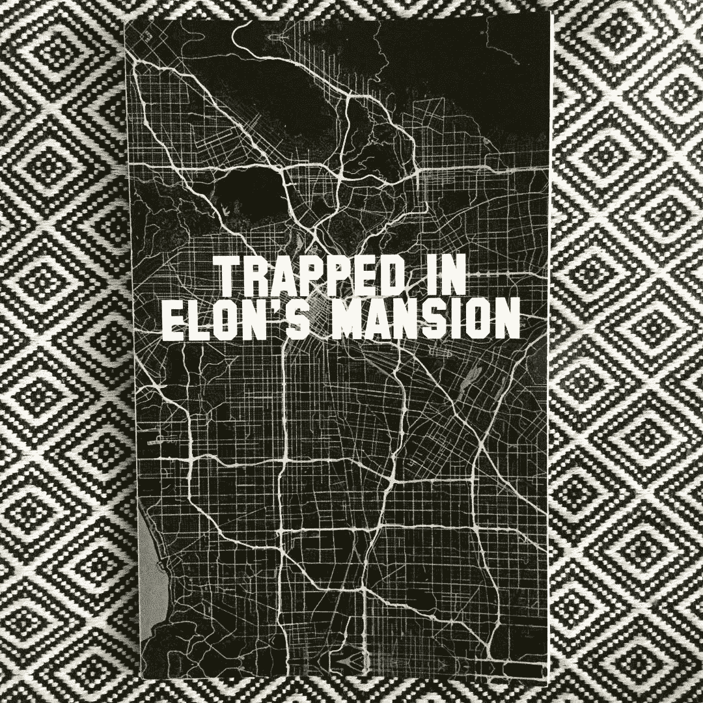](https://powertrain.press/collections/frontpage/products/trapped-in-elons-mansion)

***Acknowledgements****: Thank you to Jory, Fawn, Tom, Mat, Sandy, Niamh, Phil, Chris, Elena, Ellana, Laura, Lauren, Iain, Alec, Audrey, Austin, Evan, Jake, Suzanne, Guillaume, Gabriel, Anna, Justin, Fab, Asher, Michal, Jarrett, the cute waitress at Sumac and the Royal Dep in Saint-Henri.*** 

# **有兴趣在纽约、洛杉矶或多伦多举办展览吗？给我发一条[推文](https://twitter.com/mtlbagelboy)。📬🌎**

# **住在蒙特利尔？参加我的下一部戏:[戴维·福斯特·华莱士是鬼](https://www.facebook.com/events/2333019380261915/)！👻👻👻**