# 无罪恶感区的冰淇淋

> 原文：<https://medium.com/swlh/ice-cream-in-a-guilt-free-zone-32f7bcef553c>

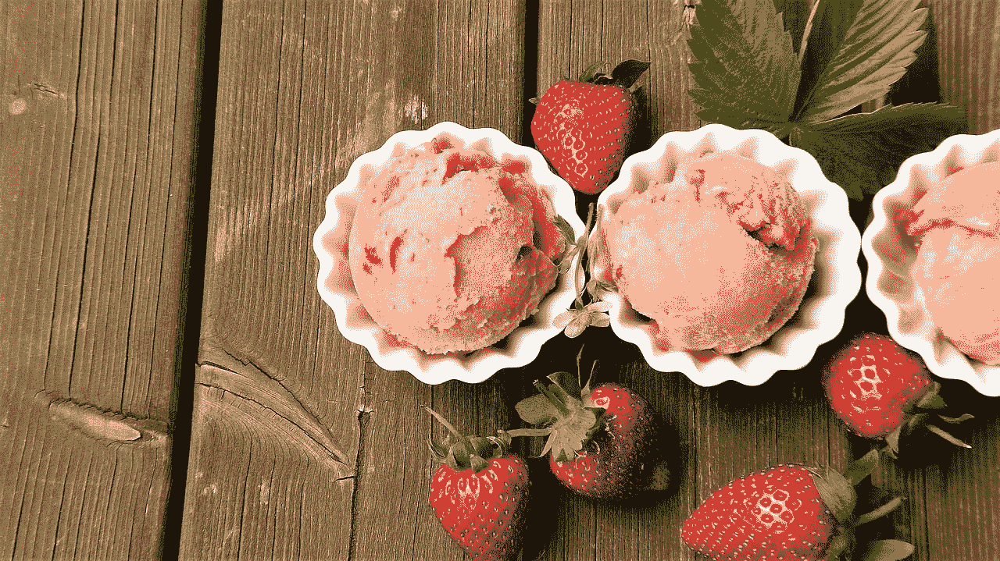

6 月，亚马逊宣布以 137 亿美元收购全食超市。

这引发了我个人分析杂货店过道的好奇心。第一篇文章关注冰淇淋:市场，新的健康替代品，企业集团的反应，以及我对未来创新的预测。

七年前，Halo Top 的首席执行官开始制定自己的冰淇淋配方。5 年前，他开始在商店里出售这种产品，据报道，他只筹集了 150 万美元。现在 Halo Top 据报道价值 20 亿美元！

[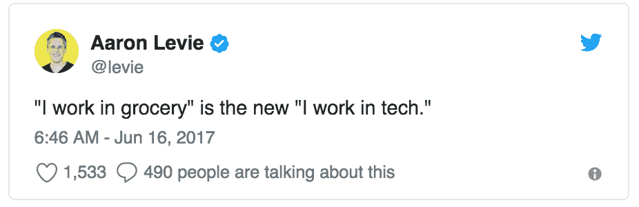](https://twitter.com/levie/status/875726202903724033)

## 冰淇淋市场

根据 Statista 的数据，2017 年全年，冰淇淋市场创造了 99.4 亿美元的收入，预计 2018 年，这一数字将超过 100.6 亿美元。

冰淇淋销售主要在美国，如下图所示，预计 2018 年全球冰淇淋收入。[来源](https://www.statista.com/outlook/40100400/109/ice-cream/united-states#market-global)

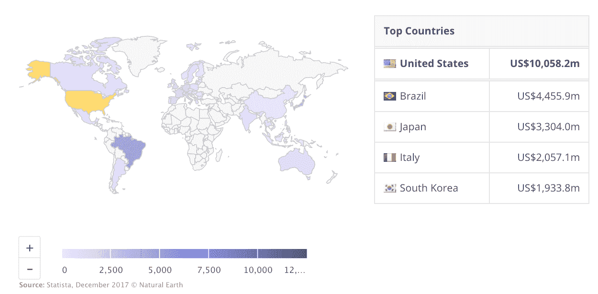

从人们购买的冰淇淋的数量和种类可以看出，消费者对普通冰淇淋的健康替代品的需求越来越大。

根据 Statista 的数据，2016 年，美国人均消费 13.1 磅，低于 2000 年的 16.1 磅。另一方面，根据 Statista 的数据，截至 2017 年 5 月，贴有“优质蛋白质来源”标签的冰淇淋销量增长了 207%。

消费者变得更加健康，阅读更多的营养标签。

几个新的冰淇淋品牌在意识到健康选择的机会后进入了市场。Halo Top 是新细分市场的明显领导者。

# 光晕顶部

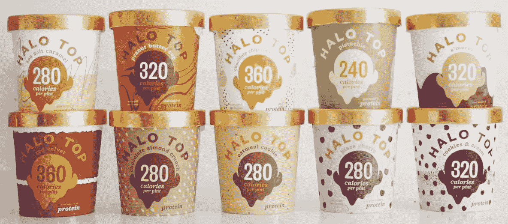

**营养**

Halo Top 的定位是每罐含 240 至 360 卡路里，而哈根达斯或本杰里的平均品脱含 1000 多卡路里。这是独特配方的结果:

*   基础:牛奶和奶油(含更高比例的脱脂牛奶)。纯素食品种的基础是椰子汁。
*   鸡蛋，增加了更柔软的质地
*   浓缩乳糖蛋白，增加饱腹感
*   甜叶菊，一种植物提取物，是“全天然”甜味剂，比大多数蔗糖甜 200 倍。
*   增稠剂(植物甘油、角豆胶和瓜尔豆胶)复制传统冰淇淋的奶油感觉
*   赤藓糖醇，一种零卡路里的糖醇，甜度是糖的 60–80%。它在水果中自然形成，如西瓜和葡萄，但也可以通过淀粉和酵母的发酵进行商业生产。
*   益生元纤维，特别是 Halo Top，是酱油和清酒生产过程中残留的酵母，增加了糖的重量。当配方中的糖和脂肪被去除后，冰淇淋变得特别硬。
*   空气，添加到冰淇淋中，使其质地更轻，被冰淇淋生产商称为“溢出”。
    -20–30%超限=优质品牌
    - 100%超限(一半冰淇淋一半空气)=许多廉价品牌
    - 82%超限=光环陀螺
    超限的影响意味着一品脱本&杰瑞的重约 428 克，而一品脱光环陀螺重约 256 克。

一些营养学家对甜叶菊和赤藓糖醇持谨慎态度。零卡路里甜味剂可能会导致体重增加，因为它可能会扰乱身体代谢糖的方式，并导致人们更频繁地渴望甜食。

此外，过量食用赤藓糖醇的一个已知副作用是头痛、腹泻和腹部脂肪。Halo Top 表示，需要一次喝掉许多品脱，才有可能患上这些疾病。

## 营销

Halo Top 利用其关键的营养差异(卡路里数)作为其营销的主要驱动力，从竞争对手中脱颖而出。

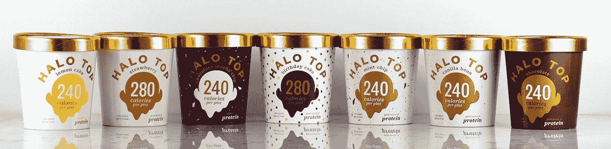

每品脱冰淇淋前面和中间都有卡路里数，在右下角还有“良好的蛋白质来源”。

根据[美国国家医学图书馆和国家健康研究所](https://www.ncbi.nlm.nih.gov/pmc/articles/PMC5188442/)的研究，消费者可能会更积极地考虑 Halo Top，因为卡路里计数占主导地位。

我在网上发现了 Halo Top 的旧包装设计:

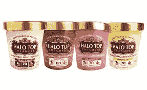

他们更新的包装更引人注目，突出了他们独特的产品提供:每品脱非常低的热量。他们的旧纸盒标明了每份食物的蛋白质、卡路里和碳水化合物的含量。这三个数字掩盖了一个巨大的市场差异，因此并不有效。

Halo Top 正在利用他们的低卡路里系列为他们的印章添加营销信息，鼓励消费者“当你触底时停止”和“没有碗，没有遗憾”

一品脱 Halo Top(240-360 卡路里)相当于几勺大多数奢侈冰淇淋品牌。许多消费者跟随营销口号，一口气吃下一品脱免费啤酒。

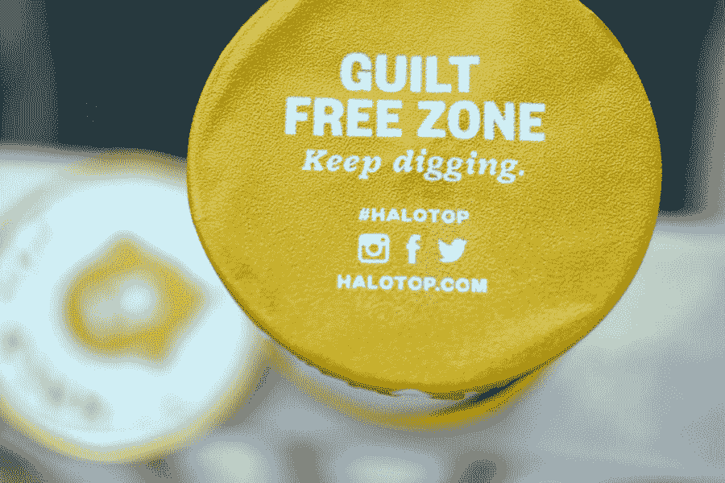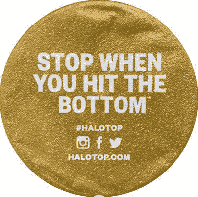

注意这些印章有社交媒体标志。他们的社会地位是他们成功的一大驱动力。

在早期，他们会联系 Instagram 健身明星和 YouTube 名人。今天，他们至少有 7 个人，他们的唯一职责是向社交媒体影响者提供免费的光环上衣。

他们在 Instagram 上有大约 65 万名粉丝，而#HaloTop Instagram 标签已经被贴在了近 20 万张照片上。粉丝们兴奋地发布他们冰柜里所有的品脱和他们的甜点作品。但最常见的帖子实际上只是人们手里拿着一品脱啤酒。

[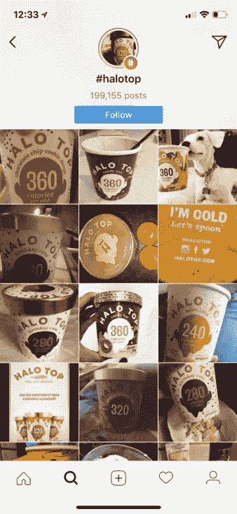](https://www.instagram.com/explore/tags/halotop/)

除了社交媒体上的有机帖子，Halo Top 还专注于付费广告——几乎每个人现在都在做。但 Halo Top 可以选择 150 美元的店内演示，或者在脸书和 Instagram 上投放每眼球 10 美分的超级定向广告。他们能够成倍地增加在线流量。

最大的指数销售增长来自于两篇病毒式的新闻报道。

[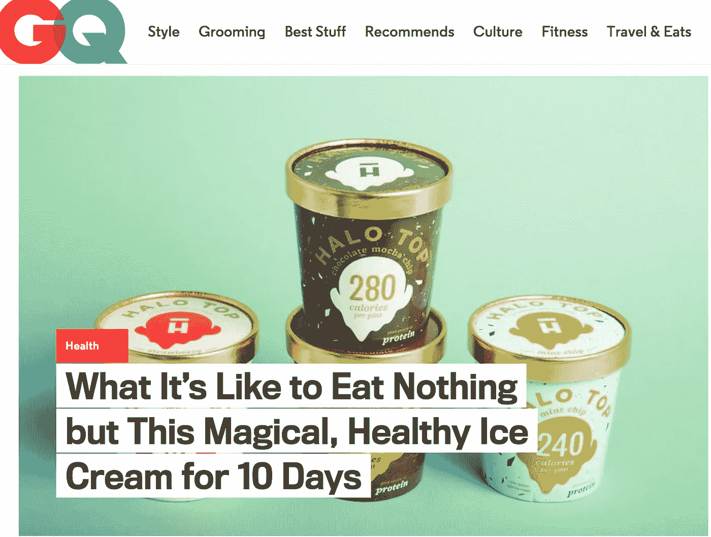](https://www.gq.com/story/halo-top-ice-cream-review-diet)

仅仅一个多月后，BuzzFeed 发表了一篇文章，标题为:[我们尝试了低热量冰淇淋，并将其与阿根-达斯](https://www.buzzfeed.com/ariellecalderon/low-cal-ice-cream-taste-test?utm_term=.wgD5zQPW74#.miQne7GraP)进行了比较。描述 Halo Top 的部分非常突出，因为它的台词是“OMG。改变人生。”

在 2016 年初的这个阶段，Halo Top 在 5000 家杂货店中，他们每隔几个月就从他们的生产商那里订购大约 1000 加仑的冰淇淋。突然，这些文章在网上疯传后，他们开始每天订购 3000 加仑，然后是 9000 加仑，然后是 12000 加仑。

订单的巨大增长不仅归因于消费者的增加，还归因于每个消费者购买的品脱数量的增加。

许多消费者每天晚上或一周几次喝 Halo Top，而不是像以前那样每隔几周喝一次，因为 Halo Top 品脱的卡路里数只是大多数冰淇淋品脱的一小部分。

> 此外，消费者平均一次购买 7 至 8 品脱。Halo Top 在供需平衡上有困难，消费者不想没有它！

[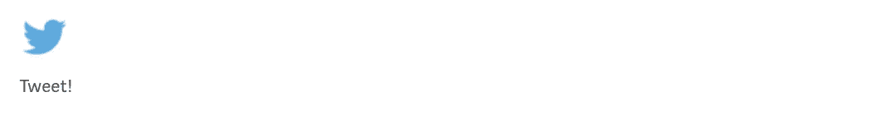](https://ctt.ec/gvd14)

## **比赛**

2017 年 1 月，Halo Top 超越了阿根-达斯和本杰里，夺得了全美最畅销冰淇淋的头衔。随后到了 9 月，Halo Top 成为美国最畅销的冰淇淋品牌，无论包装大小如何。

Halo Top 的垂直市场中还有其他几个品牌受到了增长的压力。

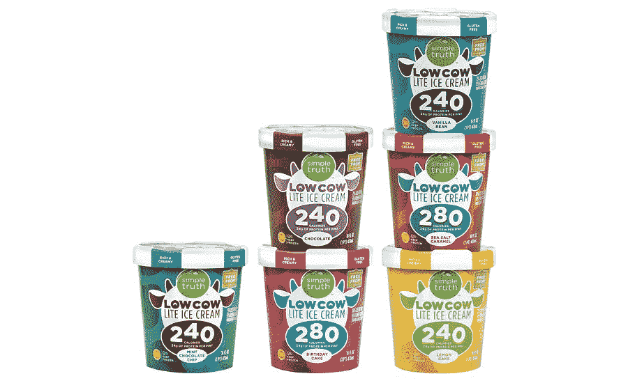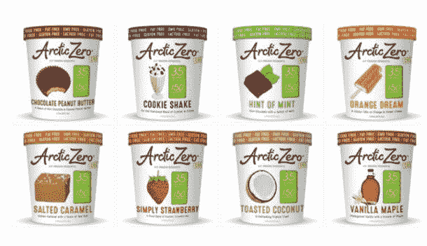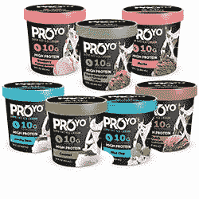

注意所有这些冰淇淋品牌是如何在品脱的前面突出卡路里和蛋白质的。他们借鉴了 Halo Top 的剧本。

市场上的其他参与者从另一个独特的角度证明了它们的低热量:和尚果汁。和尚果比糖甜 300 倍，是亚洲流行的甜味剂。它也比糖便宜得多，但比甜叶菊更贵，甜度更低。

用僧侣汁使冰淇淋变甜的品牌包括 DanoneWave 的 So Delicious and Enlightened，以及 Talenti 的 gelato。

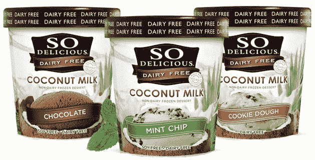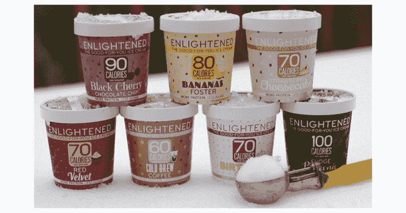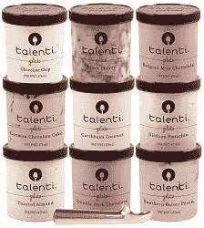

## **新人超越市场领导者的历史**

越来越多的新食品品牌对企业集团构成了威胁。以下是一些例子:

*   Chobani 成为 10 亿美元的酸奶，仅在进入市场五年后。2016 年，它超过了长期市场领导者通用磨坊(General Mills)的 Yoplait，成为全美最大的酸奶品牌。
*   Kind 酒吧在五年内占据了小吃店市场的 10%，特殊 K 酒吧自 2011 年以来销售额下降了 39%。
*   Campbell 和 Progresso by General Mills 曾经是汤垂直行业的长期市场领导者，但自 2011 年以来一直在失去其市场主导地位。
*   SkinnyPop(爆米花)正在从百事可乐的菲多利智能食品爆米花中抢走市场份额。

## **企业集团现在如何应对**

冰淇淋企业集团对 Halo Top 和其他类似品牌的成功做出了回应，创造了自己更具健康意识的品种。

由于光环 Top 的人气不断上升，联合利华已经损失了 1.5 个股份点。他们受影响的品牌之一是 Breyers，该品牌在 2016 年销售了价值 5 亿美元的冰淇淋。在同一时期，Halo Top 从 2015 年到 2016 年的销售额增长了 2500%，销售了 1350 万品脱，价值 6610 万美元。虽然销售额不及 Breyers，但 Halo Top 经历了惊人的增长速度。

在防御方面，Breyers 推出了“Breyers pleases”，作为低热量、低糖和高蛋白的冰淇淋进行营销。

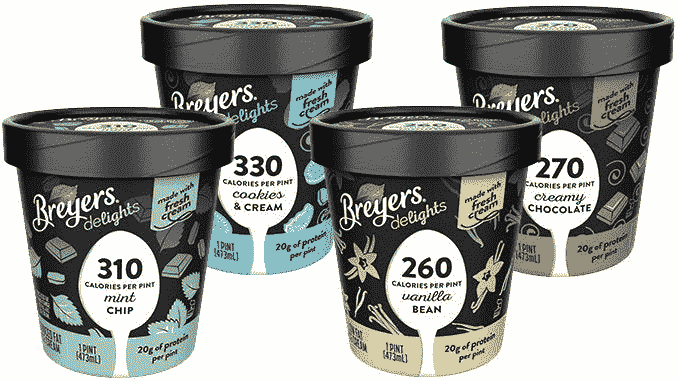

[本&杰瑞的](http://www.foodbev.com/news/unilevers-unveils-ben-jerrys-vegan-ice-cream-three-flavours/)和[哈根达斯](http://www.foodbev.com/news/)也推出了纯素冰淇淋品种。

当企业集团开始内部创新时，可能已经太晚了。收购快速增长的新市场进入者可能是最好的策略，在他们变得太大而拒绝收购要约之前，从传统市场领导者那里夺取大量市场份额。

## **企业集团收购冰淇淋新星**

*   2000 年，联合利华以 3.26 亿美元收购了本杰里
*   2005 年，联合利华收购了冰淇淋连锁店格来姆，交易金额未披露
*   2006 年，雀巢公司以 24 亿美元的价格将旗下的冰淇淋品牌(阿根-达斯和雀巢脆皮)与德雷尔斯大冰淇淋合并。
*   2014 年，联合利华购买了透明塑料罐装的特制低脂冰淇淋和冰糕 Talenti
*   2018, ???

有新闻报道称，Halo Top 的所有者 Eden Creamery LLC 一直在探索出售该公司，使其价值达到 20 亿美元。潜在买家可能包括联合利华、通用磨坊和雀巢。虽然 Halo Top 承认有这些对话，但他们表示，现在出售他们的公司太有趣了。

以下是对 Halo Top 背后指标的更多见解:

*   2013 年:
    -从朋友、家人和以前的同事那里筹集了 50 万美元
    -收入 23 万美元
*   2015 年:
    ——从天使投资人和 CircleUp 处融资 100 万美元
*   2016 年:
    ——销量超过 1700 万品脱
*   2017 年:
    -收入 1 亿美元
    -在美国和澳大利亚的 17，000 多家商店中
    -每天生产 650，000 品脱

## **冰淇淋的新机遇**

冰淇淋产品的一个主要缺口是纯素食冰淇淋。这也是 Halo 顶级客户的最高要求。

退一步说，市场对非乳制品销售的需求增加了。

*   自 2012 年以来，乳制品行业的销售额下降了 15%，至 161.2 亿美元
*   2015 年，美国的非乳制品销售额增长了 9%，而乳制品销售额下降了 7%
*   2017 年，美国非乳牛奶销售额达到 21.1 亿美元，在过去五年中增长了 61%

对脱脂牛奶的需求在增加，正如对纯素食冰淇淋的需求在增加一样。更多纯素食冰淇淋产品仍有市场机会。我很期待看到未来会发生什么。

> 好奇的你的，艾娜
> 
> [@inaherlihy](https://twitter.com/inaherlihy)

***附:查看我的其他文章:***

## [行为经济学帮助提高转化率、保留率和投资回报率的 9 种方式](/@inaherlihy/9-ways-behavioral-economics-can-help-increase-conversion-retention-and-roi-3e245a2604e3#.86yh0dflb)

## [优化邮件的 8 个步骤:分析 125 封启动邮件](http://www.inaherlihy.com/blog/2015/1/27/8-steps-to-optimize-emails)

## [如何优化推荐项目](/@inaherlihy/how-to-optimize-182250e499d7)

分析 15 个创业推荐代码+登录页面

在你走之前…

[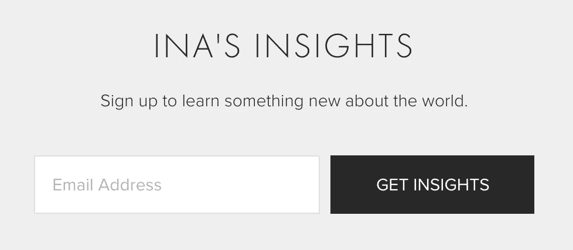](http://www.inaherlihy.com/subscribe/)

如果你觉得这个帖子很有趣，请为它鼓掌！！😊