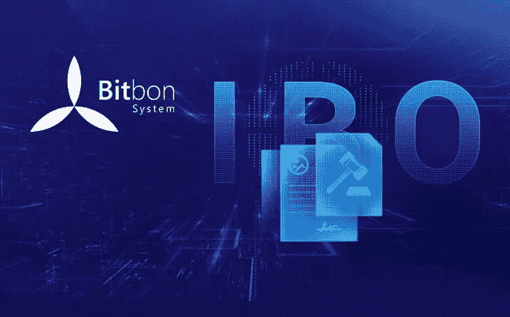

# ICO 和 IBO:一封信如何改变过程

> 原文：<https://medium.com/swlh/ico-and-ibo-how-one-letter-can-change-the-process-5712bf12bd5a>

集体投资作为一种筹款活动首次出现在 1997 年，当时粉丝们组织了一次筹款活动，以支持乐队 Marillion。短短十年间，众筹作为一种吸引资金的形式获得了巨大的普及，今天，个人可以将自己的资金投资于商业、房地产、农业、社会项目、科学研究、银行贷款系统等。基本上，众筹活动是每个人向互联网用户讲述他们的想法、获得他们的反馈、为即将推出的产品做初步广告并试图吸引投资的机会。

尽管互联网众筹平台日益普及和广泛分布，但不幸的是，传统众筹正面临着许多无法解决的问题，包括由于有限的规则和法规，法律和法规风险水平增加；相似主题的项目之间的激烈竞争和由于频繁的欺诈事件导致的低可信度。随着投资类型的演变，既定的问题形成了为众筹组织创造一种更受控制的技术——ICO 的基础。

简单来说，ICO(初始硬币发行)是通过加密货币销售为项目实施筹集资金的活动。本质上，它让投资者购买某个项目的加密货币来为其融资，并在该项目实际启动后获得投机利润或某种特权。

Mastercoin 是 2013 年第一个进行 ICO 的项目，最终吸引了大约 50 万美元。ICO 的进一步发展之所以成为可能，要归功于以太坊平台开发者 Vitalik Buterin，他创作了《以太坊加密货币发展白皮书》并将其介绍给公众。在 ICO 结束时，以太坊的总利润达到了 3900%。

2017 年是 ICOs 的“黄金时代”。这在很大程度上是因为市场上优质项目的比例较高，很少有个人愿意通过欺诈性 ico 来“轻松赚钱”。随着 ICO 项目数量的增长，问题开始出现:缺乏规范其活动并允许安全购买代币的法律；缺乏以资产支持项目的机制和透明的执行条款；对进入 ICO 的项目实施阶段缺乏外部监督等。所有这些都大大降低了 ICO 项目的受欢迎程度，迫切需要对这一市场进行监管。

今年年初，网站[Bitcoin.com](https://www.bitcoin.com/)进行了一项 2018 年的 ICO 市场研究，并得出结论，2017 年推出的所有项目中，有 59%已经失败或处于边缘。在 902 个 ico 中，有 142 个在融资阶段失败，276 个要么从地球上消失，要么干脆带着投资者的钱消失了，另有 113 个停止了社交媒体上的各种交流，这也表明了一个即将到来的结束。

万维网上有很多发现欺诈性 ico 的建议，但没有真正有效的措施从一开始就发现这种项目。对现有 ICO 问题的法律规制和解决方案的需求促进了项目的发展，最大限度地降低了损失的可能性，保证了投资的安全性。

其中一个项目是[Bitbon 系统](https://www.bitbon.space/en/home?utm_source=Altcointoday&utm_medium=article)，这是一个资产管理和投资平台，具有更大的可能性。Bitbon 系统允许在新的数字经济条件下进入一个新的资产工作水平:确保数据存储安全；使用新的会计和资产权利管理方法；提供与系统参与者建立透明交互的能力，并保证从项目投资中获得额外收入。集成到 Bitbon 系统中的所有创新技术已在许多国家获得专利，这表明了系统组件的独特性。

Bitbon 是一种数字金融工具，在 Bitbon 系统中用作支付单位。Bitbon 的定义特征是拥有加密资产的属性，因为它的价值是由实物资产支持的。

该系统提供了一种新的投资流程，称为 IBO(首次公开募股)。它是针对商业项目实施的，涉及:合同者(发起者)、Bitup-Agency(项目实施的监督者、跟随者和控制者)和出资者(投资者)。

IBO 与众不同的特点是能够利用合同中不断更新的部分来控制项目的实施。该部分包含一个项目进展指标，显示了项目发展的各个阶段:从准备阶段到商业启动阶段。

此外，在商业计划、白皮书、Projectbon 公共合同、摘要和单页纸(一种提供关于项目的一般信息以便在移动设备上更方便地查看的演示类型)上传到 Contractat 的部分之后，生成 IBO 证书，它是包含关于项目的完整且不断更新的信息的交互式文档。该证书对所有 Bitbon 系统参与者开放，并按时间顺序动态传递信息。

基于上述内容，很明显，为了分析 ico 的有效性和可靠性，您需要额外的工具和互联网资源，这仍然不排除高风险，而当项目被 IBO 接受时，它已经准备好并得到验证。

总之，值得一提的是，IBO 和 ICO 之间的主要区别是在法律范围内的活动，这意味着遵循所有必要的法律细微差别。由于正确起草的条款，Bitbon 系统内 IBO 的可能性不仅可以用于吸引资金，还可以用于转移不同类型资产的产权:货币、动产和不动产、银行存款、证券、专有技术和公司股份。因此，该系统可以保存任何资产的数据，其属性可以用数字形式准确描述。基本上，IBO 只是一个叫做贡献的更大的过程的一部分，但尽管如此，它促进了对完整项目实施和潜在投资者利润的真正保证。

*原载于 2018 年 11 月 20 日*[*【altcointoday.com】*](https://altcointoday.com/ico-and-ibo-how-one-letter-can-change-the-process/)*。*

## 这篇文章发表在 [The Startup](https://medium.com/swlh) 上，这是 Medium 最大的创业刊物，有+391，714 人关注。

## 在这里订阅接收[我们的头条新闻](http://growthsupply.com/the-startup-newsletter/)。

