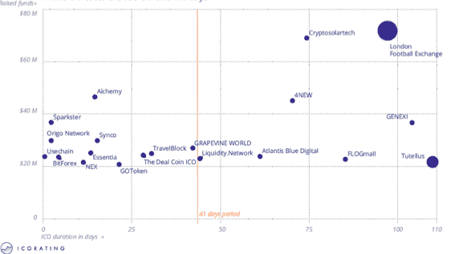
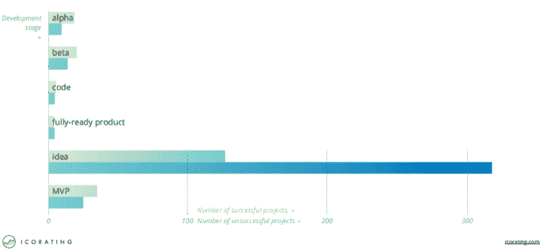
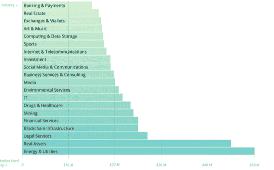
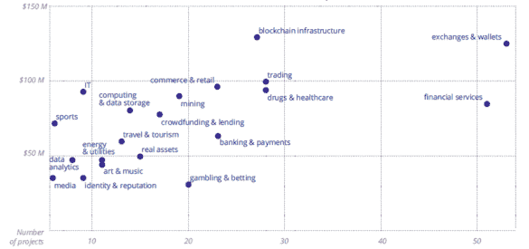
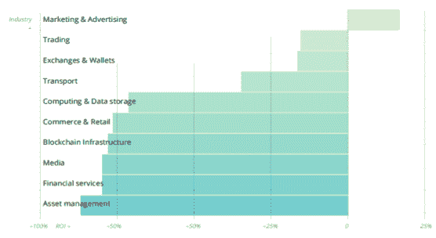
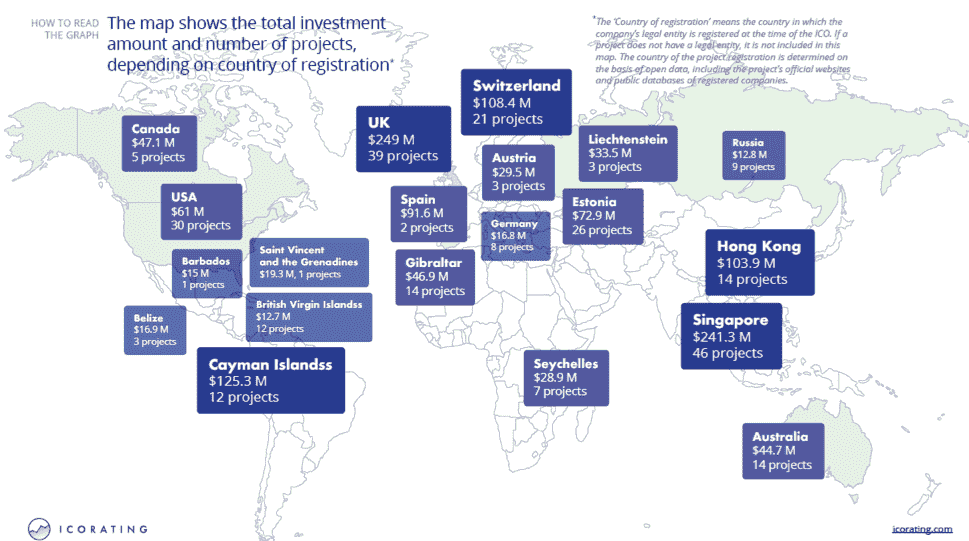
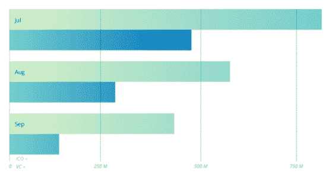
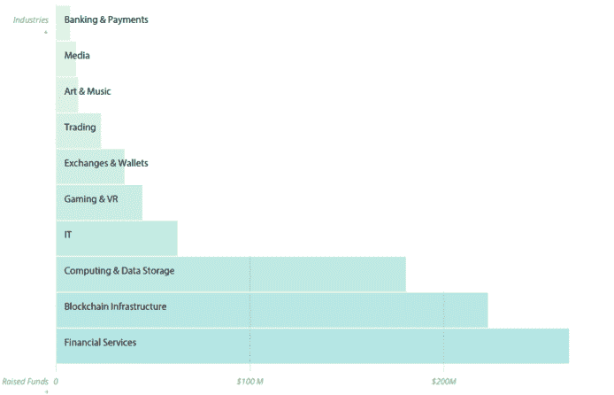
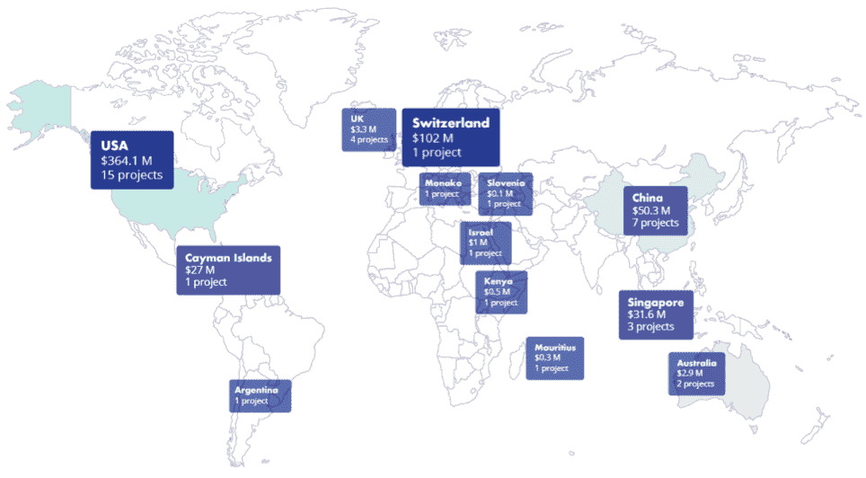

# 2018 年 ICO 市场研究

> 原文：<https://medium.com/swlh/ico-market-research-of-2018-68a124159ec6>

本文将分析 ICORATING 在 2018 年第三季度所做的 ICO 市场研究。

根据这项研究，2018 年第三季度，ICO 资金总额从 Q2 的 8，359，976，282 美元下降到 1，819，585，090 美元，下降了 78%。2018 年 9 月筹集的资金与 5 月相比下降了 78%以上。在所有公布的 ico 中，只有 4%在交易所上市，MenaPay 是上市 ico 之一。这些 ico 的成功率也在很大程度上取决于它们在哪个区域开展业务。

根据 2018 年第三季度的结果，代币的回报中位数下降了 22%。代币上市三天后的回报率中值为 3.35%。此外，79%的代币交易价格低于 ICO 价格。按照第二季度的趋势，最受欢迎、项目数量最多的行业是金融服务业。

此外，大约 87%的项目准备了 ico，目的是在第三方区块链上创建 Dapp。67%的 Dapps ICOs 都不成功。 ***从完成一个 ICO 到二级交易的代币授予平均需要 18 天。平均筹款期为 41 天。*** 64%的 ico 未能完成众筹。

**20 大 ICOs 基金/存续期**

2018 年第三季度；49.05%的代币为服务代币，25.3%为公用代币，12.47%为混合代币，6.54%为安全代币，4.3%为加密货币，1.55%为奖励代币，0.52%为投票代币。与 Q2 相比，具有公用事业令牌的项目数量减少了 10.07%。

2018 年第三季度，拥有 ICO 的项目中，76.15%处于 idea 阶段，10.22%处于 MVP 阶段，5.79%处于 beta 阶段，4.77%处于 alpha 阶段，1.7%处于代码阶段，1.37%处于全就绪产品阶段。与 Q2 相比，idea 阶段增长了 18.72%。已经开展业务的项目数量占所有项目的 5%(与 Q2 相比为 10%)。有没有正在运营的企业对筹资成功没有影响。

此外，处于创意阶段的项目平均资金为 0 美元。完全就绪的产品中位数为 25 万美元，代码阶段项目中位数为 30 万美元，alpha 阶段中位数为 70 万美元，MVP 阶段中位数为 80 万美元，beta 阶段项目的资金中位数为 145 万美元。

根据报告中的发展阶段，成功/不成功 ico 的数量如下所示。如果项目筹集的资金少于 50 万美元，则该项目被视为不成功。72%的创意阶段项目未能筹集到超过 50 万美元的资金。

**按中值硬资本划分的前 20 个行业**

最受欢迎的 10 个行业是:金融服务(跟随 Q2 趋势)有 50 多个项目。还有 50 多个交换和钱包项目。贸易、药品和医疗保健、区块链基础设施行业以约 30 个项目依次递减。商业和零售、银行和支付、投资、赌博和博彩、采矿、商业服务和咨询行业有大约 20 个项目，也是按降序排列。

交易所和钱包行业在整个季度都很受欢迎。在名单上看到来自药品和医疗保健行业的项目是很不寻常的，因为这个行业以前并不是特别受欢迎。

就第三季度吸引的资金总额而言，最受欢迎的行业是基础设施(跟随 Q2 趋势)和交易所及钱包；最初筹集的资金略低于 1.25 亿美元。金融服务收入略高于 1.25 亿美元。银行和支付业务在筹资总额排行榜上排名第三，筹资近 1 亿美元。218 年 7 月，银行与支付融资 6000 万美元。

MenaPay 成功筹集了约 600 万美元，目标是筹集 2500 万美元。该公司还包括金融服务，支付和钱包业务结构，从上述前 20 个行业的平均市值。

**按行业分布的项目数量**

**2018 年 ico 行业平均回报率**

**基于注册国的项目地理分布**

**但说到基于项目团队来源的项目地理分布时；**

1.俄罗斯；63 个项目筹集了 1.829 亿美元

2.英国；通过 22 个项目筹集了 1.576 亿美元

3.美国；65 个项目筹集了 1.555 亿美元

4.中国；30 个项目筹集了 1.057 亿美元

5.西班牙；4 个项目筹集了 9120 万美元

6.新加坡；16 个项目筹集了 7830 万美元

7.韩国；17 个项目筹集了 6810 万美元

8.印度；18 个项目共筹集 6710 万美元

9.澳大利亚；13 个项目筹集了 5120 万美元

10.乌克兰；11 个项目筹集了 4630 万美元

11.科威特；通过两个项目筹集了 4130 万美元

12.瑞士；9 个项目筹集了 3680 万美元

13.意大利；11 个项目筹集了 3460 万美元

14.奥地利；通过两个项目筹集了 2950 万美元

15.越南；5 个项目筹集了 2760 万美元

16.多米尼加共和国；1 个项目筹集了 2390 万美元

17.罗马尼亚；通过 4 个项目筹集了 2170 万美元

18.加拿大；5 个项目筹集了 2070 万美元

19.以色列；6 个项目筹集了 1960 万美元

*“原籍国”是指在 ICO 发生时超过 50%的团队成员实际居住的国家。如果项目有国际团队，他们不包括在内。来源国是根据团队的公开信息确定的，包括官方项目网站和团队成员的社交媒体。

项目最少的地区是**中东和北非地区**，根据世界银行的报告，中东和北非地区的增长预计将在 2019 年加速至 3.2%。MenaPay 率先在该地区推出了新的支付系统，使支付更加安全且符合伊斯兰法规。此外，他们的阿拉伯语应用程序和支持团队将为当地人创造易用性。

在筹资方面领先的是欧洲(筹集了 6 . 63 亿美元资金，177 个项目)，筹集了 48%的资金。来自亚洲的项目显示，筹集的资金有所减少(减少 65%，筹集的资金为 2.68 亿美元)，启动的项目数量也有所下降(减少 10%，73 个项目)。

第 3 季度，大多数项目分配给预售的令牌不到所有令牌的 10%。

不到 10%的代币分配给私人和预售阶段的项目在 67%的情况下不成功。同样，如果项目筹资超过 50 万美元，则该项目被认为是成功的。

在生态系统发展的这个阶段，以太坊继续垄断市场，因为(例如)它很容易在 DEX 上上市(大多数令牌也是基于以太坊或 0x 协议)。第三季度项目在创建令牌时使用了 83.75%的以太坊、12.06%的其他、1.68%的 Waves、1.34%的 NEO 和 1.17%的 Stellar。

大约 87%的项目准备了 ico，目的是在第三方区块链上创建 Dapp。8.96%为协议改进 ico，4.91%为定制区块链 ico。

为了使每天的用户数量进入前 10 名，一个市场或游戏应该至少有 300 人使用。此外，2018 年 10 月 10 日在该平台注册的 760 个 Dapps(占总数的 77%)每天甚至没有一个用户。每天最高数量的用户属于高风险类别(# 1–333 eth-2171 用户/24 小时)。

67%的 Dapps ICOs 都不成功。协议的不成功百分比—43%；定制区块链——51%。

82.17%的 ICOs 是闭源的，17.83%是开源的。67%的闭源项目在其 ico 时除了想法之外没有向社区提交任何东西。

69.42%没有 GitHub 库或者有封闭的 GitHub 的项目在筹集资金方面是不成功的。41.9%开源代码的项目不成功。

71%推出 ICO 的公司成立不到一年。公司的平均年龄是 12 个月。

79%进行 ico 的项目团队中开发人员少于 5 人。只有 1%的项目有超过 10 名开发人员。

**风投资金:**

风险资本对 ico 有很大的影响，今天，大多数希望参与风险资本投资的投资者都是通过管理风险资本基金进行投资的。此外，风险投资基金将帮助 ICO 提升企业家、推广产品、鼓励客户、发掘潜在人才、创造更多就业机会、带来财务可行性、帮助技术发展等等。 **MenaPay** 有两种不同的风险投资，分别是股权和代币投资机会。

**【957，910，860 美元已由 78 个区块链项目通过风险投资融资轮筹集。已披露投资额的项目平均风投资金为 1740 万。**

****

**对于 VC 和 ICO 方法来说，本季度筹资下降的速度是相似的。**

**有令牌和没有令牌的 VC 资助的区块链项目的分布是 54%非令牌化，46%令牌化。**

**87%的 VC 资助的区块链项目没有举行空投。只有 13%的人这么做了。**

****2018 年第三季度风投累计募集资金金额最高的行业****

****

**风投资助的区块链项目，78%是 Dapps，15%是区块链，7%是协议。就风险投资筹集的投资中值而言，有现成测试版的项目是最成功的。创意阶段投资在风投轮融资中的中值为 0。**

****基于注册国的项目地理分布****

****

**但是当涉及到基于项目团队起源的项目地理分布时；**

**1.美国；16 个项目筹集了 2.996 亿美元**

**2.多国；6 个项目筹集了 2.931 亿美元**

**3.中国；12 个项目共筹集 1.411 亿美元**

**4.以色列；通过两个项目筹集了 1900 万美元**

**5.英国；3 个项目共筹集 620 万美元**

**6.澳大利亚；通过两个项目筹集了 290 万美元**

**7.德国；一个项目筹集了 200 万美元**

**8.肯尼亚；通过两个项目筹集了 80 万美元**

**9.斯洛文尼亚；1 个项目筹集了 10 万美元**

**10.摩纳哥、俄罗斯、阿根廷、台湾和南非各有 1 个项目，资金不足 10 万美元。**

**可以这么说；根据报告，尽管市场有所下降，但像 MenaPay 这样的 ICO 公司能够不受影响地增长。换句话说，最初的硬币产品的结构和动态非常强大，通过有效地使用智能合约的概念，可以创建更多的代币并分配给用户。除了与稀缺性相关的资本收益之外，理解 ICO 成员从持有代币中获得的商业利益也至关重要。**

**而且；由于比特币/替代比特币加密货币的基本目标是作为支付货币的替代形式，对投资者的真正吸引力是投机性加密货币交易，因此这些加密货币的价值波动剧烈；由交易驱动。另一方面，首次发行硬币(ico)通过使用区块链技术发行代币，并为投资者提供早期投资机会以获得代币。**

**这些 ICO 的成功率也在很大程度上取决于它们在哪个区域运营。该研究还概述了在亚洲地区运营的 ICO 的 36%的成功率，MenaPay 的目标是 MENA 地区，这使得 ICO 成为竞争较弱市场的先行者。**

**最后但同样重要的是，筹资是 ICO 的主要问题，平均而言，ICO 能够筹集约 2500 万美元，而 MenaPay 甚至在推出之前就成功获得了 600 万美元的投资。**

****

## **这篇文章发表在 [The Startup](https://medium.com/swlh) 上，这是 Medium 最大的创业刊物，有+396，714 人关注。**

## **订阅接收[我们的头条新闻](http://growthsupply.com/the-startup-newsletter/)。**

****