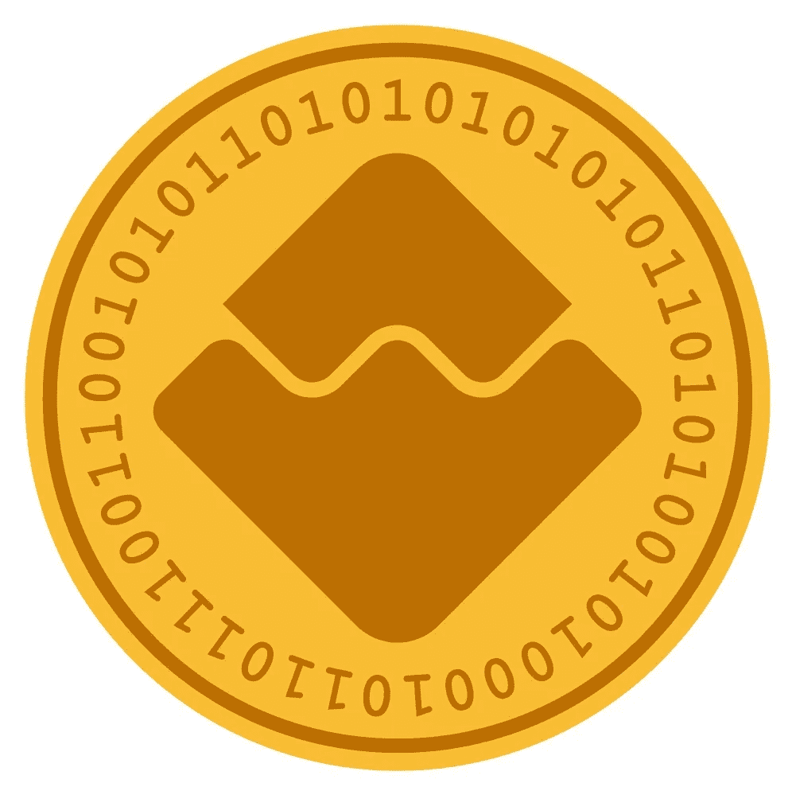

# ICOs:用点石成金的方法找到代码

> 原文：<https://medium.com/swlh/icos-finding-the-code-with-the-midas-touch-ae39969142ba>

对许多人来说，现实生活中的硬币已经变得有点讨厌了。或许可以作为洗衣钱或吃角子老虎机的食物。

数字币是有魅力的小弟。他们给你各种各样的服务。它们可以通过分布式账本在全世界范围内快速交换。

这些所谓的“实用代币”通常通过最初的硬币发行进入世界。越来越多的企业家开始热衷于这种 ico，他们经常将这种 ico 与他们的企业将提供的未来服务联系起来。ico 市场已经从 2013 年的几乎为零增长到 2017 年的 80 亿美元。

然而，它们的价值显然非常不稳定，任何比特币持有者都可以证明这一点。**投资者尽职调查至关重要**。那么，买家如何选择有金色前景的硬币呢？

根据德国学者 Christian Fisch 的观点，主要区别在于潜在代码的感知强度。他对 423 个 ico 的研究发现，有技术白皮书支持的**发行通常能筹集更多资金**。这为比特币增加了一定的学术声望，就像中本聪 2008 年的白皮书为比特币所做的那样。这份研究文件越长，你筹集到的真实资金就越多。

这同样适用于经历了更严格编程的**编码框架**。很多 ICO 筹款团队在 GitHub 等程序员平台上发布他们的代码。这允许非技术观察者仔细检查编码所经历的迭代。与更多漏洞修复相关的 ico 通常会吸引更高的投资者需求。

当然，投资者对完全开放的需求给科技创业者带来了艰难的权衡。它可能会帮助我锁定必要的资金，但它也可能引发模仿的商业模式。

放下“Ctrl+C，Ctrl+V”的偏执狂，并不容易。但许多企业家将不得不这样做:要想成功地将数字硬币转化为真正的现金，需要具备脆弱性。

*菲舍尔，C. (2019)。“为新企业融资的首次发行硬币”。商业风险杂志 34:1–22*

## 这篇文章发表在 [The Startup](https://medium.com/swlh) 上，这是 Medium 最大的创业刊物，拥有+402，714 名读者。

## 在此订阅接收[我们的头条新闻](http://growthsupply.com/the-startup-newsletter/)。

