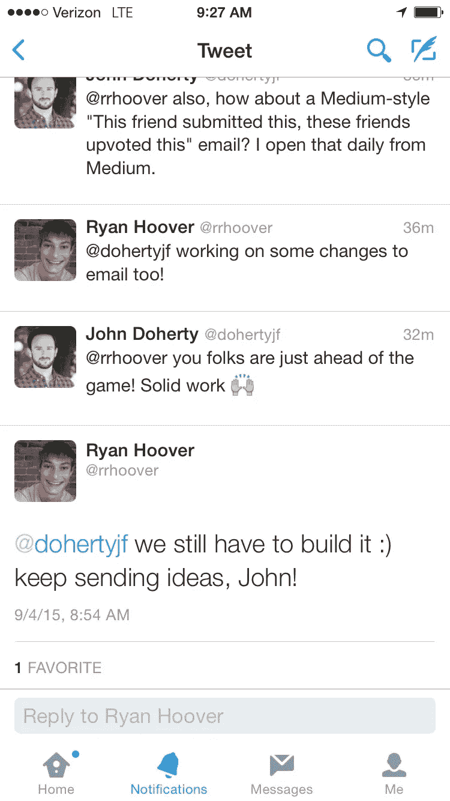

# 想法是容易的，语言是廉价的

> 原文：<https://medium.com/swlh/ideas-are-easy-words-are-cheap-eb2b31f6180b>

今天我有了一个顿悟——想法很容易，语言很廉价。真正的魔力来自于采纳这些想法，定义它们的必要性，然后把它们付诸实施并向全世界推广。

我一直认为自己是个有想法的人。我可以一整天都想出营销点子(有时会让我日常工作的人很恼火)。有时候这些只是想法，背后没有战略。有时他们很聪明，会开辟所有新的策略和渠道(不过这是个例外。我的想法大部分都很糟糕)。

今天我和 Ryan (ProductHunt 的创始人)在 Twitter 上交流了一下，我就我在 ProductHunt 中遇到的一个问题给出了一些想法(产品是短暂的，很快就会被埋没)。虽然这有助于网站的粘性，因为人们必须经常回来，以确保他们不会错过新产品，但现实是生活和工作很忙，我不能像我希望的那样经常去那里。另外，我不只是对任何产品感兴趣，我只对与我的生活相关的产品感兴趣。但这些想法是另一个话题，更提交我的观点。

> 想法是容易的，语言是廉价的

瑞安是这样说的:

“我们仍然需要建立它:)

搞定了。

作为一名代理营销人员，我的工作是采取我的客户现有的策略(当时主要是 SEO)，通过提供新的想法和对更广阔的互联网世界的洞察力来帮助他们调整它，然后帮助他们完成它(通过制作商业案例，获得正确的人温床盟友等)。这相当容易，因为我可以说“你每月付给我们公司 xx，xxx 美元。你应该听。”内部更难。

在我的工作中(自从我加入 Zillow 集团以来，我在该集团有 3 个“职位”，经理、高级经理和现在的高级增长经理)，我可以毫无问题地提出想法。我可以谈谈他们。

但是如果你想改变世界(或者仅仅是发展一家公司)，你必须把事情做好。我的工作通常从想法开始，但很快就会变成“我们如何让这一切发生？”首先是买进，然后才是真正的工作。不要混淆完成事情的想法。想法是必要的先决条件，但它们只是开始。

> 想法很容易。文字是廉价的。

谢谢你的提醒，瑞恩。

*发表于* **创业、旅游癖和生活黑客**

-