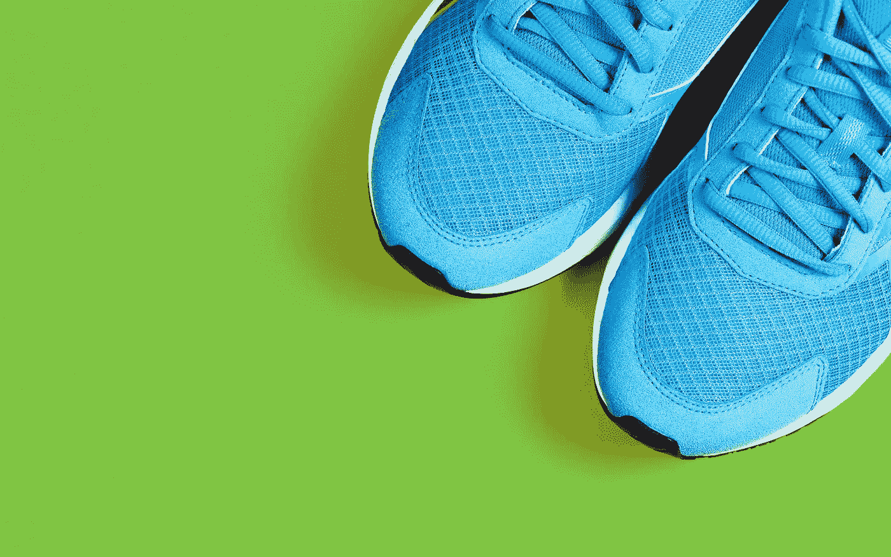
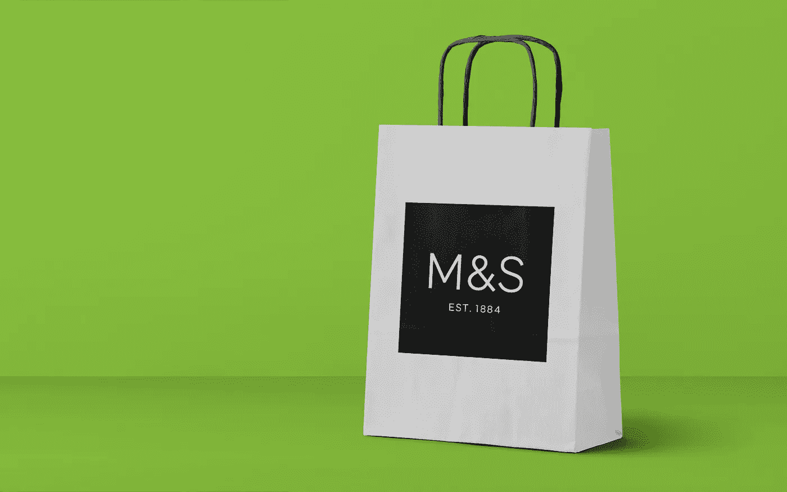
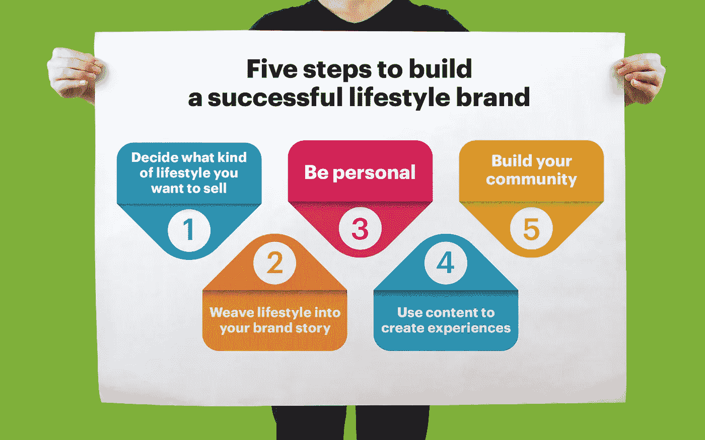
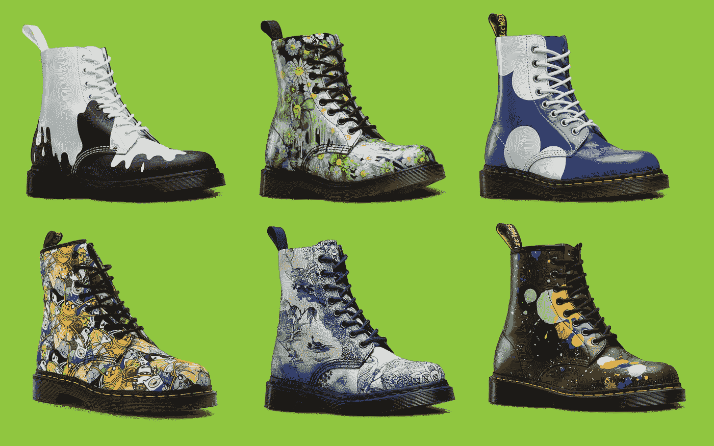

# 身份和意识形态:什么是生活方式品牌？

> 原文：<https://medium.com/swlh/identity-and-ideology-what-is-a-lifestyle-brand-30fb27971d0b>

用充满活力的展示广告和对外营销努力吸引客户的日子已经一去不复返了。今天的消费者厌倦了传统的广告形式。他们不想被“卖给”，相反，他们希望体验能在情感层面引起共鸣的品牌。

当谈到创建激发忠诚度的品牌时，很少有公司比生活方式品牌更成功。这些企业已经知道如何通过让顾客享受他们渴望的生活方式来赢得他们的尊重和信任。

[生活方式品牌的工作方式是](/comms-planning/what-it-actually-means-to-build-a-lifestyle-brand-3a8a0ff65f81)弄清楚他们的客户想要实现什么，并根据他们的客户渴望的体验以及激励他们的人、事和想法来定制他们的品牌。顶级生活方式品牌知道，在当今世界取得成功不仅仅是创造理想的跑步服装，而是[说服你的观众](http://fabrikbrands.com/neuroscience-marketing-mind-control/)你的公司可以支持他们成为他们崇拜的运动员。

那么，什么是生活方式品牌，你的企业如何成为一个？

# 什么是生活方式品牌？

生活方式品牌明白这样一个事实，对我们大多数人来说，生活相当无聊。虽然我们爱我们的家人，欣赏我们的天赋，甚至享受我们的工作，我们经常渴望实现自己的某些改变，比如变得更有冒险精神，更有运动精神，或者更有社会意识。

有了生活方式品牌，特定的食物、产品和服装可以帮助我们[与我们理想中的自己](https://hiilite.com/agency-news/why-we-love-brands-the-psychology-behind-branding/)联系起来。因为我们相信某些公司是某些价值观或愿景的代名词，我们也相信与这些品牌联系在一起有助于我们变得更像我们想要成为的人。

例如，奢侈生活方式品牌如 [Marks 和斯潘塞说服](http://fabrikbrands.com/marks-and-spencer-branding/)他们的顾客在购买他们的产品时可以获得更好的生活质量，因为他们围绕奢侈和放纵的体验建立了一种身份。

当你成为一个生活方式品牌时，你需要弄清楚你想要联系什么样的客户，然后调整你的形象、声音和营销策略，与那个特定的人形成更深层次的联系。例如:

*   像耐克或彪马这样的品牌吸引了“运动”的身份
*   吉普或哈雷戴维森等品牌与“冒险家”的身份联系在一起
*   像帕什利、马克斯和斯潘塞这样的品牌吸引着“奢华”或“富有”的身份。

# 创建生活方式品牌:你需要知道什么

成功的生活方式品牌赢得了顾客的忠诚，因为它们让顾客相信，只要稍加帮助，他们就能成为自己想成为的人。无论你是告诉你的客户他们可以和你一起享受更奢华的体验，说服他们他们可以成为一名著名的运动员，还是向他们保证他们可以拥抱更冒险的个性，你都在承诺改善他们的世界。

因为你试图推销的生活方式需要贯穿你的整个身份，你需要确保在[开始设计你的标志](http://fabrikbrands.com/how-to-create-a-brand-logo/)或建立你的网站之前，你已经做了一些事情。例如:

## 1.确定你想要推销的生活方式

当你创建一个生活方式品牌时，你需要做的第一件事就是弄清楚你想在你的顾客中拥有什么样的声誉。问问你自己，你的客户喜欢什么，他们想要实现什么，他们目前面临什么挑战。[咨询机构](http://fabrikbrands.com/factors-for-hiring-brand-consultancy-london/)可以在这方面提供帮助，或者你可以从调查你的客户开始。

## 2.创造引人注目的品牌故事

你不能只是告诉你的顾客你会给他们想要的生活方式。如果你想成功，你需要设计一个故事，让你的客户相信你的公司与他们最终的自我产生了共鸣。[设计一个故事](http://fabrikbrands.com/the-rise-of-storytelling-in-marketing/)，嵌入你做的每一件事。

## 3.社交化

生活方式品牌自然是社交的。当人们试图拥抱某种生活方式时，大多数时候，他们试图让世界相信他们的身份。作为一个生活方式品牌，与追随者联系的最佳方式是通过社交媒体。这将帮助你开始[与你的观众一起创造体验](http://fabrikbrands.com/brand-recognition-or-brand-awareness/)同时收集你的目标观众的数据。

## 4.创造伟大的内容

创建一个伟大的品牌取决于你设计令人难以置信的内容的能力。不要试图向你的顾客推销你自己或你的产品。相反，想办法在你的空间里炫耀你的身份和权威。例如，博客文章可以是教育你的客户的好方法，同时提高你的在线排名，而视频和播客可以帮助你在视觉层面上联系。

## 5.加强你的社区

一旦你知道了你想要推销的生活方式，你就能开始围绕你的价值观和理想发展一个社区。通过口口相传的内容、[影响者营销](http://fabrikbrands.com/influencer-marketing-agency/)，以及任何其他形式的可以展示你所传递的生活方式的社交证明，尽快发展你的社区。

# 成为一个生活方式品牌

如果你对今天的销售有所了解，你会知道大多数购买决定都是感性的，而不是理性的。

[当人们购买 Doc Martens](http://fabrikbrands.com/british-brands-dr-martens-history/) 时，他们这样做是因为他们想成为该品牌所代表的文化的一部分——一种以创造力和个性为中心的文化。今天的消费者认为他们购买的东西是他们身份和价值观的延伸。

生活方式品牌深入了解人们想从某个特定领域和行业得到什么，然后向他们的顾客提供他们一直渴望的生活方式或特征。成功的关键是记住你的目标应该是与你的客户想要成为的人联系在一起，而不是他们已经成为的人。

为了[了解更多关于生活方式品牌的信息](http://fabrikbrands.com/why-lifestyle-brands-become-a-way-of-life/)，查看我们的综合指南，了解通过代表一种特定的生活方式而赢得客户尊重和忠诚的成功公司的提示、技巧和例子。

今天，品牌不仅仅是销售产品，他们还销售体验和想法。

只需一点点努力，你的品牌就不仅仅是一项业务，而是一种生活方式。

## 这个故事发表在 [The Startup](https://medium.com/swlh) 上，这是 Medium 最大的企业家出版物，拥有 295，232+人。

## 在这里订阅接收[我们的头条新闻](http://growthsupply.com/the-startup-newsletter/)。

