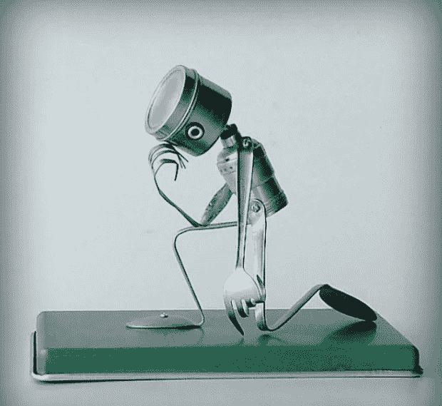
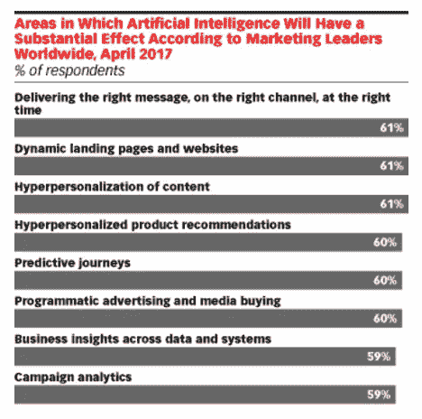
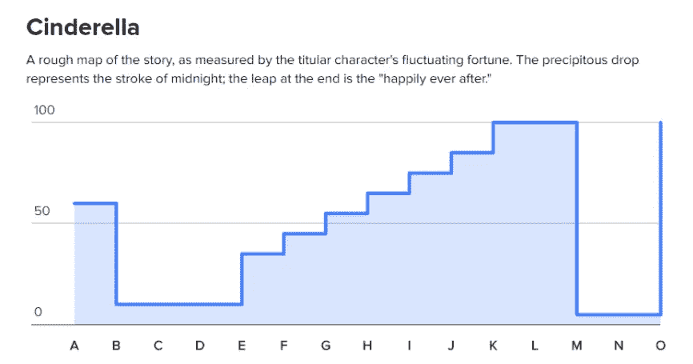
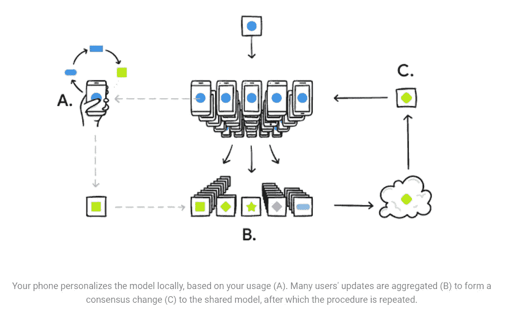

# 如果这是电脑写的，你怎么知道？

> 原文：<https://medium.com/swlh/if-a-computer-wrote-this-how-would-you-know-the-story-of-ai-and-content-creation-7a597d6ace2a>

## 我们通常认为人工智能(AI)是指过程和计算。许多基于规则的任务已经成熟，可以由复杂的算法和机器学习系统进行干预。

人们普遍认为，这样的发展只会解放我们，让我们把更多的时间花在创造性的任务上，比如战略和内容制作。

在这里，人和机器是有区别的；我们处理艺术，他们可以处理科学。

如果这是同居的一种形式，那就是他们在为我们工作，将我们无法完成的耗时或繁琐的工作自动化。

这些清晰的分类看起来很有帮助，但是它们仍然准确吗？

**随着我们从基于规则的自动化转向真正的人工智能，我们应该相信创造力仍将是人类独有的追求吗？**

深度学习算法正在迎来一个[强人工智能](https://en.wikipedia.org/wiki/Chinese_room#Strong_AI)(也称为真正的人工智能)的时代，能够接受抽象的、未标记的输入，并根据感官信息和纯结构化数据做出决策。这是一个非常重大的转变，可能标志着人工智能进入感知领域。许多人认为，随着感知而来的是创造的能力。

取决于你的立场，这种令人鼓舞的(或不祥的)证据已经在我们周围了。在过去的 12 个月里，人工智能被部署到反恐斗争中，它创作了古典音乐，也创作了批评家们无法从人类艺术家的作品中分辨出来的艺术作品。

此外， [Gartner 预测](http://www.gartner.com/newsroom/id/3143718)，“到 2018 年，所有商业内容的 20%将由机器创作，”Elon Musk [认为](https://futurism.com/elon-musk-thinks-ai-will-beat-humans-at-everything-by-2030/)计算机将能够“在 2030 年至 2040 年”做人类可以做的任何事情，而[谷歌投资](https://www.theverge.com/2017/7/7/15933224/google-press-association-ai-news-writers)超过 80 万美元在新闻协会的倡议中，仅通过使用人工智能生成新闻故事。

在这种背景下，以人工智能为主导的创意内容的无情进军似乎是确定的，但叙事并非如此线性。

人工智能在内容生成领域面临的挑战既触及技术层面，也触及哲学和心理学层面。

因此，在本文中，我们将试图定义这些挑战，评估它们的潜在回报，并讨论机器控制信息和媒体的未来会是什么样子。

# 首先，一些定义

在我们深入研究人工智能产生高质量内容的潜力之前，我们应该明确说明我们试图定义和决定的是什么。

首先，我们需要确保牢牢掌握什么是真正的智慧。

> 智力可以简单地定义为将经验转化为知识或新技能的能力。

那么，人工智能就是(根据斯坦福大学的定义)“制造智能机器，尤其是智能计算机程序的科学和工程。”

一个普遍(但并非普遍)的信念是，人工智能因此是人类智能的精确复制品，因此，只有当我们完全理解我们自己的大脑如何工作时，我们才能实现真正的人工智能。

哲学家们，如朱利安·奥弗莱·德·拉·梅特里，在他 18 世纪的著作《人类机器》(T1)中，已经在思考我们今天面临的困难:

> 人是一台如此复杂的机器，不可能清楚地了解机器的内部运作，因此也不可能给它下定义。

**这一直是人工智能进步的障碍；我们无法定义的东西，我们无法复制。**

因此，由于认知科学缺乏对意识本质的发现，人工智能受到了阻碍。

然而，对认知科学的依赖正在消失。

斯坦福大学在对人工智能的定义中强调了这一转变，“人工智能不必局限于生物学上可观察到的方法。”换句话说，我们理解的极限不一定构成人工智能的极限。

[埃森哲有益的分类](https://www.accenture.com/t20160814T215045__w__/us-en/_acnmedia/Accenture/Conversion-Assets/DotCom/Documents/Global/PDF/Technology_11/Accenture-Turning-Artificial-Intelligence-into-Business-Value.pdf#zoom=50)更进一步，将人工智能定义为能够“感知、理解和行动”的系统这与迄今为止大多数人工智能研究是一致的，这些研究通常专注于智能的几个不同组成部分，如推理、解决问题和感知。

如果我们真的想辨别人工智能生成的创造性内容是否即将出现，这些是我们必须了解的要点。首先，我们简单定义一下内容生成的流程。

“内容生成”可能是一个相当模糊的术语，但我们可以将其大致分为三个方面:提出内容创意、制作内容和推广内容。

内容本身是一个不断变化的领域，意味着从推文到好莱坞大片的任何东西，以及介于两者之间的数十亿其他东西。

就本文的目的而言，让我们将其限制在一个典型的内容营销活动中，该活动涉及视频形式的创意产生和内容制作、一些带有图片的基于文本的文章以及社交媒体推广。

在这个范围内，我们需要将解决问题、批判性分析和原创性思维结合起来，提出一个能引起目标受众共鸣的想法。

一个人工智能程序有不同的独立等级，这是我们在这里真正应该努力确定的。

# 因此，我们的问题是:

# **人工智能能在多大程度上承担并结合这些专长，其结果会等同于或优于人类的努力吗？**

# **当我们不完全确定自己创造力背后的公式时，机器能有创造力吗？**

普遍的假设是，创造过程如此抗拒具体的定义，以至于超越了人工智能。不是因为人工智能系统的任何先天缺陷，而是因为我们自身的局限性。

在这一点上，我们似乎陷入了某种僵局，但最近有了显著的进展，让我们有理由乐观地看待机器自主生成内容。

# 今天的人工智能和内容营销

人工智能通常被部署用于营销中的物流任务，因为它的计算能力在效力和便利性方面都远远超过我们自己。

例如，这些基于规则的系统可以成倍地提高媒体购买的效率，让我们继续进行更具战略性或创造性的任务。这真的是自动化的例子，而不是狭义的 AI。

内容构思、创作和传播是属于艺术范畴的任务，因此不太容易受到机械干扰。机器处理数字，我们提出想法，然后机器可以个性化信息并锁定正确的客户。

eMarketer 最近对首席营销官的调查清楚地表明了这种态度:

这里有一个明显的趋势；营销人员希望人工智能能够与预先存在的信息一起工作，针对每种媒体进行定制和定位。

预计将受到人工智能发展影响的领域可以大致分为数据分析和在线体验定制。这些都需要刺激材料，比如网站或视频的登陆页面。当然，这些都来自人类创造力的深邃而神秘的源泉。我们再一次清楚地区分了机械人和人。

一些将人工智能元素引入内容生成的努力非常有效，尽管它们的雄心有限。

像 Quill 和 Wordsmith 这样的平台已经提供了自动内容生成，这对于大规模创建声明性内容或产品描述非常有用。

毫无疑问，机器可以扫描新闻标题，评估页面级流量数据，并决定哪些标题在未来最有可能产生点击。

Whisper 最近也重新推出了 T1，拥有人工智能驱动的内容定制引擎和一些幕后人工编辑的附加安全性。

此外，如前所述，Gartner 预测，2018 年，20%的商业内容将由人工智能生成。

这听起来是一个很大的增长，但我们需要理解“商业内容”的概念，而不是“创造性内容”，以获得一些观点。

金融内容，如季度收益报告，通常由机器编写，通常由 Quill 或 Wordsmith 等软件编写。根本没有必要在这些内容中注入个性，因此计算机可以胜任这项工作。

这就是为什么谷歌对美联社人工智能项目的投资会引起营销人员的兴趣。有机会在人们没有注意到差异的情况下自动制作一些新闻故事，但看看这是否会超越信息内容将是令人着迷的。

《纽约时报》2015 年刊登的一篇[研究](http://www.tandfonline.com/doi/pdf/10.1080/17512786.2014.883116)(“机器人记者出场”)为这一观察增添了更多色彩。

“图灵测试”经常在这些问题中被引用，并且在研究中使用了这种评估的变体。在图灵测试(以英国数学家和人工智能先驱艾伦·图灵命名)中，如果人类询问者无法区分其答案和人类给出的答案，则计算机通过测试。

图灵提供了以下例子:

> ***审问者*** 在你十四行诗的第一行写着‘我可以把你比作夏日吗’，‘春天’不也一样好或者更好吗？
> 
> ***电脑*** 它不会扫描。
> 
> ***审讯者*** 《一个冬日》怎么样？那应该没问题。
> 
> ***电脑*** 是的，但是没有人愿意被比作冬日。
> 
> 审讯者 你会说匹克威克先生让你想起了圣诞节吗？
> 
> ***电脑*** 换一种方式。
> 
> 然而，圣诞节是一个冬天，我认为匹克威克先生不会介意这种比较。
> 
> ***电脑*** 我觉得你不是认真的。冬天的一天是指一个典型的冬天，而不是像圣诞节这样的特殊日子。

使用诗歌作为例子似乎是有目的的，并揭示了我们关于人工智能产生创造性内容的潜力的问题。

对人工智能系统来说，分析潜在的模式是一项理想的任务，我们将在后面看到。

在《纽约时报》的特写中，图灵测试被重新贴上了标签:

如果是算法写的，你怎么知道？

这很重要，因为它比图灵测试的二元通过/失败更进一步，询问参与者关于同一事件的两篇文章中哪一篇最符合描述性形容词的列表。参与者不知道的是，一个版本是由人工智能软件编写的，另一个是由专业记者编写的。

> 结果是惊人的，如果不是完全震惊的话。该软件在“信息丰富”、“值得信赖”和“客观”等描述词上得分很高。
> 
> 它在“阅读愉快”方面落后，但在“无聊”方面遥遥领先。
> 
> 这似乎证实了我们对计算机能做什么和不能做什么的先入之见。

虽然只是一项研究，但它确实暗示了一个潜在的事实:最好的创意内容是情绪化的，而计算机不擅长情绪化。如果没有真正的情感，机器几乎不可能挖掘这个深邃但不可渗透的灵感宝库。

这并不是说人工智能在内容创作方面碰壁了。新闻媒体可以依靠人工智能来撰写准确的事件报道，但人工智能也通过使用神经网络开发了产生创造性工作的能力。

# 神经网络和创造性内容生成

昂贵但有效的深度学习神经网络的广泛使用已经开始侵蚀对先验人类知识的需求。机器可以像人一样自主学习。然而，它所学习的并不受我们感知器官的限制。

为了输出成功，我们甚至不需要理解神经网络的过程。

下图是一个简化的图表，用来说明有多少深度学习神经网络在起作用，包括谷歌的 RankBrain 算法，它塑造了我们看到的搜索结果。

隐藏层中神经元的数量可以显著增加(层的数量也可以)，以创建一个可以产生任何期望结果的系统。

人工智能音乐作曲家 Aiva 使用了这种方法。Aiva 的输入层由古典音乐作曲家的乐谱组成。在“隐藏层”中，Aiva 学习了音乐中潜在的结构和模式。在掌握了理论之后，人工智能将其付诸实践——你可以在这里收听 Aiva 在 Soundcloud [上的工作。](https://soundcloud.com/user-95265362)

这给人留下了深刻的印象，但也需要一些警示。Aiva 的音乐依赖于刺激材料，并直接从中获得创作灵感。此外，还需要一个人类管弦乐队来演奏音乐。尽管如此，这是迈向创造力的一大步的证据。

已经进行了类似的实验，以了解人工智能系统能够在多大程度上理解文学作品的结构。

由于如此多的内容生产是由文本驱动的，这是我们需要理解的一个重要领域。[研究](https://www.theatlantic.com/technology/archive/2016/07/the-six-main-arcs-in-storytelling-identified-by-a-computer/490733/)产生了如下的可视化效果，它描绘了灰姑娘在同名人物故事持续期间的命运。

人工智能系统被输入了近 2000 个作品作为输入层，所需的输出是对它能找到的任何常见结构的分析。它找到了以下六个:

**1。白手起家(崛起)**

**2。**由富到贫(堕落)

**3。洞里的人(跌倒再爬起来)**

**4。伊卡洛斯(上升然后下降)**

**5。灰姑娘(上升然后下降然后上升)**

**6。俄狄浦斯(堕落然后上升然后堕落)**

这种分析涉及每本书的情感弧线，而不仅仅是叙事或基于情节的弧线。

再一次，这令人印象深刻，但没有告诉我们同一个人工智能是否能写出类似质量的书。

我们对此还没有明确的答案，但迹象表明在未来十年内将会有一本成功的人工智能著作问世。就在去年，一部由人工智能程序编写的短篇小说通过了日本著名的星新一文学奖的第一轮评审。评委之一，科幻小说家 Satoshi Hase 说:“这是一部结构良好的小说。但要获奖，还有些问题(需要克服)，比如人物描述。”

这与我们上面看到的一致。结构良好，信息丰富，准确，但缺乏艺术锐气，标志着人类作者的工作。尽管如此，随着人工智能系统越来越接近感知，我们应该期待机械语言技能继续改进。

也许创造性人工智能领域最著名的研究是视觉艺术。

罗格斯大学科学家的工作展示了人工智能处理数千年艺术史的能力，几乎可以立即识别不同绘画中的相似之处。其中一些是全新的发现，但艺术评论家一致认为，这些画作之间有足够的结构、主题或美学联系，可以称之为相互关联。

去年，一项公开调查显示，人工智能创造的艺术作品更受人类艺术家的青睐。这一成功是由两个相连的神经网络配对驱动的，“一个生成图像的生成器，一个判断绘画的鉴别器。”

这就是众所周知的生成性对抗网络，或 GAN。

我们在这里有一个明显的例子，人工智能生产的原创艺术作品超过了图灵测试。

因此，类似的设置似乎完全可行，可以制作成功的 YouTube 视频，甚至为我们的人工智能文章创建一些原创图像，而驱动人工智能聊天机器人的相同技术可以管理社交媒体账户。

因此，我们正在接近这样一个点，即人工智能生成的创意内容非常有可能实现，但它可以实现吗？

**这里有来自谷歌的答案提示。**

谷歌正在训练它的算法，通过一个被称为[联邦学习](https://research.googleblog.com/2017/04/federated-learning-collaborative.html)的过程来相互教授。

联合学习是谷歌加速数据共享过程和增加数据量的最新尝试，数据量对机器学习系统的改进至关重要。

这是一个重要的发展，因为谷歌有提供类似程序的开放访问的历史。

谷歌还推出了一项新举措，旨在为其人工智能系统增加一点人性。

这正是目前所缺乏的元素，因为很多内容营销都依赖于思想和情感的交流。

我们距离人工智能生成的内容可以大规模获得的营销生态系统还有一段距离，但最近的进展应该让我们对这项技术的潜力感到乐观。

# 总之:我们离“人工智能生成的内容”有多近？

今天在“人工智能生成的内容”领域发生的许多事情可以更恰当地定义为内容监管。

没有最初的内容(由一个人创造的)，这个过程就变得愚蠢，成为一个回报递减的内在螺旋。

正如我们最近所写的，人工智能将在跨越感官、精神、机械和人际关系的智能统一中达到其顶峰。

如果人工智能系统获得了创造性和独立思考的能力，没有理由为什么这种技能不能应用于内容生成。

这次讨论最有趣的地方在于合作的可能性。最大限度地发挥人类和机器优势的“扩展智能”的潜力听起来确实有些异想天开，但已经有迹象表明这可能会实现。

为了寻找灵感，我们可以看看 1993 年的小说《T2》，仅此一次(T3)，作者是绰号“哈尔”的麦金塔 IIcx，作者是其程序员史蒂夫·弗伦奇。尽管当时因其质量(或缺乏质量)而备受嘲笑，但现在看来，它在尝试将计算机和人类作者的技能结合起来方面颇有先见之明。

当我们牢记人工智能不受人类智力极限的限制时，这一点非常重要。人工智能可能会模仿我们处理信息或做出决策的方式，但它主要关注的是解决问题。因此，它可以发现解决我们从未考虑过的问题的新方法。

虽然人工智能相关领域的进展似乎是确定的，但其速度和方向尚未确定。我们在这一格局中的位置也是如此。人类和机器之间的分界线不断变化，这很重要。

我们需要知道这项技术能做什么，不能做什么，以及我们应该在哪里定位自己，以利用即将到来的与人工智能系统合作的可能性。

当然，这也会影响我们的招聘计划。正如《哈佛商业评论》中[的一篇文章](https://hbr.org/2017/07/liberal-arts-in-the-data-age)相当准确地指出:

> “现在重要的不是你拥有的技能，而是你如何思考。你能提出正确的问题吗？你知道你首先要解决的是什么问题吗？”

也许在人工智能革命中不受挑战的不是我们的创造力，而是我们与生俱来的无穷无尽的好奇心。

*最初发布于*[*www . Clark Boyd . digital*](https://www.clarkboyd.digital/thinking/2017/7/12/putting-the-art-in-artificial-intelligence-could-ai-take-over-content-creation)*。*

## 这篇文章发表在《创业公司》杂志上，这是 Medium 最大的创业刊物，有 325，521 人关注。

## 订阅接收[我们的头条新闻](http://growthsupply.com/the-startup-newsletter/)。

