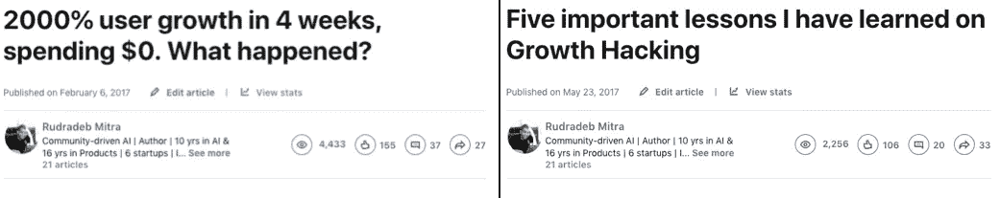
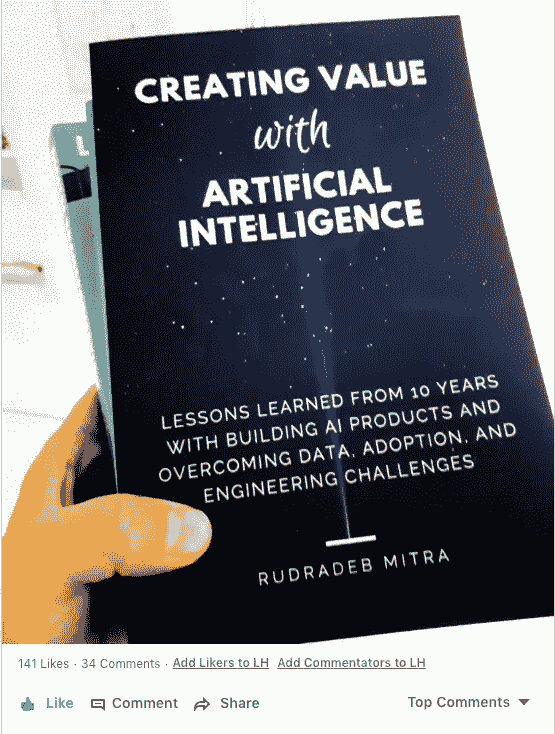

# 如果顾客说，“你的价格太高了”，就离开吧！

> 原文：<https://medium.com/swlh/if-customers-say-your-prices-are-too-high-just-leave-f8b372747f01>

如果你是一家初创公司，并从潜在客户那里听到了以下任何异议"*我们不从初创公司*"、"*我们不想付钱，因为你是一家初创公司*"、"*你的价格太高了*"，那么很可能你卖给了错误的人。那么，最好的办法是结束对话，而不是谈判。

> *“如果你接触了错误的人，无论你的服务或产品有多好，你的销售都会失败”*

在我过去几年作为导师与 100 多家初创公司的互动中，关于定价的问题排在首位。找到合适的价格并不容易，但这一切都始于为你的产品找到合适的人群。

# **为你的创业公司找到合适的客户**

> *“一个人能做的最冒险的事情就是为普通人制造一个普通的东西，并把它推销给大众。”* —塞思·戈丁

在社交媒体和影响者的时代，我们都太专注于获得成百上千的喜欢。我们使用的一个最常见的指标是——“我的视频获得了 100 万个赞”，或者“*我的产品搜索发布获得了 1000 次投票*”。但这真的重要吗？大多数人，如果不是全部的话，会在几分钟内忘记喜欢的东西，然后继续前进。

## 关注分享和评论，忽略喜欢的东西

有很多方法可以找到真正关心你所做事情的人(也就是早期采纳者和创新者)。他们之间有一个共同的行为——他们会和别人分享你正在做的事情。

例如，当我写一篇文章时，我不太在乎喜欢。我更关注分享我的文章的人，以及他们在分享时写了什么。让我们以两篇文章为例，我写道——一篇获得了 150+赞和 27 个分享，而另一篇获得了 106 个赞但只有 33 个分享。如果非要定义一个人更爱哪一个，我会选股份多的那个。我也会确保跟进每一个单独分享这篇文章的人。

Comparing likes vs shares

我作为演讲者使用的另一个指标是在我演讲后通过 LinkedIn 与我联系的人数。因此，如果你在一个活动(或创业竞赛)上谈论你的产品，不要担心你是否获得了一等奖(我认为在竞赛中评判和排名早期创业公司毫无意义)。看看有多少人走到你面前，谈论你正在做的事情或与你有关的事情。这些是你的创新者和早期采用者。与他们接触并培养他们。请记住，你不必让每个人都喜欢你的产品，即使这个世界上有 0.01%的人喜欢你的工作——你有一个成功的企业。

> “做一些 100 个人喜欢的东西，而不是 100 万人喜欢的东西”——保罗·格拉厄姆

## 但是我们不应该追求大观众吗？

我发现早期创业公司最常见的问题之一是“*你的市场有多大*”，这是一个不相关的问题。问那个问题毫无意义。如果这个问题在 Airbnb、脸书、谷歌或 Twitter 成立之初就被问及，没有人会正确预测甚至猜测他们的市场有多大或会有多大。事实上，我会说，观众越少越好。关注那些细分市场，让他们喜欢你的产品。在早期，与其做海里的小鱼，不如做池塘里的鲸鱼。

举个例子，我指导的一家初创公司正在为纹身艺术家建立一个市场。他们花了很多钱和精力去德国(纹身艺术家的最大市场之一)，并从那里搭载了 100 名艺术家。但尽管做出了努力，他们通过网站获得的所有预订都只来自一个国家(与初创公司所在的国家相同——尽管市场规模较小)。如果他们最初专注于自己的国家，然后扩大规模，他们会花更少的钱，也许会得到更多的预订。

# **不要通过竞争或成本来定价**

一旦你确定了早期采用者或创新者，下一个挑战就是为他们确定合适的价格。为此，要理解产品或服务正在创造的价值。

## 理解你为客户创造的动机和价值

有的买是为了安全感，有的买是为了地位，有的买是为了解决一个问题，有的买是为了便宜。根据你卖的东西，一旦你理解了顾客的动机，你就可以相应地定价。

## 1.只是价格游戏

Amstrad 的创始人 Alan Sugar 曾经说过“*,我从来不把罗伊斯这种产品放在眼里，我卖的产品是给卡车司机和他们的妻子的。堆高卖低。都是按价格规格*卖的。

你也可以这样做，如果你正在做一些工艺创新，而不是产品创新，这通常是合适的。市场上已经有其他类似的产品，你只是提供了一个更便宜的选择。

## 2.销售情感

你也可以从事出售梦想或情感的生意——就像古驰、劳斯莱斯、Ferarri 等等。如果你让某人感觉良好，或珍贵，那么人们愿意付出相当多。然而，这更多的是一个品牌游戏，很少有创业公司能够玩这个游戏(因为它很贵)。如果你成功了，天空就是价格的极限！

## 3.创新产品创造价值

我接触的大多数创业公司都在这个领域。很难定价，因为没有太多基准或参考点。相反，初创公司最终会根据成本因素或相对于间接竞争对手的因素来定价。相反，我会建议按创造的价值定价。创建一个基准，并量化你的产品的使用基准——可以节省时间，减少压力，节省金钱或其他。然后将基准等同于一个美元数字。注意:一旦你知道了可量化的指标，你就可以用同样的指标来计算每个国家的价格。

## 我应该把我的产品免费送给最初的顾客吗？

经常听到这个问题。我认为，有时初创公司必须免费提供他们的产品，才能获得最初的吸引力。这很有道理，但重要的是你要让你的客户明白“这个*产品定价为 x 美元，我会免费送给你，但如果你确实喜欢这个产品，你能帮我一个忙吗*”。**底线是，不要为了免费而给予任何东西。** **不幸的是，人们并不珍惜他们免费得到的东西。**例如，我给了一些精选的人我的书的免费副本，但作为回报，我让他们在 LinkedIn 上评论它(至于在亚马逊上评论，你必须是一个值得信任的买家)。

A post by an influencer generated a lot of interest about the book

# 构建您的定价模型

一旦你和早期用户做了一些初步的特别销售，就该构建你的定价模型了。我与一家硬件初创公司进行了一次对话，这家公司做了一些初步销售，但却在为未来客户定价的问题上苦苦挣扎。如果你也处于那个阶段，我的建议是回答以下三个问题。

*   谁是你最好的早期客户
*   他们支付或愿意支付的价格
*   他们认为你的产品有什么价值

关注你所说的前 5 名“最佳早期采用者”。以上问题的答案将帮助您构建定价模型，并关注合适的潜在客户。不是每个人都会或者应该成为你的客户，但是以合适的价格卖给合适的客户是很重要的。

我希望这篇文章对你有用。这更像是一篇关于这个主题的介绍性文章，但是我写这篇文章是因为我一遍又一遍地听到同样的问题。

## 这篇文章发表在 [The Startup](https://medium.com/swlh) 上，这是 Medium 最大的创业刊物，有+398，714 人关注。

## 订阅接收[我们的头条新闻](http://growthsupply.com/the-startup-newsletter/)。

