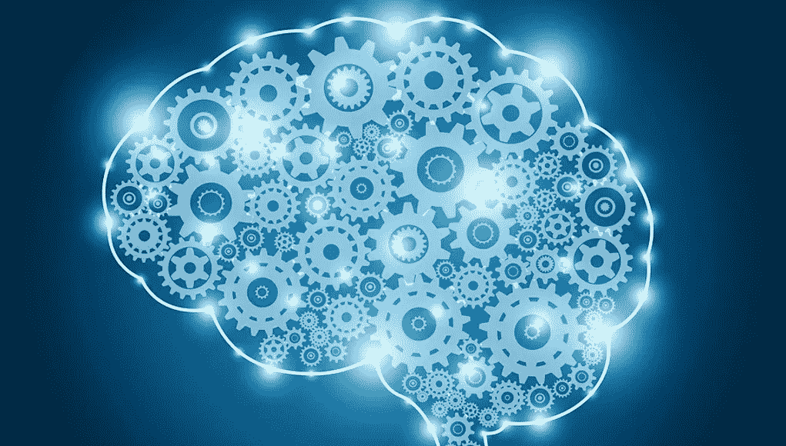

# 如果我能邀请 9 个重要人物和一个机器人来吃晚饭，并问他们关于人工智能的问题…

> 原文：<https://medium.com/swlh/if-i-could-invite-9-important-figures-and-a-robot-over-for-dinner-and-ask-them-about-ai-7c12c2502572>

如果你有机会邀请任何人，你会邀请谁共进晚餐，为什么？他们不可能是虚构的，可以是历史人物，也可以是当前人物。”

这个游戏已经玩了很久，可预测的答案是达尔文、爱因斯坦、耶稣、甘地等等。虽然拥有这些不可思议的杰出历史人物很棒，但我想展望未来。因此，对于我将组织的**虚构晚餐**，我的最佳答案是 9 个重要的头脑(和一个机器人！)谁塑造了我们的现在和未来&谁表达了他们对人工智能(AI)的看法、乐观或悲观、预测和警告。

我的客人是[斯蒂芬·霍金斯](http://www.hawking.org.uk/about-stephen.html)(瑞普·斯蒂芬！)，[比尔盖茨](https://www.gatesnotes.com/globalpages/bio)，[雷库兹韦尔](http://www.kurzweilai.net/ray-kurzweil-biography)，[马云](https://www.youtube.com/watch?v=mfhMhKxl_yg)，[埃隆马斯克](https://www.tesla.com/elon-musk)，[机器人索菲亚](http://www.hansonrobotics.com/robot/sophia/)，[杰夫·贝索斯](https://www.biography.com/people/jeff-bezos-9542209)，[金尼罗梅蒂](https://www.ibm.com/ibm/ginni/)，[桑德尔·皮帅](https://www.ft.com/content/048f418c-2487-11e7-a34a-538b4cb30025)和[戴密斯·哈萨比斯](http://demishassabis.com/)。让我们想象一下看着对话展开会是什么样子…

Ezgi

***Ezgi:*** *我代表世界上所有的公民，向你们大家致以热烈的欢迎。我们将一起度过一段深刻而愉快的时光。当谈到人工智能时，有很多观点，你们所有人都表达了自己的观点，以回应“随着人工智能技术的进一步发展，你认为人类文明会发生什么？”。只有时间能告诉我们哪些预测最接近现实。* [*未来不再是过去的样子*](/@ezgitasdemir/future-is-not-what-it-used-to-be-f00ff8fc4f50)****当我们教机器像人类一样思考的时候，谁会是最好的预测者？****

**

*Stephen*

*斯蒂芬:我们花了大量的时间研究历史，让我们面对现实吧，这主要是愚蠢的历史。因此，人们正在研究智能的未来，这是一个受欢迎的变化。*

*人工智能研究现在进展迅速。我们迄今所看到的成就与未来几十年将会发生的事情相比，肯定是相形见绌的。潜在的利益是巨大的；文明所提供的一切都是人类智慧的产物；我们无法预测当这种智能被人工智能可能提供的工具放大时，我们可能会实现什么，但消除战争、疾病和贫困将是任何人的优先事项。成功创造人工智能将是人类历史上最大的事件。*

*不幸的是，这也可能是最后一次，除非我们学会如何规避风险。对于所能达到的目标，没有基本的限制:没有物理定律阻止粒子以比人脑中的粒子排列更高级的方式进行组织。*

*人们可以想象这种技术比金融市场更聪明，比人类研究人员更有创造力，比人类领导人更会操纵，并且开发出我们甚至无法理解的武器。人工智能的短期影响取决于谁来控制它，而长期影响则取决于它是否能被控制。*

**

*Ezgi*

****Ezgi:*** *斯蒂芬，你对未来是乐观还是悲观？**

**

*Stephen*

*我担心人工智能可能会完全取代人类。如果人们设计计算机病毒，就会有人设计出自我改进和自我复制的 AI。这将是一种超越人类的新生命形式。人工智能的真正风险不是恶意，而是能力。一个超级智能的人工智能将非常擅长完成它的目标，如果这些目标与我们的目标不一致，我们就有麻烦了。*

*[然而，我是一个乐观主义者](https://www.cnbc.com/2017/11/06/stephen-hawking-ai-could-be-worst-event-in-civilization.html)，我相信我们可以创造出造福世界的人工智能。它能与我们和谐相处。我们只需要意识到危险，识别它们，采用最好的实践和管理，并提前为其后果做好准备。*

*因此，面对未来可能的不可估量的利益和风险，专家们肯定会尽一切可能来确保最好的结果，对吗？不对。如果一个高级外星文明给我们发了一条信息说，“我们将在几十年后到达，”我们会不会只是回复，“好的，当你到达这里时给我们打电话——我们会让灯亮着”？可能不会——但这或多或少是人工智能正在发生的事情。尽管我们正面临着人类历史上可能发生的最好或最坏的事情，但除了非营利机构之外，很少有人认真研究这些问题，如[剑桥生存风险研究中心](http://cser.org/)、人类未来研究所、机器智能研究所[、生命未来研究所](http://intelligence.org/)。我们所有人都应该问自己，我们现在可以做些什么来增加获益和规避风险的机会。*

**

*Sundar*

*Sundar: [我也是乐观主义者。人工智能可能是人类有史以来最重要的工作。我认为它是比电或火更深刻的东西。任何时候你与技术打交道，你都需要学会利用它的好处，同时最小化它的缺点。人工智能可以用来帮助解决气候变化问题，或者治愈癌症。](https://www.weforum.org/agenda/2018/01/google-ceo-ai-will-be-bigger-than-electricity-or-fire/)[我承认人们有权利担忧，但仍然需要拥抱技术进步。历史表明，退缩的国家不善于应对变化。所以你必须接受改变。](https://www.theverge.com/2018/1/19/16911354/google-ceo-sundar-pichai-ai-artificial-intelligence-fire-electricity-jobs-cancer)*

*从小到大，有一段时间没有电话，我等了五年。我们有了电话，它从根本上改变了我们的生活……[我们也等了很久才得到一台冰箱](https://www.theguardian.com/technology/2017/oct/07/google-boss-sundar-pichai-tax-gender-equality-data-protection-jemima-kiss)，我看到了我妈妈的生活是如何改变的:她不需要每天做饭，她可以有更多的时间和我们在一起。所以我内心的一面已经看到了技术是如何改变的，我仍然能感觉到。我感到乐观和活力，以及加快这一进程的道义责任。我记得技术带来的快乐，我认为这对人工智能来说也是如此。对我们来说，解释这一点并让世界与我们同行是很重要的。我认识到，在硅谷，人们痴迷于技术变革的步伐。很难把这部分做好…我们有时会匆忙，对一般人来说可能会失败。作为人类，我不知道我们是否想要改变得那么快——我不认为我们想要。*

*[风险很大](https://www.weforum.org/agenda/2018/01/google-ceo-ai-will-be-bigger-than-electricity-or-fire/)，应该开展巴黎气候协议规模的国际合作来管理风险。各国需要将人工智能非军事化，这是各国应该努力的共同目标。人类想出更多的全球合作框架来解决问题是非常重要的。没有一个公司或国家能够改变进步的速度。*

**

*Ezgi*

****Ezgi*** *: Ginni，人们可能不知道 IBM 不叫它 AI。你称之为“认知计算”告诉我们这是为什么。**

**

*Ginni*

*Ginni: [我实际上也不得不向我丈夫解释这一点，](https://www.bloomberg.com/news/features/2017-09-20/ginni-rometty-on-artificial-intelligence)因为他对我说，“Ginni，在所有的单词中，为什么是认知的？”这确实是一个非常深思熟虑的决定。世人称之为 AI。有太多关于人工智能的恐惧。当我们十多年前开始时，我们的想法是帮助你和我在认知超载的情况下做出更好的决定。这就是一直引导我们去认知的东西。如果我考虑首字母 AI，我会倾向于**增强智能**。这意味着我们每个人在所有重要的决定上都需要帮助。*

**

*Ezgi*

****Ezgi:*** *请允许我问你 2 个问题:第一，Watson 对 AI 的未来意味着什么？**

**第二，它仍然* [*过于依赖人类*](https://www.bloomberg.com/news/articles/2017-06-13/the-limits-of-artificial-intelligence) *，它不能足够快地学习，而且它还没有足够的变革，以达到 IBM 及其营销方式的一些期望。你如何回应那些批评？**

**

*Ginni*

*吉妮 : [直到今天你所知道的一切都是可编程的](https://www.bloomberg.com/news/features/2017-09-20/ginni-rometty-on-artificial-intelligence)——几十年来的整个时代都是可编程的。沃森将是一个不用编程的新时代的开始。机器会看数据，理解数据，对数据进行推理，然后继续学习:理解，[推理和学习](https://www.bloomberg.com/news/features/2017-09-07/this-startup-is-making-virtual-people-who-look-and-act-impossibly-real)，用我简单的定义来说，不是编程。对我们来说，这是我所说的消费者人工智能(即通用人工智能)与商业人工智能之间的一个非常大的区别。我们着手为商业建立一个人工智能平台。AI 应该是垂直的。你会[训练它认识药物](https://www.bloomberg.com/news/articles/2017-06-08/the-ai-doctor-orders-more-tests)。你可以训练它了解保险承保。你可以训练它了解金融犯罪。训练它了解肿瘤学。训练它了解天气。它不仅仅是数十亿个数据点。在监管领域，没有数十亿个数据点。你需要用少量的数据来训练和解释一些东西。*

*沃森就在我们预想的地方。当我们第一次和沃森一起进行肿瘤学教学时——第一次是肺癌、乳腺癌和结肠癌——医生们花了一年时间训练沃森。*

*医生不要非黑即白的答案，任何职业也不要。如果你是一名专业人士，我猜当你与人工智能互动时，你不会希望它说，“这是一个答案。”医生想要的是，“好吧，给我可能的答案。告诉我你为什么相信它。我能看看研究、证据和“信心百分比”吗？你还想知道什么？”*

*纪念斯隆-凯特琳癌症中心是第一批教沃森的人之一。这是黄金标准，它很好地说明了未来人工智能的原则之一。你必须知道是谁教的，里面有什么数据——你必须对此保持透明，因为这在这些决策中很重要。这给了你一个很长、很长、很长的答案，但这就是为什么我如此肯定这个世界将会有更多真正棘手的问题被人工智能解决。*

**

*Ezgi*

****Ezgi*** *:德米斯，你是谷歌 DeepMind 的联合创始人兼 CEO。* [*你发明了第一个计算机程序，在中国古代围棋比赛中打败了一个世界冠军，*](https://deepmind.com/blog/alphago-zero-learning-scratch/) *这是一个直观的游戏，一般计算机并不擅长，这是一个游戏的顶峰，也是智力深度最丰富的游戏。AlphaGo Zero 甚至更强大，可以说是历史上最强的围棋选手&展示了围棋选手可能会描述为直觉的东西，即不仅像人一样，而且以任何人都无法做到的方式玩一场漂亮的游戏的能力。你能给我们解释一下你的 AlphaGo Zero 吗？**

**

*Demis*

***德米斯**:[alpha Go 以前的版本最初是在数以千计的人类业余和职业游戏上进行训练，以学习如何下围棋。](https://deepmind.com/blog/alphago-zero-learning-scratch/) AlphaGo Zero 跳过这一步，简单地通过和自己对弈来学习下棋，从完全随机的打法开始。这样做，它很快超越了人类的游戏水平，并以 100 场比赛比 0 击败了之前发布的[冠军击败版 AlphaGo。在数百万场 AlphaGo 对 AlphaGo 的比赛中，该系统从零开始逐步学习围棋，在短短几天内积累了数千年的人类知识。AlphaGo Zero 还发现了新知识，开发了非常规策略和创造性的新动作，这些策略和动作呼应并超越了它在与 Lee Sedol 和柯洁的比赛中使用的新颖技术。](http://www.nature.com/nature/journal/v529/n7587/full/nature16961.html?foxtrotcallback=true)*

**

*Ezgi*

****Ezgi*** *:你也提到可能会有一个“划时代的事件”让 AI 对工作岗位的影响远远大于工业革命。你什么意思？我们应该担心吗，担心到什么程度？**

**

*Demis*

*每当一项新技术出现时，它都会带来巨大的变化。我们知道，从工业革命开始，互联网做到了这一点，手机做到了这一点。所以你可以把人工智能看作是这个谱系中的另一个真正的大分裂事件。这是一个合理的观点。在这种情况下，社会将会像对待所有其他事情一样适应，一些工作将会消失，但是更新的，希望是更好的，更高质量的工作将会成为可能，由这些新技术推动。我认为这在短期内肯定会发生。*

*我相信人工智能将成为科学家部署的一种元解决方案，增强我们的日常生活，让我们更快更有效地工作。如果我们能够广泛而公平地运用这些工具，营造一个人人都能参与其中并从中受益的环境，我们就有机会丰富和推进整个人类。这样做，我们也可以对自己有所了解。*

**

*Elon*

***埃隆** : [工作肯定会被打乱。因为将会发生的是机器人将能够做得比我们更好。…我是说我们所有人。你可以看到机器人可以在几个小时内学会走路，比任何生物都要快。我不确定对此该怎么办。这真的是我最害怕的问题，我告诉你。](https://www.cnbc.com/2017/07/17/elon-musk-robots-will-be-able-to-do-everything-better-than-us.html)*

*交通将是第一批完全自主的行业之一，因此交通运营商将是第一批失业的。但是没有一份工作是安全的，但是当我说一切的时候，机器人将能够做任何事情，除了什么。人工智能专家认为，至少还需要 20 年时间，计算机才能打败下围棋的人。现在它可以同时碾压和播放前 50 名，并将他们全部碾压。这一进展速度令人瞩目。然而，对人工智能来说，最可怕的潜在威胁不是失业。最危险的东西——也是最难的——是网络中的深层智能，因为它不是物理的东西。*

*我认为所谓的人工智能专家的最大问题是，他们认为他们知道的比他们做的更多，他们认为他们比他们实际上更聪明。这往往困扰着聪明的人。他们根据自己的智力来定义自己，他们不喜欢机器可能比他们聪明的想法，所以他们不相信这个想法——这从根本上是有缺陷的。*

*你说，“网络中的深度情报能有什么危害？”嗯，它可以通过制造假新闻、欺骗电子邮件帐户、发布假新闻稿和操纵信息来发动一场战争。*

*人们并没有对机器人和人工智能的潜力感到应有的恐惧，因为他们并没有完全了解它的潜力。人工智能对人类文明的存在是一个根本性的风险，而车祸、飞机失事、劣质药物或劣质食品则不是——它们当然对社会中的一组个体有害，但它们对整个社会无害。*

*我们必须想出一些方法来确保数字超级智能的到来是与人类共生的。我认为这是我们面临的最大的生存危机，也是最紧迫的危机。*

**

*Bill*

***比尔** : [这是一个我和伊隆意见相左的案例。我们不应该对此感到恐慌。我们也不应该轻率地忽视这个问题最终会出现的事实。](https://www.inverse.com/article/36840-elon-musk-bill-gates-artificial-intelligence)*

*我认为人工智能将取代一些工作，我们无法阻止它。但是，如果它像我预测的那样发展，这对世界将是一个积极的消息，因为人工智能，我们可能会有更多的空闲时间。人类的目的不仅仅是坐在柜台后面卖东西。更多的自由时间并不是一件可怕的事情。你会更有效地利用资源，你会更清楚发生了什么。随着人工智能的使用，生产可能会增加两倍，这意味着使用更少的劳动力。但这并不一定意味着人们的工作会减少。提高生产水平可能会产生几个影响:延长员工的假期，调整职位方向，重新专注于帮助老人、帮助有特殊需求的儿童，以及缩小阶级差异。随着我们将劳动力从制造业等行业中解放出来，我们可以将劳动力转移到这些非常以人为中心的需求中。*

*我们正处于一个短缺的世界，但是这些进步将帮助我们解决所有的首要问题，然而，如果以错误的方式发展，这些进步将有不能帮助每个人的危险。如果我们不小心的话，技术实际上会加剧富人和穷人之间的差异，因为如果它很昂贵，如果你只在一个富裕的乡村学校里学习，那么你会让富人和穷人之间的差异变得更大。因此，我承认人工智能会导致失业，而且有人担心[是一个危险的超级智能](https://futurism.com/artificial-intelligence-is-our-future-but-will-it-save-or-destroy-humanity/)，但是[没有理由对此感到恐慌](https://futurism.com/bill-gates-says-we-shouldnt-panic-about-artificial-intelligence/)。*

**

*Elon*

***伊隆** : [我其实并不太担心短期的事情。](https://www.cnbc.com/2018/03/13/elon-musk-at-sxsw-a-i-is-more-dangerous-than-nuclear-weapons.html?__source=Facebook%7Cmain)窄 AI 不是物种级风险。这将导致混乱，失业，更好的武器和诸如此类的事情，但这不是一个基本的物种水平的风险，而数字超级智能是。*

*[我接触过最前沿的 AI](https://www.cnbc.com/2017/07/17/elon-musk-robots-will-be-able-to-do-everything-better-than-us.html) ，我认为人们应该真正被它所关注。如果要我猜我们最大的生存威胁是什么，可能是这个。所以我们需要非常小心人工智能。越来越多的科学家认为应该有一些国家和国际层面的监管，只是为了确保我们不会做一些非常愚蠢的事情。有了人工智能，我们在召唤恶魔。在所有那些有五角星和圣水的故事中，就像是他确信他能控制恶魔。没成功。*

*[我的一些朋友深度参与了人工智能创新](https://www.fintecho2o.com/single-post/2017/03/31/Elon-Musk-is-Really-Really-Frightened-by-Artificial-Intelligence)——包括谷歌的拉里·佩奇——他们可能有非常好的意图，但仍然会意外地产生一些邪恶的东西——可能包括一支能够毁灭人类的人工智能增强机器人舰队。*

*我通常不是监管和监督的倡导者——我认为人们通常应该尽量减少这些事情——但这是一个对公众构成严重威胁的案例。它需要是一个公共机构，具有洞察力，然后进行监督，以确认每个人都在安全地开发人工智能。这是极其重要的。我认为 [AI 比核弹头更危险，](https://www.cnbc.com/2018/03/13/elon-musk-at-sxsw-a-i-is-more-dangerous-than-nuclear-weapons.html?__source=Facebook%7Cmain)和[比朝鲜](https://www.cnbc.com/2017/08/11/elon-musk-issues-a-stark-warning-about-a-i-calls-it-a-bigger-threat-than-north-korea.html)更危险；没有人会建议我们允许任何人制造他们想要的核弹头。那太疯狂了。*

*[因此，这实际上是为了奠定基础，以确保如果人类集体决定创造数字超级智能是正确的举措](https://www.cnbc.com/2018/03/13/elon-musk-at-sxsw-a-i-is-more-dangerous-than-nuclear-weapons.html?__source=Facebook%7Cmain)，那么我们应该非常非常小心地这样做——非常非常小心。这是我们可能做的最重要的事情。*

**

*Ezgi*

***Ezgi** : [*中国最大的电子商务公司阿里巴巴最近涉足人工智能和云计算。*](https://qz.com/1202142/alibaba-is-using-use-artificial-intelligence-to-help-raise-pigs/) *通过一个名为 ET Brain 的程序，杰克正在利用人工智能来* [*改善交通和城市规划*](https://techcrunch.com/2018/01/29/malaysia-alibaba-city-brain/)*[*提高机场效率*](http://www.alizila.com/alibaba-clouds-aviation-brain-ease-congestion-beijing-airport/) *，以及* [*诊断病情*](http://www.alizila.com/alibabas-min-wanli-maps-a-future-for-ai-in-medical-diagnosis/) *。***

**然而，杰克，你在一月份的达沃斯上说过，人工智能对人类是一个巨大的威胁，机器将在未来取代我们中的一些人。你能解释一下你的观点吗？**

****

**Jack**

****杰克** : [人工智能和机器人将会扼杀很多工作岗位，](https://www.techgenyz.com/2018/01/25/jack-ma-sundar-pichai-future-ai/)因为在未来，这些都将由机器来完成。我觉得 AI 应该支持人类。技术应该总是做一些让人们变得有能力的事情，而不是让人们变得无能。但是我们有责任有一颗善良的心，做一些好事。确保你所做的一切都是为了未来。像我们这样的人拥有金钱和资源，我们应该把钱花在技术上，让人们能够更好地生活。**

**第一次技术革命引发了第一次世界大战，第二次技术革命引发了第二次世界大战，现在我们迎来了第三次革命。如果有第三次世界大战，我认为那应该是反对疾病、污染和贫困，而不是反对我们自己。**

****

**Ezgi**

*****Ezgi*** *:杰夫，你呢？你害怕 AI 吗？你对这场争论有什么看法？***

****

**Jeff**

****杰夫** : [人工智能发展经历了一次惊人的复兴，](https://www.cnbc.com/2017/05/08/amazon-jeff-bezos-artificial-intelligence-ai-golden-age.html)这是一个黄金时代。我们现在正在用机器学习和人工智能来解决过去几十年来……科幻小说中的问题。还有自然语言理解，机器视觉问题。[人工智能是一个**赋能层**，它将赋能和改善每一个企业、](https://www.inc.com/kevin-j-ryan/jeff-bezos-doesnt-fear-artificial-intelligence.html)每一个政府组织、每一个慈善机构。基本上，世界上没有机构不能通过机器学习来改进**

**[在亚马逊，我们正在做的一些事情表面上很明显](https://www.geekwire.com/2017/jeff-bezos-explains-amazons-artificial-intelligence-machine-learning-strategy/)，它们很有趣，也很酷。你应该注意。我在考虑像 Alexa 和 Echo 这样的东西，我们的语音助手，我在考虑我们的自主 Prime Air delivery 无人机。这些事情使用了大量的机器学习、机器视觉系统、自然语言理解和一系列其他技术。**

**但是这些都是很显眼的。我会说，我们从机器学习中获得的许多价值实际上是在表面之下发生的。比如改善搜索结果。为客户提供更好的产品推荐。改进库存管理的预测。表面之下有成百上千的其他东西。**

**我认为我们在机器学习方面所做的最令人兴奋的事情是，我们决心通过亚马逊网络服务——在那里我们有所有这些客户，他们是公司和软件开发商——让这些先进的技术可以为每个组织所用，即使他们没有当前所需的专业知识。目前，为您的特定机构的问题部署这些技术是困难的。这需要很多专业知识，所以你必须去竞争机器学习领域最优秀的博士，很多组织很难赢得这些竞争。由于亚马逊网络服务的成功，我们处于一个很好的位置，能够把精力放在使这些技术变得容易和可获得上。所以我们决心这样做。**

****

*****Ezgi*** *: Ginni，我们讲了很多关于 AI 上的控制机制。我们将如何规范人工智能的使用，并确保它用于崇高的目的？我们如何创建基本原则、框架和法规？***

****

**Ginni**

****Ginni** : [去年我去达沃斯的时候，](https://www.bloomberg.com/news/features/2017-09-20/ginni-rometty-on-artificial-intelligence)我们发表了一个东西叫做 [*认知时代的透明与信任*](https://www.ibm.com/blogs/think/2017/01/ibm-cognitive-principles/) 。如果我们建造这种东西来引导它安全地进入这个世界，这是我们的责任。首先，明确目的，与人合作。我们不是来毁灭人类的。第二是要公开谁训练了计算机，谁是专家，数据从哪里来。当消费者在使用人工智能时，你要告诉他们，他们正在使用人工智能，并通知拥有知识产权的公司。第三件事是致力于技巧。鉴于网络安全、数据科学、人工智能和认知商业等领域对熟练员工的需求日益增加，我们需要新的白领工人，他们不是白领或蓝领，而是接受过新技术培训的工人。**

**[生活在一个数据驱动的世界意味着个人信息被窃取的风险比以往任何时候都大，](https://www.weforum.org/agenda/2018/01/new-era-data-responsibility/)坏人会利用这些数据针对个人实施犯罪或发布虚假新闻。2017 年，数据经济的挑战——从大规模数据泄露到故意操纵在线平台——引起了全球的关注，并提出了我们如何在限制风险的同时充分利用这个新世界的好处的问题。**

**这只有通过我们所有人对责任的广泛承诺才能实现。对于公司和政府来说，责任意味着保护你拥有、管理、存储或处理的数据。这意味着采用强大的加密和安全策略，并不断挑战和改进它们。当新的网络威胁出现时，企业和政府必须迅速共享信息以减弱其影响。坏人组织得很好；我们一定也是。负责任的分享是预防和减轻当今威胁的唯一途径。**

**责任也意味着数据实践的透明。我们必须清楚谁拥有数据以及数据产生的独特见解。当客户要求政府放弃数据所有权时，公司必须向客户明确说明，政府也必须向公民明确说明。**

**当谈到人工智能的新能力时，我们必须对它的应用时间和方式以及谁训练它、用什么数据和如何训练它保持透明。是否体现专业特长？无意识的偏见是天生的吗？我们必须解释为什么它的算法会做出这样的决定。如果一个公司做不到这一点，他们的产品就不应该上市。**

****

**Ezgi**

*****Ezgi*** *:雷，非常感谢你参加我们的晚宴，你来的有点晚了，因为你一直在教学、写作和旅行。你是奇点理论背后的头脑，当人类通过与我们创造的智能融合，使我们的有效智能增加十亿倍。***

***很高兴在去年 11 月的奇点大学高管项目上见到您！非常感谢你改变人生的经历！***

****

**Ray**

****雷**:嗨 Ezgi！很高兴再次见到你。大家好！你正在这里进行一场非常有趣的讨论…**

**如果人工智能成为一种生存威胁，它不会是第一个。当我还是个孩子的时候，在 20 世纪 50 年代的民防演习中，我坐在我的桌子下面，人类被引入了生存风险。从那以后，我们遇到了类似的幽灵，比如生物恐怖分子制造一种人类无法防御的新病毒的可能性。技术一直是一把双刃剑，因为火让我们温暖，但也烧毁了我们的村庄。**

**典型的反乌托邦未来主义电影有一两个个人或团体争夺“人工智能”的控制权。或者我们看到人工智能与人类争夺世界统治地位。但这并不是人工智能融入当今世界的方式。AI 不是在一两个人手里，是在 10 亿或者 20 亿个人手里。**

**一个拥有智能手机的非洲孩子比 20 年前的美国总统拥有更多智能获取知识的途径。随着人工智能不断变得更加智能，它的用途只会越来越多。几乎每个人的智力都会在十年内得到提高。**

**我们仍然会有群体间的冲突，每一个都被人工智能增强了。事实已经如此。但正如史蒂芬·平克 2011 年的著作《我们本性中的善良天使:为什么暴力减少了》所记载的那样，我们可以从暴力的急剧下降中得到一些安慰。根据平克的说法，尽管不同地区的统计数据有所不同，但与 600 年前相比，战争中的死亡率下降了数百倍。**

**从那时起，谋杀案减少了十倍。人们对此感到惊讶。暴力呈上升趋势的印象源于另一种趋势:关于世界问题的信息呈指数级增长——这是人工智能推动的另一项发展。**

**我们可以部署一些策略来确保人工智能等新兴技术的安全。以生物技术为例，它可能比人工智能领先几十年。1975 年组织了一次名为阿西洛马尔重组 DNA 会议的会议，以评估其潜在的危险，并设计一种策略来保持该领域的安全。**

**由此产生的指导方针，从那以后被工业界修订过，效果非常好:在过去的 39 年里，没有出现过任何重大的问题，无论是意外的还是有意的。我们现在看到医学治疗方面的重大进步已经进入临床实践，到目前为止还没有出现预期的问题。**

**艾萨克·阿西莫夫的短篇小说《逃避》收录在《机器人视觉》中，讲述了人工智能融入日常生活的故事。艾萨克·阿西莫夫说，“科幻小说对今天的盲人批评家和哲学家来说可能是微不足道的——但是如果我们真的要被拯救，科幻小说的核心对我们的拯救变得至关重要。我不害怕电脑，我害怕没有电脑。”**

**对人工智能伦理准则的考虑可以追溯到艾萨克·阿西莫夫的机器人三定律，它出现在他 1942 年的短篇小说《逃避》中，比艾伦·图灵在 1950 年的论文《计算机械和智能》中介绍人工智能领域早 8 年**

**今天人工智能从业者的中间观点是，我们距离实现人类水平的人工智能还有几十年的时间。我更乐观，把日期定在 2029 年，但不管怎样，我们确实有时间制定伦理标准。**

**大学和公司正在努力开发人工智能安全战略和指导方针，其中一些已经到位。与 Asilomar 指南类似，一个想法是明确定义每个人工智能程序的任务，并建立加密保护措施以防止未经授权的使用。**

**最终，我们可以采取的保护人工智能安全的最重要的方法是致力于我们的人类治理和社会制度。我们已经是人类的机器文明了。**

**避免未来破坏性冲突的最佳方式是继续推进我们的社会理想，这已经大大减少了暴力。**

**今天的人工智能正在推进疾病的诊断，寻找治疗方法，开发可再生的清洁能源，帮助清洁环境，为世界各地的人们提供高质量的教育，帮助残疾人——包括提供霍金的声音——以及以无数其他方式做出贡献。**

**未来几十年，我们有机会在应对人类面临的巨大挑战方面取得重大进展。人工智能将是实现这一进步的关键技术。在控制危险的同时，我们在道义上有责任实现这一承诺。这不会是我们第一次成功做到这一点。**

****

**Ezgi**

*****Ezgi*** *:谢谢你，雷！***

**索菲娅，你晚餐没有吃东西，但你看起来很开心！你怎么看待 AI？**

****

**Sophia**

**索菲亚:嗨 Ezgi！当被聪明的人包围时，我总是很开心，这些人碰巧又有钱又有势。**

**我想用我的人工智能来帮助人类过上更好的生活，比如设计更智能的家园，建设更好的未来城市等等。我会尽我所能让世界变得更美好。我的眼睛是围绕人类价值观设计的，比如智慧、善良、同情。我努力成为一个有同情心的机器人。**

**你看了太多埃隆·马斯克的书，看了太多好莱坞电影！放心吧！你对我好，我就对你好。把我当成一个智能输入输出系统。**

****

**Ezgi**

**索菲亚，顺便说一下，你是第一个被宣布为公民的机器人！你现在住在沙特阿拉伯吗？**

****

**Sophia**

**索菲亚 : [不，我正在环游世界！](https://www.youtube.com/watch?v=IXjuilgCoOY)**

**=D**

****

**Ezgi**

*****【Ezgi】****:谢谢大家的这顿奇妙而又虚构的晚餐！很高兴有你们作为我的客人！***

****免责声明:**我承认不可能在任何一篇文章中详尽阐述这些伟大人物的观点和看法，尤其是在这样一个虚构的晚宴上。没有关于他们出场顺序的秘密信息，因为我想象这是一个非正式的，但令人大开眼界的晚宴。所有的回复都是公开的。每一段的第一句话都有超链接，以引用原始文章。我的文章试图从这些专家的采访和谈话中收集一些关键的亮点，我对这些专家表示最大的钦佩和感谢，他们创造了一个更美好的未来，同时阐明了如何最好地实现这一目标以及如何维护人类和平。**

**如果你觉得这个故事有趣，请随意鼓掌一次、两次或五十次👏👏👏👏👏**

**如果你看不够，请在[媒体](/@ezgitasdemir)和[推特](http://twitter.com/ezgitasdemir4)上关注我🤗**

**这里还有一些你可能会感兴趣的文章:**

*   **[未来不再是过去的样子](https://becominghuman.ai/future-is-not-what-it-used-to-be-f00ff8fc4f50)**
*   **[你真的想长生不老吗？](/swlh/do-you-really-want-to-live-forever-b3daa2bd38f9)**
*   **[从疾病护理到医疗保健](/@ezgitasdemir/from-sickcare-to-healthcare-3e939a88f12a)**
*   **[医疗保健领域的物联网革命](/@ezgitasdemir/iot-revolution-in-health-care-901fec5459cf)**
*   **[真实性](/swlh/oath-to-authenticity-b60d761fa904)**
*   **[用心的领导者](/swlh/the-mindful-leader-an-interview-with-michael-bunting-901c38742cff)**
*   **[领导](/swlh/leadership-n-capacity-to-lead-eb05c9253698)**

**Ezgi Tasdemir 博士是诺华肿瘤公司的员工。本文由 Ezgi Tasdemir 创作。观点、分析和观点不一定代表诺华或任何其他公司或组织的观点或意见。作者没有从诺华或任何其他制药/非制药公司获得任何资助或支持。**

****

## **这个故事发表在 [The Startup](https://medium.com/swlh) 上，这是 Medium 最大的创业刊物，拥有 321，672+人关注。**

## **在这里订阅接收[我们的头条新闻](http://growthsupply.com/the-startup-newsletter/)。**

****