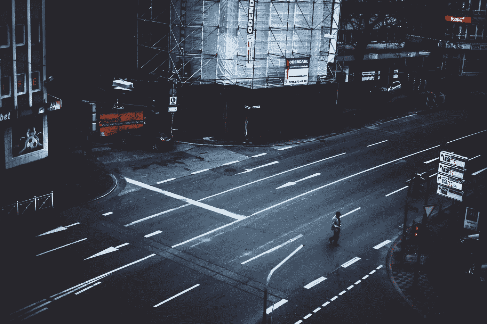

# 如果我再走一步…

> 原文：<https://medium.com/swlh/if-i-take-one-more-step-c686e896fc00>

Photo by [Dean Hergert](https://unsplash.com/photos/3r5aDbrjnLI?utm_source=unsplash&utm_medium=referral&utm_content=creditCopyText) on [Unsplash](https://unsplash.com/?utm_source=unsplash&utm_medium=referral&utm_content=creditCopyText)

> “如果我再走一步，这将是我离家最远的一步。”
> 
> ——JRR 托尔金《指环王》

我的一个密友最近向我介绍了这句话，当时我正在思考电影中我最喜欢的一些说法和台词是什么。我想把它们写在我网球鞋的侧面。撇开原因不谈，这句话显然是恰当的，于是我开始用笔写作。当然，当它在我的脚上时，我不得不笨拙地转动我的腿来看它——但我仍然喜欢它。我一直记得这句话。

但是你可能想知道，这是什么意思？在事物的大格局中，一个步骤，一个运动的意义是什么？好吧，让我来启发你。

几天前，我正在对我的书进行最后的编辑，离开了一会儿。当我试图将注意力从眼前的工作上转移开时，我想到了一个绝妙的点子，可以添加一句台词——真正将事情联系在一起。下面是对它的一个恰当的解释:

> “我想回到已经不存在的地方，那里的环境，那里的人，那里的地方，它们都不再一样了——我不想，我不能，我再也回不去了。我可以，但永远不会一样了。”

# 意识到事情已经改变了

这是我年轻时的一个很好的例子。我很想回到二年级。我和我最好的朋友非常亲密，我最喜欢的夹克是粉红色的，我的弟弟们一如既往地可爱(他们仍然很可爱)，愚蠢的乐队很酷，我的生活总体上很棒。我没有压力。没有工作可做。没有难对付的人。我没有经历任何损失。我当时八岁。

尽管我很想回到过去，但我不能。当然，我可以找到在我二年级主日学校上课的同一批人，回到发生这件事的同一间教室，找到我把那件旧夹克给了谁，但这种特殊的幻想有一些问题。我太大了，放不下那个房间的椅子。我可以找到那些每周日和周三和我一起在教室里的人，但是他们更老了，他们变了——就像我一样。

那件夹克已经不合身了。

这个地方，还有许多我也想回去的地方，包含了太多我永远不能回去的内在原因。每天我都在迈步——离我去过的地方一步一步。如果我再拿一个…

> 这将是我离家最远的一次。

# 不要执着于过去

我读过和听过的几乎所有关于自我发展的文献和媒体都鼓励积极寻求摆脱不舒服。我不得不同意。毕竟，这是成长的唯一途径——如果你曾经尝试过长跑，你就会知道。这很痛苦，但如果你想做得更好，你就必须坚持下去。

我们固守旧的。我们执着于过去。我们希望保留那些不再有用的旧习惯和传统——但这是我们所知道的。你们许多人都知道的古老的写作建议不应该用于我们的自我发展实践中。

> 写下你所知道的——但不要满足于你所知道的。

# 你的首要任务

成长的心态是最重要的。这是你如何成为一个更好的基督徒，一个更好的朋友，一个更好的孩子，一个更好的父母，一个更好的作家，一个更好的运动员，一个更好的领导者，一个更好的人。

增长是关键。

但是为了成长，你必须抛弃过去的事情。让我们暂时假设花有大脑。如果一朵花想要生长，他(或她)不能停留在离地面很近的地方。他们不能希望自己的叶子保持一定的大小。他们不能希望避开阳光——否则他们将永远无法充分发挥潜力。

为了走向未来，他们必须对过去心怀感激地挥手告别，并寻找高于他们的东西，他们还不了解的东西，让他们不舒服的东西。如果他们不这样做，他们将永远不会成长。

如果你再走一步；如果你多买一本规划书，多读一篇文章，多写一章，多完成一本书，多开一个博客，多上一门课程，多进行一次对话，多写一页日记，这将是你有史以来离家最远、最舒适的地方。

你正在旅行。我们来到这个世界是有原因的，我们都在努力寻找原因。即使那些认为自己已经掌握的人也还在学习。每天你都在前进。然而，有些人选择后退。问题是，他们会发现，我想提醒你，你永远不能回去。

这件夹克太小了。你不再适合坐在椅子上了。人们变了，你也变了。

不要试图回到过去。不要试图回到舒适的状态。你有没有见过一个人正要勇敢地走上前去，却因为恐惧而畏缩不前？我在几个电视节目中看到过它，它总是让我有点难过。他们为什么害怕？

有时他们有很好的理由害怕。害怕改变不是一个足够好的理由。我理解焦虑，但是恐惧——极度的恐惧——是绝对不可接受的。

敢再走一步。不是向后，而是向前。向前迈进，离开家，走向你的未来。上帝为你准备了难以置信的计划。你有不可思议的计划。你有自己的位置和目标。

家是一个伟大的地方。但是它很小。家是你的起点，你会永远记得它——但它不是你的最终目的地。你必须拿出勇气，敢于向前迈一步，然后一步，再一步。

这将是你离家最远的一次，没关系。

你能行的。

再走一步，看看你能走多远。

**爱，凯蒂**

## 这篇文章发表在 [The Startup](https://medium.com/swlh) 上，这是 Medium 最大的创业刊物，有 277，446+人关注。

## 订阅接收[我们的头条](http://growthsupply.com/the-startup-newsletter/)。

