# 如果尤塞恩·博尔特是一家公司:在 Next Jump 的幕后，一个刻意发展的组织

> 原文：<https://medium.com/swlh/if-usain-bolt-was-a-company-behind-the-scenes-at-next-jump-a-deliberately-developmental-44da641eab0f>

2016 年，一个哈佛大学教授团队发表了一份人人文化，将 Next Jump 列为全球三家代表未来工作的公司之一——他们称之为:刻意发展组织(简称 DDOs)。

组织的尤塞恩·博尔特:在 Next Jump 的幕后，一个刻意发展的组织

主要亮点:

Next Jump 员工将 50%的时间花在文化上，50%的时间花在收入上

Next Jump 对他们的招聘程序如此自信，以至于他们有一个**不解雇政策。**

加入 Next Jump 的每个人都必须与其谈话伙伴一起通过 PLB 入职流程。

一个真正的 DDO 能够发挥公司文化的最佳功能，将个人成长和发展融入业务的每一个方面。

Next Jump 员工开发个人能力，并在业务之外和个人生活中加以利用。

我第一次接触到 DDOs(刻意发展组织)是在*的《人人文化》中，这本书是由 Robert Kegan 和 Lisa Lahey 写的。罗伯特和这本书背后的团队想出了“刻意发展的组织”这个词来描述三个非常不同的组织，我认为，这三个组织处于公司文化光谱的最佳状态。人人文化为我们提供了关于什么是 DDO 以及它是如何运作的有趣见解。*

‍

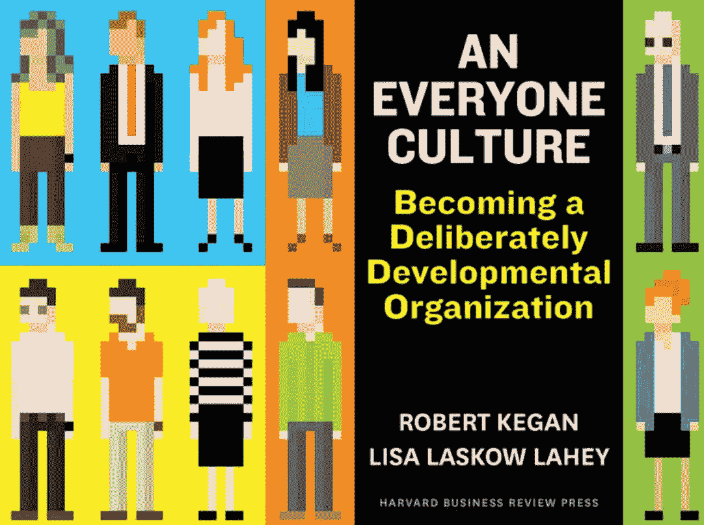

**关于 DDOs**

在大多数组织中，几乎每个人都在做着没有报酬的第二份工作——也就是说，掩盖自己的弱点，努力展现自己最好的一面，管理他人对他们的印象。可能没有比这更浪费公司资源的了。最终成本:无论是组织还是员工都无法实现他们的全部潜力。DDO 是围绕着一个简单而激进的信念组织起来的，即当组织与人们最强烈的动机——成长——更紧密地结合时，组织才会最繁荣。这意味着超越将“人的发展”委托给高潜力项目、高管培训或一年一次的异地培训。这意味着形成一种组织文化，在这种文化中，对人的发展的支持融入到工作生活的日常结构以及公司的常规运营、日常事务和对话中。

今年早些时候，我有幸被邀请参加伦敦的 [Next Jump](http://www.nextjump.com/) 领导力学院。领导力学院是一个为期三天的沉浸式课程，让你了解成为下一个跳伞者意味着什么。我的意图是参加学院，看看 DDO 到底是怎么回事，然后写一篇关于这次经历的博客。我读过《T2》和《人人文化》(T3)，也在 YouTube 上看过大部分 Next Jump 的视频，所以我想我已经为这次经历做好了准备。男孩是我错了！我被观察公司文化的辉煌震撼了，在三天结束时，我意识到我根本不可能写一篇关于我的经历的有意义的博客，因为这根本没有意义。描述我在学院毕业后的处境的最佳方式是想象一个公司是一个人的身体，你被要求向一个从未见过的外星人描述，当它运行时，身体里发生了什么。除非你能够描述身体的其他部分以及一切是如何相互联系的，否则对脚的功能、眼睛如何工作以及心脏如何工作的高层次描述是没有意义的。让事情变得更复杂的是，下一跳是尤塞恩·博尔特。

为了更深入地了解在 DDO 工作是什么样子，我采访了贝基·古奇和格雷厄姆·拉明。了解这家公司令人惊叹的文化是一件令人着迷的事情，它如此丰富和全面，以至于这里没有足够的空间来写它。在这篇文章中，Becky 和 Graham 描述了招聘和入职流程，以及它对公司员工产生的不可思议的影响。

**关于贝基&葛拉罕**

贝基和格雷厄姆于 2015 年 7 月加入该公司。Becky 今年 24 岁，她负责 Next Jump UK 的收入；格雷厄姆也是 24 岁，他领导着一个技术团队。两人大学一毕业就加入了公司，虽然都是领导，但两人都没有合适的职位等级——这些在下一次跳槽时都无关紧要。

**下一跳的失败和学习**

Next Jump 文化的众多优势之一是，作为一家企业和个人，他们对自己的失败和从失败中学习持开放态度。以公司成立初期为例，当时公司决定雇佣来自美国顶尖学校的“最优秀”毕业生，如麻省理工学院、卡内基梅隆大学、康奈尔大学、哥伦比亚大学、佐治亚理工学院。

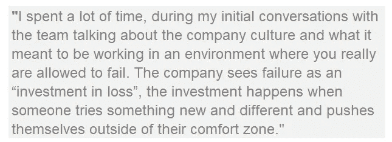

这个团队出去雇佣了所有顶尖的毕业生，他们都是非常聪明的人，渴望成功。在他们加入进来之后，这个团队发现他们实际上雇佣了一群“聪明的混蛋”,事实证明这些人对公司文化有害。这些新员工缺乏谦逊的品质，不能接受批评性的反馈，不准备失败，而且对待工作的方式顽固不化。

意识到自己的错误后，Next Jump 解雇了那些才华横溢的混蛋，并决定专注于创建一个招聘流程，招募那些表现出勇气和谦逊的人。该公司仍然从顶级学校招聘，但他们做出招聘决定的依据不是你今天是谁，而是你未来会成为什么样的人。

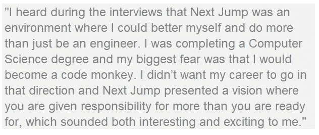

**公司对理想候选人的要求**

谦逊是公司的一个关键指标，因为如果你谦逊，你就有能力失败、学习和成长。接下来，谦逊意味着一个人拥有学生心态和成长心态。公司领导层(每年由整个公司民主选举产生)认为，作为人类，我们总是在成长和发展；这也是公司如此重视反馈的原因之一。谦逊也意味着你心怀感激，有责任感，并且会为自己犯下的错误承担责任。

通过面试过程，公司淘汰了那些有权利感的人和那些认为自己无所不知的人。在招聘过程中(Next Jump 的每个人都接受过培训并参与其中)，面试官希望应聘者表现出谦逊。具体来说，他们感兴趣的是候选人如何承担他们的失败，并会问候选人他们如何不明白他们是否能够为自己的错误负责。他们会问发生这种情况时他们是如何处理的，现在他们会如何以不同的方式处理。本质上，他们评估候选人真正的谦逊能力，以及他们对自己和自己弱点的认识程度。意识到你的强项(他们的正手)和弱项(他们的反手——甚至更重要),并努力改进是下一跳日常生活的关键部分。

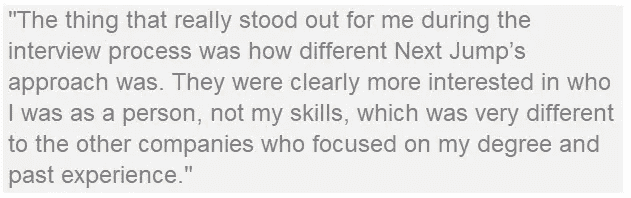

作为招聘过程的一部分，Next Jump 也要求应聘者表现出自信。但是，他们不仅仅是看一个人有多自信，他们会寻找有勇气的候选人，而要有勇气，候选人必须已经克服了生活中的一些障碍。勇气不是你从聪明、天赋和轻松获得的自信；勇气是你从艰难或挑战性的处境中获得的自信，然后在另一边变得更聪明。

**超级星期六面试流程**

该公司不断迭代和改进其流程，因此没有超级星期六是相同的。最近在伦敦举行的超级星期六的结构在领导学院期间被描述给我们。这一天被设计成一场 9 到 10 小时的马拉松，从上午 9:30 开始，为候选人和下一个跳跃队提供早餐。接下来的 Jump 团队都参加了超级星期六的面试过程，他们从候选人进门的那一刻起就开始评估候选人，没有任何停顿。该公司测试候选人是否具备正确的“学生心态”，这种心态表现出谦逊和从错误中学习的能力。

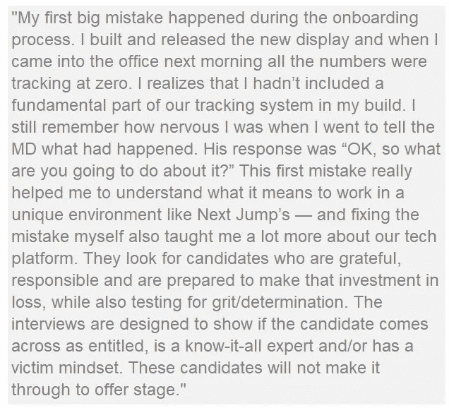

超级星期六有两种候选人:工程候选人和商业候选人。早上以开始和介绍公司开始。然后，工程师进行技能测试和编码练习，业务候选人通过实践练习进行测试，练习之间有 10 分钟的休息时间。午餐时间是半个小时，然后候选人进行公司介绍，然后连续参加四次一对一的面试。在一天结束时，有一个团队挑战，然后是演示。在文化之旅和与公司 CEOs 领导层的讨论之后，这一天在晚上 7 点结束。

该公司对候选人进行评估和评分，从大学校园的第一次会议，到预选面试，一直到超级星期六结束。发生的每一次互动都会被考虑，并通过移动应用程序对候选人进行评级。面试官可能面试的是勇气，但他们是否会对他们认为应该围绕谦逊进行进一步面试的候选人发出危险信号，并且有人应该跟进这一点。该公司在超级星期六期间实时了解谁是最佳候选人，他们需要跟进谁，以及他们可能需要进一步挖掘什么

团队挑战是面试过程的最后一个组成部分，旨在观察人们在疲惫和压力下的反应。候选人被分成小组，并被告知他们将在一小时后与另一个小组进行陈述。这项练习的目的是观察个人如何在团队环境中一起工作，然后观察他们在演讲时的反应和行为。拥有高超技能和良好面试的个人表演者，可能在充满压力的团队动态中表现不佳，这正是 Next Jump 在这一场景中测试的内容。

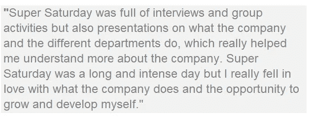

在超级星期六期间，该公司设立了一个作战室，他们可以在大屏幕上实时查看正在收集的数据和分析，这使他们能够确保每个候选人都得到彻底的面试。一天结束时，下一个跳伞队在作战室开会，详细讨论每个候选人，并决定向谁提供帮助。

他们的招聘环境，尤其是软件工程师的招聘，竞争非常激烈。在超级星期六期间，该公司展示他们是谁，以及该公司是如何独一无二的。到最后，候选人应该知道自己是否适合下一个 Jump 环境的文化和要求，以及是否想加入该公司。该公司感谢每个候选人都投入了一天的时间，所以他们让每个参加超级星期六活动的候选人都能获得他们的反馈，不管他们是否收到了邀请。这是 Next Jump 与众不同的另一个领域；在大多数情况下，受访者听不到或不理解他们为什么没有得到工作机会。该公司对重新申请的候选人持开放态度，尤其是如果候选人能够证明他们已经接受了反馈，并在此期间努力工作。这种做法还有一个额外的好处，那就是在公司招聘的大学校园里建立牢固的关系。

**入职培训和个人领导力训练营**

成功通过超级星期六的候选人将收到加入公司的邀请，并参加下一个 Jump onboarding 计划。然后，他们将加入“个人领导力训练营”，或 PLB，这是公司的不解雇政策生效的时候。当你告诉人们不解雇政策时，他们会自动认为员工会滥用这种情况，因为他们知道他们不会被解雇，但事实并非如此。如果有人违反任何基本规则，如骚扰他人、违反法律或从公司偷窃，他们显然会被解雇。不解雇政策并没有完全免除任何人，但它确实意味着你不会因为与绩效相关的问题而被解雇。

创建和建立一个成功的入职计划是很难的，Next Jump 在 PLB 计划上进行了大量投资，该计划旨在模拟、参与、快乐、有趣、具有挑战性、富有成效和故意施加压力。该公司多年来发展了 PLB，开发了一个做与展示的计划，通过在入职流程的早期注入压力，特别致力于情感和性格发展。在 PLB 期间，新员工将接受 Next Jump 历史的教育，了解公司的起源以及它是如何发展到今天的，了解公司面临的挑战和斗争以及公司的愿景。

在 PLB 期间，新员工可以致力于技能发展；工程师可以参加不同的培训课程，如果你是面向客户的一方，你会得到销售或营销培训。每个新员工都必须通过 PLB 考试并毕业(和他们的谈话伙伴),然后才能开始他们的工作。Next Jump 团队明白，员工在公司的最初几个月是最关键的时期，因为它们对员工在公司的停留时间、他们的整体参与度以及他们的长期生产力都有重大影响。

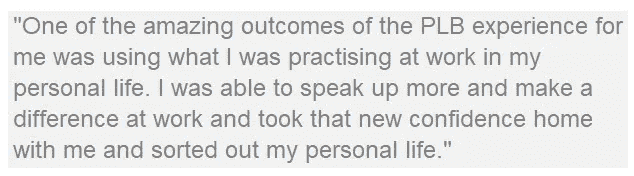

Next Jump 的新员工会加入客户服务团队，而不管他们受雇的职位是什么。该公司为新员工预计完成的机票数量设定了目标，这一数字每周都在增加。在新员工学习客户服务的同时，公司还会推出文化发展计划、团队挑战或新员工必须完成的惊喜附带项目，然后提交给团队。PLB 是该公司的一项重大前期投资，因为它可能需要 3 个多月才能毕业。

很多 PLB 项目旨在帮助新员工了解哪些个人行为或过去的经历会阻碍他们成为最好的自己。下一步使用**绩效=潜力-障碍**等式来帮助沟通可能会阻碍新员工发挥潜力的因素。公司利用文化发展计划和项目，让新员工在一个“失败”不会影响公司收入的“安全”环境中实践他们初出茅庐的技能，并学习如何克服他们的障碍。

该公司希望个人了解他们的优势(正手)和劣势(反手)，以及他们的傲慢或不安全感如何影响他们的行为。下一步要让新员工能够了解他们的真实身份。公司雇用你不是因为你今天是谁，而是因为你将来会成为谁，而 PLB 计划是专门为帮助新员工探索和了解他们的潜力而设计的。Next Jump 为每个新员工支付费用，让他们参加 Simon Sinek 的在线“从为什么开始”课程，这样他们就可以制定自己的个人目标(他们的“为什么陈述”)。这有助于新员工了解他们的目标是什么，以及他们在实现目标的道路上遇到的障碍。

Next Jump 向每位新员工展示了他们在初次面试和超级星期六会议中收到的反馈。他们可以在招聘应用程序上看到他们收到的好评或差评，以及任何其他评论，以及他们被认为是更自信/傲慢还是谦虚/不自信。该公司将来自应用程序的反馈作为起点来发展个人的自我意识，并通过情景研讨会(稍后将详细介绍)、同龄人的反馈、与教练和 TP 合作来进一步发展这一点。随着时间的推移，新员工开始更清楚地了解在某些情况下会出现什么样的负面行为或倾向(反手),以及如何改进和提高。

贝基和格雷厄姆是谈话伙伴(TP)。接下来的 Jump TP 会议是个人在开始工作之前分享他们的问题、挫折和对第二天的想法的日常机会——本质上，是一个有意的释放阀。交谈型伙伴关系是在个人领导力训练营(PLB)的入职过程中形成的，理想情况下(但不总是如此),这种关系是在一个性格特征倾向于傲慢的伙伴和另一个性格特征倾向于不自信的伙伴之间形成的。该公司希望看到在 PLB 期间合作关系如何发展，关键是 TPs 必须一起毕业。

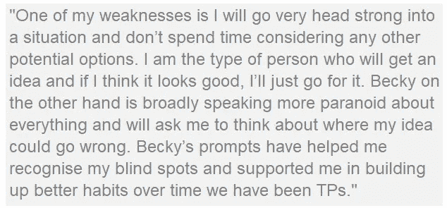

在 PLB 期间，新员工还会与一名教练配对，教练是一名相对较新的员工，最近刚刚通过入职流程毕业。他们每周或每两周与教练进行一次会谈，谈论他们在回答客户服务问题或文化活动中的经历。这位教练帮助新员工探究他们在哪些方面苦苦挣扎以及为什么，探索他们在公司取得潜在成功的障碍。通过这种方式，Next Jump 将任何工作中都会发生的正常情况进行了分析，并帮助个人思考，学习如何更好地完成工作，同样重要的是，发展自己。

Next Jump 让我非常钦佩的一点是，他们将自我发展融入到公司的每个流程中。例如，PLB 教练角色实现了两个结果:它通过 PLB 帮助新员工进步，同时为教练刷新 PLB 流程的记忆。这提醒教练他们个人经历了什么，并让教练对他们自己在公司内的持续成长负责。

在 PLB 的前三周结束时，以及毕业前的每三周，新员工向评委小组展示五件事:他们一直在做什么；他们学到了什么；他们所犯的错误；他们认为自己在加强反手击球方面取得的进步；他们在平衡傲慢/不安全感方面所做的工作。

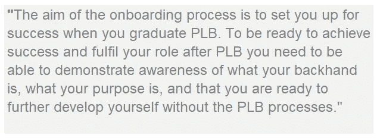

然后评委给出反馈。为了毕业，一个新员工需要被三个评委一致通过。如果法官决定他们还没有准备好毕业，新员工*和*他们的 TP，回到 PLB，将做另外三周的计划。

‍

PLB 是一个真正迷人的过程。这不是打勾和简单地通过过程；它比那更复杂。PLB 本质上是个人的个人旅程，以了解他们的反手和他们在生活中的个人目的，并建立想要发展自己的自然能力，以便当他们毕业时，他们不需要 PLB 结构来继续他们的发展。每个人的过程都是独一无二的，无法与他人相比，而且在大多数情况下，很难知道一个人是否准备好毕业，以及准备好对他们真正意味着什么。这就是 PLB 如此独特的原因，也是它对每个人如此有价值的原因。

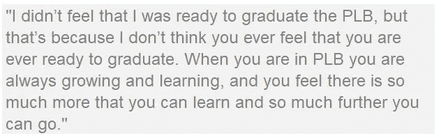

了解更多关于下一次跳跃:【www.NextJump.com 

# [文化甲板解码](https://www.culturegene.ai/books)将于 2018 年第四季度出版，现在注册以获得第一章的预览，并在该书出版时得到通知。

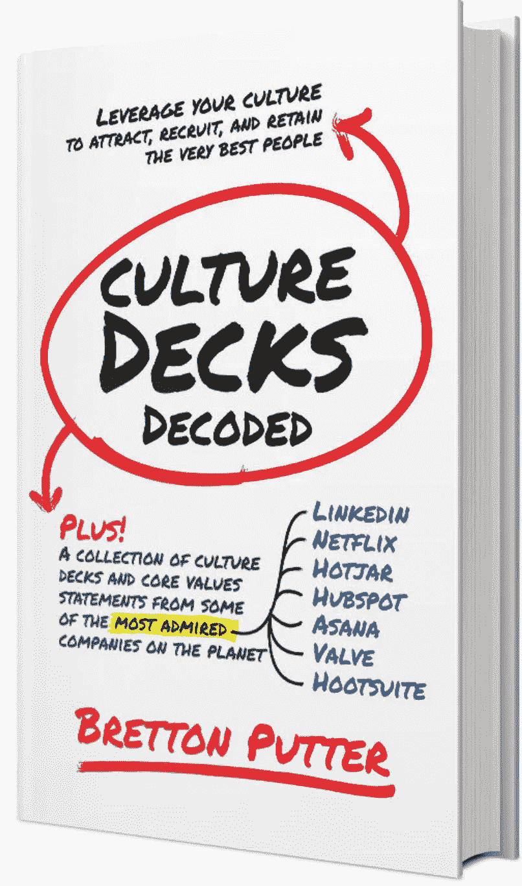

了解更多关于 culture gene:[www . culture gene . ai](http://www.culturegene.ai)

## 这篇文章发表在 [The Startup](https://medium.com/swlh) 上，这是 Medium 最大的创业刊物，有 344，974+人关注。

## 在这里订阅接收[我们的头条新闻](http://growthsupply.com/the-startup-newsletter/)。

