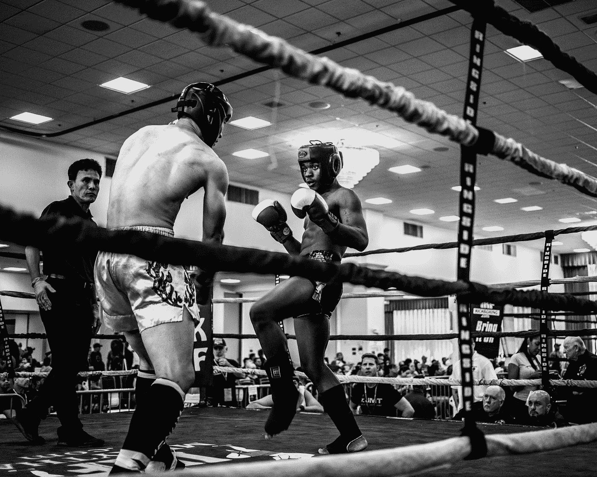

# 如果你足够勇敢，你就会失败

> 原文：<https://medium.com/swlh/if-you-are-brave-enough-often-enough-you-will-fail-13c5ddb9aec0>

但是…去竞技场吧！

Photo by [Pablo Rebolledo](https://unsplash.com/@prvelasco89?utm_source=medium&utm_medium=referral) on [Unsplash](https://unsplash.com?utm_source=medium&utm_medium=referral)

> “如果你穿着‘人们会怎么想’的紧身衣，你就做不了任何勇敢的事。”—布伦·布朗

我热爱作家布伦·布朗的作品。她写了许多畅销书，如*《坚强的崛起》、《大胆的尝试》和《不完美的礼物》。*每当我情绪低落或怀疑自己或自己的作品时，她都是我的灵感来源之一。

她一生都在研究脆弱、羞耻和创造力。

如果你没有读过她的书或者看过她的 YouTubes 视频，我强烈建议你去看看！

## 她经常谈到“进入竞技场”。

Photo by [Wade Austin Ellis](https://unsplash.com/@wadeaustinellis?utm_source=medium&utm_medium=referral) on [Unsplash](https://unsplash.com?utm_source=medium&utm_medium=referral)

当你把你自己和你的作品放在那里时，你现在就在“竞技场”上。

你是一个勇敢的人。你是一个有创造力的人，不会安于现状，也不会做一个鸡屎。你把你的工作扔在那里。

她说如果你是一个有创造力的人:

> 你不能冒险掉下去。不——它保证你会跌倒！你会受伤的！

如果你把你自己和你的作品放在外面，有人会不喜欢。会有人批评的。
有人会忽略。有人会试图劝你不要这样做。有人会告诉你这不现实。有人会告诉你这是浪费时间。
有人会称之为平庸。有人会恨之入骨。

总有人不会喜欢你的东西。

# 总会有人对你说不！

tenor.com

当你是一个“有创造力的人”时，每天当你醒来时，你也走进了黑暗。

在黑暗中行走是勇敢的。

如果你像我一样，当你开始一项创造性的努力时，你并不确切知道你会创造出什么。

你可能会感到忧虑或害怕，但你还是出现了。西装革履，现身吧！这是问题的关键。

Show up and SUIT UP!

我喜欢认为，当我开始一个写作项目或一本书或一首歌时，我的写作是*告诉我它想要成为* 。

你不知道创造性的努力会把你带到哪里。你不知道艺术过程会在哪里结束

但是，你跟着它走。你坚持下去。

如果你致力于创造，这正是应该做的事情。

> 有时你看不到任何有形的结果，但你毫无疑问地知道你是在“长期”这样做，所以你继续回到舞台上。

Photo by [Frida Aguilar Estrada](https://unsplash.com/@fridaae29?utm_source=medium&utm_medium=referral) on [Unsplash](https://unsplash.com?utm_source=medium&utm_medium=referral)

为自己的出现而沾沾自喜。

**为你喝彩！！**

很多人不露面。他们采取了简单的方法。他们躲起来了。他们不允许自己的作品被公之于众，因为这样更安全！

他们陷在恐惧或完美主义中，这对我来说是一回事。

> 你不被批评的唯一方法是你不出现。如果你不把自己放在竞技场上！

你不会流血的。确实如此。但是你也不会得到工作的礼物。
在于做的礼物。
忠于自我和灵感的礼物。

## 感谢阅读！

[www.michellemonet.com](http://www.michellemonet.com)

 [## “一年后，你会希望今天就开始”

### 所以现在就做吧！

medium.com](/writers-guild/a-year-from-now-you-will-wish-you-had-started-today-6851fc2018e6)  [## 最佳建议？停止渴望和希望。开始做。

### 下面是我的行动步骤是如何为我规划的。

medium.com](/writers-guild/best-advice-stop-aspiring-and-hoping-start-doing-fd87b51038fe)  [## 我睿智的老智者给我内在写作的 22 条建议

### 你知道你内心的声音是你内心的智者吗？给你加油的那个？

medium.com](/the-book-mechanic/22-pieces-of-advice-to-my-inner-writing-self-from-my-wise-old-sage-self-f47e87b00648) 

[https://www.amazon.com/Michelle-Monet/e/B01J5X26QS/ref=sr_ntt_srch_lnk_1?qid=1546188292&sr=1-1](https://www.amazon.com/Michelle-Monet/e/B01J5X26QS/ref=sr_ntt_srch_lnk_1?qid=1546188292&sr=1-1)

 [## 米歇尔·莫奈

### 关注米歇尔·莫奈，从亚马逊网站的米歇尔·莫奈作者页面探索他们的参考书目。

www.amazon.com](https://www.amazon.com/Michelle-Monet/e/B01J5X26QS/ref=sr_ntt_srch_lnk_1?qid=1546188292&sr=1-1) 

## 这篇文章发表在 [The Startup](https://medium.com/swlh) 上，这是 Medium 最大的创业刊物，拥有+405，714 名读者。

## 在这里订阅接收[我们的头条新闻](http://growthsupply.com/the-startup-newsletter/)。

