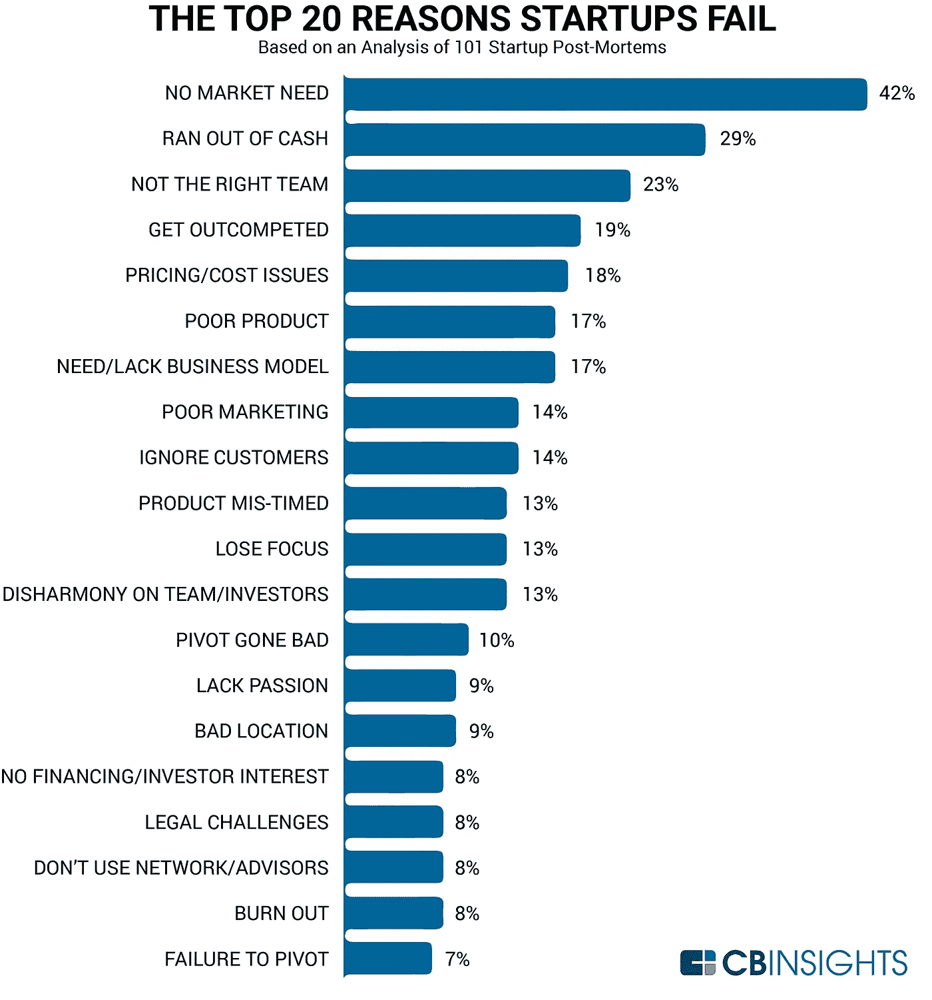

# 如果你正在寻找一个创业想法，请停止！

> 原文：<https://medium.com/swlh/if-you-are-looking-for-a-startup-idea-please-stop-73bf1f112092>

## 不要把重点放在解决方案上，要把重点放在问题上。

Source: [https://thefoundation.com/blog/unique-idea](https://thefoundation.com/blog/unique-idea)

你正在寻找一个创业的想法，但你不知道如何得到一个伟大的想法？

以下是我对你的回答:

拦住我的朋友！

你走错方向了。不要像大家平时一样犯同样的错误。不要等着一个创业想法来找你。

相信我这一次。你不需要它。

不用找思路，找身边的问题就行。

不要花时间在你的脑海中寻找隐藏和未被锁定的想法，打开你的思维，开始注意你或你周围的人遇到的问题。正如保罗·格拉厄姆所说:

> 获得创业想法的方法是不要试图去想创业想法。而是寻找问题，最好是你自己有问题。
> 
> 保罗·格拉厄姆

大多数渴望建立公司、成为企业家和创业舞台上的积极参与者的人，一开始都有一种直觉告诉他们:去吧！找个点子！

他们认为这是最终的真理和道路，以达到他们的最终愿望。日复一日，他们花时间思考什么样的好主意最适合他们的创业。

让我们来看一个真实的例子。

Airbnb 是过去几年最成功的创业公司之一。在 Airbnb 之前，人们在预订和租赁方面的选择有限，但现在有了 Airbnb，他们在这方面的选择是无限的。Airbnb 的创始人创建了一个简单的面向用户的平台，每个人都可以轻松地租赁和预订房间。

正如你所看到的，创业背后的主要理念是解决人们的问题。一直都是这样。但是我们大多数人都忽略了这一点。

所以也许一个好的练习和我们所有人的起点是问我们自己这些问题:

*   我有什么问题？
*   人们有什么问题？
*   哪些问题可以解决？

## 为什么解决人们的问题如此重要？

它之所以如此重要，是因为它确保了问题确实存在。而当你遇到问题的时候，你就可以开始思考如何解决。

不知何故，现在我们犯的最常见的错误是解决没有人解决的问题，不知何故在这个过程中，我们迷失了自己，认为这个想法会受到每个人的喜爱。

> 听起来不错。不管用。

## 你觉得好的重要还是市场需要的重要？

不要因为你和你的朋友觉得它很神奇，就认为你的想法或产品是原创的。

好吧，这可能是个好主意，但有市场在等待你的创新吗？

只关注想法而不质疑我们解决了什么样的问题通常会导致我们创造出没人想要的产品。这类产品我们称之为**维生素产品**，也就是“很好拥有”，但实际上并不需要它们。

我们真正想打造的是一个解决现实问题的产品。这些产品被称为**止痛药产品**，属于“必须拥有”类别。

没有止痛药是大多数创业公司失败的原因。

## 那么，创业公司为什么会失败呢？

[地震之都](https://medium.com/u/4cf2616dc412?source=post_page-----73bf1f112092--------------------------------)分享了 cbinsights 关于[为什么创业失败](/swlh/the-top-10-reasons-startups-fail-ab3196d70568)的研究，这很棒。请仔细看看为什么你应该停止寻找想法，开始关注问题。正如你在下图中看到的，创业失败的首要原因是**他们的产品没有市场。**

Source: [https://www.statista.com/chart/11690/the-top-reasons-startups-fail/](https://www.statista.com/chart/11690/the-top-reasons-startups-fail/)

## 假设你有一个解决现有问题的想法。这样够了吗？

这还不够。你还必须考虑其他的事情。

首先要做的事。不要和你的家人或朋友一起检查你的想法是否好。可能他们会说这是一个非常好的方法，他们会使用它。

说真的。不要那样检查你的想法。每个母亲都相信自己的孩子是最好最漂亮的。

所以让我们看看你能做些什么来避免这种情况。

在你开始投入时间和金钱之前，做大量的研究。先看看是否有人和你有同样的想法。所以，打开谷歌或者你喜欢的搜索引擎，开始研究吧。

在研究过程中，你应该记住两件事:

*   这个问题真的存在吗？
*   如果是，有人已经找到解决方案了吗？

用你的研究来回答这些问题。

如果你的研究证实这个问题已经存在，并且人们正在谈论它，搜索它，这意味着你走在一条好的道路上。

现在，如果市场上已经有了你的想法的解决方案，不要因此而难过或害怕。不要因为别人比你先行动就放弃。事实上，你应该在你的房间里跳起来，因为你的想法已经被市场验证了，因为你已经有竞争对手了。这总是一个好现象，它让我想到了非常重要的一点:

> 你应该避免创造一个不存在的市场。

通过努力创造你自己的市场，你将是唯一能解决问题的人。这是肯定的。但是有什么收获吗？人们有兴趣成为这个市场的一部分吗？我相信不会。所以你的收益最终会等于零。

当你通过研究确认问题确实存在，并且已经有了市场，你也开始注意到已经在追求这个想法的公司。这些是你的竞争对手。

我再次重申，不要失望。此时，您应该开始分析它们中的每一个。检查他们是如何解决这个问题的，他们是否有和你设想的相似的方法，他们客户的反馈和公司的整体成功。

你也应该分析曾经是这个市场的一部分，但由于某种原因失败了的公司。他们的故事可以帮助你从他们的错误中吸取教训。记住你应该检查硬币的两面。成功的故事和失败的故事，并精心构思你的概念。

现在，一旦你收集了所有需要的信息，你应该问自己:

> 在解决这个问题时，我和其他人的独特之处是什么？

和往常一样，凡事总有变通的办法。这个概念也不例外。这种方法有一个特别的替代方法，我很喜欢。buffer 首席执行官 Joel Gascoigne 已经证实了这一点。你可以在“[如何验证你的创业想法](/@joelgascoigne/how-to-successfully-validate-your-idea-with-a-landing-page-mvp-ef3c2d02dc51)”中了解更多关于他的方法。这是一个令人惊讶的创意和简单的方法，帮助他验证了他的想法，并最终在此基础上成功创业。

现在，最后我该说什么？

时间是我们最宝贵的东西。在我们花掉它之前，我们应该想清楚，并设法明智地使用它。不要花费你的时间或时间去执行一个不能解决任何问题或者没有市场需求的想法。

在执行之前，检查它是否值得，并永远记住:

> 创造人们想要的产品。

**各👏如果你喜欢这篇文章，欢迎！**

我写关于编程、技术、人工智能、创业和自我成长的文章。如果你 [**在 Twitter 上关注我**](https://twitter.com/h_polatyuruk) **我不会用不必要的帖子浪费你的时间。👍**

## 这篇文章发表在 [The Startup](https://medium.com/swlh) 上，这是 Medium 最大的创业刊物，拥有+388，456 名读者。

## 在这里订阅接收[我们的头条新闻](http://growthsupply.com/the-startup-newsletter/)。

