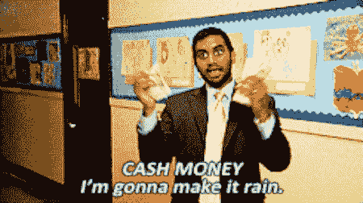

# 如果你没有建立一个成功的博客，你可能会错过这些成功的机会

> 原文：<https://medium.com/swlh/if-you-arent-building-a-successful-blog-you-may-be-missing-out-on-these-triumphant-opportunities-d7ff06db3749>

Photo by [Drew Colins](https://unsplash.com/photos/PnbJL0O_jrs?utm_source=unsplash&utm_medium=referral&utm_content=creditCopyText)

对于许多想开博客的人来说，与追求相关的动机包括自主、自由、经济回报和建立人生目标的总体感觉。

**妈的，我知道这就是为什么我参与了这个游戏。**

像许多人一样——我厌倦了朝九晚五的繁琐工作。我不能忍受一个不称职的老板(他只是玩政治游戏玩得很好)告诉我如何完成我的任务、角色和职责。

我不再听那些比我更不知道前进方向的人说话了。

**于是我开始写作——我的世界完全变得更好了。**

 [## 过去一年每天写作如何彻底改变了我的生活

### 我从写作中获得的不太可能的教训，让你不必如此。

writingcooperative.com](https://writingcooperative.com/how-writing-everyday-for-the-past-year-drastically-changed-my-life-3e300c31ce7) 

自从我深思熟虑地选择写作并(更重要的是)与世界分享以来，我的生活有了很大的改善。

即使你的最终目标不是离开朝九晚五的工作岗位，[赚取收入](https://www.tribeloyal.com/viral-writing-playbook/)，用你的声音产生潜在的全球影响，建立一个成功的博客对你未来的生活成功至关重要。

我们来看看为什么。

# 你会错过不断变化的经济中充满活力的机会

Photo by [chuttersnap](https://unsplash.com/photos/eH_ftJYhaTY?utm_source=unsplash&utm_medium=referral&utm_content=creditCopyText)

我写过几次这方面的文章。

有人称我为“世界末日信号员”

在不久的将来，由于自动化引入市场，数以百万计的工作岗位将会失去。据报道，到 2030 年，大约 7800 万美国人会因为自动化而失业。

这将对美国工人产生自工业革命以来从未有过的深远影响(当然，在这种情况下，将产生相反的影响)。

市场将会强调创造性的工作。这些工作在未来的日子里会更有保障，而不是更单调的工作——如数据录入、客运、电话销售——会首先消失。

开创性书籍[*【智人】*](https://amzn.to/2AHW3cN) *(我强烈推荐阅读)* [的作者尤瓦尔·赫拉利在 2018 年 DBS 亚洲洞察大会上发表演讲时就这个话题进行了权衡，他指出](https://www.cnbc.com/2018/07/24/creative-careers-to-be-spared-from-job-disruption-automation.html)，*“很肯定，很多工作将会消失，尤其是那些更单调或重复的工作，”*他后来说，“需要更高创造力的工作将会更安全。”

成功的“传统路线”——在小学和高中表现出色，这样你就可以进入一所“好”大学。在那所大学里，做“好”的工作，这样你就能被学校招出来。从那里，你可以得到一份“好”的介绍性工作，提供一个可升级的成功阶梯和收入增长。从那里开始——和你的伴侣有“好”的性生活，这样你就能创造一个“好”的家庭，然后奔向*升起的夕阳*。

好吧…我可能夸大了“好”生活的最后两步。

但我想你明白我的意思了。

向前进——做好事是不够的。在新经济中，你将需要有创造力并受到追捧。

写作，把这些想法放到网上让全世界看到，是建立和提升这些创造性技能的好方法。即使你没有为写作内容创建博客，这对你也有好处。

*   也许你是一名摄影师——利用你的博客来展示你在拍照方面的创造性技能将是显而易见的。
*   你可以把博客作为一个平台来提升你作为音乐制作人的技能。
*   你可以把你的博客作为你平面设计技能的作品集——市场永远需要人性化的设计。

在建立和维护博客的过程中——你正在经历未来需要什么的实时训练。

# 你会错过多种收入来源的机会

被动收入长期以来一直被吹捧为寻求释放时间的个人的“圣杯”——从产生健康月收入的潜力中解放出日常义务和责任的绳索。

这是一幅宏伟的画面——你每天早上醒来，第一眼看到的是你柔滑肌肤的爱人，而不是盯着你的银行账户，看到大量涌入的付款，而这些付款几乎不需要你做任何工作。

Seeing [dolla dolla](https://media.giphy.com/media/3o7TKOFSNDoSQGoKe4/giphy.gif) billz

从那里，你可以离开你的限制性工作(无论是地理上的还是创造性的)，向你的老板竖起两个中指，穿越广阔而美丽的地球。

当然，如果你不开始把你的想法放到互联网上，这些愿景都不会实现。

 [## 如何在博客上赚到你的第一美元(甚至更多)

### 为聪明的博客作者提供一步一步的演练…

medium.com](/swlh/how-to-earn-your-first-dollar-and-more-blogging-5094bafd7cdd) 

**此外，如果你没有******的适当策略，即使你的博客已经开通并运行，你也肯定会被搁置一旁。****

** [## 在 2018 年开始一个赚钱的博客:快 100 倍的新方法

### 全面的 4 节指南

medium.com](/swlh/starting-a-money-making-blog-in-2018-new-method-thats-100x-faster-3105e6a5fb44) 

如果你不为自己建立一个被动的收入流，你将永远停留在主动收入流的仓鼠轮上，永远找不到离开职场的方法。** 

# **你会错过了解自己的机会**

**也许最容易被忽视但最重要的机会是你会错过的发现真实的自己的机会。**

**透过我自己的写作经历，我对自己有了更多的了解:**

** [## 我从发现和痴迷地追随我的激情中学到了什么

### 你可以采取切实的步骤来揭示你的人生目标。

medium.com](/swlh/what-i-learned-by-discovering-and-obsessively-following-my-passion-3f454bc3d0fd) 

*   我明白了，我的能力比我想象的要大。
*   我认识到我是自己最苛刻的批评家。
*   我了解到人们通常喜欢你的工作多于你对它的厌恶。
*   我已经了解到在线作家社区是多么的吸引人和有教养(谢谢你[杰西·凯雷马](https://medium.com/u/4287e61bb67?source=post_page-----d7ff06db3749--------------------------------)、[乔伦·范·沙克](https://medium.com/u/58d0551e31b5?source=post_page-----d7ff06db3749--------------------------------)、[埃梅特·贝克](https://medium.com/u/1d6e1f3a8bd1?source=post_page-----d7ff06db3749--------------------------------)、[安东尼·摩尔](https://medium.com/u/bb9f5cdbf1f9?source=post_page-----d7ff06db3749--------------------------------)、[马丁·范·多恩](https://medium.com/u/a3a509c23f11?source=post_page-----d7ff06db3749--------------------------------)、[塔米·奥尔森](https://medium.com/u/b80250dc735a?source=post_page-----d7ff06db3749--------------------------------)、[米丝蒂·s·布莱索](https://medium.com/u/d8f1f93bd644?source=post_page-----d7ff06db3749--------------------------------)，以及任何我忘记的人！]).
*   我明白了，如果你下定决心，日复一日地朝着那个目标努力，你一定能实现它。
*   我知道了得到第一份自由职业是什么感觉。
*   我已经知道被解雇是什么感觉了。

**学习和成长的机会实际上是无穷无尽的……**** 

**就像老话说的那样，**

> **“种树的最佳时间是 20 年前，其次是现在”**

**同样的道理也适用于开始和培养你的博客(坚持 20 年 10 年……)。**

**如果你还没有开始你的博客，并且需要一些资源来让你自己进入状态，请在这里查看我的免费资源:**

** [## 还有谁想成为自己的老板

### 仅第 1 天免费赠送“最佳日常表现 10 步指南”——无任何附加条件)。](https://mailchi.mp/4b982beed325/free-6-step-course)  [## 如何写出终极博文

### “如何写好最终的博文是我开始写博客和添加一些急需的策略的出发点……](https://mailchi.mp/566013464a92/ultimateblogpost) 

# 👋🏻你好，我是乔恩

想建一个赚钱的博客？你必须知道如何利用你的激情，并将其与人们想要的东西融合在一起。加入**1200 名其他人**的行列，参加我为期 6 天的免费**“创业博客”**课程，你将学会如何在经济上实现你的激情。

**🚨** [**> >世卫组织还想自己当老板？< <**](https://mailchi.mp/4b982beed325/free-6-step-course) **🚨**

(你还将获得一份免费的 ***“如何撰写终极博文”*** )

## 这篇文章发表在 [The Startup](https://medium.com/swlh) 上，这是 Medium 最大的创业刊物，拥有+385，976 名读者。

## 在这里订阅接收[我们的头条新闻](http://growthsupply.com/the-startup-newsletter/)。

**