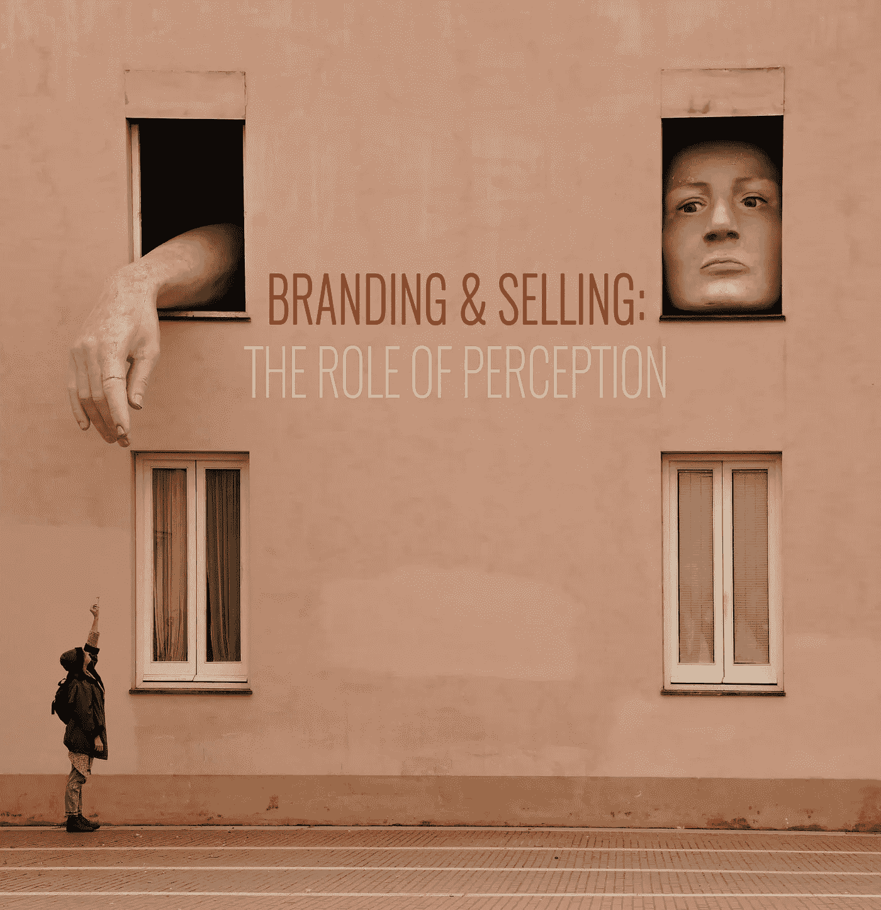
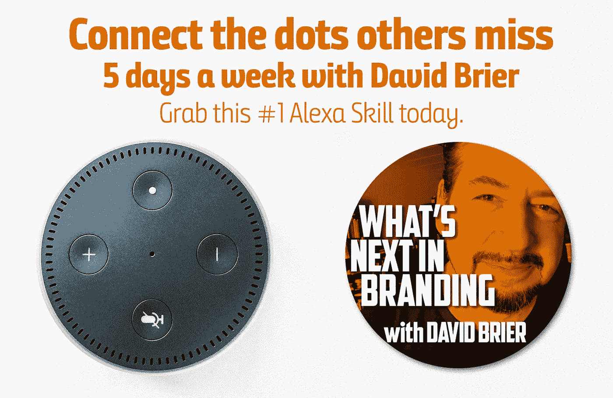

# 如果你做品牌和销售任何东西，这就像火箭燃料，只会更好

> 原文：<https://medium.com/swlh/if-you-brand-and-sell-anything-this-is-like-rocket-fuel-only-better-87554f4c1081>

## 在这篇文章中，我涵盖了“C 字”，为什么你现在需要应用它，加里·维纳查克补充了一些智慧的话。

正如我在上一集《周三一分钟》的中充分解释的那样，品牌和销售是任何品牌关注的两个主要领域。

为了更进一步，这里有一个关键点:

> “如果你不给市场可谈论的故事，他们会为你定义你的品牌故事。”

是的，我很抱歉这么说。

在本周的《周三一分钟》中，我将讨论销售和*关怀的角色。*

# 品牌和销售 101:你的品牌是作为一个销售产品的企业还是一个关心顾客需求的企业而出名的？

百思买做的不对。西尔斯玩具反斗城做得不对。

诺德斯特龙、捷步达康、苹果和亚马逊都有。

没错，我说的就是那个 C 字:在乎。

在生意场上，*你就是你所知道的那个人。*

甚至杰夫·贝索斯也说过这样的话(在我的新书《品牌干预》中)，“你的品牌就是当你不在房间里时，别人对你的评价。”

***让事实见鬼去吧。主宰一天的是感知。***

你可能是最伟大的，但是如果你以平庸而闻名，在最重要的人眼中，你是最伟大的:你的潜在顾客。

# 给我 60 秒。我会给你所有的玉米卷饼。

在这个新视频中，我用大约一分钟的时间全面解释了品牌和销售之间的关系。

# 我如何将品牌和销售提升到一个全新的水平

学习拥有数百万设备的整个 Alexa 技能生态系统，更重要的是，数百万用户(问 Alexa“有什么新闻吗？”)，我决定每周 5 天制作*品牌中的下一步是什么，关于品牌、营销、超越噪音等等的简短见解。那是我为别人增值的投资。*

*毕竟，加里·维纳查克刚刚在纽约举行了第一次语音会议。*

*以下是 Gary 对这个机会的看法， ***“播客和 Alexa voice 的崛起今天就到这里。在过去的 24-36 个月里，品牌和个人都非常重视音频。问题是，仍然没有很多优秀的原创内容可供消费，这给那些能够在另一个层面上创作的人留下了巨大的机会。就像网飞一样，创作出最佳原创作品的公司将会胜出。”****

*为了了解我是如何开始利用这一点向我的追随者宣传我的价值的，这里有一个我用来推广[这一技能](https://lnkd.in/epWCr7r)的广告(你需要听到并订阅)。*

**

*交给你了。*

**原载于*【www.risingabovethenoise.com】*

****

## **这篇文章发表在 [The Startup](https://medium.com/swlh) 上，这是 Medium 最大的创业刊物，有 329，974+人关注。**

## **在这里订阅接收[我们的头条新闻](http://growthsupply.com/the-startup-newsletter/)。**

****