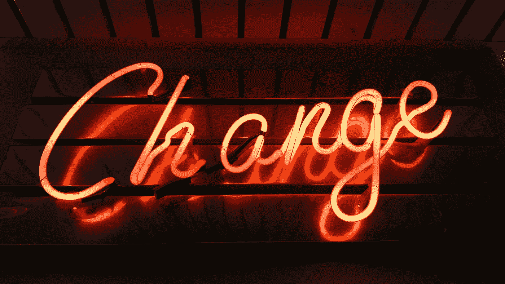

# 如果你能接受不适，你就能实现个人的伟大

> 原文：<https://medium.com/swlh/if-you-can-accept-discomfort-you-can-achieve-personal-greatness-cd8f1bc03d53>

## 冒更多创造性的风险会让你自由

Photo by [Jeremy Bishop](https://unsplash.com/photos/Q5ZjqF6Wd3k?utm_source=unsplash&utm_medium=referral&utm_content=creditCopyText) on [Unsplash](https://unsplash.com/search/photos/risk?utm_source=unsplash&utm_medium=referral&utm_content=creditCopyText)

几年前，我在网飞看了《厨师桌》第一季的第一集。我惊呆了！我热泪盈眶，不是因为悲伤，而是因为厨师马西莫·博图拉全身心地流露出来的无拘无束、充满爱心、发自内心的创造力的最真实的表达。

> 观看这一集提醒我，你必须在你的艺术和工艺中冒险，你必须相信你自己和你的目标——最重要的是——在你成功之前，你需要一个啦啦队来度过那些黑暗的日子、几周甚至几年。

# 冒险不是试图与众不同，也不是试图成名。

你无法预测任何人会关心、追随你，甚至支持你所做的事情——尤其是如果你只是被自我所驱使的话。如果自我没有得到认可(“嘿，看着我！”)你的努力感觉减少了，浪费了。

相反，冒**创造性风险**意味着意识到其他人在做什么，但不要在乎其他人对你试图完成的事情有什么想法。

## 让自己与众不同并不意味着不尊重在你之前的人所做的事情。

也不意味着好战。我说的是承担你内心深处感受到的那种风险。这与坐过山车或跳伞的风险不同。

Photo by [Yeshi Kangrang](https://unsplash.com/photos/EV9Io66tDm0?utm_source=unsplash&utm_medium=referral&utm_content=creditCopyText) on [Unsplash](https://unsplash.com/?utm_source=unsplash&utm_medium=referral&utm_content=creditCopyText)

> *这是一次灵魂的冒险，向世界展示你的真相、你的能力和你的创造天才*。

如果你想创造一些真正伟大的、有着难以置信的价值的东西来改善人们的生活，你需要拒绝所有的声音、所有的批评、所有“你应该这样做”的建议，相信你的直觉，敢于冒险。

> 敢于承担灵魂的风险，向世界暴露你的真相和创造天才。

# 真正的伟大是要付出极其高昂的代价的。

如果你不在风险的利刃上来回滑动，流血，但仍然相信你能做到，你会落到后悔的一边，地上的胎儿，舔着你的伤口。多糟糕的休息地方啊！这不是我想结束的地方。

## 相反，我选择不舒服

十多年来我一直不舒服，现在我不能停下来——回头已经太晚了。原因有很多，但在过去的 10-15 年里，

*   将我的全部自我意识投入到我的工作中，并向网络世界展示我是谁；
*   花了无数个小时计划、执行、失败、重新开始；
*   投资了我没有的钱，并背上了沉重的债务(这不是我会建议的)，以及；
*   将身体和情感的能量消耗到生病的程度(我有时会越过那条线)从而达到我生命中的这一点。

 [## 作为一名企业家，苦难教会了我什么是成就

artplusmarketing.com](https://artplusmarketing.com/what-suffering-as-an-entrepreneur-taught-me-about-achievement-8f1e0890851e) 

现在我很少在实现目标的过程中像剃刀一样锋利。我知道我会成功，尽管会有伤疤，因为我学会了如何生活，而不是生活在悬崖边上。我相信自己的影响力——这种影响力来自知识、经验和智慧。我足够固执，用自己的心理韧性去承受冒险的出血和不适。

# 舒适是转变的对立面

我们都需要以某种方式被指导、被教导、被鼓励或被引导——这只是让我们觉得我们所做的工作有意义，并有可能产生影响。

在自己的旅途中，我需要的不仅仅是质量指导。我需要接受挑战，玩冒险游戏，挑战自己的极限。当我和教练一起工作时，她需要看穿我，倾听我的故事，并拒绝让我一遍又一遍地播放“同样的老唱片”。

凭直觉，我认识到我需要将更多的创造性风险带入我的日常思维，并努力实现我的商业和生活方式目标。我需要提醒自己，得罪人不在乎没关系。我的所作所为、所写所言可能本身并不违法，但我的信息或传达可能会令人震惊，或者存在于现状之外。

## 大声说出来

我厌倦了对人们被引导相信的垃圾不做足够的直言不讳的批评，无论是通过大量资助的营销活动、对真相的扭曲、公然的谎言，还是耸人听闻的非调查性报道，导致误解、歪曲或完全忽视事实。

我宁愿有一小群忠实的追随者，他们是我接触和挑战的对象，他们知道我在尽最大努力从内到外改善和帮助改变他们的生活。

这并不是因为我有什么专有系统，也不是因为我想出了比别人更好的工作方式。我说的是事实——据我所知——因为我了解古老的基础。我追求美好，消除垃圾，并提供一种方法来改善你的生活，不受误导的趋势、时尚或夸张的影响。

最重要的是，我愿意不断学习新的信息和技术，也愿意犯错。

在我的教练工作中，当我和客户一起工作时，我会要求他们超越自己的最佳水平——但不是以你可能期望的方式。行动固然重要，但帮助别人了解真相的核心，了解对他们来说最重要的事情，有助于他们理解全新的冒险需求。

## 有哪些让你内心感到怪异和尴尬的事？

当你有一个啊哈的时刻，或者你自己的真理的一丝曙光时，你的身体有过那种奇怪的生理反应吗？作为一种意识，这是一种你“已经知道”的感觉，但在那一刻之前从未如此强烈地“感受”过？

有些人在身体上感觉到这种感觉是一种头部压力，但并不十分头痛。其他人在他们的胃里感觉到它；一种直觉。

> 当我经历这些啊哈时刻时，我在我的太阳神经丛中感觉到它。它是你胸部中间的空间，肋骨中间下方的凹陷。这感觉就像一团能量雾在我的肺里散开——几乎就像是一个吸气的灵感。这感觉就像呼吸急促，就像你因突然的震惊或惊吓而快速吸气一样。当我进入这种感觉时，它会移动到我的肋骨下面，把我“打开”到新的觉知状态。这感觉有点不舒服，但在那一刻是完全正确的。

Photo by [Ross Findon](https://unsplash.com/photos/mG28olYFgHI?utm_source=unsplash&utm_medium=referral&utm_content=creditCopyText) on [Unsplash](https://unsplash.com/?utm_source=unsplash&utm_medium=referral&utm_content=creditCopyText)

# 你可以在瞬间改变，但你需要想要做出改变，风险，不适等等。

关于个人成长和目标实现的书籍和项目多得我都数不过来。当你发现你为什么想要你想要的东西——超越表面的“为什么”——超越其他人想要的(或认为你应该想要的)，那就是你开始活出最好的自己的时候。

## 当你扫清道路上的障碍时，得到你想要的就像呼吸一样平常。

如果你在寻求清晰——一条摆脱阻碍你前进的道路，对驱动你前进的动力的清晰理解，**你为什么想要你想要的东西**，以及[一种保持正轨并得到你想要的东西的方法](http://darrenstehle.com/coaching/)，让我们来谈谈吧。

发现如何弄清楚你最大的挑战或问题的原因。预订与达伦的[深潜探索电话。](https://darrenstehle.com/coaching/)

 [## 达伦·斯蒂赫勒教练

### 如果你和我一样，你想创造或做一些能改变世界的事情。你在……

darrenstehle.com](https://darrenstehle.com/coaching/) 

## 这篇文章发表在 [The Startup](https://medium.com/swlh) 上，这是 Medium 最大的创业刊物，有+368，675 人关注。

## 订阅接收[我们的头条新闻](http://growthsupply.com/the-startup-newsletter/)。

