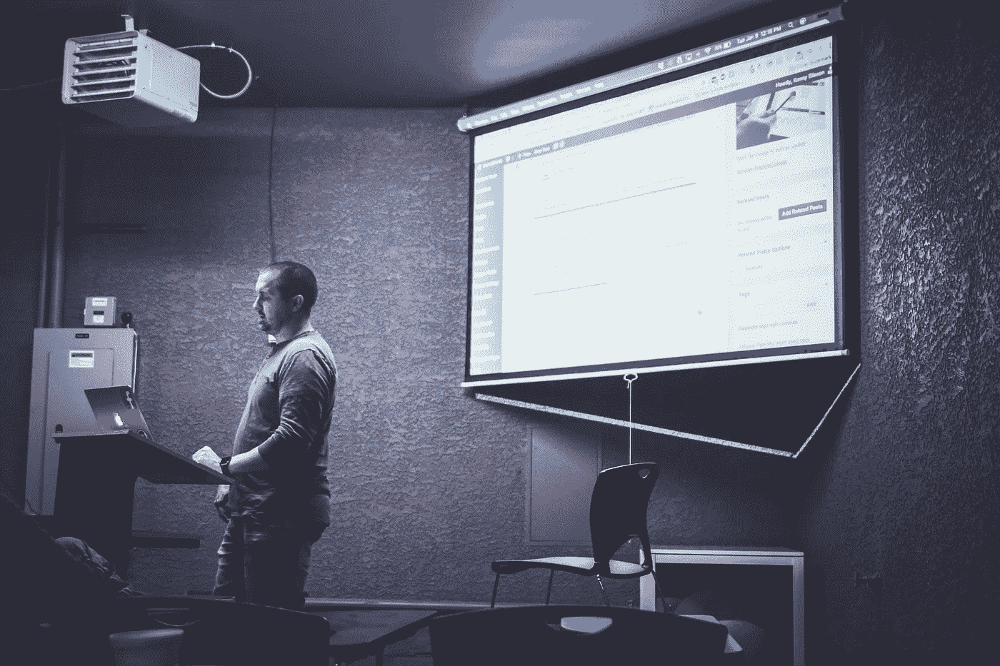

# 如果你害怕公开演讲，你必须读一下这篇文章

> 原文：<https://medium.com/swlh/if-you-fear-public-speaking-you-must-read-this-c2bca8b3993>

## *拥抱不适，关注他人，为难自己！*

Photo by [NeONBRAND](https://unsplash.com/photos/gYf49RB7bvE?utm_source=unsplash&utm_medium=referral&utm_content=creditCopyText) on [Unsplash](https://unsplash.com/search/photos/public-speaking?utm_source=unsplash&utm_medium=referral&utm_content=creditCopyText)

公开演讲是个混蛋。

问问世界上的任何一位演讲者，我敢保证，无论他们在大大小小的人群面前就已知或陌生的话题发表过多少次演讲，他们都会提到在成千上万的眼睛注视着他们的一举一动之前，他们会感到肾上腺素激增或紧张不安。

这令人望而生畏，令人恐惧，它可以让巨人安德烈感觉像小蒂姆，但它也可以令人振奋。

它可以是勇气、脆弱和无私的终极表现。

对于任何规模的观众来说，这都是一份无与伦比的礼物，我将向你展示如何做到这一点。

> *根据大多数研究，人们最害怕的是公开演讲。第二是死亡。死亡是第二位的。听起来对吗？这意味着对一般人来说，如果你去参加葬礼，你最好躺在棺材里，而不是念悼词。*
> 
> *——杰瑞·宋飞*

# **我第一次面对公众演讲**

我正要在一群人面前发表我的第一次演讲。我背下了整本书，实际上还背下了另外两个版本，我练习了超过 15 次，我对着镜子，在一小群人面前，对它进行了润色，我甚至得到了一位前教授的反馈。

我似乎准备得很充分，对吗？

不对！我还是有点害怕。

公众演讲是一种普遍的恐惧，有一个价值数百万美元的行业与克服它相关。它在学校、大学、某些企业中被教授，然而出于某种原因，人们仍然无法摆脱站在一群人面前，通过口语简单地分享一些想法。

你可能在想，“你只要想想穿着内衣的人就好了”。当然，这对某些人来说是有效的。但是其他人喜欢描绘自己穿着内衣的样子，所以这给人一种轻松、脆弱的感觉，立刻让观众站在他们一边。

> 没有“正确”的方法，除了个人分析之后的方法。

就像我在很多场景中做的一样，也是我一直敦促你做的，我后退一步，思考。这是一个分两步走的过程。

# **问自己问题**

关于公开演讲，我真正害怕的是什么？

在我演讲的前一天，我开始检查演讲的许多组成部分。

是因为我不喜欢自己的声音被听到吗？

嗯，我一直在说，到现在还没有人对我说什么，所以我不认为是那样。

*是我不相信内容吗？*

不，我真的很喜欢我准备的东西，真的很想和大家分享。

是因为我不想让别人看我吗？

这件事让我开始思考。从身体的角度来看，我对自己的样子很满意，但后来我开始想象有几十个人盯着我看。

如果我讲笑话时他们不笑怎么办？

*如果他们都有茫然的眼神会怎样？*

*如果他们看着我的脸，我抽搐了一下会怎么样？*

如果他们看着我的眼睛，而我有一秒钟斗鸡眼了呢？

我用我的手做什么？

这些问题开始在我脑海中闪过，我知道我已经找到了问题的根源。

我害怕那些盯着我一举一动的小眼睛。

从身体的角度来看，我害怕这些眼球对我身体的评价。

我害怕我的外表。

我会流汗吗，我会口吃吗，我会失声吗，我会忘记什么吗？

我害怕未知的情况，但这是我可以控制的，所以我设计了一个计划来绕过它。

# 这个计划

如果发现恐惧的根源是困难的部分，那么理解如何战胜它是容易和有趣的部分。

我创造了一个非常简单的解决方案。在我演讲的开始，我要求观众先闭上眼睛。我做了同样的演讲，同样的意象，同样的故事和信息，除了我一开始让他们闭上眼睛。

这像魔法一样奏效。

没有人刺穿我的灵魂，我开始获得动力。我看到了微笑，我看到了笑声，我不在乎也不去想我在做什么。我变得更加流畅和自然。当我告诉观众睁开眼睛时，他们已经站在我这边，我势如破竹。我已经把我的恐惧分离出来，分解到它的核心，打败了公开演讲。

# **归根结底是你的为什么**

我提到过这是一个两步的过程。我问自己的另一个问题是确保我粉碎了这个演讲

*我到底为什么要这么做？*

我的原因是我要说的东西对观众真正有帮助，我真诚地相信这一点。

所以当我想到这个演讲是否会产生我想要的影响时，我的第一反应当然是害怕。我并不是说这有什么错，只要我们能克服它。

> 感到恐惧、焦虑或紧张意味着你正在做的事情对你有真正的意义。但我们绝不能让这种恐惧吞噬我们，以至于我们无法实现我们的目标。

Photo by [Joseph Pearson](https://unsplash.com/photos/OWfXfRhJMYI?utm_source=unsplash&utm_medium=referral&utm_content=creditCopyText) on [Unsplash](https://unsplash.com/search/photos/baseball?utm_source=unsplash&utm_medium=referral&utm_content=creditCopyText)

这一切让我想起了贝比·鲁斯的古老格言，“不要让对出局的恐惧阻止你玩游戏。”但我觉得这是想得太超前了。在击球前，在击球前，你首先应该考虑的是:

你他妈的为什么要打棒球？!"

一旦你明白这一点，一旦你相信你正在做的事情对自己或他人有某种影响，那么你就知道恐惧是一种可以被摧毁的谬误。

对我来说，这是一个理解，这个演讲将帮助别人。

当我知道我有仁慈的意图，应该把注意力集中在别人而不是我自己身上时，我为什么要在乎我看起来怎么样，我是否完全遵守了剧本，我是否微笑得很好，我是否站得很高？

总之，我不应该在乎。所以我没有。我什么都没想，我克服了恐惧，我成功了。

除了找出问题的根源，弄清楚你为什么要做这个演讲，向谁做这个演讲，我有一个简单的三步走的方法来准备任何一种公开演讲的机会。

# **1。拥抱不适**

你知道这次经历会很尴尬。你知道你可能会结巴，你可能会忘记你想说的话，你的一举一动都会被别人盯着。但是玩得开心点！

永远不要害怕表现得有点傻，对你的观众开诚布公，告诉他们这种经历让你感到多么不舒服，他们会立即站在你这边。

告诉他们，“这很尴尬。接下来的 30 分钟我该怎么娱乐你呢？”

> 脆弱+诚实+幽默=观众同理心

在你的演讲中加入坦诚，尤其是幽默，这样听众会觉得有力量，享受和你在一起的时光。

# **2。为难自己**

这与拥抱不适密切相关，但同样，你意识到这种经历可能会让你感到尴尬。

有什么比故意让自己难堪更好的克服方法呢？

在你的幻灯片中放一张尴尬的照片，讲一个尴尬的故事，做一些事情告诉观众，即使你是专家，你也不比他们好。你和他们在一起。

# **3。关注他人**

你的演讲从来都不是关于你的。

请允许我重复一遍。

你的演讲从来都不是关于你自己的。

这与你的头发有多好看无关。

这与你能站得多直多高无关。

*不是关于*你和观众的眼神交流。

这些都很重要，但归根结底，它们很重要，因为它们增强了观众的体验。

你的信息，你的目标，你说话的原因是因为你想影响那些听你说话的人。

一旦你将这一点牢记在心，公开演讲就会变得更加容易和自然。

# **下一步你应该做什么**

公开演讲是指对我们每天做的事情感到舒适——和其他人交谈。

但更重要的是，公开演讲是关于倾听的。

这是关于关注别人如何发表强有力的演讲，关注并询问你的听众想要什么或需要什么，然后当你最终站出来时，询问并评估反馈。

当你和别人聊天时，专注于你的陈述和演讲。每次谈话都是练习公开演讲的机会。

要认识到。泰然自若。要自信。你会让整个房间为之惊叹。

# 行动呼吁

*如果你想获得更多关于如何在公共演讲等不舒服的情况下保持舒适的建议，请务必查看本页面***！**

**

## *这篇文章发表在 [The Startup](https://medium.com/swlh) 上，这是 Medium 最大的创业刊物，有 325，962+人关注。*

## *在这里订阅接收[我们的头条新闻](http://growthsupply.com/the-startup-newsletter/)。*

**