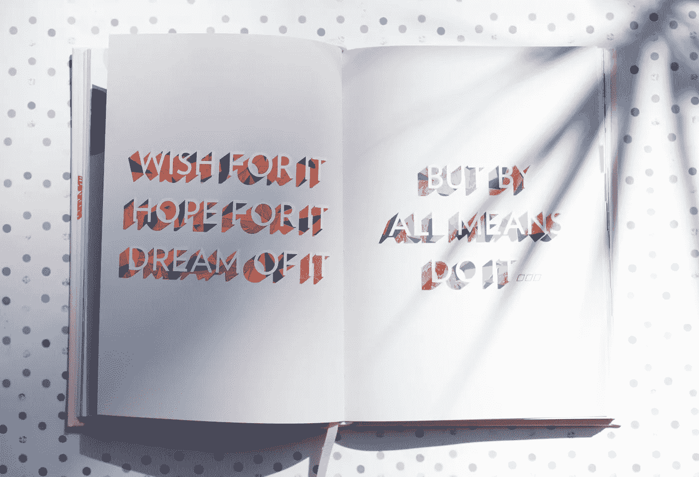

# 如果你专注于有意义的工作，你会取得个人成功

> 原文：<https://medium.com/swlh/if-you-focus-on-meaningful-work-you-will-achieve-personal-success-94cb6ba9b893>

Photo by [S O C I A L . C U T](https://unsplash.com/photos/6iYb1BWWbV0?utm_source=unsplash&utm_medium=referral&utm_content=creditCopyText) on [Unsplash](https://unsplash.com/?utm_source=unsplash&utm_medium=referral&utm_content=creditCopyText)

当你知道你想要在生活中完成什么，你可以建立系统和结构来支持完成你的目标。

## 不过有一个小挑战，叫做分心。

如果你很容易对每一个新想法感到兴奋，从一个项目跳到下一个项目，你永远不会得到你想要的。相反，结果将是许多未完成的项目——一些大的，一些小的——或者从一个工作或机会跳到另一个。你将不会更接近实现你的目标和创造你梦想的生活。

这是我人生中的一个挑战，也是我见过的其他创意人员和企业家努力应对的事情。对于像我一样的许多创意人员来说，很容易就能想出我们想要做什么，以及我们想要实现的目标。然而问题是我们经常有太多的想法。

# 这是漂亮闪亮的物体的大问题

> *“哦！那是什么？”你说。“现在让我放下一切，跟随这个又酷又令人兴奋的新想法，直入兔子洞！嗯，也许我会开始写书。哦等等！这个想法会成为一个很棒的新项目。见鬼，在我做这个的时候，我还不如帮助我的朋友完成他们的项目——我有那些技能，这会给我带来一些快钱。”*

这些陈述听起来像你吗？我想了，说了，做了每一件事！

追随一个“闪亮的物体”本身并没有错。有时候这样做对创作过程有很大的价值。你可能会学到一些新东西。你可能会意识到你需要把这个新的“闪亮的物体”作为一个系统添加到你的工作流程中。或者它是一个有价值的附加物，可以加入到你正在做的东西中。

过了一段时间，尽管那些分心的事情令人兴奋，但我们不再感到满足。我们从地图上消失了，现在我们意识到我们迷路了。我们发现自己在问这样的问题，

> *“我人生的使命是什么？*
> 
> *在我想要完成的事情上，我真的取得了进展吗？*
> 
> 我知道自己想要完成什么吗？我是说，我真的知道吗？
> 
> 即使我知道自己还有更伟大的东西要探索并带到这个世界上，我这样做安全吗？”

“lighted red Discovery neon signage” by [Noble Mitchell](https://unsplash.com/@1littlemangraphic?utm_source=medium&utm_medium=referral) on [Unsplash](https://unsplash.com?utm_source=medium&utm_medium=referral)

## 你如何确定地发现你最想用自己的方式完成的事情？

在长时间面临注意力分散和注意力不集中的挑战后，我对自己多年来使用的生产力工具做了一次深刻的回顾。我阅读我从项目、课程和与过去教练的个人通信中做的笔记。我看到我有工具和手段。我只是缺少一个完整的系统来组织和优化各个部分。

通过这次调查，我创造了**添加教练方法**。这是一个系统的过程，帮助你**评估**、**梦想**、**设计**清晰、有目的、有方向的生活。最终的结果是，你将绘制出自己的道路，一劳永逸地创造并过上你梦想的生活。

> 人生不就是这样吗？我们想创造一些有意义的东西。

我们希望与让我们兴奋并帮助我们发展的人一起工作。我们想分享一个积极影响他人生活的信息。

我们想做以上所有的事情，不仅仅是因为我们想要经济保障，还因为做这份工作会给我们带来满足感、个人参与和强烈的幸福感。我们会觉得值得！不是因为我们以前觉得自己没有价值，而是因为我们最终证明了一些有价值的东西，因此对我们自己和他人都有价值。

当我们知道我们的使命，是什么驱使我们，每天早上起床去工作就会变得容易得多。谋生几乎成了次要的。赚钱几乎成为一种默认，因为工作不会感觉像工作。

## 你是如何坚持下去的？

假设你有这个问题的答案，“我最想做什么？”。

你已经将你的答案——你的使命——与你的价值观和目标联系起来了。你在对齐，但你如何保持在轨道上，避免那些讨厌的分心(因为让我们面对它，我们无法避免它们)？

“closeup photo of ballpoint pen near camera” by [Jazmin Quaynor](https://unsplash.com/@jazminantoinette?utm_source=medium&utm_medium=referral) on [Unsplash](https://unsplash.com?utm_source=medium&utm_medium=referral)

# 设置您的生活和工作日以赢得胜利

我们都需要结构、系统和时间表来最好地管理需要完成的事情，这样我们才能高效和有效。工作的最后两个品质会让你以后的生活变得容易得多。

我们需要一个“生活计划”，一个提供灵活解决方案的计划，为你的健康和健身、你的人际关系以及你正在进行的个人成长和幸福提供足够的时间。

如果你太长时间忽视生活中的任何一个核心方面，就很难维持有意义的工作。把工作看得比你生活中的其他方面都重要会导致疾病、高压力和缺乏生活满足感。

## 有意义的工作在某种程度上让人觉得有价值和重要。

当我们因为照顾了生活中的其他方面而感到快乐和满足时，我们的工作做得最好。正是从这种幸福的状态中，我们可以获得最大的个人满足感，从而获得经济保障。

> 这不就是过上成功生活的全部意义吗，积极主动地去实现你的梦想？

## 当你的使命、价值观和目标一致时，干扰就很少了。

当你将**加法**应用到你的生活中时，你将发展出支持你日常行为和选择的有效系统。这反过来会让你更容易继续走下去，得到你想要的。

你将有办法去诊断那些总会出现的问题或挣扎。你将能够想出解决方案，这样你就可以继续前进。

加强你生活事件链中的联系有助于支持你想要完成的每一个方面。

“man holding smartphone looking at productivity wall decor” by [Andreas Klassen](https://unsplash.com/@schmaendels?utm_source=medium&utm_medium=referral) on [Unsplash](https://unsplash.com?utm_source=medium&utm_medium=referral)

## 为你的生活制定一个用户手册。

为了在生活中创造一些有意义的东西——一些让你兴奋并迫使你日复一日工作的东西——你需要一台运转良好的机器来促进这个过程。你的行动和选择就像“气体”，只有当零件(结构)正常时，“机器”(系统)才能正常工作。

生产力这个术语被频繁使用。我喜欢正面地把生产力这个词描述成这样:

> *最佳的自我管理能够高效且有效地完成我们想要创造的目标。*

当你偏离了轨道，当一些事情似乎不工作，你可以回顾添加方法的核心步骤，以摆脱困境，回到工作中来，创造你想要的生活。

*达人帮助人们* [*活出最好的自己*](https://darrenstehle.com) *，放下阻碍他们的东西，活出他们独特的天赋，让他们的世界变得更美好*。

 [## 活出最好的自己|达伦·斯蒂赫勒

### 如果你正在读这篇文章，你可能过着一种被深刻审视的生活。人们可能会称赞你的洞察力。你是…

darrenstehle.com](https://darrenstehle.com) 

*原载于 2018 年 10 月 12 日*[*darrenstehle.com*](https://darrenstehle.com/focus-on-meaningful-work-achieve-personal-success/)*。*

## 这篇文章发表在 [The Startup](https://medium.com/swlh) 上，这是 Medium 最大的创业刊物，拥有+ 377，643 名读者。

## 在这里订阅接收[我们的头条新闻](http://growthsupply.com/the-startup-newsletter/)。

