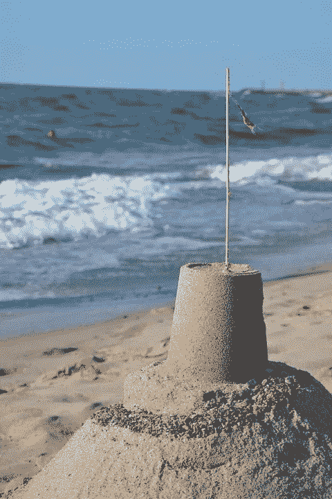

# 2018 年成功失败的五种有效方法

> 原文：<https://medium.com/swlh/if-you-happen-to-visit-your-nearest-library-or-any-bookshop-you-will-undoubtedly-notice-tons-of-c3672c28b14e>

如果你碰巧去了离你最近的图书馆或书店，你无疑会注意到大量关于生产力、领导力、成功咒语和其他激励性书籍。你去参加聚会或婚礼，你遇到的人想知道你有多成功，他们能从你身上学到什么，对吗？

没有人真正想知道如何成功地失败；然而，几乎每个人都这样做。生产力、成功咒语、领导力、专注度等等。，对你来说是不是有点陈词滥调？这里有几条建议，你不必真的担心成功或生产力，甚至时间管理。你应该关心的是悲惨地成功地失败。

1.  **晚起**:时间管理是失败的大敌。不要拥抱它。懒惰是最确定的目标。早上 5 点早起不仅有效，还能创造时间思考和计划。我有大量的书籍证明，当人们早起并努力争取胜利时，他们确实很有效率。事实是他们是对的。但是，如果你必须在早上 9:00 上班，我的建议是你早上 8:00 醒来，冲出去。这样，你真的不需要坐着思考。思考是失败的罪，我们不想为这项任务衡量自己。

2.**上社交媒体和电视**:在脸书、推特、SnapChat、Instagram 和其他社交媒体网络上创建个人资料，并确保浏览可爱的猫打架和 vine stars 的最新搞笑视频，让你开始新的一天。这真的有助于你停止整天想着有成效的事情。工作时，确保您的智能手机就在身边，以便始终与手机保持联系。当你听到哔哔声时，你必须找出是谁发送了这条转发信息。

网飞不是电视迷的福音吗？难道你真的不想下班后打开遥控器看看演员们在做什么吗？[研究表明，九岁以下的儿童每天看电视的时间超过两个小时。这难道不是培养孩子的好方法吗？在户外玩耍可以增强他们的大脑活动，从而带来良好的进步。然而，这不利于失败，需要停止。建设性的工作应该从他们的词汇中拿走，永远不要把他们放在他们的想法中。](http://edition.cnn.com/2017/10/19/health/children-smartphone-tablet-use-report/index.html)

3.**浅工**:拥抱浅工。肤浅的工作就像在沙滩上建造城堡。当你没有你正在建造的东西的基础时，这会导致肤浅的工作。

工作时，一定不要把你的大脑完全放在工作上，转移注意力是值得称赞的。最好的方法是完全停止读书，转而坚持使用社交媒体。这将有效地帮助你的失败。注意:如果你喜欢肤浅的工作，就不要读卡尔·纽波特的《深度工作》和丹尼尔·戈尔曼的《聚焦》。

4.沉迷于分心的事物:任何地方的分心都是失败的福音。你需要几样东西来确保你不会分心。首先，检查你的智能手机是否在你旁边。这样，当你在工作的时候，你可以摆弄所有的新消息和 WhatsApp 转发来阅读。确保你参加了他们召集的所有会议。在这里，你可以放松，喝咖啡，吃饼干(如果允许的话)，享受听各种废话的乐趣。

5.**重复你的错误**:如果你认为你在某个特定的项目或工作中犯了一个错误，那就确保你会一次又一次地犯同样的错误。在这里，你需要掌握重复错误的艺术。

小心明智地遵循这些，相反的可能是有效的。

## 这篇文章发表在[《创业](https://medium.com/swlh)》上，这是 Medium 最大的创业刊物，有 286，184+人关注。

## 在这里订阅接收[我们的头条新闻](http://growthsupply.com/the-startup-newsletter/)。

