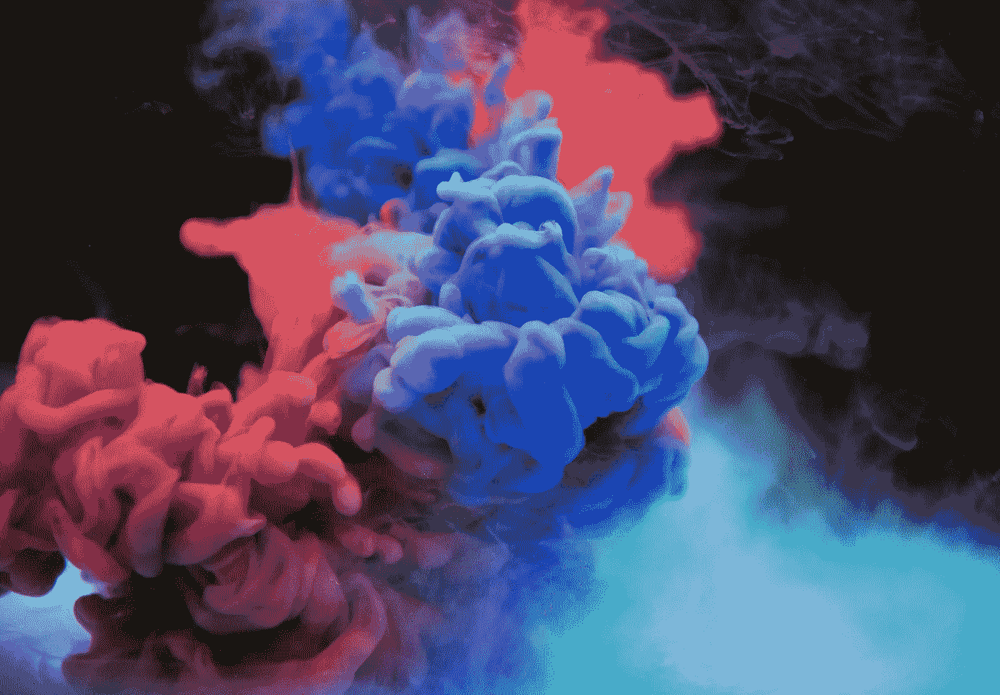

# 如果你认为你没有创造力，你是对的

> 原文：<https://medium.com/swlh/if-you-think-youre-not-creative-you-re-right-a1693dbad8e5>

我听过很多次了。“哦，我只是不是那种有创造力的人。”这是一种心态，人们一出生就开始以这样或那样的形式迸发创造力。这是一种心态，认为有“我们”和“他们”，没有重叠，没有改变立场，也没有个人成长的可能性。虽然有些人天生比其他人更擅长发挥他们的创造力，但每个人都必须进行大量的练习，才能达到被其他人视为“有创造力”的程度，并能够以任何令人印象深刻的方式使用他们的技能。正是通过这种程度的实践，创造力得到磨练，没有所说的实践，创造力很难存在。

所以当有人说“我就是不是有创造力的类型”时，这是一个自我实现的预言。你假设它是你有的或者你没有的东西，如果你还没有“它”，那么尝试就没有意义。

这是一种有害的心态。创造力不仅仅体现在画一碗水果上，它是我们所做的每件事情的一部分。它是以一种不同的新方式思考问题。有创造力的人也倾向于对新的经历和想法非常开放，我认为这几乎是鸡和蛋的关系——这种关系会导致一种积极的反馈循环，让你参与到新的有趣的事情中，这往往会给他们自己程度的创造性灵感。

认为自己做不到或成不了什么的想法是一种弄巧成拙的思维方式。这不仅适用于上面提出的创造性问题，也适用于你根据自己的能力给自己贴标签的任何方式。这些能力中有许多与通常被描述为“创造性”的东西毫无关系。考虑一下你已经自动放弃的各种爱好、经历或职业道路，因为自我强加的狭隘视野只关注你已经很好(甚至很棒)的事情和你一直在做的事情。

如果你认为你永远不能成为一名摄影师，但发现自己越来越擅长摄影，那么接受这个标签的界限在哪里呢？如果你认为你永远成不了工程师，但是你越来越擅长写代码，那么，分界线在哪里呢？在很大程度上，没有一个管理机构来决定一个人什么时候成为什么样的人。没有人会突然说你是设计师。也没有人正式说你是营销人员。很多事情也是如此。当你开始擅长某件事时，你不需要给自己贴上一个标签(“例如，我擅长销售，但我不是推销员”)。

你必须首先相信你能做某事，然后你才能采取措施去做。虽然这是显而易见的，但它经常被忽视，当你长时间以来一直以某种方式思考时，很容易被固定下来。现有的(和限制性的)信念是阻力最小的路径，所以除非你有意识地承认它只是一个信念，而不是一个事实或一成不变的东西，那么你会继续自动地这样想。

我是住在纽约市的数码战略家和偶尔的摄影师。在 Instagram 上通过 **@andreikorchagin** 关注我，或者在 andreikorchagin.com[访问我](http://andreikorchagin.com)。

## 这篇文章发表在《T4》杂志《创业》(The Startup)上，这是 Medium 最大的创业刊物，拥有 325，521+读者。

## 在这里订阅接收[我们的头条新闻](http://growthsupply.com/the-startup-newsletter/)。

