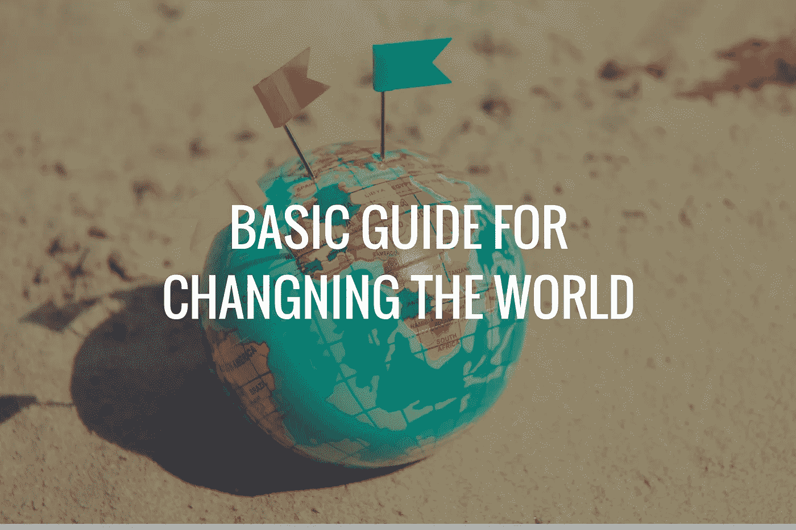

# 如果你想改变什么，先改变自己

> 原文：<https://medium.com/swlh/if-you-want-to-change-something-change-yourself-first-324c9c48cc92>

[Pexels](https://www.pexels.com/photo/blur-close-up-figure-focus-346696/) + [Canva](http://canva.com)

## 改变世界的基本指南。

在形成我们今天生活的世界的每一次革命中，一切都始于一个人和他的映像。很明显，这个人自己做不了多少事情，但是在创建和聚集了一个分享他们理想的社区后，他们做出了巨大的改变。

在这篇文章中，我将试图解释世界被改变的过程。这不是一条容易的道路，因此，这项任务只留给少数人。

**我们的想法要改变一些东西，需要很大的耐心，很多的努力，还需要一点运气。**

# 第一步:分析和思考

为了改变世界，我需要一个世界从未见过的想法。产生新想法的最好方法是学习，然后反思。

> 如果你想改变一个行业，你必须了解它的一切，寻找它有改进空间的地方。

分析之后，**我们必须反思**(很多)**找到解决办法。**

一旦我们认为可以想出解决问题的办法，我们就进入第二步。

# 第二步:改变我们的思维

这一步体现在文章标题中:想改变什么，先改变自己。

> 我们必须忠实于我们的想法，并表明我们相信它，因此我们必须将它付诸实践。我们必须改变心态，为新想法腾出空间，并在日常生活中考虑到它。

我们必须和我们所想的一致，也就是说，我们必须按照我们所说的去生活。让它成为我们的一部分对于**证明它是一个正确的想法**并证明它是否需要修改是很重要的。

# 第三步:分享想法

正如我在引言中所说，只有一个人不能改变世界。你需要一个社区做后盾。这就是为什么有必要创造一场革命来把我们的想法传达给世界。

> 这有两个好处:接收反馈以改进我们最初的想法，并开始创建一个相信我们和我们的想法的社区。

显然，如果我们的想法不够好，不足以改变社会，我们必须回到第一步，我们必须重新思考我们可以改善什么，我们可以删除什么，以便这个想法有一个更好的结局。

# 第四步:改变世界

你有一个通过前面三个步骤发生过几次的想法，也就是你有一个清晰可行的改变世界的想法，有一个在你身上也有同样想法的社群。现在是最难的部分。

> 我们的世界已经在这里很多年了，不喜欢改变，总是有来自社会某些部分的阻力。他们害怕改变，但不是因为这种改变有害，而是因为他们不喜欢新的东西。他们希望继续保持现状，即使他们可以做得更好。

你必须成为大多数人，这个想法才能被接受，你必须让这个想法不再是新奇的，而成为新的常态。为此，你需要耐心，主要是因为你必须长时间保持这个想法，直到这种情况发生。
但一旦这种情况发生，就是这样，你做到了。你改变了世界，**世界和你发现的不一样。**

# 第五步:重新开始

**一旦世界改变了，你就得再改变一次！总有需要改进的地方，所以你必须回到第一步，创造一个新的想法。**

# 结论

从文明之初，人类就进行革命，以便他生活的地方能够向前迈进。我们总是有好奇心，想知道如何改善整个社会的生活，由于这一点，他们也有创造力找到必要的解决方案来实现这一点。

> 这种好奇心和创造力的循环不应该停止，今天我们并没有生活在一个理想的世界里。

我们有义务离开一个比我们到达这里时更好的星球。为了生活在一个更美好的世界，我们还需要几次革命。

## 这篇文章发表在 [The Startup](https://medium.com/swlh) 上，这是 Medium 最大的创业刊物，有 333，253+人关注。

## 在此订阅接收[我们的头条新闻](http://growthsupply.com/the-startup-newsletter/)。

