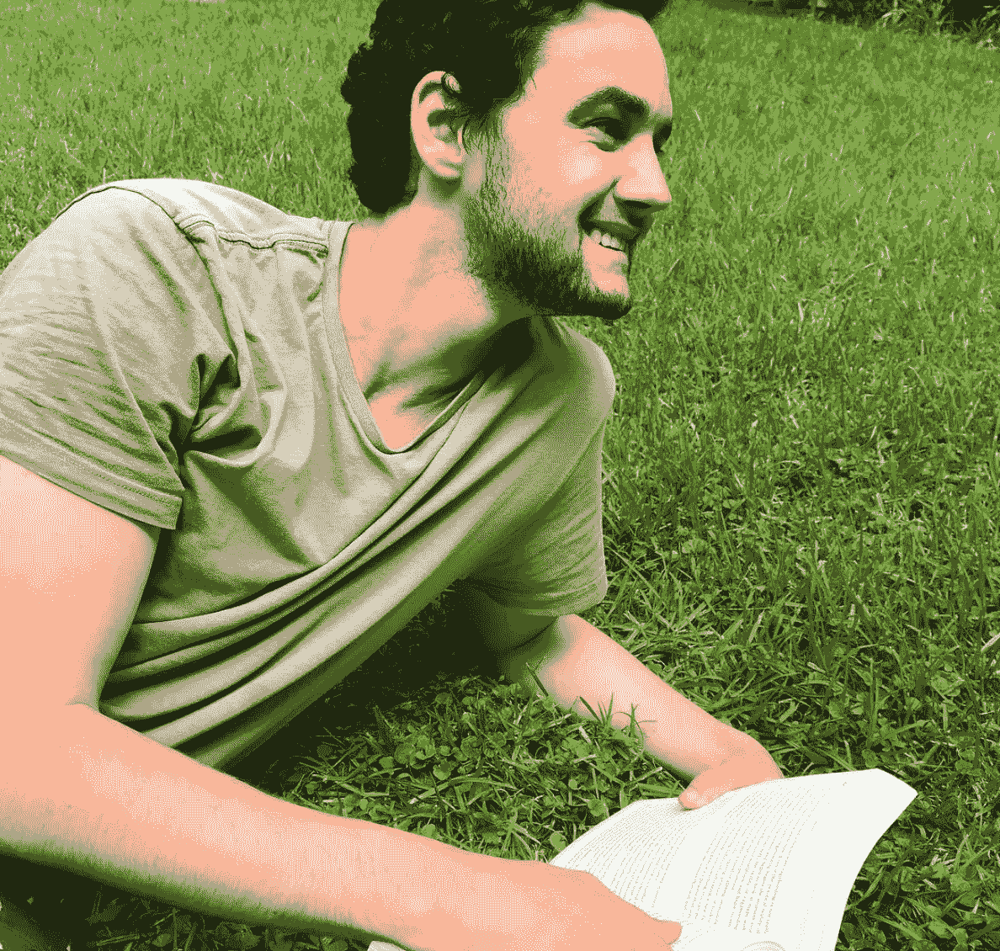

# 如果你想改变你的生活，从你的环境开始

> 原文：<https://medium.com/swlh/if-you-want-to-change-your-life-start-with-your-environment-e6be0fc27588>

我要承认，2017 年是糟糕的一年。

除了意识到我需要改变之外，没有任何好处。

事情是从分手开始的。总是从分手开始。这导致他们在一年中复合/分手五次。虽然我现在知道这有多愚蠢，但当时这就像是五次小小的希望之光。五次复合的机会。

*这样我就不会惹上麻烦——这不是我现在的女朋友。*

我为什么要告诉你这些？

它对我产生了影响，我现在才意识到我可以回顾和反思。

**它延长了分手期。**

你知道那段时间你的心态是“我现在是单身了，是时候去找点乐子了”吗？在你喝得比平时多一点的那段时间里，你一有机会就会去夜总会和派对，让自己忘掉那些事情。通常持续几周。

我的婚姻持续了一年，因为我不断地进出一段有毒的关系。

我设法每周喝 4-5 次酒。一天中的大部分时间都在睡觉，没有取得任何进展来真正完成任何值得做的事情。

为什么？

我是环境的双重产物，除了我自己，我不能责怪任何人。

在这期间我和一群我真的不应该有的人成了朋友。

**郁闷。没有。没有动机。酗酒者。**

这些都是和我一起出去玩的那群人的特征，因此也成为了我的特征。

他们是一群容易相处的人。没有目标，没有野心，所以，没有必要有自己的目标。

在我继续说下去之前，我想把事情弄清楚。我仍然有一份全职工作，仍然很正常。我想你可以说我有 18 岁的“什么都不重要”的思维定势，并且有钱去激发它。

我生命中最重要的一天到来了。

22/01/2017.(我觉得我应该纹上去，这对我意义重大)。

我不知道那天点击了什么，但是有东西点击了。

我无法告诉你为什么那天我决定改变。我一直想弄明白。

但重要的是有东西确实*点击了*。

从那天开始，我彻底改变了我的环境。这改变了我的生活。

因为在我宿醉的状态下，那天我意识到了一些事情:**如果我改变我的环境，我就能改变我的生活。**

在我的启示之后，我从一个领域开始。

# 人

在过去的两年里，我一直在努力改变我的生活，如果你想改变他们的生活，这是你需要解决的一个主要问题。

> 你是和你相处时间最长的 5 个人的产物。

我知道每个人都听说过上面的话，但是有多少人真正做到了呢？

我第一次听到这句话是在 3 年前。我花了两年时间才真正使用它。

你需要仔细看看和你一起出去的人，并开始做一些艰难的决定。

*   你渴望像他们一样吗？
*   他们对追逐目标有着同样的热情吗？
*   它们符合你的总体规划吗？

如果他们没有勾选以上任何一项，那么是时候摆脱他们了。

一般来说，在这种情况下，你知道你需要继续前进，但你担心感情受到伤害。我要告诉你的是:你来到这个世界上不是为了让别人快乐。

鼓起勇气，做对你最有利的事。

我的做法是停止一切交流。就这样。有些人问我为什么不和他们一起玩，我给了他们一个答案，但除此之外，没有交流。

几个月后，当你和真正帮助你接近目标的人在一起时，你会感谢自己。

## 警告！

*这样做会有一些反弹。我保证他们会生气，发牢骚，抱怨，还有那些你以为已经远离的有趣的高中垃圾。*

*不要陷入其中。你做了决定。*

*正确的决定。*

超越它，开始追逐你的目标。

在我找出了有毒的人之后，是时候做另外两件我需要改进的事情来完成这个过程了。

# 自然环境

你的卧室看起来像什么？

说真的，四处看看。

干净吗？

你的床整理好了吗？

你有没有把你的目标写下来并且清晰可见？

这些是我问自己的下一个问题，你也应该问。

如果你打算改变你的生活并开始实现你的目标，你需要一个富有成效和目标导向的物质环境。

这都归结于习惯。[积极习惯的养成](https://jessekerema.com/how-to-eliminate-distractions/)。

如果你想创造一个目标导向的环境，你需要养成积极的习惯。

所以，这样做:

1.  确定你需要养成的习惯。
2.  每天都这样做。

这就是全部了。

> *没人看的时候的你，是所有人都看到的你。*

你可能认为这并不重要，但你私下里是谁比你想象的更重要。

例如，你不能说你是一个非常有条理的人，每天早上不整理床铺。

虽然没人看得见，但这很重要。

你想开始培养改善自我的习惯。即使是小事也很重要。

我养成的第一个积极习惯是每天早上整理床铺。

这是一件很小的事情，但却是一项成就，每天早上都能让我积极地度过一天。

我开发的其他产品:

*   每个星期天打扫我的房间，我是说全面打扫 T2。除尘、吸尘、擦拭我的白板，这样就不会有黑色污迹了。不只是把屎扔进抽屉里然后说我已经打扫干净了。就像我说的，你是谁，在私事上和做事时总是不小心。
*   **不在床上吃东西。**
*   清洗我的汽车。

我有一大堆其他的，但是这些是和环境有关的。

# 头脑

这是迄今为止最难克服的，但是通过首先对*人*和你的*物理环境*进行工作，就比较容易了。

你的思想是你环境的一部分。可以说，这是三者中最重要的。你的心态会成就你，也会毁掉你，所以采取措施培养积极的心态很重要。

你的思想也是个卑鄙的小混蛋。它会让你相信，当事情不顺利的时候，事情是好的，这是我 2017 年的问题。我以为一切都很好，直到我醒悟过来。

如果你要追求你的目标，你需要培养一个积极的心态，除非你改善了你的外部环境，否则你无法做到这一点，但是一旦你做到了，你需要看看有助于积极心态的其他方面。

## 积极的习惯培养积极的心态

我简单地谈了一下，但我想更多地谈一谈。如果你想改变心态，积极的习惯是至关重要的。你需要养成这些习惯，只要每天坚持，就能让你更接近目标。

这些是我的一些作品:

*   整理我的床
*   每天写作
*   在[媒体](/@jessekerema)上评论 20 篇帖子
*   回答 Quora 上的 5 个问题
*   给旅游博主发关于 [OAKTRAV](https://www.oaktrav.com/index/public/) 的邮件
*   联系记者了解 OAKTRAV
*   练习:周一，周三，周五
*   阅读

这大概是我习惯的 1/3。

## 一致性

要建立在上述基础上，你需要始终如一。

回到 2015 年，我试着养成每天早上整理床铺的习惯。3 天后我放弃了。不是因为这很难，而是因为我没有现在的心态。快进到 2017 年，从第一天开始它就像胶水一样粘在一起，从那以后我每天都这样做。

它现在已经深深印在我的脑海里了。我必须整理床铺。

另一个例子是天天评论媒体。

有时候我真的不喜欢它。有时我会花上几个小时，因为我没有动力，但我还是会这样做，因为一致性是你发展动力的方式，动力是你实现目标的方式。

保持一致。

## 目标嵌入

仅此一项就会改变你的生活，这真的很容易做到。

将你的目标植入你的头脑会让你变得目标导向。

你的目标需要成为你所想的一切，唯一的方法就是不断提醒自己(看到一致性的模式了吗？).

对我来说，这是瞬间的，因为我确切地知道了我想要什么，这成了我做任何事情的原因。

我不断思考我的目标。意味着几乎一天中的每一秒钟。

当我写这篇文章的时候，我正在思考这个问题。这是你需要达到的水平。

这有助于我之前的所有观点，因为你将能够确定你需要做什么，你需要养成什么习惯，你应该和谁在一起。

实际上，这应该是我的第一点…

以下是我提醒自己目标的方法:

*   我把它写在一张卡片上，放在钱包里。
*   我把它写在我桌子后面的白板上。我现在正盯着我的目标。
*   它在我床边的公告板上，所以它是我每天看到的第一件也是最后一件东西。
*   我每天主动大声读两遍。

如果你想培养一种不仅积极而且目标明确的心态，我建议你做以上所有的事情。

我一直处于一种可怕的心态，什么都不会发生，一切都是自我毁灭。这些正是我为了扭转局面而努力的事情。

如果你真的想改变你的心态，在生活中获得成功，你需要非常重视你的环境，无论是内在的还是外在的。

在你真正开始行动之前，你需要做好准备。对我来说，我花了几年时间才达到这样的水平:我已经受够了无所事事，并准备为此做些什么。

对你来说，可能需要更长时间，或者希望你现在已经准备好了。

如果你在那里，在接下来的两个月里完成上述过程。先从最艰巨的开始。人们。用不了多长时间。只有几天的时间来决定谁去谁留，然后让大家明白你的决定。

在我离开之前，我要指出我反复强调的一点:没有什么会因为你读了这篇文章而改变，你必须实际行动起来。

## 如果你喜欢这篇文章或者觉得它有帮助，不要吝啬，点击不止一次。

## 更好的是，在你的想法上留下评论。

# 喜欢这个故事？在此与我联系:

[insta gram](https://www.instagram.com/jesse.kerema/)|[LINKEDIN](https://www.linkedin.com/in/jessekerema/?lipi=urn%3Ali%3Apage%3Ad_flagship3_pulse_read%3BMbMfWF1NTCO6384kIHw53Q%3D%3D&licu=urn%3Ali%3Acontrol%3Ad_flagship3_pulse_read-nav.settings_view_profile)|[oak trav](https://www.oaktrav.com/jessekerema)|[博客](http://www.jessekerema.com/)

## 这个故事发表在 [The Startup](https://medium.com/swlh) 上，这是 Medium 最大的企业家出版物，拥有 292，582+人。

## 在这里订阅接收[我们的头条新闻](http://growthsupply.com/the-startup-newsletter/)。

