# 如果你的访客问你这 5 个问题，是时候更新你的文案了

> 原文：<https://medium.com/swlh/if-your-visitors-are-asking-you-these-5-questions-its-time-to-update-your-copy-c5d932d8746f>

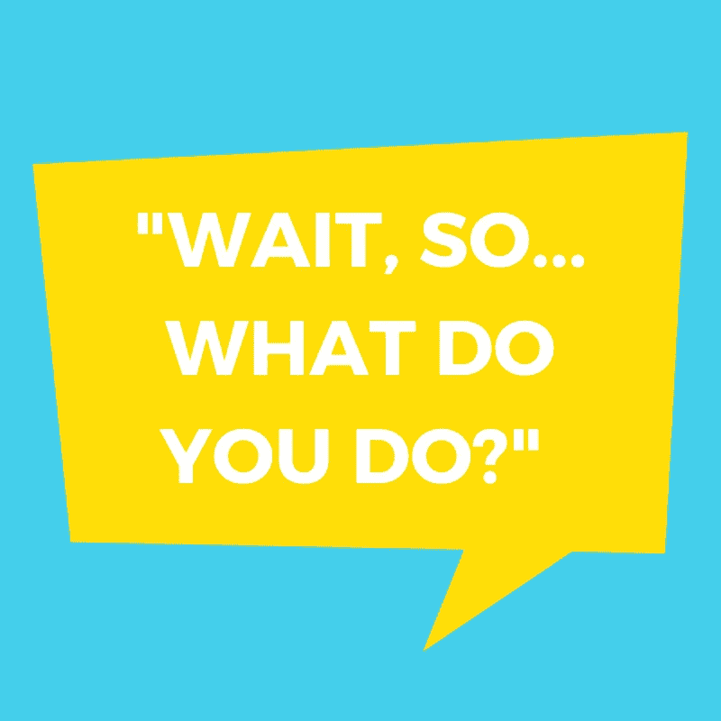

你的内部通话感觉像是 21 个问题的游戏吗？

“你是做什么的？”

“它是如何工作的？”

“是给谁的？”

“这对我有什么帮助？”

“和 X 有什么不同？”

刚开始，这还挺好玩的，但是在回答了几百遍这些问题之后，你可能会开始疑惑:*“为什么这些混蛋一遍又一遍地问我同样的问题？”*

当然，你可以责怪他们(“他们不阅读”，“他们很懒”，等等)，但是如果你继续在与访问者的对话中看到模式，这不太可能是他们的问题，而更可能是你的网站副本的问题。

如果你在想，*“糟糕，我需要重写我的整个网站吗？!"*，放松。这是一个常见的(也是可以解决的)问题。

你所要做的就是记下你的访问者问你的最常见的问题，翻译他们的意思，然后提出正确的解决方案。

(别担心，我已经做了一些工作来帮助你起步😁 ).

以下是你的访客可能会通过对讲机(或你使用的任何信息应用程序)问你的 5 个问题，它们是什么意思，最重要的是，你可以做些什么。

# Q1:“你是做什么的？”🤔

*意思是:你的产品定位不清晰*

当一个访问者登陆你的网站，问你类似“你是做什么的？”你可能会想，“唉，难道没有人读书了吗？！就在那里！”

但是请记住:仅仅因为一些事情对你来说很清楚，并不意味着对你的访问者来说也很清楚。

如果这个“你是干什么的？”这个问题日复一日地困扰着你，你可以这样做:

## 试试“空白就是空白”的公式

这是我从[版权黑客课程](https://copyhackers.com/)中学到的一个简单技巧。

通常，“空白就是空白”这一公式用于帮助您围绕特定的功能或优势撰写文案，但我发现它对撰写定位陈述同样有用(就像您可能在英雄信息中发现的那样)。

它是这样工作的:

首先，用公式“__ 是 ____”写一个(或几个)关于你的产品或服务的重要部分的陈述

例如: *Shopify 是一个商业平台，任何人都可以在网上、零售点以及两者之间的任何地方轻松销售。*

接下来，去掉“Shopify”和“is”，这样就有了你一直在寻找的清晰的产品描述:*“一个让任何人都可以在网上、零售点以及两者之间的任何地方轻松销售的商业平台”*

这一行可以用在很多地方，比如你的主页。

如果你正在努力写你的“空白就是空白”的陈述，没关系。

后退一步，浏览一下 [**我的品牌问卷**](https://learn.anniemaguire.com/branding-questionnaire) 。它包含 28 个问题，可以帮助你发现自信地写下自己的“空白就是空白”陈述所需的关键见解。

# Q2:“它是怎么工作的？”🤔

*含义:不清楚你的产品的所有部分是如何组合在一起的*

“它是如何工作的？”这是一个常见的问题，尤其是对于技术 SaaS 产品。

如果你提供的产品或服务很复杂，试图让人们以简单明了的方式理解它是如何工作的会很有挑战性，但并非不可能。

如果这个问题在您的产品中反复出现，您可以这样做:

## 试试“1，2，3”公式

花点时间从“步骤 1-3”的角度来思考你的产品(即使它有比三个步骤或部分更多的步骤或部分)。

这里的想法是将你所做的事情简化到最重要的部分，这样你的客户就可以很快清楚地知道使用你的产品会是什么样子。

如果你的产品或服务需要 12 个步骤(或更多)，看看你是否能把某些步骤放在一个“总括”类别下，让它看起来更简单、更容易。

一旦你有了你的 1，2，3 公式，它可以在你的主页上被提炼成一个**“它是如何工作的”部分**，就像下面的 [Stitch Fix](https://www.stitchfix.com/) 中的例子:

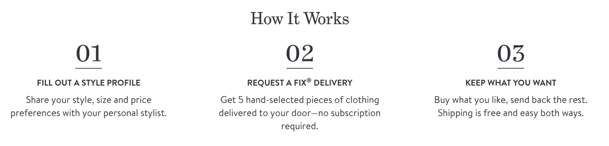

或者，如果你的产品确实更复杂(很可能如此)，将你的“1，2，3 公式”展开成一整页可能更有意义，就像 [99Designs 在这里做的](https://99designs.com/how-it-works)(也在下面):

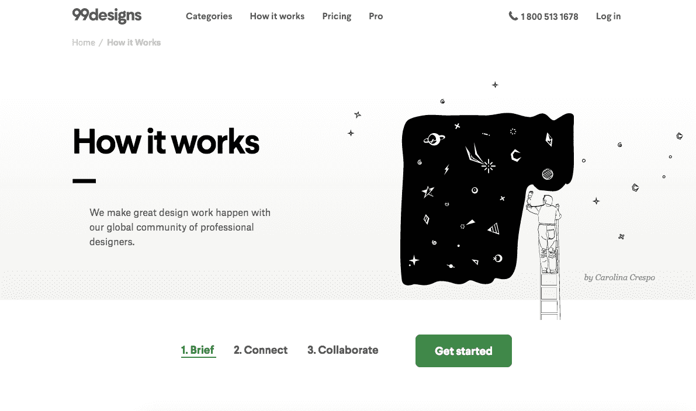

## 制作用例列表

从写一份清单开始，列出别人可能使用你的产品或服务的所有方式。

您可以通过直接与客户交谈或通过调查来做到这一点。如果可以的话，浏览旧的产品评论，更好地了解真正的顾客是如何使用你的产品的。

如果你在调查你的顾客，问这样的问题:

*“您觉得[您的产品]什么时候最有用？”*

*“在您的日常生活中，是否有您使用【您的产品】的特定时刻？”*

*“如果你向你认识的人推荐[你的产品]，你认为谁会从中受益最多，为什么？”*

一旦你对你的产品如何以及何时被使用(以及被谁使用)有了一个很好的想法，创建一个“用例”部分(或者像 Evernote 中的[页面)专门用于你的产品提供的用例。](https://evernote.com/business/use-cases)

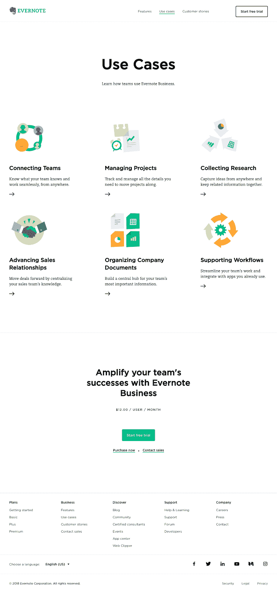

## 显示不告诉

解释事物如何工作的最清楚的方法之一是使用视觉例子，你可以用几种方法来做到这一点。

首先，你可以**创建一个“产品演示”选项或页面**，展示你的产品的实时状态。 [Squarespace](https://www.squarespace.com/templates) 允许你在注册之前预览网站模板。

你可以利用“产品演示”的另一种方式是允许客户选择**“请求免费演示”，就像这里的 [Zoom](https://zoom.us/livedemo) 一样。这使您能够个性化客户的演示体验*和*在会议期间向他或她推销。**

如果你不想制作完整的演示，你可以制作一些快速的**视频或 gif 来演示**你的产品的特定部分如何协同工作或单独工作。这是许多 SaaS 公司，如 [Input](https://www.input.com/) 目前正在使用的一种流行解决方案。

最后，你可以制作一个 1-2 分钟(甚至 3 分钟以上)**的讲解视频**来更好地解释你的产品及其工作原理。如果人们经常问你“你是做什么的”，那么这个选项非常好以及“它是如何工作的？”。

下面是[顶空](https://www.headspace.com/)是怎么做到的。

# Q3:“是给谁的？”🤔

*含义:访问者无法判断产品是否适合他们。*

你的网站的主要目标之一是帮助访问者想象他们使用你的产品。

因此，如果人们来到你的网站，他们对产品是否适合他们感到困惑，那就很难说服他们没有它就无法生活。

“这是给谁的？”这个问题在早期创业公司中尤为常见，但在成熟的创业公司中也会出现。

无论你的创业处于哪个阶段，这里都有一些解决这个问题的方法:

## 大声说出产品适合谁//不适合谁

当你刚刚起步时，你自己的团队可能不清楚这个产品是给谁的，所以试图说服完全陌生的人为什么你的产品是给他们的会很困难。

此外，当你第一次开始时，你可能没有很多客户成功的故事或证明，这只会使问题复杂化。

但是不要担心，你发现自己在这条船上，你不是注定的——一个简单的列表或图表可能是一个实用的解决方案，就像这样(但是希望有一个更好的设计😉 ):

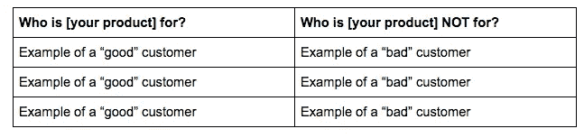

如果你是一家有很多客户(因此有很多例子)的初创公司，试着在你的网站上添加一整块区域(或页面),专门为你服务的各种客户服务。

这里有一个来自 Podia 的例子:

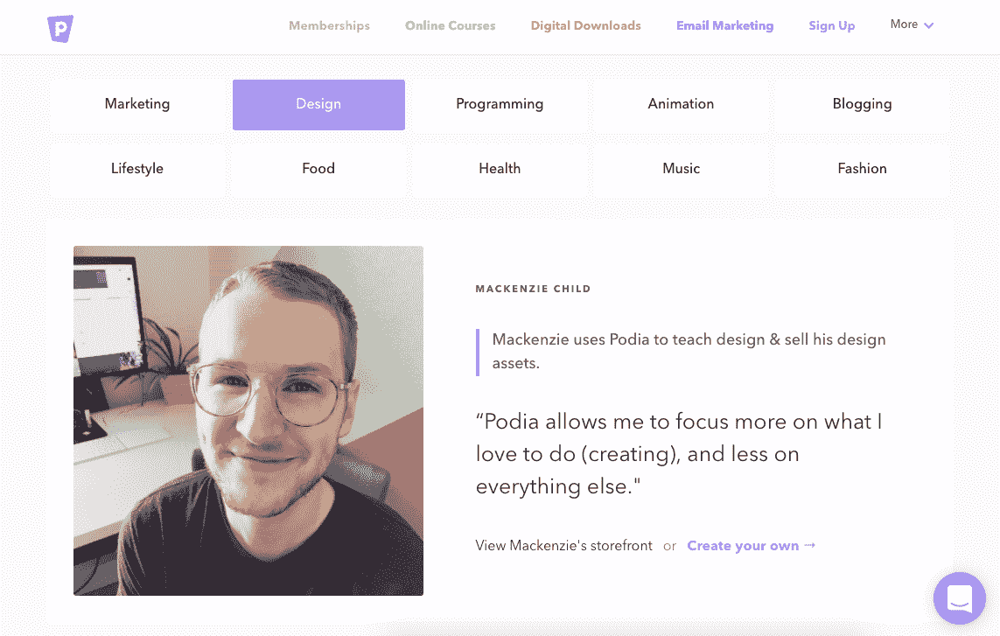

这让访问者有机会探索并潜在地认同已经在使用你的产品的其他客户。

# 喊出你所服务的顾客的数量和类型

另一种方法可以帮助你先发制人地回答“这是给谁的？”问题是关于**具体信息**。

例如，你可以突出你所服务的顾客数量以及这个群体是由谁组成的，就像 [Podia](https://www.podia.com/) 在这里所做的:

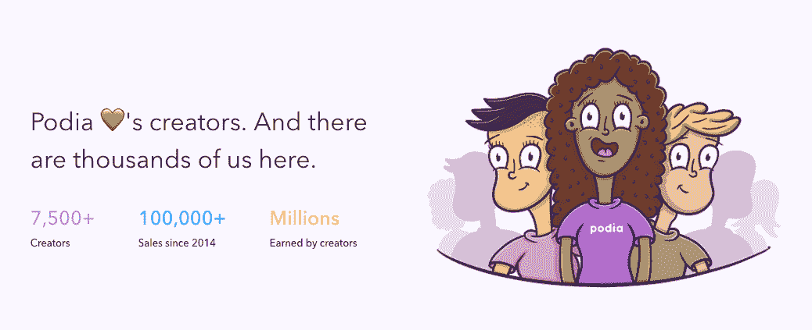

注意“creators”这个词是如何出现在标题和“7500+”下面的,**强调了这个产品是为特定类型的人设计的。**

这是另一个来自 [Reedsy](https://reedsy.com/) 的类似例子，他们宣称他们为作者服务(准确地说是 75，000 名)。

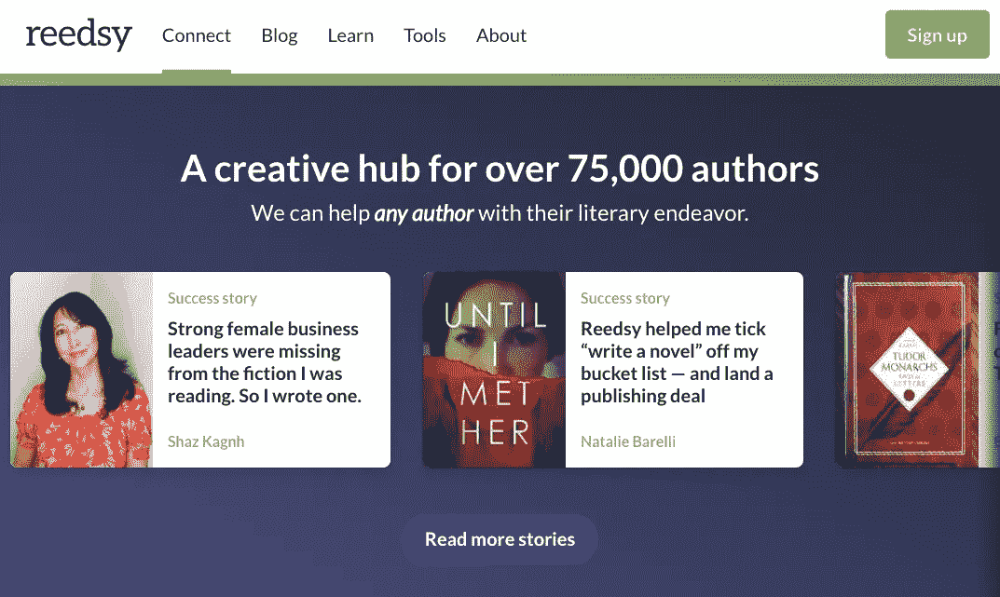

## 显示客户徽标

另一种帮助访问者判断产品是否适合他们的方法是展示一些客户的标识(就像下面例子中的 [Slack](https://slack.com/) 所做的那样):

这让访问者清楚地知道你目前在为谁服务，所以他们可以想象自己是在这个群体之内还是之外。

## 证明书

放一个部分或一页专门介绍你的客户评价，这不仅是展示客户满意度的一种方式，也是你强调客户具体信息的一个机会。

有了证明，您可以包括客户的姓名和形象(可以表明性别、种族等)、他/她工作的地方、位置等等。所有这些都有助于帮助其他人认同你的现有客户。

这里有一个来自 bench.co 的好例子:

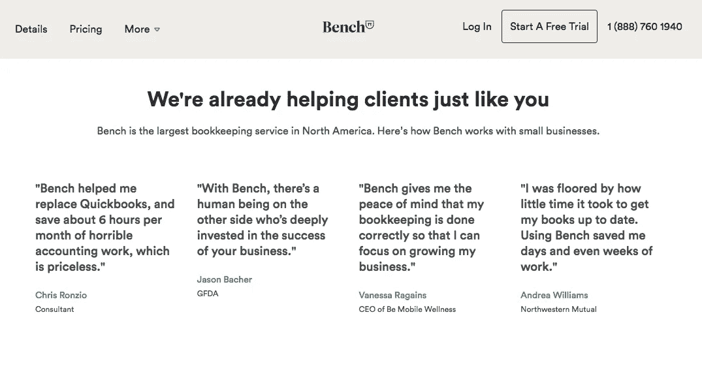

让我们快速检查一下他们语言的有效性:

“我们**已经**在帮助客户**就像你**”(与相似的人一起强调已证实的专业知识)。

“Bench 是北美最大的簿记服务公司。以下是 Bench 如何与**小型企业"**"合作(强调位置和他们合作的企业类型)。

每份报价都有一个**全名、头衔和/或公司名称**，让你更清楚地了解他们的客户是谁。

# Q4: **“这对我有什么帮助？”**🤔

*什么意思是:你的价值主张不明确*

在访客掏出钱包之前，她想知道:“里面有什么给我的？”

这意味着，如果你的价值主张不是 100%清楚，你会一遍又一遍地被问到这个问题。

如果您需要一些帮助来阐明您的价值主张，请尝试以下建议:

## 关注结果(而不是功能或优势)

当试图向客户展示价值时，大多数公司专注于他们的功能，以及这些功能提供的好处。

这里有一个来自 [Headspace](http://headspace.com/) 主页的例子(我用草图标记了它):

我用一些红框来突出应用提供的*好处*(即“保持专注”)。这是大多数营销网站使用的语言类型；很简洁，但是很笼统，有点模糊。

为了解决这个问题，尝试使用**具体的结果，而不是模糊的利益。**

为了向您展示我的意思，我在 Headspace 网站上“重写”了这一部分，重点关注**具体结果与模糊的益处**:

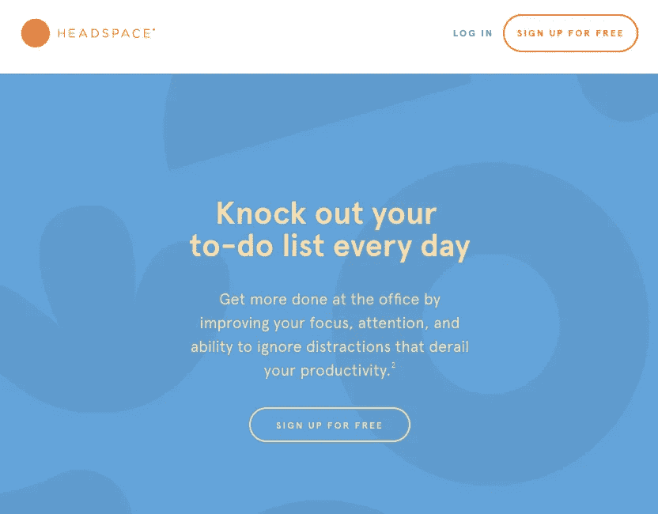

My version of this section on Headspace’s homepage

请注意我是如何**非常具体地告诉你**使用顶空冥想应用程序会发生什么。通常，人们在工作时更关心注意力、注意力和集中注意力的能力，所以这就是我关注的。

这只是一个例子，但希望你能看到模糊或高层次的好处与某人将经历的**具体结果**之间的区别。

## 变得具体

当人们对你的价值主张感到困惑时，你能做的最好的事情之一就是变得具体(就像我们刚才提到的那样)。

这意味着如果你有一个客户，她的转化率增加了 304.5%，**使用那个特定的数字**。

例如，如果你帮助一位客户赚了 10，891 美元，询问花了多长时间，然后写一个标题，将结果(10，891 美元)与实现上述结果所需的具体时间(1 周)结合起来。

任何时候，你都可以变得具体而不是笼统，你在以人们可以理解的切实方式帮助阐明你的价值主张。这意味着你让顾客更容易想象同样的结果会发生在她身上。

## 使用案例研究或实例

展示有抱负但真实的成功是帮助顾客想象如何将产品应用到他们自己生活中的好方法。

例如，squarespace 在他们的主页上有一个突出客户标志的部分*和*一个可点击案例研究页面的部分**(就像这里的这个)，围绕每个人的故事进行更详细的描述。**

******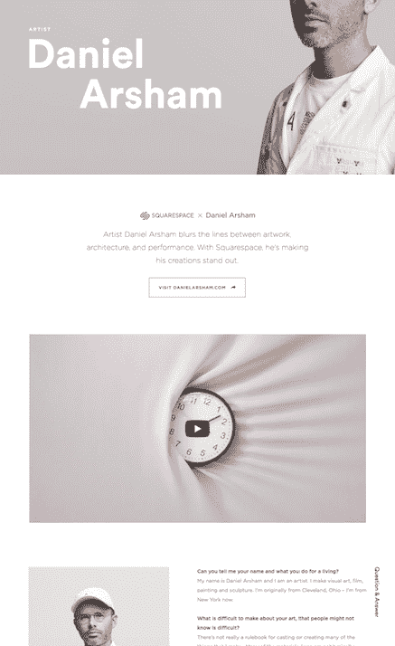**

**这些故事有助于将产品的价值带入生活——你看到真实的人在使用它并获得成功，这是每个访问者在购买前都希望看到的。**

# ****Q5:“你和 X 有什么不同？”**🤔**

**含义:不清楚为什么他们会选择你而不是竞争对手**

**如今，客户比以往拥有更多的选择。**

**对他们来说，这很好，但对初创公司来说，不断解释你如何或为什么与众多竞争对手不同可能是一个挑战。**

**如果“你有什么不同？”问题不断出现在你面前，这里有一些你可以考虑的选择:**

## **比较页面**

**帮助访问者了解你和类似产品的区别的最清楚的方法之一就是使用比较页面。**

**比较页面对有机发现也很有帮助，因为大多数顾客在购买前都会进行比较。**

**在比较购物阶段，客户在谷歌中键入类似“*[他们知道的产品]备选产品*”或“*[你的产品]对[其他产品]【T3]”的内容，这些都是你可以在比较页面上复制的短语(你会在[中注意到这一点，下面是对讲机](https://www.intercom.com/customer-support/zendesk-alternative)提供的示例):***

**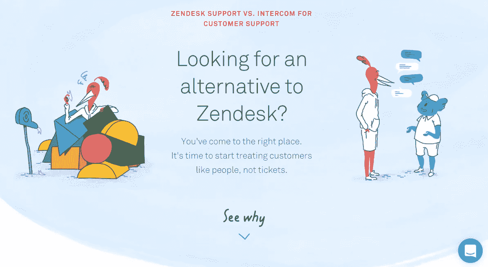**

**Comparison page: Intercom vs Zendesk**

**有了比较页面，你不仅增加了访问者自己找到他们想要的东西的可能性(通过有机搜索)，而且如果问题不断出现，你还有一个方便的链接页面。**

## **向您的网站添加常见问题部分或页面**

**FAQ 部分或页面可以适用于我们今天讨论的任何问题，但它也是解决有关竞争对手问题的好地方。**

**例如，如果你不断被问到，“你和 X 有什么不同？”在你的 FAQ 部分或页面中使用准确的语言，尽可能具体地回答问题。**

**只是为了好玩，这里有一个来自国税局的 FAQ 页面的例子(因为你知道他们可能比任何 SaaS 的初创公司收到更多的问题):**

**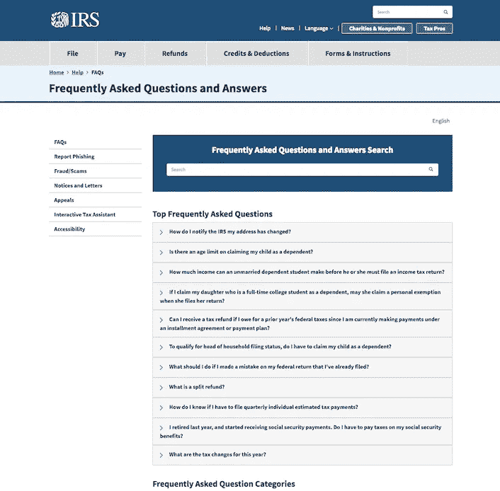**

**如果你还没有一个 FAQ 部分或页面，那么就从制作一个你最常问的问题的文档开始吧(或者开始使用 Intercom 按类别标记转换)。**

**一旦你有了 5-10 个(或更多)常见问题，用你自己的访问者使用的语言整理你的部分或页面。**

# **永远结束“21 个问题”的游戏**

**正如你所看到的，有很多方法可以“赢得”你和你的网站访问者之间的 21 个问题的游戏。**

**但是如果你被问到我们今天没有提到的问题，试着通过这三个简单的步骤，看看你是否能想出一个解决方案:**

**(1) **观察:**我反复被问到的前 5 个问题是什么？**

**(2) **翻译:**这些问题*到底是什么意思*？我的访问者想告诉我什么？**

**(3) **行动:**根据我现在的了解，有哪些潜在的解决方案可以帮助我的访问者获得他们想要的信息？**

**如果你在寻求帮助，请在下面的评论中留下你的具体情况，我会尽力为你指引正确的方向。**

**你觉得这篇文章有帮助吗？随意👏👏 👏**！****

****想取得联系？在下面评论或者直接联系我:annie1maguire@gmail.com。****

****

## **这篇文章发表在[《创业](https://medium.com/swlh)》上，这是 Medium 最大的创业刊物，有 293，189+人关注。**

## **订阅接收[我们的头条新闻](http://growthsupply.com/the-startup-newsletter/)。**

****