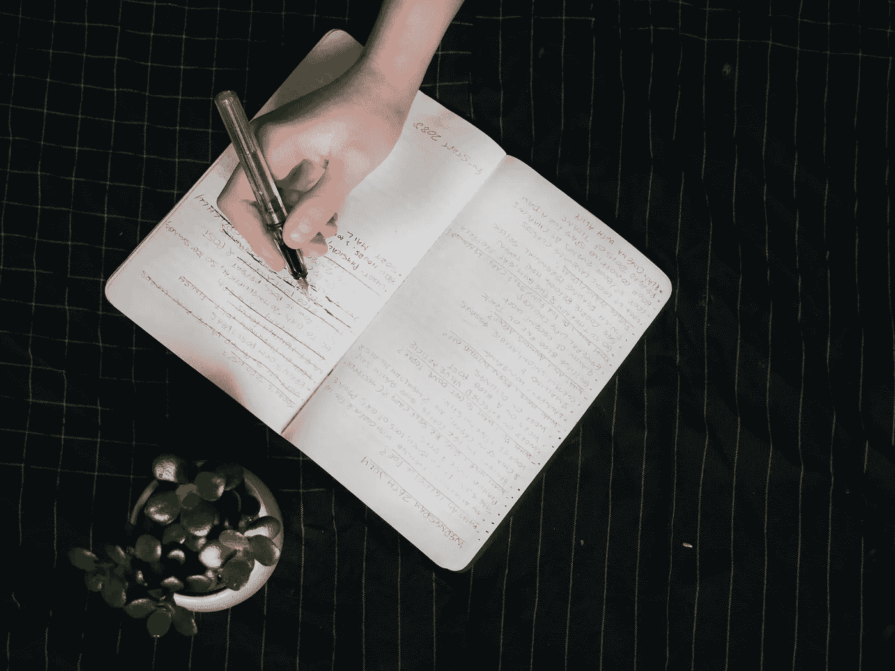
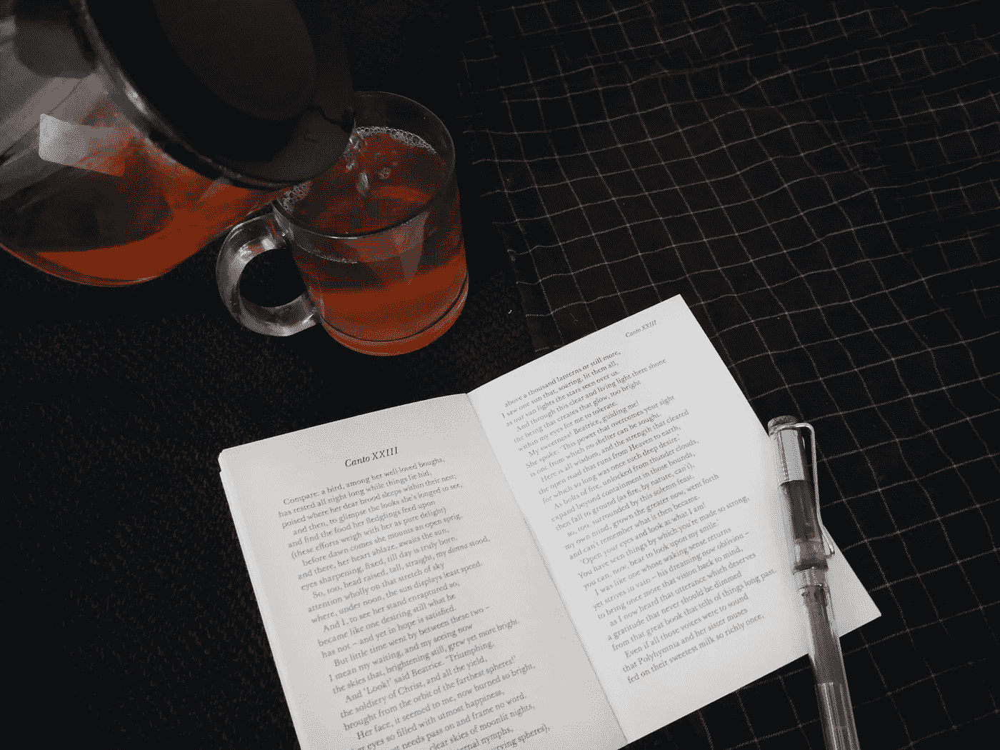

# 如果你不为你以前的工作感到尴尬，那你就做错了

> 原文：<https://medium.com/swlh/if-youre-not-embarrassed-by-your-old-work-you-re-doing-something-wrong-88102e31670a>

# 这是一个任何搞艺术的人无疑都熟悉的奇怪难题。

你创造了一个东西。一篇文章，一首歌，一幅画，一场秀，一本书，无论什么。你拼命工作来完成它。你花了几个小时打磨它。你全身心地投入其中。你让它接管你的生活，几天，几周，甚至几个月来消耗你的思想。

最后，你完成它并向世界发布。你以此为荣。也许其他人喜欢，也许他们不喜欢，但你很高兴你发货了。你欣赏自己的作品，然后继续下一件事。

然后一年后(或者半年后)你再看它。突然，好像没那么印象深刻了。其实看起来[有点坏](https://www.rosieleizrowice.com/blog/overwhelm)。

你检查它，挑剔本该不同的细节。发现现在显而易见的缺陷。也许你会对自己如此傲慢地发布它感到震惊。

如果有人提出来，即使他们喜欢，你也开始找借口。你夸大你多久前做的，或者声称你当时喝醉了或者正在经历一个奇怪的时期。也许你甚至不记得你为什么做它，或者它的意义是什么。你回去编辑它，甚至删除它。

所以你做你最近的事情，经历同样的过程。新事物是完美的，你超级自豪。你永远不会为此感到尴尬。你已经从以前的错误中吸取了教训，现在你长大了，也更聪明了。

然后同样的事情发生了。在很短的时间内，你会对下一件作品感到尴尬。这个过程不断重复。

我以前说过很多次了，现在我再说一遍:[创造力让你变得脆弱。](https://www.rosieleizrowice.com/blog/creativityisvulnerability)你实际上是在向世界展示你自己的一部分。不管是什么，里面有很多你。随着你的改变，工作保持不变。它仍然与你过去的样子联系在一起，[过去的自己](https://www.rosieleizrowice.com/blog/burnyourships)，现在已经过去很久了。

我从 13 岁开始写博客。从五岁开始，我就在笔记本上写满了故事和想法。然而，只有网络侦探才能找到我两年多前的作品，原因很简单。我最终删除了 99%的内容。我为出版物写的东西 99%都是笔名

同样，我也没有任何四年多前写满的笔记本。出于尴尬，我把剩下的撕碎或者烧掉了。

虽然我后悔毁了这么多我的旧作品，但对你以前的作品感到尴尬是一个好迹象。这表明你已经走了多远，你学到了什么，你如何改进。如果一年前的工作没有让你退缩一点点，这是一个不好的迹象。

我们无法达到完美的顶峰。

我们的工作没有一点不能变得更好，我们不再畏缩于以前的作品。

这是一个无止境的向上跋涉，一点一点地提高，一年比一年好。

芝诺的悖论很吸引人，虽然它们大多与运动有关，但可以有几种解释。《一粒小米的悖论》指出，一粒落下的小米不会发出可辨别的声音，然而一整蒲式耳却能发出清晰的声音。

我们的工作也是如此。日复一日，随着我们运送的每一件东西，每一粒落下的谷物，没有太大的变化。

然而，当我们回顾过去六个月或一年时，这种变化似乎很明显。

*附言:如果你想让我的帖子每月发送一次到你的邮箱，在这里* *注册* [。](https://rosieleizrowice.substack.com/welcome)