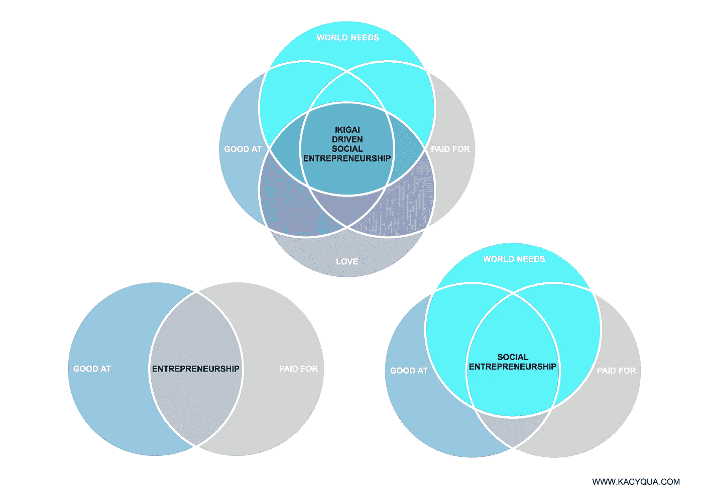
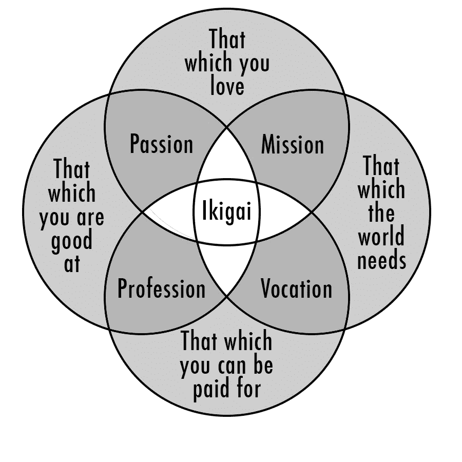
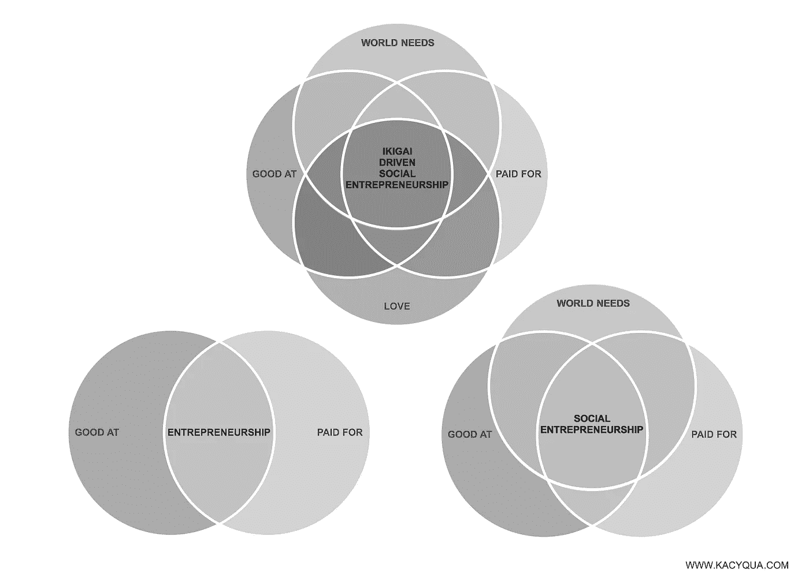

# 企业家的 Ikigai

> 原文：<https://medium.com/swlh/ikigai-for-entrepreneurs-b100f6a00650>

**What if the rising generation of entrepreneurs were equipped with a personal compass that helped them translate individual purpose and professional skills into social impact, while also making a profit?**

## 成功不仅仅是金钱。

抛开摇滚明星、运动员和一线演员，这一季我们有了一个新的偶像:企业家。他们中也有一个非常特殊的品牌——不是自举者或小企业建设者，而是拥有数百万美元首轮融资的独角兽。知名投资者。十亿美元的估值。我们赞美创业生活，相信这样的宣传:

*   筹集大量投资资金预示着成功
*   被收购或上市是最好的结果
*   成功主要取决于你的技术技能和经验
*   如果你跟随其他企业家的脚步，你的公司将会成功
*   你必须在赚钱和创造意义之间做出选择
*   影响世界的最佳方式是成为创始人或首席执行官

当然，有时候这些是真的。但和大多数职业一样，你可以问问自己是否愿意接受这个角色更有可能出现的负面影响，而不是去想象这种不太可能实现的理想场景是什么感觉。就创业而言，这包括令人不安的高失败几率、财务不确定性、难以置信的艰难决定(影响他人的生活)、频繁的孤立、意想不到的孤独以及漫长的吃力不讨好的工作时间。虽然 Benajmins 可能是最容易衡量成功的指标，但我们依赖的创业指标往往会产生误导。估值一点也不精确。筹集的投资是一种债务——你拿得越多，你对自己企业的控制就越少。如果你真的成功实现了你的财务目标，你可能会获得一份工作，在那种你想成为企业家而不想去的公司呆上几年。好玩！

承诺“创业成功的十大关键”的无休止的列表将创业视为一门科学——一种可以复制的活动、环境和过程的公式，提供标准的结果。但是，尽管了解企业的基本面是必要的，但这还不够。创业要素清单忽略了创业的本质。他们把它当作一个可以被淘汰的班级，而不是一个不断变化和不可预测的动态环境。就像答案是黑白的，而不是五十度灰。就好像企业的成功可以在真空中发生，与创始人无关(而实际上，它更像一个未出生的孩子，其健康与其母亲的健康直接相关)。

# 我们不重视难以量化的因素，如动力、激情和动机。我们同样低估了以高于巨大回报的愿景经营企业所能带来的不可思议的意义、目的和影响。但是，如果年轻一代的企业家配备了一个个人指南针，帮助他们将个人目标和专业技能转化为社会影响，同时还能获得利润，那会怎么样呢？

我们如何为等式中添加新的(难以测量和量化的)参数提供业务案例？当成功对每个企业都有不同的意义时，会发生什么？实现它需要的不仅仅是钱？

**创业的 Ikigai**

在创业中，个人和职业之间的联系比其他就业场景更加紧密。在你对你的*职业*强项、弱项、才能、价值观和激情(或你的创业公司)做出诚实的评估之前，你应该考虑你的*个人*强项、弱项、才能、价值观和激情。就像我们看待企业的战略、使命、愿景、核心能力和竞争优势一样，我们也可以看待企业家的差异化、目标、能力、激情、经营方法和人生经历。对你来说什么最重要？你愿意为什么而战？你能提供什么别人不能提供的独特东西？你天生理解什么？你不擅长什么？

*(The image above has been recreated a lot, so I’m unsure who to give photo credit to — happy to do so, though)*

***一个古老东方概念的现代西方诠释——iki Gai***

日语中的 Ikigai (大致翻译为“存在的理由”)的概念再次流行。你可能见过上面的图片，一个你擅长什么，你热爱什么，你能得到什么报酬，以及这个世界需要什么的重叠图。它被用作建立更有意义的生活的工具，特别是通过有意义的工作。如果我们从四个 Ikigai 要素的角度来思考创业，它一直专注于你能得到什么报酬和你擅长什么。然后[社会企业家](https://www.ashoka.org/en/focus/social-entrepreneurship)出现了，我们增加了第三个元素——世界需要什么。当然，许多创始人是从他们的爱好或激情开始创业的，但这从来都不是先决条件。但如果是呢？

*Moving from Entrepreneurship to Social Entrepreneurship to Ikigai Driven Social Entrepreneurship*

# 如果下一代社会企业家建立了与他们个人的 Ikigai 紧密相连的企业会怎样？如果创业的范式发生了转变，每一项业务都是我们可以获得报酬的东西、我们擅长的东西、世界需要的东西和我们热爱的东西的组合，那会怎样？

(*需要明确的是，当我谈论我们热爱的东西时，我不仅仅指激情和爱好。我指的是我们愿意为之奋斗的事情，我们足够关心去解决的问题，对我们来说最重要的事情。)*

虽然四个 Ikigai 元素没有完美的等式(取决于你当时的优先事项，你可能不得不牺牲一个元素的一部分，以允许更多的另一个元素)，但它们可以用作指南针，使事情达到平衡。缺失的并不总是“世界需要什么”。当我创办我的第一家企业 Qualifyor 时，我希望改变人们准备工作和思考工作的方式，为年轻人提供资源，让他们走出标准的大学，走上职业道路。我的自我意识让我相信，推动重大变革的最佳(唯一)方式是成为一家风险投资公司的创始人兼首席执行官。在经营这家企业近三年后，我感受到了试图平衡利润和社会影响的艰难(用 Ikigai 的话来说，*我能得到的报酬与世界需要的东西*)。更不用说意识到虽然愿景是合适的，但角色并不是(*我喜欢的和我擅长的*)。尽管我尽了最大努力去破坏，但我基本上重建了一所学校——其他人可能天生比我做得更好、更开心，因为我 16 岁就离开了学校，自学获得了早期文凭。我的角色完全浪费了我独一无二的部分，那些只有我才能展现的东西。因此，当我思考我的下一步行动时，我专注于我的 Ikigai，(以下是我发现的一些事情):

*   *擅长*:设计思维、写作、解决问题、第一原理推理
*   *付费*:教育/就业创新、促进、辅导、演讲
*   *爱:*自组织，大创意，挑战现有系统，阅读
*   *世界需求:*关于我们如何以及为什么工作和学习的更新心态，解决世界最大挑战的企业家，为社会公益创造事物的财务激励，自我组织工具

有了这种意识，我开始了一个与我的 Ikigai 一致的创新咨询公司，通过使用第一原理推理和设计思维来帮助改变我们看待世界的方式，从而推动我们的系统、公司、大学和城市发生更多的变化。说起来比“ *Ed Tech CEO* ”要花的时间要长得多，但这些是世界上的棘手问题，我有能力、有动力、也有报酬去解决它们。这是我解决这些问题的最佳方法。

成为一名企业家可以有许多不同的形式，所以在你决定开始某件事之前，花一分钟确定你最适合开始的事情是值得的。因为与众不同不是因为从众，而是因为拥抱个性。经营一家你特别适合的企业是有竞争优势的。不仅仅是你的工作经验，还包括你的兴趣、技能、关系、知识、动力以及你想要留下的遗产。如果我们想最大限度地为他人服务，我们应该把大部分时间花在我们关心的事情上，不管我们是否有报酬，这些事情对我们来说是自然而然的(当然很少只有 T1 必须做我们擅长和喜欢的事情，但这些应该是我们时间馅饼中更大的一块)。

想想你经历过的最有影响力的时刻和事件，以及它们教会了你什么。他们给你灌输了什么？这些不仅仅是面试的话题，而是你性格和动力的基本方面。对于一些人来说，这可能是一种直接的影响——你爱的人被枪击，所以你成为了枪支管制的倡导者，或者你是由单身母亲抚养大的，现在想为像你这样的家庭争取更好的社会政策，或者也许你承受了学生贷款的负担，现在为一家替代教育公司工作。对于其他人来说，这是一种更抽象的联系。你用漫画书和伟大的音乐逃脱了欺凌，你想支持创意产业。或者你看着一个朋友与癌症作斗争，这激励你充分利用你的健康。

当 sh*t 真的硬起来的时候，迭代、适应、渡过难关，需要的不仅仅是钱。在一场大多数跑步者都没有冲过终点线的比赛中，为比你自己更重要的事情服务是有帮助的，这是你非常关心的事情，也是你特别有能力去完成的事情。是时候停止将利润和影响力视为创业光谱的对立面了——它们是密不可分的。我们越早停止强迫企业家在两者之间做出选择，我们就能越快将范式转向赚钱更多的企业(并通过这样做赚更多的钱)。

## 这篇文章发表在[《创业](https://medium.com/swlh)》上，这是 Medium 最大的创业刊物，有+368，052 人关注。

## 订阅接收[我们的头条新闻](http://growthsupply.com/the-startup-newsletter/)。

