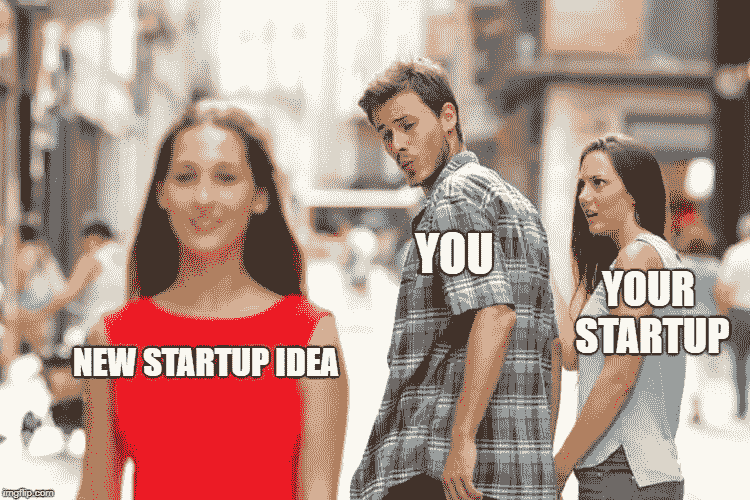

# 我担心你的创业成瘾，以及它是如何扼杀你的梦想的

> 原文：<https://medium.com/swlh/im-concerned-about-your-startup-addiction-and-how-it-kills-your-dreams-87d0c6b5d57f>

Looks familiar?

*我最初在 2017 年 5 月写了这篇文章，但当时没有发表。*

*我找到了草稿，看得很开心，因为我清楚地知道，在我做了我邀请你做的事情之后，我们公司发展了多少。*

*我很高兴现在与你分享，我希望它能激励你克服创业成瘾，进入下一个阶段。*

当你想到在周六凌晨 3 点建造“宠物的优步”或“视频游戏的 Airbnb”时，你知道那种感觉吗？

你有没有因为偶然想到这样一个革命性的概念而感到兴奋？你内心深处认为这个想法会改变你的生活？

好吧，如果你有这些想法已经有一段时间了，你可能已经感觉到，作为一名企业家或产品经理，你在很长一段时间里获得了一种超能力:直觉。

从设计和开发到销售和营销，随着你在有助于产品成功的不同领域积累经验，你开始发展你的直觉，当你走在正确的道路上时，你能从内心感受到这一点。

随着时间的推移，它变得更加有效。你学会过滤掉起初看起来很棒的想法，但是睡了一夜好觉之后就不那么棒了。随着想法和策略争夺你的注意力，你一次又一次地执行和失败，你变得更有选择性，但也更相信自己的直觉。

当——越来越少——一个想法真的对你说出来，你感到胃里刺痛，说“神圣的 SHI，就是它！”兴奋之情油然而生，你只需要执行它。

嗯，我已经做了 10 年了，我还没有看到我的脸出现在福布斯的封面上。

在那段时间里，我为客户建立了 60 多个项目，经营着一个小型的网络开发机构。从 19 岁到 27 岁，我还创办了八个完整的副业——微型创业公司，它们完成了自己的使命。

每次我开始一个新产品，都是因为我的直觉告诉我“这将会成功”，这给了我灵感。

每次我跟随它，它不仅奖励我学习新事物的机会，而且奖励我一次真正令人兴奋的跌宕起伏的旅程，这与赌博成瘾的人的感觉一定没有太大的不同。

心理学家广泛研究了随机奖励会让你被迫重复某个行为，希望下一次你会得到大回报。这一招常用于我们日常使用的大多数应用程序中，让我们沉迷于。

事实证明，我刚刚了解到这与催产素有关。

当你在做一些你认为在不久的将来会有很大机会的事情时(比如当你为了升职而加班时)和当你在做一些现在很好的事情时(比如你已经有了一份薪水很高的工作)，你的大脑会产生不同的荷尔蒙。

我们把第一个叫做兴奋阶段，第二个叫做回报阶段。

另一方面，当你什么都没有的时候——这意味着它既不会给你带来好的回报，也不会让你对你正在建立的东西感到兴奋——它感觉起来就像是工作。无聊，无聊，毫无意义。

我从开发新产品和跟踪想法、进行市场验证和首次销售、建立 MVP 和看到观众人数增长到第一个千人的过程中获得的激情来自于我们的大脑给予我们努力的回报。

正如《习惯的力量》一书的作者所言，这和上瘾没什么区别。

Charles Duhigg explains how habits (and addiction) is formed

# 生意不是赌博

不幸的是，因为我们被一夜成功的虚构故事轰炸，我们创业的方式就像赌博一样。

我们被告知，你应该验证市场并快速失败，这样如果这个失败了，你就可以尽快开始下一个想法。

不用说，那会让你失败。

人们称之为创业公司，因为他们不认为这是传统业务。这让你对创业需要付出多少努力产生了误解。

人们会试图在没有产品或更重要的是没有观众的情况下，通过 power point 演示来筹集资金，如果他们不能打动投资者，3 个月前就会放弃。他们会拼凑出一个原型，并在第一眼看到缓慢采用时就把它扔进垃圾桶。

然而，与赌博不同的是，如果你投入时间和精力，做生意总有机会赢。如果你真的投资它，倾听你的客户，改进你的产品，并有足够的时间，几乎任何想法都可以变成一个真正的，有利可图的生意。

Micro Speed, Macro Patience

这意味着，如果你坚持不懈，你的初创企业将会达到这样一个阶段:它已经经历了第一个兴奋阶段，但还没有进入回报阶段。

在这一点上，你的能量突然开始消失。你赚的不是真钱。你没有资源来应对下一个利益挑战，比如招聘和扩张。当你接近一个新客户时，不再像前几次那样感觉是一个惊人的成就。

> 在兴奋和回报之间的中间地带，你将不得不面对你的创业瘾。

当我到达那一点时，我开始寻找一些我想改变的东西，让事情变得新鲜。一个支点，一个新的客户档案，一个副产品。有时一个新的副业会一起出现。

不幸的是，这阻碍了我做唯一一件能让我的业务进入下一阶段的事情:加倍努力工作，管理和构建流程。

我的创业公司[proposive](https://proposeful.com/)，处于那个阶段大概六个月。

我们有客户，但不是成千上万的。我们有收入，但不足以推动我们的增长。我们有一个很好的销售漏斗，提供很大的支持，可以看到我们的工作如何帮助我们的客户完成更多的销售，但在这一点上，这既不像是挑战，也不像是奖励。感觉是工作。

这让我花了很多时间寻找一种方法，一种新的想法，我可以测试并突然让我们达到 6 位数的 MRR。几乎每周我们都尝试不同的东西。在某种程度上，这很有效。但我们只是在追自己的尾巴。它让我们在几个月内保持小规模。

> 我们唯一真正需要的是加倍努力。
> 
> 在内心深处，我知道。如果你有同样的情况，你也知道。

所以这个月我要对古老的催产素说不。我将经营我们的公司，完善我们的活动，取悦顾客，就像我们到目前为止做得这么好一样。我不会寻找“成长秘诀”或被一个闪亮的新想法转移话题。

我会投入我们公司进入下一阶段，迎接更大挑战所需的时间。

如果你的感觉和我一样，就像你总是停留在第二档，我邀请你加入我。试着加倍努力工作。投资于你表现最好的香奈儿，而不是实验性的。致电更多销售线索，而不是审查您的定价结构。提高你的转化率，而不是建立一个新的漏斗。

毕竟，从 A 到 B 最快的方法是走直线，而不是像疯子一样曲折前进。

*嘿，又是我送的礼物！我确实做到了我所说的——我加倍努力，对干扰说不，投入工作。*

*现在，一年多过去了，我可以说我是对的。那个时刻对我们来说至关重要，我们现在规模更大了，在那段时间里，我们的用户从大约 800 人增加到接近 10，000 人。*

*现在，在我们的初创公司工作又一次充满了挑战和回报，我很高兴我克服了尝试新事物的瘾，让我们走到了这一步。*

我希望这个故事也能帮助你。我很想在评论中听到你的想法。此外，留下一个赞，如果你喜欢这个，它会让我知道我应该写更多关于我们在创业过程中吸取的教训。感谢阅读！

## 这篇文章发表在 [The Startup](https://medium.com/swlh) 上，这是 Medium 最大的创业刊物，拥有+365，945 名读者。

## 在此订阅接收[我们的头条新闻](http://growthsupply.com/the-startup-newsletter/)。

