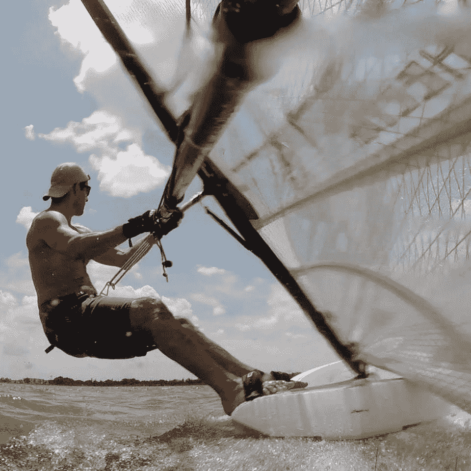

# 我很尴尬我花了一辈子才明白这一点

> 原文：<https://medium.com/swlh/im-embarrassed-it-took-my-entire-life-to-figure-this-out-ab5165665ae>

## 成功的关键显而易见，但我没有看到

my photo, but not of me!

我已经绕着太阳转了 52 圈了，误差不超过几度。

我不想做数学，我在度假🌞

这个假期我终于要成为一名风帆冲浪运动员了。

从 16 岁到现在，我一生中已经玩过 6 次帆板。

齿轮对我来说总是太大，所以我得到了**超功率**，沮丧和放弃。

现在我有了我所谓的“婴儿装备”。大小完全适合我的**，我在这里的每一天都会用它。**

**我已经有了一个良好的第一天跟踪和 jibing。**

# **这启发了我去回顾我生命中的其他时候，当我努力获得任何成功的时候。**

**在我之前，有多少次我以其他成功人士为榜样？那些让它看起来简单的人。**

**我做了他们所做的…我说了我的主张…我摒弃了限制性的想法…我超越了理性…**

**有多少次我做了所有这些事情，仍然对结果感到失望？**

**我最近的风帆冲浪经历终于揭示了一些看起来如此基础的东西，我不好意思承认我花了一生的时间才看到它。**

# **如果你过去没有成功过，也许你需要用一种独特的方式去实现它。**

**我在尝试其他人的策略，并为他们的成就而自豪，但一直以来我的装备对我来说都太大了。**

**当然，我们可以从导师和大师那里学到很多东西，我仍然主张向专家学习。**

**但是要愿意**认识到**你通往成功的道路必须由**你自己**打造。**

# **也许你需要不同尺寸的装备。**

**换句话说，也许千篇一律不是你的菜，有另一种方式去实现你的目标。**

**当我经营按摩诊所的时候，我是一个单身妈妈。**

**所有的商业教练都告诉我，我必须以一种特定的方式经营我的业务。**

**他们的妻子留在家里抚养孩子。他们从未因为孩子发烧而取消一天的预约。**

**换句话说，他们的装备不适合我。**

**所以我用不同的方式做事。我成功了，而且成功了。**

> **“铺好自己的路，无所畏惧。”—亚当·德雷珀**

# **如果你已经一次又一次地尽了最大的努力，但却没有如你所愿，把这些想法扔进垃圾桶，用新的方法去做。**

**对你的处境、技能和能力做一个诚实的评估。**

**我不是说低估自己，因为障碍肯定是可以克服的。**

**只是采取一种诚实的、**非判断性的**看情况。**

**我永远也不会有 22 岁男人那样 6 英尺 2 英寸的上半身力量。**

**但是我可以选择最适合我的尺寸的装备，并且在那里享受同样多的乐趣，这就是成功。**

**一如既往的祝你一切顺利！**

*****我做了一个掌握幸福的 5 天指南，免费送给你！*** [***点击此处免费获取指南！***](https://pages.convertkit.com/91317c2826/fed3710297)**

****

## **这篇文章发表在 [The Startup](https://medium.com/swlh) 上，这是 Medium 最大的创业刊物，拥有 340，876+的读者。**

## **在此订阅接收[我们的头条新闻](http://growthsupply.com/the-startup-newsletter/)。**

****