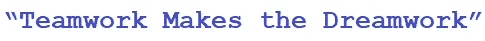
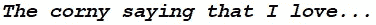
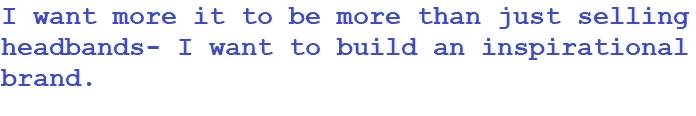

# 我要和我的姐妹们一起重新推出我的品牌

> 原文：<https://medium.com/swlh/im-relaunching-my-brand-with-my-sisters-d18c83371b42>

## 我已经让我们进了 Instagram 监狱

今天，我和我的两个姐姐开了一个会。

这可能是自[重启我们公司](https://www.aleeshalauray.com/the-last-piece-to-the-puzzle/)以来的第六次了。

现在似乎一切都进展缓慢，但我知道有时候我需要做乌龟而不是兔子。🐢🐇

最初几周，我在 Instagram 账户上不关注任何人。看起来没什么大不了的，但我们跟踪了很多人，超过 7000 人。

我们同意每天各做 200 次，有一天我决定挑战极限，做更多。我只想快点开始我们的倒计时。

不幸的是，我把我们弄进了 Instagram 监狱，我们被禁止追踪 3 天。

我的姐妹们没有强迫我，但我知道她们内心肯定是这样的，

> "伙计，冷静点。"

我太鲁莽了，我必须道歉。

我承认，有时需要后退一步，放慢速度时，我肯定会变得不耐烦，全力以赴。

许多人听说过 follow for a follow，它确实有效。

2016 年我第二次重新提升业务，这就是我们所做的。

我们半积极地追随我们的一个竞争对手的追随者。他们出售不同风格的发带，并且拥有大量粉丝(大约 18 万)。他们的追随者已经对我们的产品开放，并会跟随我们的页面，立即购买头带。

除此之外，我们每周都发放免费产品，因此我们的参与度很高。

> 问题是我不喜欢这种方法。感觉不太对劲。

虽然没有人说什么，但随着我们的追随者不断增加，我们关注的人数每隔几周就从 5000 人增加到 0 人，我们在做什么是显而易见的。

我知道这是一种常用的做法，但我想尝试一些不同的东西。

我们将尝试一个我从加里·范耶尔查克那里学到的策略。

*几周后，当我们的新发带到来，我们开始实施这一战略时，我会详细介绍这一点。*

我们团队的一名成员休息了几天，我们不得不召集一个小小的激励聚会。

> 当你不在传统的工作环境中时，没有人会盯着你。

*一切都是自我驱动的。*

尽管我和我的姐妹们不得不相互问责，但每个人都必须单独确保履行自己的职责。

有时候这需要一些时间来适应。

尤其是当你习惯于做传统的工作时,。

当周末有薪水时，很容易被驱使去完成工作。

当没有薪水，有很多工作要做时，就必须有其他的动力。

对于一个妹妹来说，这次旅行是一次庆祝旅行，一旦我们达到了某个目标。

另一方面，我们仍在研究驱动因素。

对我来说，我只想能够从我的远程工作中解脱出来，和我的孩子一起环游世界。

*好吧，首先，发带只是个开始。*

我们肯定想进入服装和其他项目，但我们不能超越自己。

> *耐心，对吗？*

之前对公司失去激情的另一个原因是缺乏明确的使命。我知道我想让它不仅仅是一个可爱产品的金钱交换。

我想提供一些令人兴奋和激励的东西。

我很难将销售发带融入到一个鼓舞人心的品牌中。

我们把各种各样的东西扔在墙上，试图创造这种品牌信息，但有时它不太管用。

One of our previous guest singers-her voice is great!

有一段时间，我们在做音乐剧《周一》,让歌手戴着发带唱歌。歌手很棒，那些视频也有一些浏览量，但是不太合适。

因此，我们现在最优先考虑的事情之一就是为我们的公司创造一个统一的使命和故事。

我还没完全搞清楚那部分。我有一个想法，但它需要我更专注于我创建的内容类型。

上周，我和布莱恩·托拜厄斯聊天，他是 YouTube 上的一个生活方式视频博主。我在讨论我最初是如何从没有利基开始的，因为我不想再找借口，只想开始。

他解释说，当他的内容从食物到创业再到健身时，这让他的观众有点困惑，结果他的观点下降了。

现在他只是专注于创业，他的 YouTube 频道做得更好。

我完全明白他在说什么，利基*比*更强大。

我的播客对我来说很容易就能融入到灵感的利基中。但是我知道我是如何写作的，它会尝试反抗这个利基计划。

目前我不会强调这一点。

有很多步骤，但有趣的部分是把所有的拼图拼在一起。

## 感谢你阅读❤

*第 110 节*

## 这篇文章发表在 [The Startup](https://medium.com/swlh) 上，这是 Medium 最大的创业刊物，有 319，931+人关注。

## 在这里订阅接收[我们的头条新闻](http://growthsupply.com/the-startup-newsletter/)。

