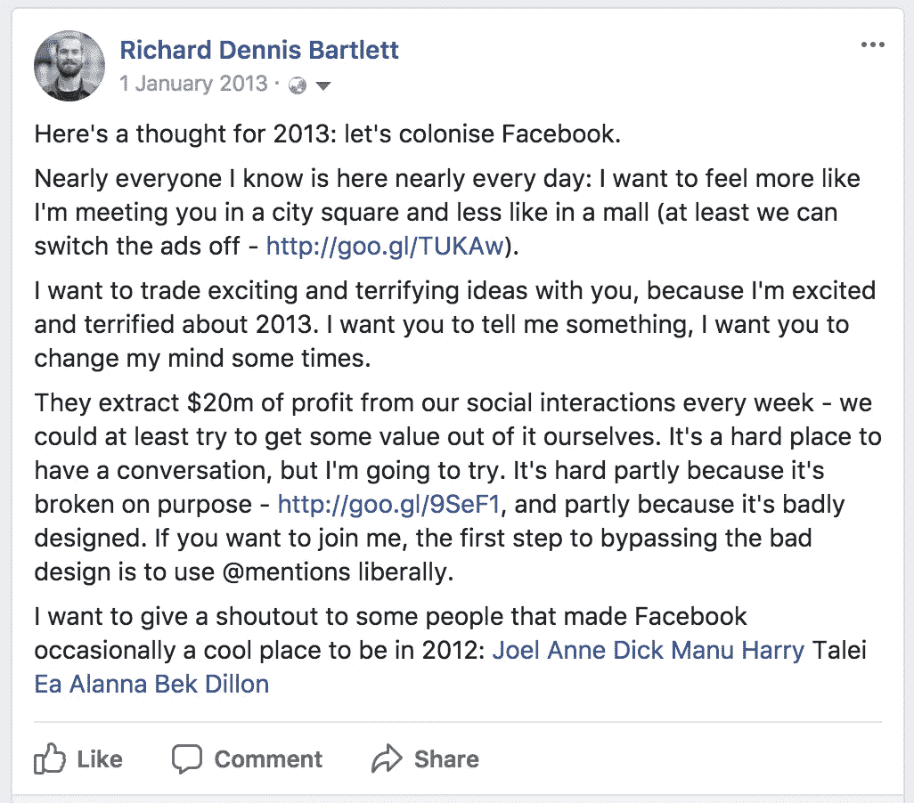

# 我讨厌脸书

> 原文：<https://medium.com/swlh/im-sick-of-facebook-8e7c7fa03b0a>

## …我找到了更好的地方

5 年前，我表示我打算把脸书当作一个公共广场，抵制平台的商业和肤浅，开辟倾听和分享的空间。

我开始后悔了。

以下是我在 2013 年的今天发的帖子:

在我的蓝色大网的小角落里，我一直在努力为社会创造空间，但现在我觉得我正在促成最反社会的行为。我在给一台失控的机器喂食。

有人检查了我的数学，但我认为他们现在的利润是 2013 年的 25 倍:每周净收入超过 3 亿美元。它们坐拥现代资本主义中最难以置信的宝贵资源:数十亿人的综合个人数据积累。他们正在为我们每个人构建分辨率极高的心理地图。他们把这些地图卖给专门操纵人群的公司，这些公司通过对无数个人的深入了解和可靠的即时访问来操纵人群。

> 脸书出售广告的收入模式只是出售选票的热身。

尽管马克·扎克伯格声称，他们无法阻止这种操纵。只要存在大规模的个人数据集中存储，以及允许其作为商品进行交易的收入模式，我们就会受到任何形式的创新宣传的攻击。这项创新是由具有利润动机的人工智能推动的，以指数级增长的数据集为基础。

我感到愤怒，但这不仅仅是因为脸书对赞助内容的超级定位旨在触发我最基本的本能。喜欢的流行让我觉得我正在接受购买选票的训练:我感到被鼓励去发表能赢得我支持的东西。我们正在规范一种针对病毒式传播而非意义优化的公共话语形式。通知徽章上的多巴胺比我见过的任何物质都更容易上瘾。

我在这里，周游世界，会见最不可思议的人，收集非裔美国人的故事和见解，老人，妇女，精神领袖，土著人，前线活动家和他们的盟友，人们园艺裂缝，建立一个超越父权制和殖民主义的社会。我把这些故事打包成同样大小的包，等待你的点击、分享、关注和叮！丁！丁！多巴胺就像花蜜或尼古丁一样源源不断。清！清！那一小撮富有的白人不断赚钱，不断与我们其他人疏远，疏远到你可以开始明白为什么他们认为离开并殖民太阳系是个好主意，让我们中的绝大多数人留下来收拾他们的烂摊子。

所以今年我在寻找一种新的方式。我不认为我能彻底退出:我的生活依赖于我的通讯录，不幸的是，目前通讯录被扣为人质，只有政府特工和公关人员可以使用，而不是我。但我在寻找停止喂野兽的方法。至少就目前而言，我的首要任务是写书(如果你想早点来，请在 patreon 上支持我)和接待访客(如果你想留下来，请给我写信)。

当我需要向一个社交网络发布内容时，我会将刚刚起步的社区放在[小道消息](http://scuttlebutt.nz)之上。这是一种实验性的新分散技术，用于社交网络中的分享。这是我所知道的唯一一个重视可访问性、关心安全性的分散式技术社区。它肯定仍然是一个早期采用者的地方，但不是每个人都适合，但当你努力探索时，你可以指望受到热烈欢迎。大部分是技术人员，他们大多是男性，但他们大多是那种真正关心他人的人，他们不需要被说服需要多样性和包容性。他们在为你建造这个空间，他们也会帮助你建造它。

因此，如果你喜欢冒险，正在寻找一个更好的地方和你的朋友们一起闲逛，或者你想体验一下网络是什么样子的，那时人们只是通过共同的兴趣来联系，来探索一下流言蜚语吧。我完全理解你们中的大多数人还不会努力，这很好。这个软件发展很快:当你期待一个社交网络工具的功能和易用性时，我会让你知道。不过，与此同时，你可以指望在纽约少见到我。如果你想赶上❤️，就来我家吧

## 当你不是工程师的时候来八卦

**更新——1 月 3 日:**人们一直在寻求一个“非技术性”的小道消息介绍。

作为一个社区，我们正在努力提供可访问的资源，以支持人们进入社区。但是在一定程度上，你必须了解一些使用它的技术细节，或者了解为什么它值得使用。该架构不会对用户隐藏，当您探索感兴趣的内容时，我们会邀请您学习一些关于交付机制的知识。

流言蜚语是一种与你在网上遇到的任何东西都完全不同的技术。没有中心枢纽，只有同行。

流言蜚语是一种协议，一种传递信息的方式，更像短信或 IP，而不像脸书的 Twitter。与其说是车，不如说是路。

全名是安全消息灵通人士(SSB ),因为这些消息是用密码保护的:只有预定的接收者才能阅读它们。

因为没有中央枢纽，消息就像闲话一样传递，或者像教室里的纸笔记一样:从朋友到朋友。没有列出所有参与者的电话簿，所以第一次联系某人时，你只能问你的朋友“你认识这个人吗？”或者“你有朋友认识这个人吗？”

为了使这更容易，我们连接到“酒吧”。SSB 上的酒吧就像街上的酒吧一样:它是一个见朋友和交流八卦的地方。因为许多人聚集在每个酒吧，这是一个认识新朋友的好地方，它使你更容易扩展你的社交网络，不仅仅是你的兄弟姐妹、同事和俱乐部成员。

记得我说过它像一条路，不是一辆车吗？这是一条没有警察的路，所以任何人都可以做任何他们想做的事。任何人都可以在“小道消息”上发布任何类型的消息，比如一篇博客帖子、一笔金融交易、一步棋或者 3d 打印机制造枪支的指令。人们正在制造不同种类的汽车在这条新路上行驶。目前，最受新司机欢迎的汽车是一款名为 Patchwork 的应用程序。拼凑只关注网络中的某几类消息。它显示了一个与脸书或 Twitter 非常相似的 feed:有帖子、评论、喜欢、朋友、关注者、标签等等。

请记住，没有电话簿，没有公民登记册，所以如果你安装了 Patchwork，你需要去一家酒吧，我的朋友有时去那里，如果你想找到我。The One Butt pub 是一个很好的起点:要“@ 3r 4+iy b5 NV L2 in 6 qozhiu 9 osr zud+nuvgl 2g x3 x2 WG 8 = . ed 25519”。当我们连接时，你可能会想给我一个昵称，因为那很难记住。我会建议“迪克”或“里奇”，但这取决于你。因为这里没有警察，没有登记处，没有中心枢纽，这使得一切都与你在其他地方遇到的人有所不同。

## 这个故事发表在 [The Startup](https://medium.com/swlh) 上，这是 Medium 最大的企业家出版物，拥有 282，454+人。

## 订阅接收[我们的头条](http://growthsupply.com/the-startup-newsletter/)。

