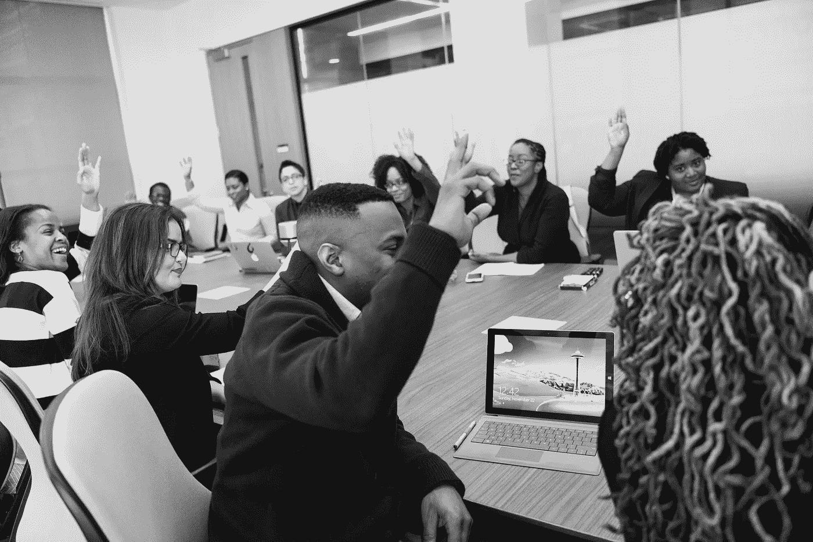

# 我是经理，不是接待员

> 原文：<https://medium.com/swlh/im-the-manager-not-the-receptionist-ce7ce2fbc99f>

Photo: [WOCinTech](https://www.flickr.com/photos/wocintechchat/page2/)

有三个男人，一个接待处，四把椅子，一张桌子和一个大房间隔板站在我和快递员之间。他走过接待处，走过椅子和桌子，走过挡住他去路的三个人，直接站在我面前，宣布“我需要接待员签收这个”。

我目前也在招聘新的团队成员。我筛选简历，选择我想面试的人。按照惯例，首席执行官会列席面试，但我对聘用谁有最终决定权。我参加过的许多面试中，候选人会越过我说话，直接回答我向首席执行官提出的问题，并且在离开时不与我握手，这令人震惊。有，我面前有个记事本，记笔记；不，这并不意味着我是秘书。就在上周，我连续面试了五名男性。在这五个人中，只有一个人在回答我提出的面试问题时与我进行了长时间的目光接触。五个人中有三个只和 CEO 握过手。

当他们在事后发现他们在等待我的决定时，我怀疑他们有点像《实习医生格勒姆》中的格雷厄姆，当他意识到“耳机”是谷歌搜索的头时。

## **不要再假设女人不能掌权。**

接待员通常在企业中扮演着重要的角色；他们是当人们走进办公室时迎接他们的笑脸，他们是电话另一端乐于助人的声音，他们通常是在没有人能帮助你时能帮助你的人。

但是，我不是接待员。我是一家快速发展的法律初创公司的高级项目经理。我给首席执行官提建议，并花大量时间致力于公司的战略增长。我怀疑是我的性别导致快递员向我走来，这让我意识到默认的立场是女人是站在男人面前的笑脸，或者任何操作的大脑。

我敏锐地意识到女性在商业中仍然面临的困难。虽然与我之前的坚强勇敢的女性相比，我的抱怨是微不足道的，但它们仍然存在。我的收入仍然是这个人收入的 77 %,大部分国内关税将属于我的领域。当我们有了孩子，我的伴侣将获得有限的陪产假，当他帮忙洗衣服时，他的伙伴们会笑话他被“鞭打”。

要推动变革的车轮，变革可以从小处开始。它始于我们表情的一个简单变化。我是专家证人，定期为大型律师事务所举办研讨会。最近我注意到，我经常把和我一起工作的顾问称为“他”。尽管我接触的咨询者中有很大一部分是男性，这是一个不争的事实，但通过简单地将我的语言从“他”变成“她”，我正在让这个房间挑战他们的假设。

Photo: [WOCinTech](https://www.flickr.com/photos/wocintechchat/page2/)

## **外面是一个新世界……**

企业家精神和商业的面貌正在改变，快递员和所有与我分享商业世界的人的看法也需要改变。每个人都知道我们看起来不像《华尔街之狼》中的兄弟——但是我们看起来也不像马克·扎克伯格。

雪莉·桑德伯格鼓励我们“向前一步”参与对话，但只要看看阿里安娜·赫芬顿、戴伟丽和索菲·阿莫鲁索，就会发现女性不仅仅是向前一步，她们还抓住商机，向我们展示如何去做。

此刻我正在读#GIRLBOSS，尽管说了这么多，我最喜欢的一句话是:“你不会因为要求别人认真对待你而被认真对待。你必须出现并拥有它。如果这是一个男人的世界，谁在乎呢？我还是真的很高兴能成为里面的一个女孩。”

作为女人，我们需要不断出现。我们需要继续拥有它。这可能是一个男人的世界，但我们不会以此为借口来改变它。我们继续战斗。我们保持强大。我们礼貌地告诉导游，接待员确实是坐在接待处后面的人。