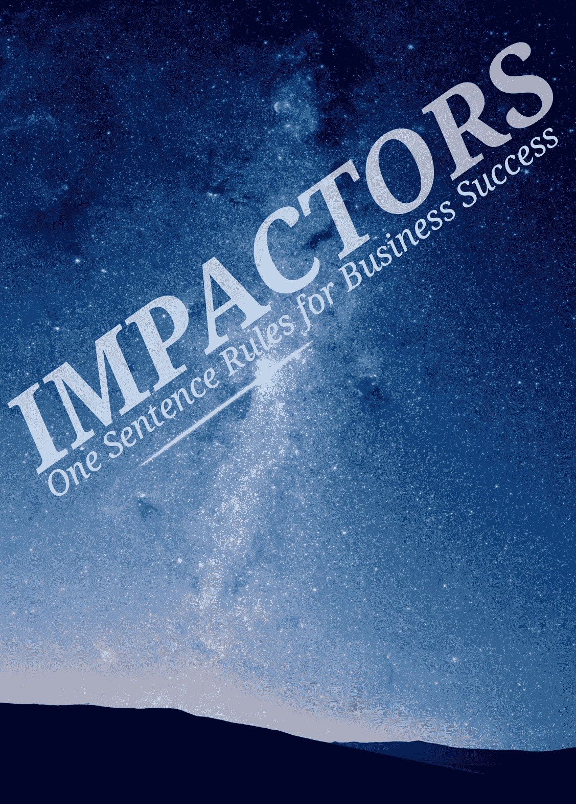

# 影响者——商业成功的一句话法则#5

> 原文：<https://medium.com/swlh/impactors-one-sentence-rules-for-business-success-5-f5b264e6fc2d>

## 帮助你获得商业成功的一句话规则是什么？

*以下是来自我们不同受访者群体的最佳选择…*

> ***经常仔细倾听你的顾客，他们会成为最佳产品/服务的向导。***

*盟友*创始人[创始人*汪星座*创始人](https://www.woofsigns.com/)

> 带着激情、力量和毅力投入到你的努力中去。

*Emil Jimenez，* [*激情传播*](http://passioncomm.com/)CEO/CCO】

> 为你的企业找到合适的位置需要时间，但是找到市场需求将会帮助你的企业成长。
> 
> ***平均是一个失败的公式。***
> 
> ***工作时间是无关紧要的，成功是以目标的实现来衡量的。***

*米尔斯美瑟，* [*钻石银行*](https://www.diamondbanc.com/)

> ***CTC:控制可控——把你所有的精力集中在你能控制的事情上，不要在你不能控制的事情上多浪费一秒钟——你的时间太宝贵了。***

*劳拉·蒂尔尼，总裁&*[*社会研究所*](https://thesocialinstitute.com/) 创始人

> 成功和成长需要的时间比你意识到的要长得多，所以要坚持。
> 
> 在招聘中实施严格的测试，以找到最优秀的人才。
> 
> ***专注于完成一件事，然后转向下一件。***
> 
> 如果你设定目标，并真正致力于实现它们，它们就会实现。

*弗雷德·施贝塔，首席执行官&*[*Finder.com*](http://www.finder.com)的联合创始人

> 因便士而生，因便士而死…总有人能让你的产品更便宜…质量是最难攻克的东西，也是保护你的利基市场的最好方法。

*克雷格·沃尔夫* [*名人*](http://celebriducks.com/) 总裁

> 把对你的想法和信念的挑战视为“礼物”,它能拓展你的思维，让你成为一个更富有的人。

*詹娜·肯纳，联合创始人&联合首席执行官* [*哈珀·王尔德*](https://harperwilde.com/)

> 不要相信做一件事只有一种正确的方法。

*简·费舍尔，联合创始人&联合首席执行官* [*哈珀·王尔德*](https://harperwilde.com/)

> ***建立一家公司需要很长时间，所以尽早建立一个自我保健的养生之道。***

*Sara Schaer，创始人&CEO*[*Kango*](http://www.kangoapp.co/)

> ***相信你的团队，不要告诉别人怎么做事，只要告诉他们你想要什么，让他们给你惊喜。***

*[*袜子俱乐部*](https://www.sockclub.com/) 联合创始人诺亚·李*

> ****一致感谢每一个人，从员工到客户到厂商。****
> 
> ****专注于建立关系，而不仅仅是建立利润。****
> 
> ****总有进步的空间。****

**司徒雷登，* [*维他米卡*](https://www.vitamedica.com/)*

> ****记住你做出的视觉冲击——这是最有说服力的证据。****
> 
> ****虽然必要，但事实很少具有说服力；情绪劝说。****
> 
> ****驾驭第三方使者的力量。****
> 
> *弄清楚你的听众需要什么，想要什么，以便精心制作有效的信息。*
> 
> *在别人替你打破坏消息之前，先打破它。*

*公关项目总裁凯蒂·科茨*

## *[< <冲击器#4](/swlh/impactors-one-sentence-rules-for-business-success-4-c962c58656c1)*

****

## *在[www.FractalSolutionsLLC.com](http://www.FractalSolutionsLLC.com)了解更多信息*

**

## *这篇文章发表在 [The Startup](https://medium.com/swlh) 上，这是 Medium 最大的创业刊物，拥有 335，210 多名读者。*

## *在这里订阅接收[我们的头条新闻](http://growthsupply.com/the-startup-newsletter/)。*

**