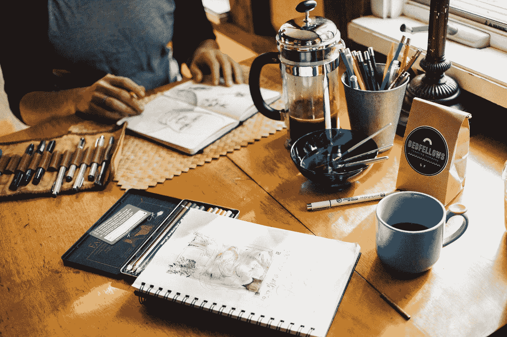

# 当我专注于创造时，我学到了重要的经验

> 原文：<https://medium.com/swlh/important-lessons-ive-learned-when-i-focused-on-creating-2ad4fa6d9154>

[Credit](https://unsplash.com/@rachaelgorjestani?utm_source=medium&utm_medium=referral)

## 这也可能对你有帮助

2016 年，我第一次辞职，作为一个[创业者](https://www.oberlo.com/blog/what-is-entrepreneurship)去碰碰运气。

从[初创](https://www.investopedia.com/ask/answers/12/what-is-a-startup.asp)到[地产](https://www.thebalance.com/real-estate-what-it-is-and-how-it-works-3305882)我接触过很多领域。我做了一些糟糕的投资，也吸取了一些教训。

这个世界就像毒品。经历过创业世界的人都知道我在说什么，也知道这会让人上瘾。

未知的领域，成长和学习的过程，网络。

**每天都带来新的机遇。**

和企业家在一起会让你觉得一切皆有可能。

对我来说是汽油。

白天变成了夜晚。我可以在忙乱中度过几个小时，甚至在我意识到我应该吃饭或睡觉之前。

我不想离开创业世界，回去就业。

但我还是做了。
这是两个主要原因:

*   我屈服于环境的压力。
*   我计划搬到德国一个叫弗莱堡的小镇。为此，我需要证明我的账户上至少有 15k。

我告诉自己回去做员工只是暂时的-

六个月后，我会带着我的钱去德国

那六个月过去了，我的老板给了我一份重新安置的提议。我们谈到了基辅。

他们提出支付我所有的机票和公寓费用。

我答应了，不到两周，我发现自己来到了一个我从未想过会去的城市。

我去追钱。

我不喜欢这份工作，也不喜欢它把我变成的那个人。

**我放弃了我的原则和人民。**

我应该早点离开，但迟走总比不走好。

我离开基辅，开始在特拉维夫和巴黎之间生活。我思考了我的生活和我将要做的事情。

我花了几个月的时间才重返赛场。

我从几乎无所事事到同时致力于建立四个帝国。

当我专注于创作时，我学到了很多经验。

今天，我将与你分享三个，所以你可以在建立自己的帝国的同时思考它们。

[Credit](https://unsplash.com/@rawpixel?utm_source=medium&utm_medium=referral)

# 向合适的人寻求建议

我们的父母和朋友爱我们，希望我们得到最好的，但是他们不一定有知识来指导我们的旅程。

当我第一次创业时，我当时的男朋友告诉我，这不是一个好主意，我应该放弃。

恕我直言，我不能接受他的建议。

他不是来自创业界，也从未处理过创业事宜。

我只是不能指望他的建议。

当你的手臂骨折时，你不会去看牙医寻求帮助。

# 成功没有捷径

**这是一个数字游戏，所以你需要努力工作。**

如果你想创造遗产，如果你想建立一个帝国-

做**不做**寻找捷径。专注于你需要完成的工作。

在你的项目上花更多的时间会带来更好的结果。

更多的学习时间会让你成为更好的自己。

你必须做得更多，但方向要正确。

阅读**更多**学习**更多**投资**更多**尝试**更多**

# 合作会让你变得更强

通常当我想到我想要创建的项目时，我会想到潜在的合作伙伴。

大多数时候，我可以自己做，当然。

但是**两个大脑总比一个好。**

被从事相同类型项目和有相同目标的人包围会帮助你获得更好的结果。

> “单独我们能做的事情很少，联合起来我们能做的事情很多。”
> -[-*海伦·凯勒*-](http://www.hki.org/our-impact/about-us/helen-kellers-legacy#.W47QU7ixXIU)

## 这篇文章发表在 [The Startup](https://medium.com/swlh) 上，这是 Medium 最大的创业刊物，有+ 371，336 人关注。

## 在这里订阅接收[我们的头条新闻](http://growthsupply.com/the-startup-newsletter/)。

## 如果你喜欢读这个，我们可能也会喜欢:

 [## 为什么深沉的人会吓跑别人

### 一个有深度的人会吓跑人的 10 种行为

medium.com](/the-charisma-crew/why-a-deep-person-scares-others-off-c5aadc8177f4)  [## 当家庭阻碍我们成长时

### 我的自我提升三步计划

byrslf.co](https://byrslf.co/when-family-holding-us-back-from-growing-55e11c3ec49b)