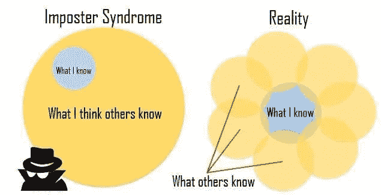
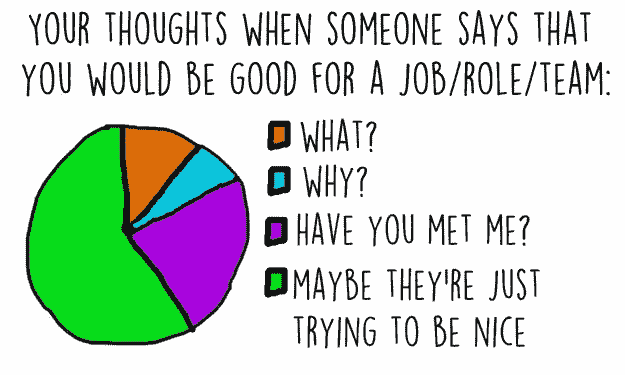

# 冒名顶替综合症——这种心理现象会破坏你的成功吗？

> 原文：<https://medium.com/swlh/imposter-syndrome-is-this-psychological-phenomenon-undermining-your-success-efb398066ac8>

What are you pretending not to know?

每个人都说你聪明、有才华、成功——那你为什么不喜欢呢？

我记得我第一次听到这个术语，“冒名顶替综合症。”

不用细看，我就知道有些东西是天生熟悉的。就像当你知道你以前见过某人，但是你不能把名字和他们的脸放在一起。

读完这篇文章后，我立即去了谷歌，在搜索栏中输入“冒名顶替综合症”，然后按下“回车”

维基百科是第一个引起我注意的搜索结果，所以我点击进入并开始阅读。

然后就发生了…

“啊哈”时刻。“原来他们是这么叫的，”我对自己说。

就在那一刻，我知道了那个偷走了我许多梦想、成就和幸福时刻的人的名字。

接下来的几分钟，我静静地坐在那里；反思人生中所有曾经想做的事，所有错过的机会，所有以打小的名义经历的痛苦和失望。

让我以亲身经历告诉你——冒名顶替综合症是真实存在的。

这是一个活生生的东西，在我一生中为此付出了很多。

这可能也花了你很多钱。

它会继续下去，直到你清楚你是谁，你在处理什么，以及如何在你的头脑中赢得这场战争。

# 什么是冒名顶替综合症

Credits: David Whittaker

“冒名顶替综合症”这个术语是由临床心理学家波林·r·克兰斯和苏珊娜·a·艾姆斯创造的[，他们称之为:](http://www.paulineroseclance.com/pdf/ip_high_achieving_women.pdf)

> “成就卓越的人无法将自己的成就内化，并一直害怕被人认为是“骗子”。尽管有他们能力的外部证据，[他们]确信他们是骗子，不应得到他们已经取得的成功。成功的证据被认为是运气、时机或者是欺骗他人，让他们认为自己比想象中更聪明、更有能力的结果。

如果你还在读这篇文章，很有可能这是你正在纠结的事情。

没关系。

很多人都在和冒名顶替综合症做斗争；如果你明白你在一个很好的公司，因为它通常是我们中最聪明的人在与它斗争。

已故的玛娅·安杰洛博士曾经说过，

> “我已经写了 11 本书，每次我都想，‘哦，他们现在会发现的。我对每个人都耍了手段，他们会发现我。"

你看，这实际上比你想象的要普遍得多。大多数人只是不知道或者在与他人分享时没有语言来描述。

如果你仍然不知道这是否适用于你，让我来帮你..

# 冒名顶替综合征的迹象

你觉得自己像个骗子吗？

患有冒名顶替综合症的人总是觉得他们会被“发现”或“揭露”为无能或骗子。

你是否淡化自己的想法或贬低自己的成就？

当患有冒名顶替综合症时，把它变得愚蠢是很常见的；提升别人的思想和观点，同时贬低自己的。

疯狂吧？

研究还表明，人们会避免表现出自信的迹象。

**你会“讨好别人”来赢得别人的认可吗？**

与骗子综合症作斗争的人倾向于使用默许、洞察力和魅力来赢得权威人士的认可。

这通常会适得其反，因为即使在人们成功被接受的情况下，他们也会经历负面的感觉，认为被接受的是魅力而不是真实的自己。

# 为什么冒名顶替综合症如此难以克服？

冒名顶替综合征通常是由一些看似随机的事情引发的，你会经历一段较长的时间。

也许你的父母给了你很大的压力让你成功，你觉得你一直在努力达到“黄金”标准。

或者可能完全相反，有人告诉你，你这辈子将一事无成。

在某种程度上，这样的事件会改变你。

现在，你仍然带着过去的东西到今天。

这就像你一直在人生的高速公路上撞车，但你似乎不知道为什么…

> 骗子综合症与强烈的经历和对自己根深蒂固的信念联系在一起。

这些经历和信念塑造了你的身份，你的观点和你的生活方式。

不是一夜之间就能改变的，尤其是没有高度的自我认知。

另一件让你难以摆脱的事情是，这可能是你一生都在挣扎的事情。

意味着你已经尝试过无数次不成功的克服它。

所以你可能对超越你当前的插曲有所怀疑；感觉这次你肯定会被“发现”。

好像你已经在生活、商业或职业生涯中取得了这么大的成就还不足以证明你的才华。

# 如何克服冒名顶替综合症

## **暂停并与自己核对**

每当你感觉“不在状态”时，暂停你正在做的任何事情，保持安静，检查你自己是个好主意。

你想弄清楚为什么你在做你正在做的事情或者你现在的感觉。

> 意识孕育选择，选择孕育成功。

如果你没有锁定它在你生活中的表现，你就无法控制你的冒名顶替综合症。

## **承认感受(不做判断)**

一旦你花了一点时间审视自己，弄清楚自己的处境，最重要的是不加评判地承认自己的感受。

承认这些感觉可以让你朝着处理它们的方向迈出一步(理解为:让它们去吧),继续你的生活。

人们常常试图避免焦虑、恐惧和怀疑这种不舒服的感觉。通过这样做，你允许他们发展到势不可挡的地步。

消除判断是这里的关键，因为它让你保持中立，处理问题时不赋予它任何特殊的意义。

通常，当某件事情发生时，你会给它附加一个消极或积极的因素，这会影响你在这种情况下的体验和行为。

如果你去掉判断，它就变成了信息。

没有好坏对错。

## **确定你的触发因素**

这是你开始控制你的冒名顶替综合症的地方。

如果你能确定是什么引发了你的冒名顶替综合症，你就能更好地应对它们，在它爆发之前**。**

你是因为不得不与公众分享你的作品而触发的吗？

你是因为准备演讲、准备考试还是接受批评而触发的？

无论你的触发器是什么，你都可以在它启动前解除它，但前提是你提前知道它是什么。

## **抱着富足的心态**

富足就像一份不断赠送的礼物。

这是一件美好的事情。一些真正渴望体现的东西。

不要认为自己不够好，对自己缺乏信心或信任，富足会让你相信你有足够的能力去犯错误，并且仍然会有结果。

富足是相信你在任何意义上都足够了。你可以放弃一切，今天失去一切，但仍然足够，因为你是一个无限的源泉。

当你开始真正拥抱富足时，你会发现在你的生活中不会有任何冒名顶替综合症的空间。

## 重构你的经历

有没有花一点时间停下来，从不同的角度看问题？

这是一个强大而有洞察力的练习。

当处理冒名顶替综合症时，重要的是重新定义你的失败或察觉到的不足。

维基百科将重构描述为:

> “一种观察和体验事件、想法、概念和情绪的方式，以找到更积极的替代方案。”

这个想法是，一个人的观点是由看待它的框架决定的，或者简单地说，是他们看待和理解它的方式。

当这个框架以任何方式转移或改变时，与之相关的思维和行为也会改变。

所以，当你把一次失败重新组织成一次经验教训时，你是在把“消极”变成“积极”；把你通常会避免的东西变成你想要寻找的东西。

我保证这是你表演过的最好的魔术。

关于重构，你需要意识到的是，它在每时每刻都是可用的，并且适用于任何事情。

生活真的毫无意义。

我们最终赋予事物意义，在每一天的每一刻。

为什么会选择不为自己服务的东西？

## **保留“雨天”笔记**

有时候我们会忘记自己到底是谁。我们开始进行稀缺对话，并对自己感到失望。

我们开始关注我们的环境或行为。我们开始体验悲伤、沮丧甚至绝望的感觉。

一个人真的很难从中恢复过来，所以我不想。

我有一个马尼拉纸信封，里面装着一些便条、卡片和其他一些我从别人那里收到的标志，上面写着对我所做的事情或者仅仅是对我是谁的感谢和赞赏。

我还在 Evernote 上保存了一个数字文件，记录了人们对他们认为是我的礼物的看法。

我知道这一切听起来很老套，但它确实有效。

相信我，当我说这正是在绝望的时刻想要和需要的。

当我在旅途中遇到坎坷，需要提醒我是谁以及我对他人生活的影响时，这些人向我讲述人生。

虽然我去藏毒点的次数很少，但它总能帮助我把事情放回正确的角度。

> 自我意识是成功的关键。

重要的是，不仅要意识到我们如何看待自己，还要意识到别人如何看待和体验我们。

这就是雨天笔记的妙处。

无论你的雨天笔记是纸质的还是数字的，把它放在一个安全的地方，当你需要的时候就可以查阅。

# 如何培养对自己的信心

## 将目标分解成更小的微观目标

很容易被你的目标冲昏头脑，尤其是如果你是雄心勃勃的类型。

对我和我认识或共事过的其他人来说，最有效的方法之一就是把一个大目标分成几个小目标。

例如，假设你的目标是写一本书。

与其让这个庞大的目标保持原样，我会把它分成几个更小的目标，比如在 30 天内每天写 1000 字，把草稿发给编辑，设计好书的封面，发给印刷商，举办一个新书发布会。

看到我做了什么吗？

你有没有注意到，当你一步一步地把一本书分解开来时，你会觉得写起来容易多了？

现在花一点时间来实现你一直在拖延的目标，把它分成小块，然后发给 3 个朋友，让他们负责。

## 获得责任伙伴

我最近和一位白宫工作人员开了一次会，在我们的谈话中，我了解到的最大的一点是，他们所做的事情有多少是由委员会完成的。

当接受一项任务时，每个团队成员将他们的工作提交给团队的其他成员进行审查，在这一点上有反馈、编辑和修改的交流。

最重要的是，他们知道这是过程的一部分，是非常必要的一部分，他们不会把它当成个人的事情。

他们知道犯错是人之常情，但这是他们没有的自由，因为他们所做的一切都是生死攸关的事情。

你是否将你所做的工作视为生命或死亡？这在我的日常生活中会是怎样的呢？

如果你和我一样，那么在筒仓里工作是非常容易的，只是，这不是我们生活或工作的最好或最有成效的方式。

所以现在我是每周通过电话会议开会的策划者的一部分。

我们讨论哪些可行，哪些不可行，以及我们需要哪些支持来实现我们的目标。

结果，我们都在很大程度上移动了指针，因为我们对其他人负责，他们也对我们负责。

我不知道这是什么，但当人们对他人负责时，他们往往会表现得更好。

这有助于防止不充分的感觉，自我怀疑和欺诈。

所以我问你…

**你对谁负责，谁对你负责？**

> 找到那些爱你、尊重你但不为你所动的人，因为他们会让你变得强大。

## 采取行动

我相信时间助长了你的恐惧。在你和你的目标之间你允许的时间越多，恐惧阻碍你的机会就越大。

当务之急，马上行动。这让你没有机会去思考你所有的想法，包括那些实际存在的和你将要编造的。

你越快采取行动，你就能越快完成任务。最终，你会更快地建立自信和信誉。

现在，我把它还给你…

下次冒名顶替综合症出现时，你打算如何解除它？

—

# 行动呼吁

想扩大你的观众群吗？如果是这样，下载这个 PDF 格式的 12 个有效的列表构建策略。 [**马上在这里抢一份**](https://dewanemutunga.com/lbb/) 。

*Dewane Mutunga 是一名作家、演说家和企业家，专门研究实现目标和业务发展的数据驱动战略。他是* [***Solopreneur 编年史***](https://dewanemutunga.com/newsletter) *的创造者，在这里他将个人发展和创业之间的点点滴滴联系起来。在推特上关注他*[***@ DewaneMutunga***](https://twitter.com/DewaneMutunga)*。*

*本文原载于*[*DewaneMutunga.com*](http://dewanemutunga.com/imposter-syndrome/)