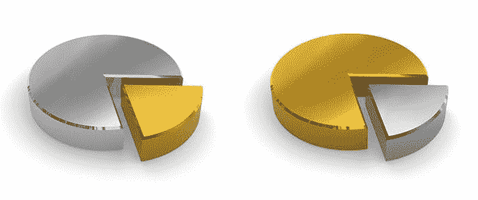

# 改进还是创新？(提示:问题不对)

> 原文：<https://medium.com/swlh/improve-or-innovate-hint-wrong-question-269294227155>

## 持续改进和“颠覆性”创新有什么区别？

我经常收到这样的问题，尤其是那些在一些流程改进项目上有大量投资的组织——如精益、六西格玛或*kaizen*——他们摘下了所有容易摘到的果实，尽可能多地从工作中榨取低效率，现在意识到他们心爱的项目并不完全以客户为中心。所有的内部审查让客户没有任何真正新的和有用的价值。因此，领导者决定他们现在需要关注的是创新，好像这是完全不同的东西。

这个问题有不同的形式，但不管是哪种形式，我认为这是一个错误的问题。这表明了错误的心态。我从语言中听到:“我们正在进行精益生产”，以及“我们已经进行精益生产三年了。”

不好意思，但你没有“做精益”！你“做创新”吗？你上一次听到有人说“我们做创新已经三年了”是什么时候？天啊，你以前做过什么？

为什么我们将注重效率或生产力的活动视为一种附加活动，而将创新视为每个企业都必须具备的一种必要的内在能力？为什么会有关于什么是改进或者创新，什么不是改进或者创新的争论呢？我不明白。

事情是这样的。作为人类，我们都以本质上相同的意识方式解决问题:我们提出一个问题，假设一个答案，测试它，然后反思我们预期的因果是否成真。

这是一个学习循环。永无止境的循环。这是一切的核心。从这个角度来看，改进和创新——无论你希望如何定义它们——没有什么不同。如果有区别的话，那是在渴望中。

持续改进工作通常集中于并渴望增强现有的流程、产品、服务或系统。把它想象成一个“工作馅饼”，其中大约 25%是真正的价值——顾客关心并支付的东西。剩下的都是些愚蠢的东西:没有附加值的东西，比如官僚政治、规章制度、超负荷、不一致以及各种各样的浪费。你的改进旨在通过减少那些负担和价值贬低者来增加现有的价值。

所谓的激进或“破坏性”努力通常集中于并渴望创造一个完全*的新馅饼*，通常会完全消除一个或多个价值障碍。

让我们看看浪费的七种基本形式…传统的持续改进目标。除此之外，让我们从整个商业词汇定义为“颠覆性”创新的角度来看待它们。

**生产过剩。任何不考虑需求的行为都被认为是生产过剩。这包括像在实际需要之前处理订单这样简单的事情。优步的成功很大程度上(如果不是全部的话)归功于消除了这种浪费，当时它率先推出了按需用车服务……没有汽车。同样，BnB 航空公司已经成为一家非常成功的住宿服务公司，但却没有产生任何资产。**

**过度加工。**当有太多无附加值的步骤来实现给定的结果时，你就过度处理了。例如，完成一个阶段的工作需要太多的操作，检查和修复由不良工具或产品设计引起的缺陷，以及由于多个系统之间缺乏集成而导致的冗余数据输入。亚马逊通过“一键式”创新消除了过度处理。

**运输工具。当把货物、材料和信息从一个地方运送到另一个地方时，你所能期望的最好结果就是不会出任何差错。运输是一种必要的罪恶，应该尽可能地减少。美国邮政服务的衰落始于有史以来最激进的创新应用之一，现在已经有一代人的历史了:电子邮件。**

**库存。任何时候任何种类的库存增加，都会给管理、减少或消除库存带来压力。对普通汽车经销商的访问——许多人认为这种体验比根管治疗更痛苦——就是一个恰当的例子:汽车的增加是销售压力和不友好的消费者策略的根源。最近，福特 Canvas 计划等汽车制造商和 Fair 等独立创业公司推出了专注于移动性而非所有权的创新型新订阅模式。**

**运动。任何不必要的重复过程(即使是精益过程)都会耗费时间、生产力和成本。例证:登录各种移动应用程序是一个很大的负担。进入指纹安全，这是一项天才的技术，它消除了不断重新输入用户名和密码的需要，我们大多数人反正都记不住。**

**缺陷/返工。每个人都经历过某种缺陷:错误、不准确或不完整的信息、有缺陷的产品。降低这些事情发生的概率显然很重要。然而，令人惊讶的是，它并不总是最优先考虑的事情。根据《患者安全杂志》最近的一项研究，估计每年有 210，000 到 440，000 名患者死于医院失误和医院护理引起的伤害。这将使医疗失误成为第三大死亡原因。诸如所谓的“数字员工”软件、RFID、条形码和虹膜/指纹扫描等新技术专注于消除这些关键错误。**

**等待。汤姆·佩蒂说得对:等待是最难的部分。无论是没完没了、纹丝不动的排队，还是在等待批准时陷入闲置状态，或者仅仅是缓慢的互联网连接速度，我们都经历过等待以及随之而来的无助感和生产力损失。网飞完全消除了等待 7 天才能观看喜爱节目的下一集的需要。**

尽管如此，从某种意义上说，所有这些创新都只是以前的更好版本。只是改进的范围、规模和幅度如此之大，以至于一个全新的价值馅饼已经出炉，虽然总体形状看起来很熟悉，但味道完全不同。证据是显而易见的:用户或客户的行为是根本不同的。

所以，把问题提出来，把愚蠢的争论放在一边，听听托马斯·爱迪生的话:“有一种方法可以做得更好。找到它。”

## 这篇文章发表在[《创业](https://medium.com/swlh)》上，这是 Medium 最大的创业刊物，拥有+367，690 读者。

## 订阅接收[我们的头条新闻](http://growthsupply.com/the-startup-newsletter/)。

