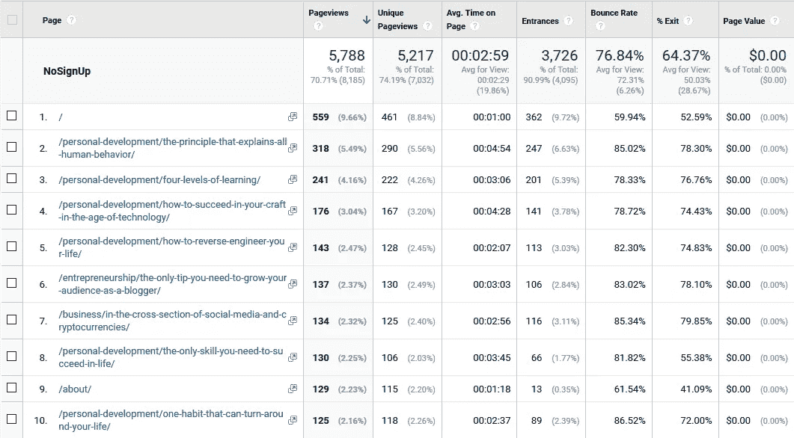

# 改进我的博客设计以增加电子邮件简讯订阅量

> 原文：<https://medium.com/swlh/improving-the-design-of-my-blog-to-increase-email-newsletter-subscriptions-476b63952e63>

[ptra/pixabay](https://pixabay.com/en/workplace-imac-desktop-creative-3236523/)

*   我博客中的电子邮件简讯订阅并不总是符合我的目标。
*   到目前为止，我专注于提高我的写作来优化这些结果。
*   下一步将是改进我的博客的设计。

**我如何衡量我博客的表现**

我正在追踪两个数据来衡量我的博客的表现。以上是我的媒介关注者和 [**邮件通迅**](http://eepurl.com/c_1Mw5) 订阅者的增长率。我的目标是 [**每周两个数字都增长 10%**](https://ideavisionaction.com/personal-development/how-i-use-growth-metrics-to-optimize-the-stats-of-my-blog-and-email-newsletter/)。

我前一周成功实现了简讯目标，下一周却失败了。这种一开一关的模式已经持续了一个月了。

到目前为止，我试着优化我的博文写作技巧。我通过 [**分析我的中等统计**](https://ideavisionaction.com/marketing/measuring-the-contribution-of-my-medium-posts-to-my-content-marketing-goals/) 做到了这一点。我从 [**博客**](https://ideavisionaction.com/tag/blogging/) 中学到了很多，我在**的一系列帖子中分享了它们。**

****专注博客设计****

**当然，我的写作还有改进的空间，但我现在想专注于我的博客。我的博客还有更大的改进空间。**

**我的流量数字还不错，但我很难将这些流量转化为电子邮件通讯订阅。我将用一个月左右的时间关注这种转换。**

****我的膝跳反应****

**我开始使用 [**谷歌分析**](https://analytics.google.com/) 来完成我的目标。那不是个好主意。我警告我的读者不要在没有计划的情况下就使用某个工具。我犯了那个错误。我不认为谷歌分析是这项工作的合适工具。**

**谷歌分析是一个神奇的工具。当我使用这样的工具时，我可以花上几周、几个月甚至几年的时间来研究它。使用一年后，我仍然可以学到一些东西。然而，那不是我的目标。**

> **我的目标是提高我博客的转化率，而不是成为谷歌分析专家。**

**我在帖子 [**中警告过这种滥用科技的行为，把科技当成加速器，而不是终点**](https://ideavisionaction.com/productivity/use-tech-as-an-accelerator-not-as-an-end/) 。我昨天甚至写了一个名为 [**的帖子，如果你知道如何使用**](https://ideavisionaction.com/marketing/data-is-the-gold-if-you-know-how-to-use-it/) ，数据就是黄金。然而，我仍然花了几个小时在谷歌分析上，没有任何结果。**

****从纸笔开始****

**几个小时毫无结果的工作后，我离开了电脑。我拿着纸和笔坐下来。我集思广益，写了这篇文章的初稿。**

****读者的搜索查询****

**谷歌分析的一个有趣的发现是人们在我的网站上使用的搜索查询。这些搜索查询给了我一些写博客的想法。**

**其中一个搜索查询是“**如何每天写作**”我想我的访客对我每天发布帖子的方式很好奇。实际上，如果我没有一份全职工作，那会很容易。但是除了全职工作之外很难。**

****提高我的工作效率以跟上每日出版进度****

**我仍在提高我的生产力和工作流程。我计划在我的写作常规达到某一点时报告它。**

**这里面也有一些内在的博弈。我发现我的心理捉弄我的方式很有趣。然后我在心理上作弄，作为回报来跟上我每天的出版进度。**

**如果你想了解更多关于我如何保持日常日程的信息，请订阅我的 [**电子邮件简讯**](http://eepurl.com/c_1Mw5) 。我计划在接下来的几天里写下这些。**

****从质量问题开始****

**在使用 Google Analytics 几个小时后，我意识到我不需要花那么多时间。我可以在十分钟内得到我需要的东西。**

> **在你开始使用谷歌分析这样的工具之前，写下你想从中获得什么。此外，写下你将如何处理你得到的答案。**

**如果你不知道这些问题的答案，你最终会浪费你的时间。最后，你可能最终知道了很多关于谷歌分析的东西，却没有给你的业务增加任何价值。**

**我的目标以及我计划如何实现它**

**我的目标很简单:提高我的博客流量到时事通讯订阅的转化率。为了做到这一点，我需要改进我博客的设计。**

**我已经开始写作了。如果我的博客设计得不好，无论我写得多好，我都无法实现我的目标。这两个部分的效果就像乘法中的因子。**

****确定改进空间最大的因素****

**如果我的写作是 80%，我的博客的设计是 20%，我的转化率将是 16%。达到一定阈值后，提高一个因素只会增加边际价值。**

**根据上面 80% — 20%的数字，我的写作还有 25%的改进空间。如果我专注于写作，我最多能提高 25%的成绩。**

**基于同样的假设，我的网站设计有 500%的改进潜力。如果我专注于我的网站设计，我可以将我的结果提高 500%。**

****挑战无限可能****

**当我开始一个项目，比如更新我的网站设计时，可能性实际上是无限的。尽管这听起来不错，但同时也令人不知所措。所以我才写了这个帖子，[**创业时如何应对无限可能的挑战**](https://ideavisionaction.com/entrepreneurship/how-to-deal-with-the-challenge-of-infinite-possibilities-when-starting-a-business/) 。**

****从哪里开始？****

**如果由我决定，我会从 [**关于**](https://ideavisionaction.com/about/) 页面和 [**主页**](https://ideavisionaction.com/) 开始。但是当我看谷歌分析时，我看到了一个不同的画面。**

**如果你看看图 1 中的前十页，你可能会认为主页是最重要的页面。占页面浏览量的 10%。这意味着如果我改进了主页，我只改进了网站设计的 10%。**

****

**Fig. 1\. Pages with top 10 views**

**前十名中有八页提到了博客文章。我看完整列表，80%以上的页面浏览量都是博文浏览量。如果我改进了博客帖子的设计，我将改进 80%的网站。**

**改进博客文章的设计在 WordPress 中相对容易。我所要做的就是更新我使用的主题中的一些文件。**

****衡量影响****

**一旦我做了更新，我会等几个星期来看看它的效果。我很难想象这些改变会导致比当前设计更差的转换率。**

**目前的设计我还没想好。我只是使用了标准主题，并在底部添加了一个订阅框。**

****改进思路****

**脑子里已经有了一些改进的想法。这些想法的灵感来自于媒体 [**和初创刊物**](https://medium.com/swlh) 。**

****顶部电子邮件时事通讯的链接。**文件夹上方没有任何信息表明我有一封电子邮件简讯。唯一的例外是 [**电子邮件简讯订阅页面**](http://eepurl.com/c_1Mw5) 。**

**我喜欢初创刊物 给他们的链接命名的方式 [**。他们称之为“更聪明地创业”就我而言，甚至称之为“时事通讯”都比我现在拥有的要好。**](https://medium.com/swlh)**

****订阅框的位置。**订阅框位于帖子、社交分享按钮、相关帖子列表、类别和标签列表下方。订阅框可以在社交分享按钮和相关帖子列表之间。**

****作者信息栏。我会在顶部放一个作者信息栏，包括我的照片、我的名字和简短的简历。我在拖延写我的媒体简历。一旦我有了一个简短的简历，我会在我的博客和媒体上使用它。****

****门柱上的一小段投球。**这不是设计更新，但可以增加简讯订阅量。我在这篇文章中加入了一个推介。我给了一个关于我将在未来几天发表的帖子的提示。我也可以在以后的文章中这样做。**

****结论****

**当更新一个项目时，关注有最大改进空间的组件。对我来说，这就是我的博客文章页面的设计。**

**技术可能是工作中的陷阱。不要因为某项技术是一个好工具就使用它。只有当它服务于你的目标时才使用它。把它作为达到目的的手段。不要只是为了用而用，不管多好玩。**

****轮到你了****

**如果你能给我一些建议来提高我的电子邮件简讯订阅数量，我将不胜感激。如果你有任何我可以改进这个属性的想法，请在评论中告诉我。**

*****如果你觉得这篇文章很有价值，注册*** [***每周简讯***](https://ideavisionaction.com/email-newsletter/) ***就可以收到我关于创业、企业家精神、领导力和自我提升的文章综述。*****

****

## **这篇文章发表在 [The Startup](https://medium.com/swlh) 上，这是 Medium 最大的创业刊物，有 319，283+人关注。**

## **在这里订阅接收[我们的头条新闻](http://growthsupply.com/the-startup-newsletter/)。**

****