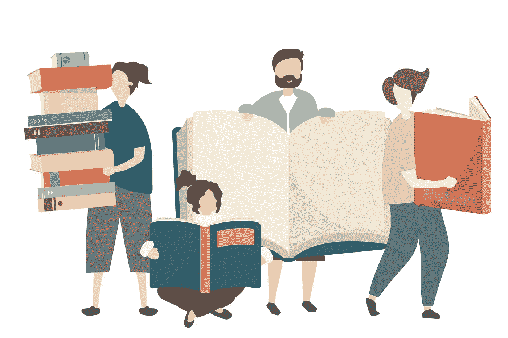

# 2018 年，我无法放下这些非虚构的书籍

> 原文：<https://medium.com/swlh/in-2018-i-couldnt-put-these-non-fiction-books-down-c78dbdf7a3d>

改变你看待自己和世界的方式的书。

Image by rawpixel.com

从小我就知道，书籍是一个神奇的领域，带你去不同的世界，拓展你的想象力，培养你的批判性思维。

书籍帮助我在个人和职业上成长。