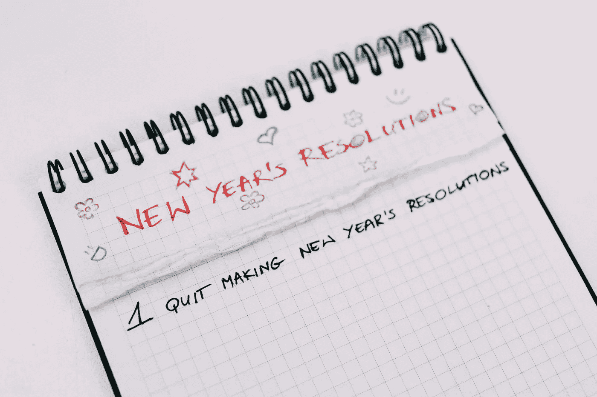

# 2019 年，让自己摆脱反应性

> 原文：<https://medium.com/swlh/in-2019-rid-yourself-of-reactivity-1d8ca0dd9f8a>

今天早上，布拉德·菲尔德带来了一个关于决心的新变化:2019 年你不会做什么*？*

*他为首席执行官们列出了一系列建议，“那些通常是可选的，但会消耗大量时间和精力的事情”，包括不要被收购分散注意力:*

*假设你是一家快速发展的公司，拥有大量的财务资源。也许你过去做过一些收购。但是，你没有具体考虑过，所以这是一个反应性或机会主义的举动。决定“今年我们不进行任何收购，我们不会被围绕收购的动议分散注意力”是非常自由的。当首席执行官的好处在于，你可以改变自己的想法，尤其是对一家处于强势地位的公司而言。但是，通过预先声明你在一段时间内不会做什么，你就必须积极地改变你不会做什么的想法。*

*毫无疑问。*

*令我震惊的是，大多数公司的 DNA 中有如此多的反应性。他们不打算收购，他们不知道路的尽头在哪里，或者分叉，或者变成一条高速公路。越来越多的人异口同声地说“开始时要考虑到结果”，这让我很受鼓舞，但还没有足够多的公司这样做。*

*人们太容易陷入日常事务中，利用不断增长的客户群的势头和良好感觉，或者相反，将自己投入到止损和寻找短期修复方法以回到正轨中。这一切都是如此的不稳定，而且没有特定的方向。这也使得人们太容易被闪亮的新事物所吸引，比如一家要收购的很酷的新公司或一个出价收购者。*

*让我们播放一下这个场景:一家公司做得很好，一个买家出现了。势头遇到一些障碍，管理团队争先恐后地存储数据室。有兴奋和压力。但是你没有计划。你没有把 2019 年作为退出的目标，有明确的公司退出计划，也有你个人的退出计划。所以，也许它进行得很顺利，或者，正如布拉德所想，也许它“消耗了大量的时间和精力。”*

*让我们听从布拉德的话。意识是第一步。*

*2019 年， ***你不会做什么？****

*接下来，让我们对你*要做什么以及如何实现做一个前瞻性的计划。**

***劳拉·里奇是* [*离职俱乐部*](http://exitclub.co) *的创始人，这是一个帮助创业者在离职后拥有美好生活的服务和社区。***

****

## **这篇文章发表在 [The Startup](https://medium.com/swlh) 上，这是 Medium 最大的创业刊物，拥有+399，714 名读者。**

## **在这里订阅接收[我们的头条新闻](http://growthsupply.com/the-startup-newsletter/)。**

****