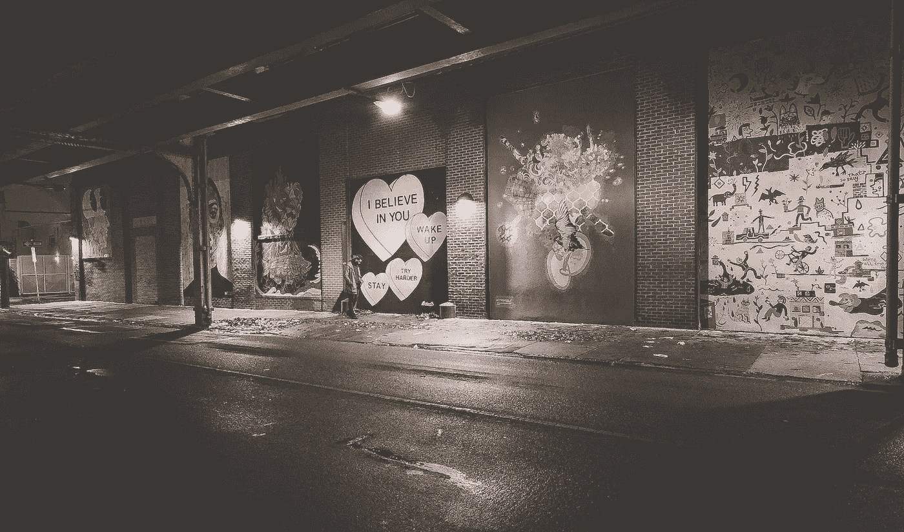
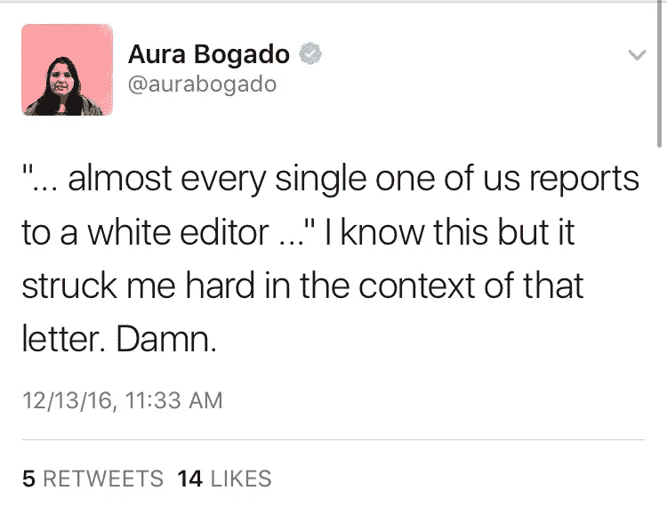
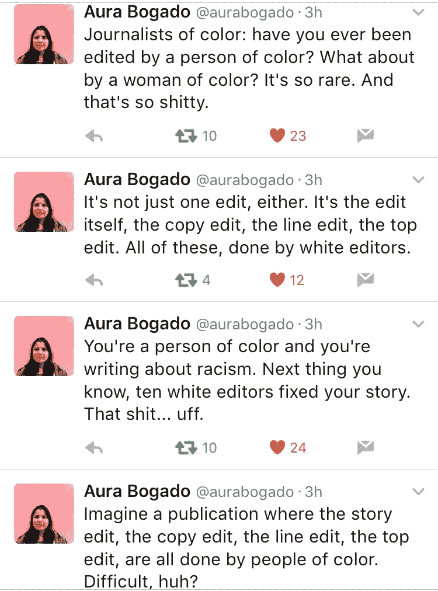
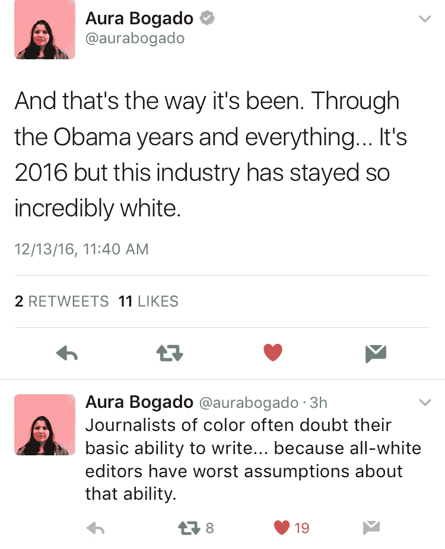

# 为自助出版辩护

> 原文：<https://medium.com/swlh/in-defense-of-self-publishing-907e0d33fc29>

## (尽管身无分文)

Photo by Femi Matti

今天早上，我读了杰伊·凯斯宾·康[写给少数族裔记者](/kang-blog/an-open-letter-to-fellow-minority-journalists-2ccf3f1bbfeb?source=linkShare-a75c8b7d148f-1481660165)的公开信，这让我对自己出版的决定重拾信心。我从未担任过正式的写作职位，从未去过编辑部开会的房间，从未去过出版社的总部报到。但是我从事自由职业已经一年多了，即使在我有限的经验中，我也能认同这封信的内容。我看到了整个行业，除了少数(通常是少数人主导的)出版物，是如何迎合潮流和超越诚信的力量的。我发现，正如康所言，对于我们这样的作家来说，没有安全感，除非我们“自己造自己的屎”

当我开始专业写作时，我不知道这些是如何运作的。在因抑郁而辍学之前，我只上了一年大学，然后像蒲公英种子一样在生活中漂浮，直到岁月让我有机会尝试一下。[我的第一篇作品在网上疯传](https://thsppl.com/why-i-m-absolutely-an-angry-black-woman-2cf74c95828)，我尝到了成功和被剥削的滋味。许多主要的出版物选择了我的作品，但是我没有报酬，当然也没有机会。一篇又一篇文章，同样的事情发生了，而我看到白人作家因相似的恶名而获得书籍交易。

但是不管怎样，我开始感觉到我对自己的第一点信心。我开始觉得自己足够优秀，可以沿着一条轨迹前进，这条轨迹可能会让我在某个地方获得一份全职或可持续的写作或编辑职位。我以为我能在众所周知的桌子旁找到一个位置。

所以我尝试了典型的自由职业路线，尽管我不是典型的自由职业者。为了获得足够多的署名来支持我，我试着推销声望(和报酬)提高的出版物。但是我不能吃署名，我设法收集的那些不能支付帐单。

尽管如此，我还是坚持了下来。然后时间就过去了。更多的时间。更多的时间。每次尝试都意味着有时要等待两周的接受或拒绝，然后是几天的写作，然后是 30-90 天不等的等待支票(通常不到 100 美元)，而我的账单已经过期了。

很明显，遵循自由作家的道路需要一定的资源。我没有的资源。它需要大量的时间和精力、加快推销的关系、支票迟发或不频繁时的备用资金等等。我拥有的是一个只允许我在他睡着的时候写作的婴儿，一个偶尔使我虚弱的抑郁症，这使我无法工作，以及一个同样疲惫的支持网络，当我赌上自己的时候，他不能保释我。但我继续在自己身上下注，希望有人能在我的决心破灭之前给我一个大突破。

**剧透**:我没有什么大的突破。相反，我发现自己遇到了更多的问题，阻碍了我对自己坚持下去的能力的信心。我发现自己在质疑，我是否有勇气把我的个人文章交给那些没有能力以尊重的方式处理这些内容的人。

在回应康的信时，奥拉·博加多在推特上谈到了许多少数民族作家面临的一个问题——是谁塑造和批评了我们的作品。

除了令人窒息的限制使我不能像更有特权的同行一样生产，我发现我*生产的作品被我推销的出版物的编辑过程冲淡了。我发现男人们正在编辑我关于厌女症和性别歧视的文章。我发现白人正在编辑关于黑人的文章。我发现我声音最强的部分为了迎合口味而变得柔和了。我很快变得沮丧和不满。*

如果我牺牲睡眠来写能产生大量流量的发自内心的作品，如果我被来自大酒吧的曝光所带来的观众所辱骂，如果我努力与编辑保持我自己声音的完整性——我的稳定性到底在哪里？我所能指望的一致性，我所有辛勤劳动的好处在哪里？我的那一半房租呢？失踪了。

我很快就认定，我开始写作时所寻求的根本不是我想要的。它占用了我所有微不足道的资源，但仍然让我在经济上没有安全感。因此，我选择优先自我出版我的作品。

我自己出版，因为我最想从写作中得到的是能够尽可能真实地说出需要说的话，并在这样做的同时可靠地供养我的家人。我明白了——作为一个破产的黑人女性——我能指望这个行业让我同时拥有这些东西的可能性很小。

因此，我致力于建立自己的平台，并相信其他人对我提供的内容的重视程度不亚于我对提供优质内容的重视程度。我相信那些欣赏我作品的人会投资我的作品，这样我就有能力创作了。

我拒绝向守门人求助是通过大门的唯一途径。守门人易变易错。他们的钥匙一直在进化。守门人不代表我没有规定我不能袖手旁观。我不能指望像现在这样被接纳。我能指望的是，我在这里聚集的观众是来欣赏我未经过滤的能力的。我希望有一天我所选择的模式能够足以维持下去。

我经常收到关于我使用受众资助的自助出版的评论或电子邮件。评论者坚持认为，如果我的工作足够好，我会在主要的出版物上工作，而不是“乞讨”除了指出要求为提供服务而获得报酬不是乞求——我对他们说，这条路是我对一个不适合像我这样的作家的行业的抵制。我找到了一种适合我作为一个缺乏时间、精力、金钱和机构证书的边缘人的生活方式。我创造了一个空间，让我尽我所能去创造。

而且，不，我还没有稳定下来，但是我知道我正在接近自己。有时我的作品比任何出版物都更能让我受益。我的听众完全按照我的意图接收我的话。没有人有权力从我这里拿走我的平台，把它交给更适合潮流的人。

在一个像我这样的人很少掌权的行业，我已经夺回了我的权力。自助出版让我有能力建立自己的寄托。