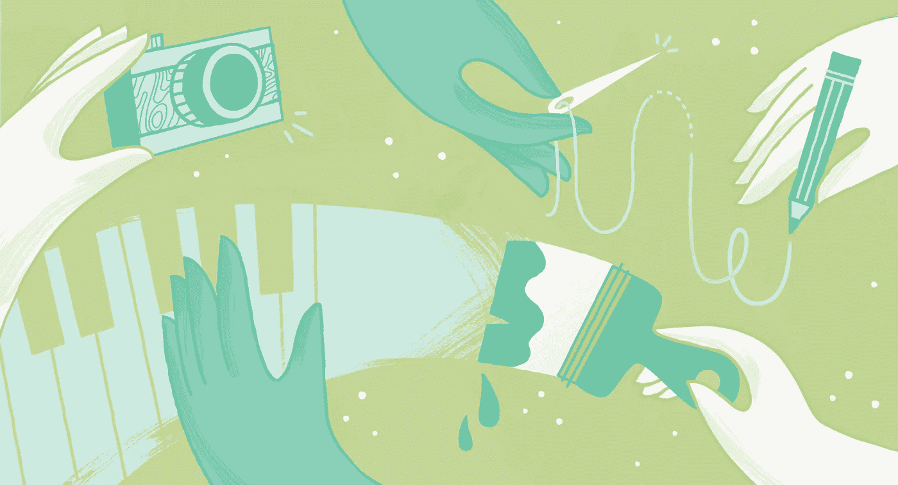
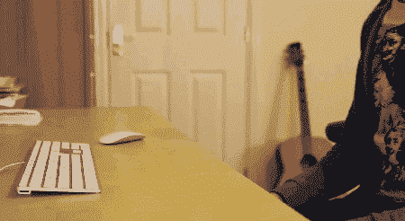

# 捍卫创造力的传播

> 原文：<https://medium.com/swlh/in-defense-of-spreading-creativity-around-4033ff5f193c>

“做一件事，”他们说，“并把它做好。”

这是个好建议。这是一种有内在意义的建议，对很多人都有效。这也是我几乎不可能遵循的建议，至少在创造性努力方面。我都想做。

对我的创意市场同事的快速调查显示，我并不孤单。我们的业余爱好包括演奏各种乐器、烹饪、绘画、雕刻、摄影、家具制作、陶艺、装饰创作、缝纫、烘焙，甚至木偶制作。

至于我，我以软件工程师为生。我不是世界上最好的程序员(不管我的咖啡杯会说什么或不会说什么)，但我已经投入了多年的时间来学习和实践编写干净、功能性的代码。它不仅能支付账单，我还乐在其中。我喜欢用代码制作解决方案的创造性。也许你从未想过代码争论是一种创造性的努力。确实是。是的，这在技术上具有挑战性，但也需要发明和想象力，并花时间做白日梦。我大脑的[斯波克](https://en.wikipedia.org/wiki/Spock)半边和[兵邦](http://disney.wikia.com/wiki/Bing_Bong)半边之间有这种令人满意的互动，这种互动只有在我处于代码区时才会发生，我喜欢这种互动。

但这还不够。我还[写小说](http://joshuaccarroll.com/)，做饭，做[音乐](https://soundcloud.com/joshuaccarroll)，拍[图片](https://creativemarket.com/JoshuaCCarroll)，合拍[播客](https://itunes.apple.com/us/podcast/the-telltales-podcast/id1268484259)。这些都没有让我变得富有，甚至没有对我的开销有显著的贡献。事实上，它们都耗费了时间、精力和金钱，而这些本可以用在更有利可图的地方。

那么，为什么不把我所有的时间和精力集中在培养我的编程能力上呢？以下是我的三大理由:

# 1.头脑清楚

任何构建过比基本的“Hello，World”应用程序更大的东西的人都会告诉你，[编程糟透了](https://www.stilldrinking.org/programming-sucks)。虽然设计和构建优雅、高效的解决方案可以起到净化作用，但这只是工程师一天中的一小部分。剩下的时间都花在了消除 bug(开发者可能会也可能不会引入 bug)上，解决飞来飞去的技术债务问题，测试，记录，以及在硬件出现故障或在一些底层技术中发现安全漏洞时尽量不要惊慌。回报值得吗？没错。程序员有时候会需要做一段时间别的事情吗？是的，请吧。

On the daily

其他创造性职业也是如此。我的同事[贝丝·鲁芬尔](/@BethRufener)说她的工作(支持)需要“大量左脑型任务，这很棒！但这让兼职做右脑工作变得非常有益。”(在 Instagram 上查看[贝丝的作品](https://www.instagram.com/creatifolio/))

无论你是在与客户打交道，建立粉丝群，协调场地，推广你的工作，跟踪开支，还是保持你的社交媒体存在，你工作中的一些部分都是不可避免的痛点。有时候，最好把所有这些都关掉，去创造一些你选择允许进入你的过程中的唯一的痛点。你可以画出所有你想要的快乐小树，把画布挂在墙上让家人和朋友欣赏，继续你的生活——不需要炫耀或闲聊。

> 但是，创造而不是消费来提神的美妙之处在于，它有可能重新点燃你对创造过程本身的热情。

当然，你总是可以扑通一声坐在沙发上，打开电视，什么也不做。有时候你的大脑需要休息。我明白了。但是*创造*而不是*消耗*来刷新自己的美妙之处在于，它有可能重置你对创造过程本身的热情。当我和我的写作俱乐部分享一篇短篇小说草稿，或者给我的家人端上一份特别美味的沙拉时，我会想起为什么我喜欢创作。这些小小的成就火花累积成一团动力之火，伴随着我回到我的笔记本电脑，让我有能力写更多有创意的代码。更好的是，出色完成工作的成就感让我在工作内外都变得乐观；当我创作时，我是一个更有趣的同事，一个更令人鼓舞的父亲，一个仍然有精力在周末从甜蜜清单上删除几个项目的丈夫。

# 2.创造力产生创造力

玛娅·安杰洛曾经告诉一位采访者，“你不能用尽创造力。用的越多，拥有的就越多。”放下麦克风。走开。你可能有胆量不同意玛娅·安杰洛关于创作过程的观点，但我没有。即使我知道，我自己的经历也会证明我是错的。

例如，当我保持日常创造性写作的例行公事时，我发现自己在休息时间会想出与工作和我的其他兴趣相关的想法，而我的大脑在其他情况下会处于中性状态。这就好像我的想法陷入了一种创造性的模式，当这种情况发生时，去商店会产生产品功能的想法，发型会产生新的歌词。

Ben Wyatt is my spirit animal

这种影响并不仅限于我思想空闲的时候。在一个创造性领域的小小成就可以激发我在另一个领域的自信。也许我已经在我的小说的第二章上停留了一个月(或者更久)。但是你知道吗？昨晚我花了一个小时用 Photoshop 把一些平凡的老照片变成了有价值的作品。如果我能利用这种势头，我就能利用它来突破我的写作瓶颈。

正如 Beth Rufener 所说，“对我来说，创造力就像是另一种食物和/或肌肉(如果这有意义的话)。如果我不断创造和锻炼创造力，我肯定会感到更有活力，更有动力去做其他事情。”

这是我最喜欢的创造性多样性的副作用。我数不清有多少次我在一个创意渠道学到的东西影响了另一个创意渠道。

通过声音和视角写作小说影响了我写作歌词的方式(谁讲故事，他们如何讲故事和故事本身一样重要)。我学到的关于烹饪时如何以及何时加盐的经验适用于音频制作中的压缩应用(任何地方太多都会破坏最终产品，但在过程中的正确点添加一点点可以让它发光)。法国烹饪概念 *mise en place* 改变了我处理编码挑战的方式(首先准备好一切，然后组装组件)。摄影中的构图决定了短篇小说中的场景范围(你在画面之外留下的和你包含的一样重要)。我写伪代码来计划各种各样的项目，从小说到食谱。

[马特·博切特](/@matt_borchert)，创意市场的社区策展人，也有类似的经历。“我做过很多家具——你必须构思和思考各种部件如何配合的方式几乎适用于任何类型的设计。”(在 Instagram 上查看[马特的创意作品](https://www.instagram.com/mattborchert/))

[品牌设计师 Bronwyn Gruet](/@bronwyngruet) 也表示同意。“在多个学科中工作会让你获得有用的视角，可以应用到你的主要学科中。你可以从你遇到的任何/每一个经历、手艺和人身上学到一些东西，这些东西会融入到你的工作中。”(在 Instagram 上查看[布朗温的项目](https://www.instagram.com/bronwyn.gruet/)

# 勇往直前去创造

腾出时间来满足你的创造性兴趣。写一首诗。[学习制作自己的字体](https://crmrkt.com/Ol8QO)。用肥皂刻一尊汉·索洛的半身像。为了快乐而快乐，然后看看会发生什么。创造性的多样性不一定等同于在任何一个领域缺乏深度。足球运动员经常上芭蕾课是有原因的。交叉训练是有益的。

*本文原载于* [*建筑创意市场*](/building-creative-market/in-defense-of-spreading-creativity-around-a0ca163a6d84) *，经允许在此转载。*

## 这篇文章发表在 [The Startup](https://medium.com/swlh) 上，这是 Medium 最大的创业刊物，拥有+ 376，592 名读者。

## 在这里订阅接收[我们的头条新闻](http://growthsupply.com/the-startup-newsletter/)。

