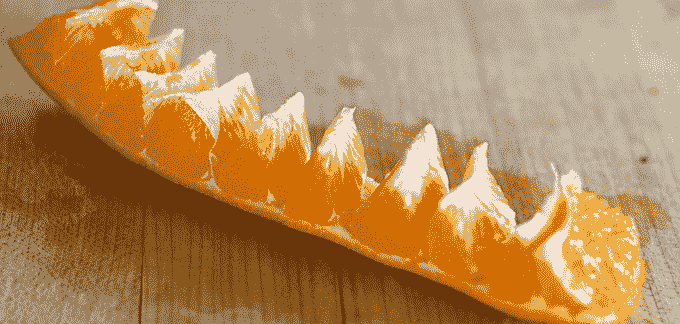
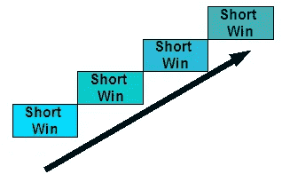
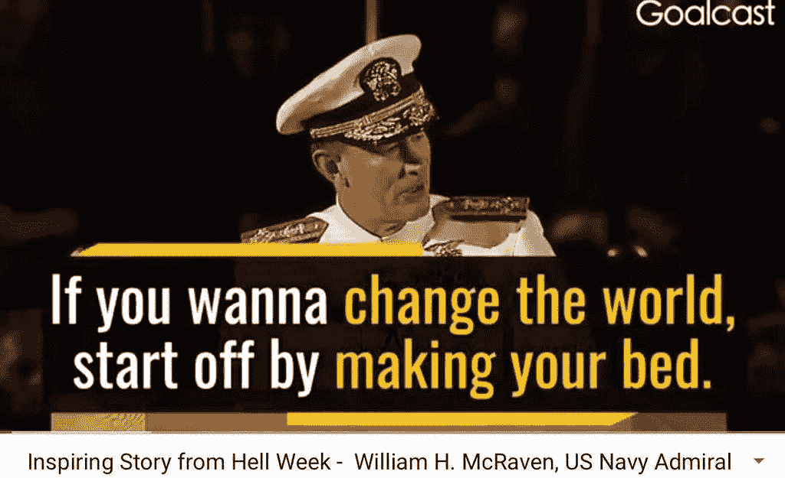
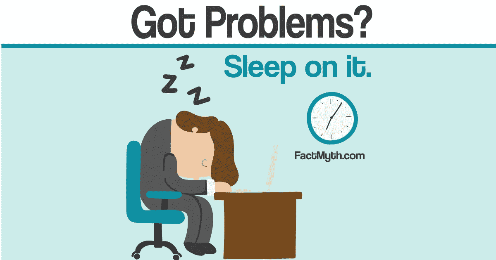
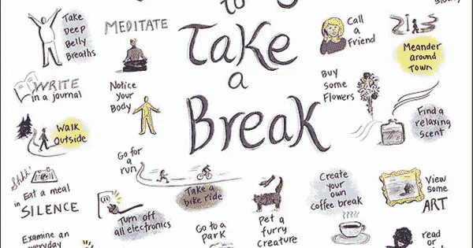

# 需要动力？试试这些简单可靠的提高效率的小技巧

> 原文：<https://medium.com/swlh/in-need-of-motivation-try-these-simple-tried-and-true-productivity-tips-79d1807f277d>

[https://unsplash.com/photos/TAegVkFYIqo](https://unsplash.com/photos/TAegVkFYIqo)

想想这个简单的想法:生产力带来胜利。胜利带来动力。[气势让你势不可挡](https://www.forestco.co/blog/true-momentum-really-makes-you-unstoppable)。不可阻挡意味着动机几乎变得无关紧要。

*   早上 5:45 醒来？小菜一碟一旦你势不可挡！
*   [去健身房](https://www.forestco.co/blog/can-you-handle-the-obsession-needed-to-reach-your-most-insane-goals)？小菜一碟一旦你势不可挡！
*   工作中完成一项艰难或无聊的任务？小菜一碟一旦你势不可挡！
*   [做同一个游戏 2-3 年](http://powerlevelstudios.com)？小菜一碟一旦你势不可挡！
*   [学习新技能](https://www.forestco.co/blog/i-learn-3-new-skills-a-month-and-so-can-you)？小菜一碟一旦你势不可挡！

你明白了。

但这一切都始于富有成效。

> "专注于高效而不是忙碌."— *蒂姆·菲利斯*

富有成效并不意味着比别人工作更多，还意味着工作更有效率。不一样。跳出框框思考。

应用以下 5 个技巧。让他们激励你想出自己的方法。在评论中让我和全世界知道什么对你有用。让我们都富有成效，并建立我们的势头！

# 技巧 1:将任务分成最小的部分

橘子是单一成分吗？

嗯，不。当你把它分解成最小的组成部分时，就有更多的东西了。

我们的很多任务都是相似的。出于某种原因，我们不敢把它分解成更小的组件。

我个人的目标是将所有事情分解成 10-15 分钟的任务。

正如科学所证明的以及本文中所解释的[，每当我们成功完成一项任务时，无论任务大小，大脑都会释放一点多巴胺。](http://themindunleashed.com/2017/12/increase-your-dopamine-levels-naturally-and-never-feel-depressed-or-anxious-again.html)

> 这种习惯也有助于让你朝着目标前进，并清理你头脑中的混乱。—TheMindUnleashed.com

[https://eduwithtechn.wordpress.com/2007/02/26/improving-student-achievement-through-small-wins-introduction/](https://eduwithtechn.wordpress.com/2007/02/26/improving-student-achievement-through-small-wins-introduction/)

# 秘诀 2:从一两个简单的任务开始一天

[https://www.youtube.com/watch?v=3sK3wJAxGfs](https://www.youtube.com/watch?v=3sK3wJAxGfs)

即使我认为自己很有动力，我仍然需要一两次“胜利”来开始我的一天。完成简单的任务后，我有动力和精力去解决真正的难题。

作为一名程序员，我通常从一个简单的 bug 修复或小的 UI 更改开始，这可以在 10 分钟或更短的时间内完成。把代码向上推，把特雷罗卡移到“完成”给了我继续前进的动力。

健身吗？起床后做 10 个俯卧撑。你就可以去健身房了。

写作？从赞美一个你喜欢的作家开始。

或者更简单，从整理床铺开始。我个人觉得这有点太容易了，对我自己的个人目标不起作用，但对其他人有用。

# 提示#3:当你工作得最好的时候，做你最难的任务

对我来说，它发生在早上，就在我完成一两个简单的任务之后。我很早就开始了，大约 2 个小时没有任何分心的事情，而且我有从不久前醒来的所有精力+咖啡+之前完成任务的多巴胺。这是成功的秘诀！

对我来说困难的任务包括游戏设计/平衡和工程新系统。需要我所有脑力的事情。对你来说会有所不同。

> 关键是:不要把你高质量的精力花在不重要的任务上，否则你会因为不重要的任务而得到高质量的结果。

[http://www.matthew2323.info/wp-content/uploads/sites/2/2016/08/sisyphus-267x300-267x300.jpg](http://www.matthew2323.info/wp-content/uploads/sites/2/2016/08/sisyphus-267x300-267x300.jpg)

对于**高度重要的**任务，始终以高质量的结果为目标。就这么简单！

> "没有什么比让根本不应该做的事情变得更有效率更没效率的了."~ *彼得·德鲁克*

# 提示 4:前一天晚上准备好你的第二天

这对早上醒来有很大帮助！在一天工作结束时，我写下第二天要做的所有任务，并在睡觉前回顾一下。这帮助我带着目标感醒来。我知道需要做什么，我想去做！

作为奖励，当我睡觉时，我的大脑一直在工作，所以有时我会想出如何在我睡觉时完成任务的天才想法！每个人都听说过这样一句话:“睡一觉再说”。好吧，这就对了！这已经被多次证明是有帮助的[这里有一个解释](http://factmyth.com/factoids/sleeping-on-a-problem-helps-you-solve-it/):

> 快速眼动睡眠有助于稳定、巩固和增强记忆之间的联系。当我们经历快速眼动睡眠时，白天储存在长期记忆中的信息被激活(也称为排练),并转化为有用的联系。—factmyth.com

# 秘诀 5:休息和放松

你有没有遇到过这样的情况:你花了几个小时解决了一个问题，后来又回到这个问题上，几分钟就解决了？经常对吗？

问题是我们纠结于无法解决的问题。我们用剩下的一点点精力试图弄明白它，但大脑就是不像它应该的那样工作。休息一下吧！这是一项需要练习的技能:弄清楚何时以及如何休息。不要按计划做，那没有意义。当你不能解决一个你应该可以用很少或很少的努力就能解决的问题时，休息一下。

[http://highexistence.com/images/view/50-ways-to-take-a-break-%E2%98%AF/](http://highexistence.com/images/view/50-ways-to-take-a-break-%E2%98%AF/)

我最喜欢的恢复精力的方法是:小睡一会儿，小睡一会儿，散步，淋浴和冥想，没有特定的顺序。

额外提示:不要理会人们对你休息的评价，这是你应得的休息。

人们可能会给你贴上懒鬼的标签，但他们错了。忽略他们，收获回报，比他们更有生产力！

# 结论

记住，不可阻挡的一切都是从更有效率开始的。

通过一系列小的生产力胜利，你发现很难被激励的任何事情都可以变得简单。

上面的建议有助于你管理你的期望，也有助于尊重你的身心。

你试过应用这些技巧吗？

哪些适合你？

你个人最喜欢的建议是什么？

欢迎在评论中分享你的经历，并激励世界上的其他人！

你能做到的！

**感谢阅读和分享！:)**

**如果你喜欢这个故事，请随意鼓掌几下(说真的，最多 50 下)。对于生产力和其他方面的额外帮助，请查看 dannyforest.com 的******。****

****

## **这篇文章发表在 [The Startup](https://medium.com/swlh) 上，这是 Medium 最大的创业刊物，拥有 288，884+人关注。**

## **在此订阅接收[我们的头条新闻](http://growthsupply.com/the-startup-newsletter/)。**

****