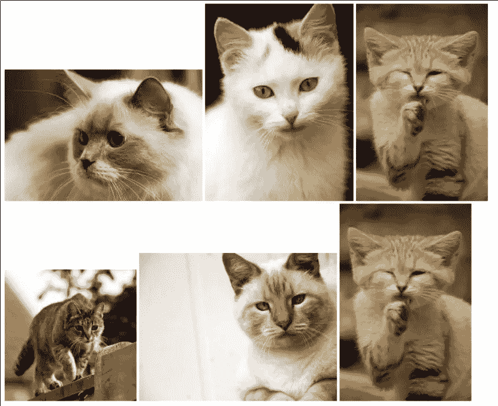
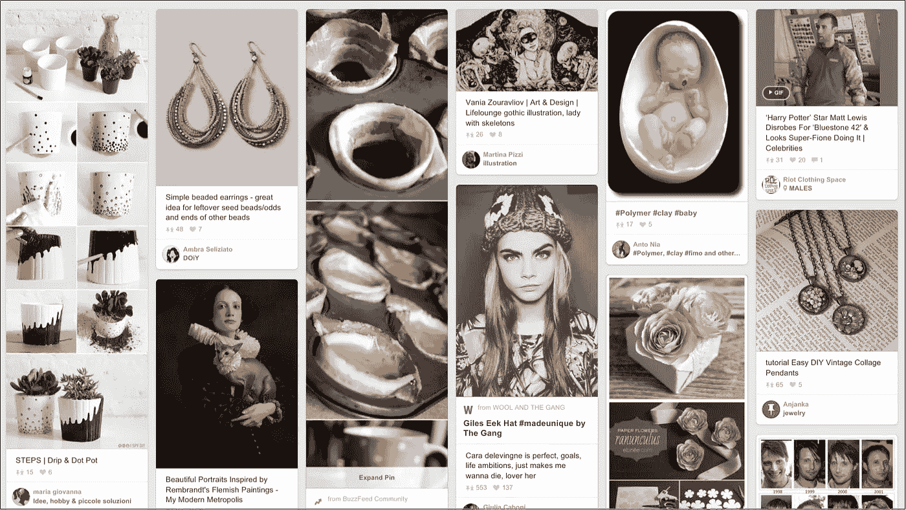
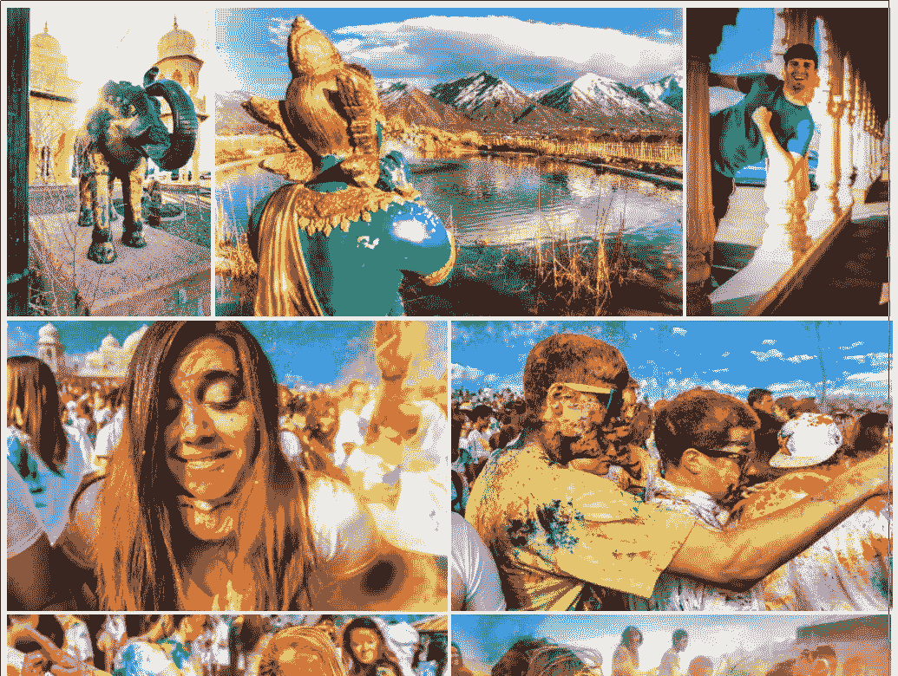
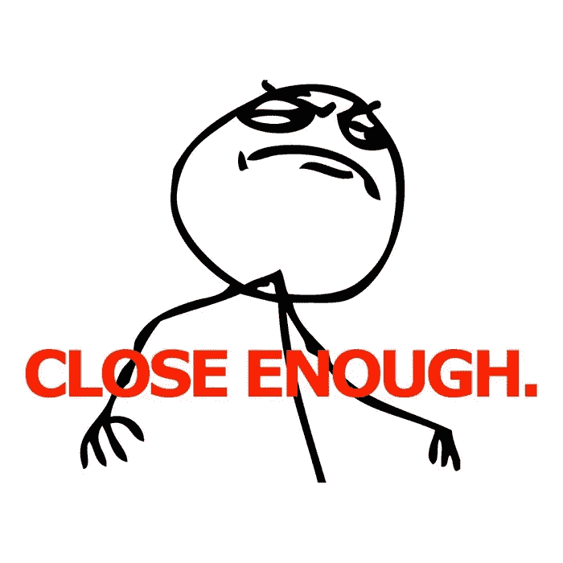
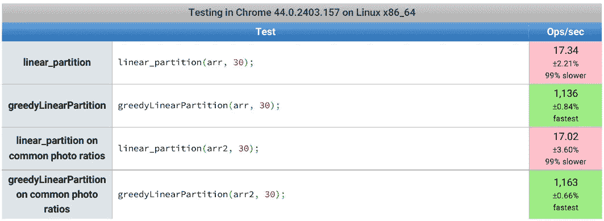

# 寻找完美的图库

> 原文：<https://medium.com/swlh/in-search-of-the-perfect-image-gallery-34f46f7615a1>

让我们面对现实:在一个反应灵敏的世界中显示图像并不容易。

在网页设计师的天堂里，所有的相机都会拍摄正方形图像，所以我们幸运的网页设计师会很容易地添加一个简单的标签列表，并最终玩一些 float: left 或某种 flexbox 的游戏。然后，他们会在下午 4 点关闭笔记本电脑，出去参加一些社交活动。

不幸的是，对于我们亲爱的网页设计师来说，实际上并不是这样。照片可以是水平的(风景)，垂直的(肖像)或方形的。当你需要把一堆不同长宽比的图片放在一起时，你会努力弄清楚如何让整个东西看起来像一个专业的照相馆，而不是一片混乱。

that’s what I mean with “total mess”

解决这个问题的一个显而易见的方法是，像杂志图片编辑一样思考，调整图片的大小和位置，使它们看起来很棒。然而，这种方法不是可行的选择，因为它基于三个假设:

1.  我们是优秀的图片编辑
2.  我们有时间仔细调整数百张照片的大小和位置
3.  网站比例是固定的

因此，基本上我们需要的是某种自动化，允许我们盲目地将我们的图像添加到图库中，然后将它们漂亮地放置。我们还希望能够在糟糕的 iphone 4 和 IMAX 屏幕上看到这些小猫。

所有这一切意味着我们亲爱的网页设计师将无法有社交生活，因为他们将不得不处理媒体的询问和基于百分比的布局，而他们的客户将开始抱怨他们浪费所有的时间在一个该死的简单的图库上，而他们的堂兄弟的一个朋友可以在五分钟内完成。

然后，当我们可怜的网页设计师开始失去任何希望时，一个名为 [pinterest](https://www.pinterest.com/) 的网站推出了一个可能解决所有邪恶的灵丹妙药:砖石布局。

masonry layout on pinterest

砖石很棒！你可以放入任何长宽比的图像，这段智能的 JavaScript 代码会填充照片中的空隙，并保持所有元素的固定宽度。也很容易配置它来减少小屏幕上的列数，最终在那个蹩脚的旧 iphone 4 上只有一列。

然而，这种解决方案已经开始太受欢迎了，所以，就在我开始有一些社交生活的时候，我决定我需要寻找一种替代方案。

在打印的布局中，图像放置在不同的基线上是很少见的。砖石侧重于列，印刷设计师通常侧重于行，所以我开始寻找一种方法来固定行高而不是列宽。我已经找到了一些不错的解决方案，如 [jquery-collagePlus](https://github.com/ed-lea/jquery-collagePlus) 或 [Justified-Gallery](http://miromannino.github.io/Justified-Gallery/) ，然而真正让我震惊的是 [chromatic.io](http://www.chromatic.io/) 使用的图库

chromatic.io gallery

这个图库最大的特点是它总是试图让行的高度接近屏幕高度的一半，并且它总是会产生一个完美的矩形图库，而不会在页面末尾留下任何空白。

幸运的是，chromatic 的人发表了一篇文章[和他们为达到这一点所做的所有研究，我强烈建议你看一看。](https://www.crispymtn.com/stories/the-algorithm-for-a-perfectly-balanced-photo-gallery)

基本上他们做的是:

*   将窗口高度除以 2，找出单行的理想高度
*   假设调整图像大小以适合理想的高度，使用所有图像宽度的总和来猜测我们需要的行数

*   使用归一化图像比率作为权重，使用 perfectRowsNumber 作为我们的 k，解决线性分区问题
*   计算每个映像必须有多大的尺寸才能适合我们的分区阵列
*   最后，他们简单地用这些尺寸的 div 填充 DOM，并使用实际的图像作为背景

所有需要的代码都可以在 [github](https://github.com/crispymtn/chromatic-ui) 上免费获得，他们还提供了一个 [jquery 插件](https://github.com/crispymtn/chromatic.js)，但是它没有得到很好的文档记录，并且有很多额外的功能，所以我决定创建我自己的版本来做一件事，并试图把它做好:给定一个由图像的来源和纵横比描述的图像数组，返回一个由图像的精确尺寸描述的图像数组，让它们适合我们的完美布局。

最初，我试图简单地从他们的 CoffeeScript 源代码转换 linear_partition 函数，但突然我意识到它太复杂，计算量太大，不符合我的要求。所以我开始在网上阅读关于线性分区问题的可能解决方案。chromatic 所遵循的方法在此处被描述为[，并且允许找到最优解。](http://www8.cs.umu.se/kurser/TDBAfl/VT06/algorithms/BOOK/BOOK2/NODE45.HTM)

盯着所有这些数学符号开始头疼，我跑去寻求另一个众所周知的万灵药的帮助:[维基百科](https://en.wikipedia.org/wiki/Partition_problem#The_greedy_algorithm)。

根据该文章，将简单地将每个元素推到最小的可用分区的贪婪算法已知给出了最优解的 7/6 近似值。所以我决定写一个贪婪的线性划分算法，看看它与最优算法相比表现如何。

这是我的 greedyLinearPartition 算法:

首先，我做了一支[笔](http://codepen.io/axyz/full/VLJrKr/)，看看它在定位图像时表现如何。这不是完全相同的彩色最佳版本，但它似乎是我可以接受的。

现在，让我们看看使用贪婪算法，我们将获得多少速度。我已经准备了一个 [jsPerf](http://jsperf.com/greedy-linear-partitioning) 来看看这两个算法如何在一些随机的样本数组上执行，既有完全随意的，也有类似实际照片比例的。

结果是惊人的，也许 linear_partition 代码可以优化:它使用下划线并直接从 CoffeScript 转换而来，但是在每秒操作数方面的差异确实很大，因此它可能会在较慢的设备上产生一些很大的差异。

我已经在 github 上发布了完整的代码作为[完美布局](https://github.com/axyz/perfect-layout)，它也可以在 [npm](https://www.npmjs.com/package/perfect-layout) 和 bower 上获得。

请随意使用和贡献，我真的很想看看它会如何发展(我在考虑惰性加载和无限滚动支持)，但始终保持模块化的方法，以便那些只需要简单布局的人不会被未使用的代码弄得臃肿。

[阅读第二部分](/@axyz/in-search-of-the-perfect-image-gallery-part-2-48f04c84ac34)

*发表于* **创业、旅游癖和生活黑客**

-