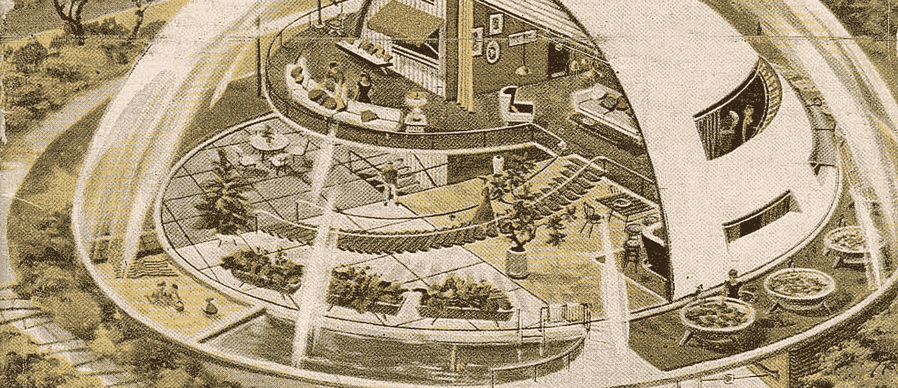
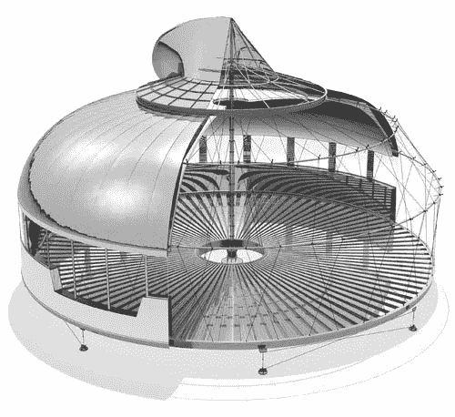

# 在未来，每个人都将有 15 分钟的创作时间。

> 原文：<https://medium.com/swlh/in-the-future-everyone-will-be-creative-for-fifteen-minutes-4c8f8d84911a>

我们被许诺未来会飞的汽车和机器人奴隶。我喜欢我的智能手机，但如果未来看起来不像 80 年代，就掐我一下。我责怪有创造力的人。

就拿我家来说吧。这是一栋相当不错的建筑，但它和世界上其他的房子一样。油漆覆盖干墙，干墙覆盖间隔正好 16 英寸的木梁。

我是唯一一个为此烦恼的人吗？

我觉得奇怪的是，普通家庭与街对面的家庭难以区分。它可能是去年或半个世纪前建造的，公式是一样的。如果说有什么不同的话，那就是这些年来，材料变得更便宜了，建造质量也下降了。

*我知道你在想什么。阿德里安，如果每栋房子都是艺术品，没人会买得起的请允许我不同意。*

**让我们做一个思想实验。试着想象一个世界，在那里每个人都突然开始发挥他们全部的创造潜力。结果会是乌托邦还是世界末日？**

有些人可能会说，社会将陷入停滞。谁会做所有的体力劳动？总得有人来翻动汉堡。如果我们的会计师太有创造力，我们怎么能相信他们的数字呢？手术不是自我表达的地方。创造力对邮递员或出租车司机有什么好处？

## 有没有可能总会有不需要创造性思维的工作？

上周末做一些家庭保养的时候，我思考了这个问题。我想象着，如果建造我的房子的双手是由一个有创造力的头脑驱动的，一个用他的一生来掌握建筑艺术的人，我的房子会有多么不同。

Buckminster Fuller’s Failed [Dymaxion House](https://en.wikipedia.org/wiki/Dymaxion_house)

当我想象这个虚构的建筑者时，我开始为他感到难过。他肯定会沮丧，因为尽管他有一个更好的房子的愿景，但他会面临惊人的阻力。他没有权利偏离蓝图。他没有预算去选择更好的材料。如果他的新想法出了差错，他不会被允许失败。最重要的是，他将与很久以前决定我们的房子以某种方式建造的社会期望作斗争。

对创新略知一二的巴克明斯特·富勒说:

> “你永远无法通过对抗现有的现实来改变事情。要改变什么，就建立一个新的模式，让现有的模式过时。”

起初，让一名建筑工人承担创造力似乎有些残忍。相反，给他一个教育，教他“正确的”建房子的方法，似乎是富有同情心的。给他简单的工具，一个公式，一个老板，确保他永远不会偏离计划。他拿到了薪水，我们得到了基本上足够好的廉价房子。

但是等等。我的理想主义场景问，如果*每个人*都充分发挥他们的创造潜力，世界会是什么样子。关键词*大家*。如果是这样的话，建筑工人会兴旺发达。他老板的障碍转化为相互合作。预算和材料由提供额外协作的专家控制。社会的使命不是负担得起的顺从，而是进步和创新。

*理想主义？*

确实如此。但我喜欢想象这个世界。如果我们与之互动的一切都拥有工艺的完整性，那该有多好。

没人指望你改变世界。很可能你的工作描述是为了减轻创造性的负担。即使我们这些在所谓的“创造性”领域工作的人也有无数的借口让我们避免尝试真正创新的工作。不一定要这样。

不，我们不存在于一个要求我们每个人都有创造力的世界。相反，我们下班回家，在我们称之为家的立方体的墙上贴上补丁。

是的，我们相信英雄能够超越束缚我们的体制。偶尔，当一个艺术家完成了不可能的事情，我们能够见证一个如此伟大的创造，它成功地摆脱了地球的束缚，触摸到了上帝的面孔，我们仍然会欢呼。那是我想住的地方。

*嘿，感谢阅读。如果你喜欢这篇文章，你可能会喜欢艾萨克·阿西莫夫的头脑风暴建议或者我写的活死人艺术。一如既往，你的推荐和分享对我写作有很大帮助。保持创造力。*

发表于*[**【SWLH】**](https://medium.com/swlh)**(***创业、流浪、生活黑客)**

******