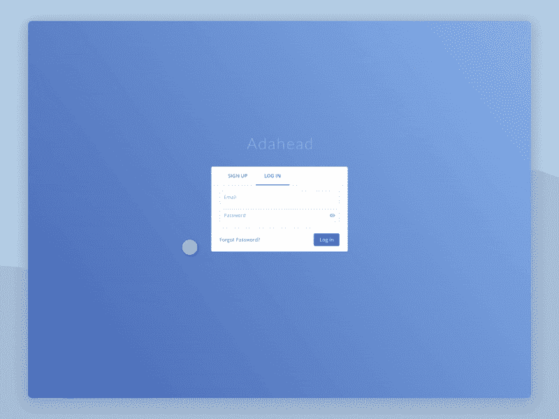
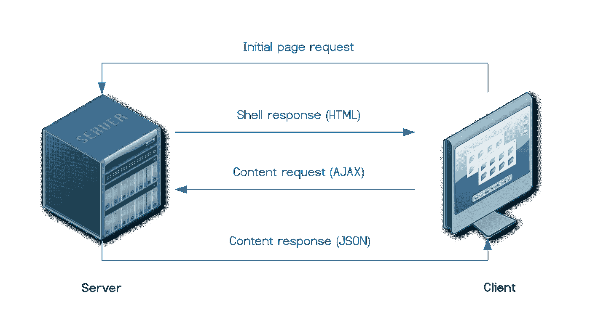
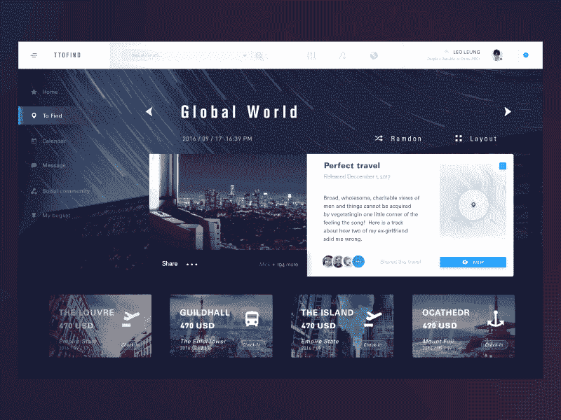
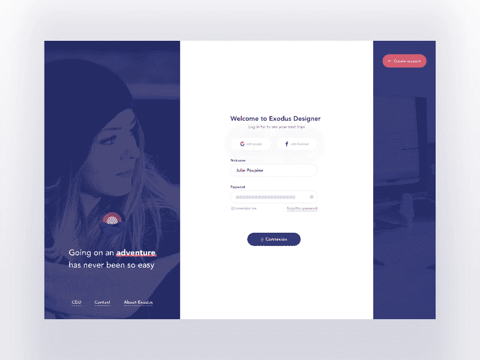
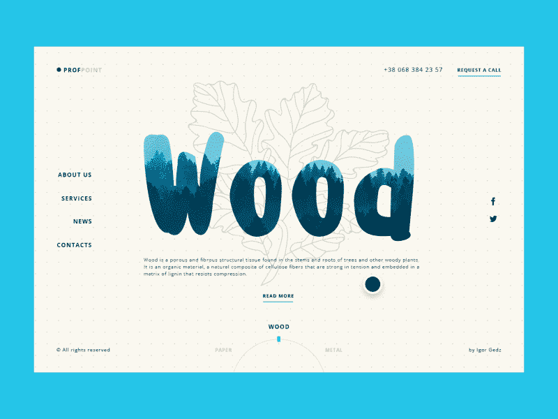
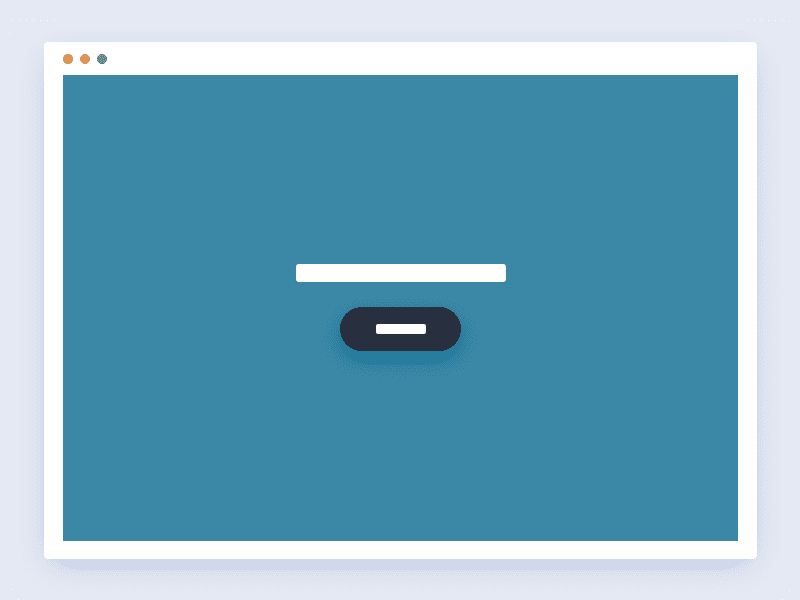

# 以 SEO 的名义

> 原文：<https://medium.com/swlh/in-the-name-of-seo-89631269a1ca>

## 单页应用的服务器端渲染

Image credit: Pankaj Patel

T 移动优先的应用程序开发趋势改变了我们对内容交付方式的预期。基于网络的应用程序比移动应用程序占优势的领域并不多。至少在娱乐方面，我们完全迷上了 iPhone 或 Android 应用。移动应用程序最习惯和暗中苦心经营的品质之一是屏幕之间转换的速度和流畅度。

这些天来，我们准备授予我们的应用程序的等待时间非常短，这使开发者陷入了优化和改进的深水区。更重要的是，基于网络的应用程序必须跟进并模仿移动速度，以便对 2018 年急躁的用户保持友好。

# 单页应用程序

移动 UX 确实依靠实时过渡和[动画](https://shakuro.com/blog/grasping-meaningful-ui-animation/)来说明用户输入。传统的页面刷新/重新加载是网站体验的一个属性，为了创建一个持续的无缝交互，这一点必须取消。因此，相当多的网站开始以单页面应用程序(SPA)的形式运行。

从技术上来说，SPA 是一个页面，一旦你打开网站，它就会完全加载。当你在网站上移动时，不同的页面会动态加载。这允许在桌面上模拟平滑的移动应用程序 UX。

Image credit: [Gregory Muryn-Mukha](https://dribbble.com/murynmukha)

也就是说，与传统的多页面平台相比，有一个很大的缺点，那就是只有相当少的网站是以 SPA 的形式建立的。缺点是搜索引擎优化或者 SEO。

# SEO 友好型 SPA

搜索引擎机器人(又名网络爬虫)的标准行为与 SPA 无关，因为 SEO 所依赖的所有内容都不存在。它在客户端按需生成、提取和显示。为此，许多网站使用异步 AJAX 调用，这基本上是 JavaScript 将新内容代码从服务器仓库注入特定页面，而无需在浏览器中重新加载整个网站。

> 所以，对于一个网络爬虫来说，SPA 是一个没有显著内容的空壳，这对 UX 来说是好事，因为用户不必看到页面重新加载并留在口袋里。

这种架构允许快速交互和类似移动应用的感觉，但是它在 SEO 方面表现如何呢？当你想到一个很难被搜索引擎索引的高质量内容，以及理解排名是如何工作的，这是很有意义的。

看到有多少 SPA 网站依赖内容，这几乎是违反直觉的。他们的主要推广媒体是他们制作的原创内容，这些内容也必须以适当的方式呈现。这让我们处于一种奇怪的状态，你要么推动 UX，努力实现无缝过渡，要么充分利用你制作的内容，确保它能很好地在谷歌上搜索。

# 网络爬虫搜索引擎优化

关于 SEO 的一个常见误解是，如果页面没有完全呈现在浏览器中，网络爬虫就无法浏览页面。他们看到从后端发送的 HTML 代码，根本不认为这是有意义的内容。

因此，如果你用 JavaScript 修改了你的内容页面，谷歌制作了一个名为“谷歌抓取”的[工具](https://support.google.com/webmasters/answer/6066468?hl=en?utm_campaign=chrome_series_fetchgoogleweb_111717)，向你展示它在页面上看到的内容。事实证明，Googlebot 可以使用异步 JavaScript。

> *Googlebot 会给网页至少 20 秒的时间来完成异步调用。*

与此同时，虽然客户端内容呈现对于 Googlebot 来说是相当安全的，但仍然存在一些问题:

*   一些网站的特定架构可能会出现边缘情况，导致 Googlebot 无法呈现内容。
*   现代 CSS 会给 Googlebot 带来问题，并阻止内容被抓取。
*   甚至索引页面也可能排名不正确。

为了保持相关性，Googlebot 的工作方式类似于浏览器。正如 2017 年[所说](https://www.youtube.com/watch?v=RAhYnK0v3rk)，GoogleBot 是基于 Chrome v.41 来抓取网页的，目前还没有更新。Chrome 的当前版本是 66，这意味着该机器人在抓取网页时不会看到最新版本 Chrome 看到的所有内容。最重要的是，自 41 年以来，已经发布了许多新的 API，据称，Googlebot 无法基于这些 API 渲染和索引页面。

> *这让我们陷入了一个兔子洞，我们在构建 web 应用程序时不得不考虑旧的浏览器，以及基于这些旧版本的网络爬虫。*

Image credit: [Denis Krol Krasavchikov](https://dribbble.com/krolone)

# 解决方案

因为我们希望我们的网络应用程序不仅看起来好，感觉好，工作快，我们希望他们被访问，也就是说，被搜索引擎找到。从这个角度来看，SEO 是一个至关重要的工具(可以说是唯一的工具)，必须明智地对待它。

水疗对 UX 有好处，但在商业上可能表现不佳——没有得到正确的调整。其中一个调整是服务器端渲染。

# 服务器端呈现(SSR)

SSR 原理基于在请求和响应交换期间在 web 服务器部分呈现页面的 SPA 架构。这通常是通过虚拟文档对象模型(VDOM)运行 web 应用程序来实现的。

当应用程序的状态改变时，VDOM 转换成 HTML 代码串，然后注入到页面中并发送给客户端作为响应。在客户端，JavaScript 通过现有的 shell 分发接收到的数据。

Image credit: [Leo Leung](https://dribbble.com/leoleung)

SSR 方法使页面对 SEO 可见，因为无论网络爬虫是否使用异步 JavaScript，内容都在那里。

同时，SSR 可能包含一些缺点:

*   **费用**。实施 SSR 需要更多的时间和金钱。
*   **有限的后台环境**。SSR 仅适用于 Node.js。非节点环境后端(如[V8](https://github.com/phpv8/v8js)Javascript Engine for PHP 或 React Pre-Rendering via[RPC](https://github.com/musawirali/preact-rpc))的功能是可用的，但仍然很少。
*   **庞大的代码**。就 API 和对象而言，SPA 代码必须能够在客户端浏览器和服务器端 JavaScript 环境中工作。
*   **复杂的 UI 交互**。满足现代 UI 原则所需的大量 JavaScript 代码几乎抵消了 SSR 的优势。使用静态应用程序外壳可能更好。
*   **“一个六个，另一个半打”**。SPA 将对请求产生额外的负载，这取决于内容的类型，可能会降低响应速度，至少在初始缓存负载时是如此。

为了让 SSR 为您的特定应用程序工作，您必须首先决定您是否需要它。

# 你需要 SSR，还是？

事实是，你的网络应用的搜索引擎优化可能与正确的 SSR 配合得最好。同样，如果没有它，你的应用程序的 UX 可能会更好。这完全取决于您的 web 应用程序的目标和细节。有一些变通办法可以在不中断流程的情况下为您节省大量资源。

要定义关于 SSR 的进一步行动，请考虑以下事项:

## 你活动的焦点

SPA 的价值必须基于文本内容或性能。换句话说，你的应用是以内容为中心还是以行动为中心。

> 如果你希望你的用户在登陆一个页面后马上执行某种操作，你不需要 SSR。

SSR 需要一些时间来完成请求和装载内容。结果，你的用户可能会陷入页面可见但不可操作的模糊状态。如果你和一个有经验的用户打交道，这可能会让他们感到沮丧。点击和点击 UI 元素只会让事情变得更糟。

如果你的内容是基于文本的，用户希望立刻看到文本，那么内容供应必须是稳定的，并且非常敏感。同时，它必须是可抓取的，以适应您的搜索查询。

Image credit: [Zhenya Rynzhuk](https://dribbble.com/Zhenya_Artem)

## 证明

需要你的内容的 SSR 来立即吸引你的用户进行文本或视觉对话。在我们这个焦虑和数字成瘾的时代，这是极其重要的。然而，有一个你可以挤进去的容差窗口。那扇窗是习惯的力量。

由于多年的在线经验，我们已经习惯了请求-响应的情况。我们不期望一个人立即做出反应。这就是为什么我们有这个💬同样，如果输入正确，我们可以容忍页面重载。登录就是这样一种输入。

> 如果你的网络应用有一个可以发挥其最大潜力的用户区域，你就不需要 SSR。

把它想象成一扇门。为了进入房间，你必须打开它，走进去，然后关上它。这是一件自动驾驶仪的事情，一点也不会让我们沮丧。也就是说，一旦你在房间里，你就不能再容忍任何障碍了。

Image credit: [Gabriel Avédikian](https://dribbble.com/gabrielavedik)

## 内容-大量的第一页负载

如果你的 SPA 是内容密集型的(带有独特的文本信息)，那么你很有可能使用深度链接来链接到你网站上的具体的、通常可搜索的或有索引的内容。

> *利用深度链接进行推广的 SPA 可以从 SSR 中获益。*

关于深层链接的事情是，每当用户点击它，他们希望立即重定向到相关的内容。这意味着内容必须在第一次页面加载时就存在。为了在不破坏体验的情况下保持流量和当前值，请使用 SSR 作为处理 HTML 和解析 JavaScript 或其他请求的最快方式。

Image credit: [Igor Gedz](https://dribbble.com/gedz)

## 关键词和社交分享

就像我们说的，Googlebot 可以执行 JavaScript，解析和排名 spa。并不是所有的网络爬虫都能够做到这一点，但是它们都能够处理来自服务器的内容响应。

> *如果关键词对你的应用程序的搜索引擎优化很重要，比如在经营一个在线商店的时候，SSR 是必须的。*

单页应用程序的 UX，特别是在电子商务中，要求内容显示没有延迟。反过来，SEO 需要内容在页面上，以便阅读它并对页面进行排名。

Image credit: [Oliver Dead](https://dribbble.com/oliverdead)

# SSR 工具

由于可以使用 SSR 或部分 SSR 的 spa 的变量范围很广，因此除了手动配置 SSR 之外，没有更好的方法。大多数 SSR 是在 JavaScript 框架中完成的，如 Ember、React 或 Angular。正如我们所知，当搜索引擎优化对业务很重要或者最初的内容呈现很重要时，SSR 对于依赖此类框架的单页面应用程序很重要。

## Ember 快速启动 1.0

[Fastboot](https://ember-fastboot.com/) 通过 Node.js 运行 Ember web 应用程序，并使用初始 HTML 进行响应，然后在浏览器中运行。

## ReactDOMServer

[ReactDOMServer](https://reactjs.org/docs/react-dom-server.html) 是 React API 的一部分。它的目的是将组件呈现为 HTML 字符串。这个工具还在开发中，需要大量手工操作 React Router 和 Redux 库，才能使它们在部分服务器/客户端应用程序渲染的条件下工作。

## Vue.js & Nuxt.js

[Vue.js](https://vuejs.org/) 就像 Node.js 服务器和 SPA 代码之间的粘合剂。浏览器加载 VueJS 应用程序的过程叫做*水合*。Nuxt 是一个使用 Vue.js 创建通用应用程序的框架。它旨在解决使用 Vue.js 配置 SSR 的任务。

## 角度通用

[Angular Universal](https://universal.angular.io/) 是居于 Angular 和 Node.js 之间的中间件，简单来说，AU 就是“Angular 应用的服务器端渲染”，统一了 SPAs 的高性能和 UX 以及静态页面网站的 SEO 责任。

# 外卖食品

无论用户使用哪种类型的应用程序，都要给用户一致的体验，这一理念是由移动技术的可用性进步决定的。然而，网络在访问方面是不同的。你可以创建一个快速而漂亮的单页应用程序，但你不能像安装移动应用程序一样把它安装在别人的笔记本电脑上。这意味着你的 SPA 必须能够被网络爬虫搜索和索引。

> *实施 SSR 需要大量的手工工作，因此您必须事先考虑是否值得。为此，看看你的水疗中心的 UX 以及业务逻辑。*

Image credit: [Sebastiano Guerriero](https://dribbble.com/Sebastiano_Guerriero)

2017 年，我们见证了开发者对不同框架内 SSR 状态的兴趣不断上升，不仅仅是 JavaScript。像 Ember 和 Angular 这样覆盖 SPA 整个架构的主要框架都对在其中集成一个可行的 SSR 解决方案感兴趣。

与此同时，还有一些有希望的附带项目，如 Next.js 和 Nuxt.js，它们希望在现有框架内建立一个稳固的 SSR 结构。

## 这个故事发表在 [The Startup](https://medium.com/swlh) 上，这是 Medium 最大的创业刊物，拥有 323，238+人关注。

## 在这里订阅接收[我们的头条新闻](http://growthsupply.com/the-startup-newsletter/)。

