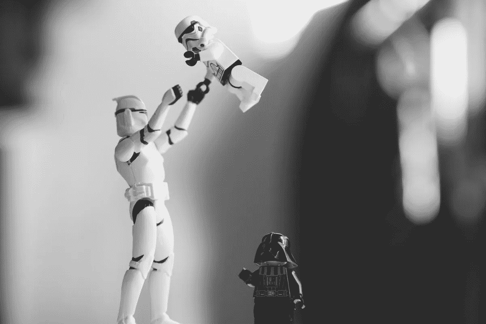

# 在与旧:如何利用怀旧来改善你的营销

> 原文：<https://medium.com/swlh/in-with-the-old-how-to-use-nostalgia-to-improve-your-marketing-e7ffc3de9696>

## 如果运用得当，怀旧可以深入你的观众，在更基础的层面上与他们建立联系。

Ah, those were the days…

# 回顾过去

除非你过去几年一直生活在岩石下，否则你会注意到一些奇怪的事情。

所有的事，所有的人，似乎都在回望过去，拥抱过去。

像《奇异事物》这样的热门节目是对 80 年代电影的致敬。好莱坞翻拍了如此多的电影，以至于很难找到一部电影没有经过他们的处理。排行榜音乐目前听起来像 80 年代，只是有一些更新的产品和更好的发型。

甚至社交媒体也参与进来。脸书促使我们分享过去“记忆”。Instagram 和 Twitter 上充斥着#ThrowbackThursday 帖子，让我们得以一窥过去的生活。

这种怀旧感进一步延伸到营销和广告领域。

英国巧克力制造商吉百利最近带回了他们标志性的牛奶托盘电视广告。

这是灌输过去更好的感觉的直接方法，所以让我们再把它带回来。

政治家们也接受了这种技术。川普承诺*【让美国再次伟大】*，这实际上暗示着一切将回到过去。在英国，英国退出欧盟运动者鼓吹一种回到欧盟存在之前国家的方式。

在这两种情况下，公众都欣然接受。似乎每个人都在回顾过去，希望事情能像以前一样。

说到营销，这提供了一个成熟的机会。

**这是因为怀旧提供了与观众情感的直接联系。**

# 情感的力量

任何称职的营销人员都很清楚情感对营销活动的影响有多大。

让你的观众开心，或者让他们难过。拨动他们的心弦，或者吓死他们。他们怎么想并不重要，重要的是他们真的这么想。

神经成像研究发现，当消费者评估一个品牌时，他们更依赖情感而不是信息。

尽管我们喜欢认为自己是理性的机器，但事实是，在做决定的时候，我们非常不理性。这包括购买决策。

这意味着我们更关注产品给我们的感觉，而不是考虑事实。

事实是一部分，你需要确保你告诉你的观众。然而，如果你想达成交易，你需要在情感层面上吸引他们。

*这是为什么？*

嗯，这一切都要追溯到我们史前祖先的时代。当时的世界是一个更加恐怖的地方，掠食者总是在拐角处伺机出击。

比方说，当我们的祖先面对一只剑齿虎时，他们有两种选择:战斗或逃跑。

但正是这种强烈的恐惧促使他们采取了行动。

强烈的情绪可以绕过嗯嗯和啊嗯，为你做决定。

那时候，这意味着你没有拖延逃跑，你会活着，改天再战。(我应该是个诗人。)

现在，这意味着你必须买一部新的 iPhone，否则你会错失良机。

如果你想让你的听众做出决定，你需要在情感层面上与他们交流。

恰好怀旧是做到这一点的一种极其有力的方式。

# 怀旧的力量

还记得小时候吗？

一切都是新的。每天都有新的经历或情况需要你去处理。

新的经历让我们猝不及防，当我们年轻时，我们经常被从未感受过的情感所淹没。

随着时间的推移，这些原始情绪的强度会减弱，一旦我们成年，我们就完全可以控制了。

这意味着营销很难真正影响我们的情感。

现在，我想让你为我做点事。

闭上眼睛一秒钟，想想你的初吻，或者你的初恋。想想那次你做了个噩梦一夜没睡，或者第一次宠物死了。

尽可能地回想一些最生动的童年记忆，想象你就在那里。

完成了吗？太好了！

回想你的童年和你的经历，会引发强烈的情感。本质上，你正在回复到你当时的感觉。

你可能没有意识到，但回忆起童年的记忆会引发情绪反应。

它几乎可以压倒一切。

**这是因为对我们来说，回忆一种我们曾经感受过的情绪比从头产生它更容易。**

当营销活动试图引发一种情绪时，这是一场艰苦的战斗。

人们会立即对任何营销产生怀疑，并自我封闭。他们不希望公司操纵他们，所以他们限制自己的情感输出。

他们试着什么都不感觉到。

这使得营销人员几乎不可能。

怀旧绕过了那些障碍，突破了那些防御，偷偷溜进了雷达下。

当一个公司利用怀旧时，他们的观众不可能调节他们的情绪。

如果有什么东西触发了他们童年的记忆，那么他们就无法抑制。这种回忆会在他们内心产生强烈的情感。

我们的大脑是用来寻找联系和模式的，所以我们可能会不经意地将这些感觉与促使我们感受到它们的品牌联系起来。

**这种联系在潜在客户和公司之间形成了一种亲密的个人纽带。**有价证券。

但是你需要小心…

# 太过分了

听起来很糟糕，在营销中使用情感可能会疏远你的观众。他们可能会称之为*操纵型*。

当你试图在理性和逻辑的层面上操纵他们时，人们不会太介意。他们希望你向他们推销产品的特性和优点。他们可以简单地推脱购买，继续前进。

然而，当你开始玩弄人们的情感时，你最好小心行事。如果潜在客户意识到你一直像弹奏四弦琴一样拨动他们的心弦，他们会发疯的。如果他们疯了，那么他们很可能不会做出那个至关重要的购买决定。

这是坏消息。

把事情推得太远，你会得到与你想要的相反的结果。

*好消息？*

当你把事情做得太过分时，你很容易就能看出来。

不要忘记，你(嗯，你们中的大多数)也在情感层面上对事物做出反应。也许你们中的一些人比其他人做得更多，但在一定程度上你们都是这样。

这让你很好地洞察你的营销是否走得太远。

如果“感觉不对”，内心深处你有一种不安的感觉，你不应该做某事，那就不要做。那是你的直觉告诉你你做得太过分了。

一场让其创造者感到不安的运动，必然会对受众产生同样的影响，甚至可能更大。

经验之谈:继续努力，直到你觉得自己已经走得太远了。获取一些外部意见。

**如果人们觉得被操纵了，那么你需要减少竞选中的情感因素。**

# 如何利用怀旧

现在是有趣的部分。

我解释了怀旧是多么强大，它如何在基本层面上挖掘情感，以及情感是如何促使人们采取行动的。

我想这意味着是时候谈谈如何在你的营销中运用怀旧了。

一如既往，最好的学习方法是通过例子。因此，我精心挑选了一些很好的运动，它们很好地利用了怀旧情绪。

我会解释是什么让它们滴答作响。

## Spotify——永无止境的故事

Never ending stoooory!

我不知道你怎么想，但是我喜欢这部电影。我记得小时候看着它，当 Atreyu 的马 Artax 在悲伤的沼泽中慢慢死去时，我泪流满面。

如果这句话对你有任何意义，那么你就会明白为什么 Spotify 的广告如此有效。

蹩脚的 CGI，标志性的配乐，以及 Falcor(飞龙狗的东西)原声演员的使用，所有这些都让观众回到了年轻时的自己。

这就好像我们在重新观看我们喜爱的童年电影，因此我们在情感上敞开了心扉。

Spotify 如何阻止它走得太远？他们在广告中注入了一点幽默。

Atreyu 现在大约 40 岁，留着浓密的大胡子，开玩笑说:

我不敢相信这么多年后人们还在听这首歌

是在观众的悬念上开的一个小玩笑。是的，我们要带你回到你的童年，但你还是会定期去那里，所以有什么问题吗？

这是一个聪明的让你分享笑话的方法。这个广告不再是针对你，而是针对的**你。**

我已经是 Spotify 的客户了，但如果我不是，这肯定会让我三思。

顺便说一句，这也让我想重温永不落幕的故事。

## Adobe Photoshop 草图—鲍勃·罗斯

Check out those brushstrokes.

作为一个英国 90 年代的孩子，我从来没有在电视上看到鲍勃·罗斯的喜悦，但我知道他在大洋彼岸有多少追随者。

事实上，如此之大，以至于 Adobe 用他(由一名演员扮演)来展示他们在 iPad 上的 Photoshop Sketch 应用程序。

在这个视频中，鲍勃·罗斯平静而安详地给出了如何使用该应用程序的教程，并向你推销他的功能。

对许多人来说，鲍勃·罗斯将唤起童年的惊奇感，并立即将他们带回到过去。

这让他们有机会消化鲍勃·罗斯替身告诉他们的话——这款应用非常棒，任何艺术家，无论是有抱负的还是专业的，都应该赶紧去下载它。

在一个充满无聊的 informercial 式教程的世界里，很高兴看到 Adobe 尝试一些不同的东西。

也许我唯一的抱怨是，他们基本上重复了鲍勃·罗斯的表演，没有自己的观点，也没有添加自己的即兴表演。

Spotify 狡猾地拿他们年长的、留着胡子的 Atreyu 版本开玩笑，这让我们也开了这个玩笑。

Adobe 做不到这一点，Adobe 可能会因此失去一些观众。

## sunny D-直排轮

Totally radical, man.

在这个广告中，Sunny D 模仿多年前他们自己的广告活动，将怀旧情绪推向了一个新的高度。

扎染衬衫“kidults”轮滑到郊区的一个家里，从冰箱里拿一些阳光 D。

其中一位母亲停下手中的活，宣称她已经受够了，这些成年人都 36 岁了，需要表现出他们的年龄，找份工作。

这是对 Sunny D 的旧广告的一个很好的回归。他们没有重复，甚至添加了新的一层，暗示 90 年代广告中的人一直在不停地滑旱冰和喝 Sunny D。

当现在的成年人看到找工作的前景放声大笑时，他们就开始取笑 90 年代的孩子。这是对高失业率和那一代人被误解的懒惰的微妙暗示吗？

该广告乐观而轻松的怀旧风格深情地回顾了一个时代，但也暗示着是时候走向未来了。

# internet Explorer——90 年代的孩子

I was a Hungry Hippos pro.

我不记得上次使用 Internet Explorer 是什么时候了。抱歉微软。作为一名 mac 用户，即使我想，我也做不到，让我们面对现实吧，我不想。

但是这个广告至少把我带回了童年时在 Internet Explorer 上度过的时光:更新我的 MSN，从 Limewire 下载歌曲，查找我最喜欢的视频游戏的指南。

它以 90 年代流行文化时刻的蒙太奇为特色，任何 90 年代的孩子都会记得，无论是天真还是不安的痛苦。

无论哪种方式，微软都不隐瞒他们想让你怀念那个时代的事实。几乎鼓舞人心的音乐、明亮的色彩和铿锵有力的画外音都是为了让你回到 20 年前。

我想问题是，我对 ie 浏览器的记忆没有那么好。我离开是有原因的。他们关于自己也长大了的断言很容易被置若罔闻。

但是，公平地说，这是一个产品问题，而不是营销问题。我会着眼于未来，而不是挖掘他们过去的过错，但这只是我的想法。

总的来说，这个广告看起来很有趣，而且确实让我怀念 90 年代的简单时光。

但是请不要让我再用 IE 了。

# 回顾过去

不，你没有失去理智。是的，这和第一个标题完全一样。

这是我笨拙地尝试的一个巧妙的元笑话。这一次我们回头看这篇文章，试图进行总结。

我首先观察到怀旧无处不在，这是不可避免的。

然后我解释了原因。是因为情感迫使人行动。对你来说，这意味着购买你的产品。没有什么比过去的黄金时代更能激发这些情绪了。

我接着警告你，做得太过火会有疏远你的听众的危险。

最后，我向你展示了四个依靠怀旧的营销活动的例子，解释了什么有效，什么无效。

唷。

我不知道你怎么想，但所有这些关于过去的话题突然让我想竖起我的头发，听熊猫流行音乐，在布兰妮·斯皮尔斯的伴奏下彻夜跳舞。

宝贝，再打我一次。

***PS。如果你是一家 SaaS 公司，有兴趣雇用我来写你的内容，*** [***给我发一封电子邮件***](mailto:joe@thismonkeytypes.com) ***，让我们一起来变魔术吧。***

## 这个故事发表在 [The Startup](https://medium.com/swlh) 上，这里有 262，800+人聚集在一起阅读 Medium 关于创业的主要故事。

## 在这里订阅接收[我们的头条新闻](http://growthsupply.com/the-startup-newsletter/)。

