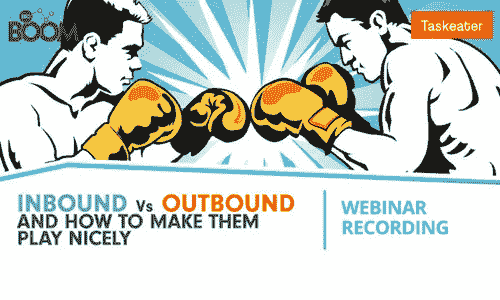
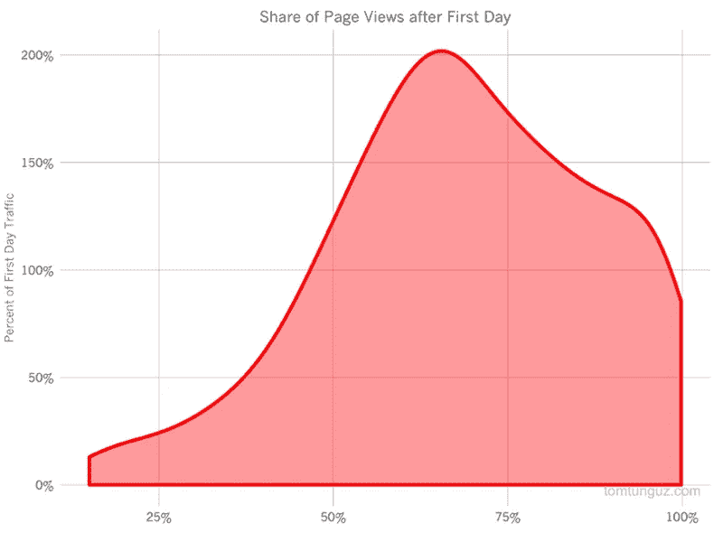
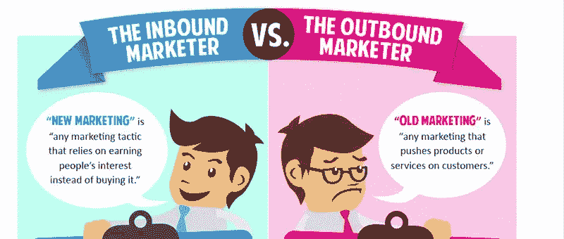

# 内向与外向——哪个真正有效？

> 原文：<https://medium.com/swlh/inbound-v-outbound-which-really-works-17bbcc7fd625>

网上有数百篇文章宣称“出境旅游已死”或“入境旅游是一种时尚”，每一篇都在驳斥另一种方法。然而，这两种方法都有优点和缺点，本文旨在对这两种方法进行诚实的评估，以便您可以为您的市场和业务目标做出正确的选择。

## **高层定义**

入站和出站方法是营销和销售方法，最终目标是产生销售线索和推动销售。

两者区别的线索就在名字中:

*   **外向**是你向潜在客户发送一条或多条信息的地方。这可能包括电子邮件推广、电话营销、横幅广告等。你正在积极寻求潜在客户的任何营销
*   **入站**是指潜在客户通过制作信息丰富、引人入胜的内容，自愿进入你的网站或邮件列表。这可以通过你的博客，下载电子书，注册时事通讯或网上研讨会等。

我现在将更详细地分析每种方法，并给你一个两种方法的优点和局限性的诚实列表。

要更全面地了解相似之处、不同之处以及您可以为您的企业利用的可能策略，请 [**收听我们与入境专家 BBD Boom**](https://www.taskeater.com/downloads/inbound-outbound-lead-generation/) 的网络研讨会。注册并接收一个完整的记录，包括幻灯片。

# 外向营销方法

对外营销和销售线索挖掘很难被贴上“过时和无效”的标签，因为它已经涵盖了太多内容。传统的对外战略包括广播、电视、报纸、杂志、直邮、广告牌和活动赞助。

由于对外营销有着如此悠久的历史，我们必须注意到，随着技术、营销策略、业务目标和行为洞察的进步，这种方法也在不断发展和多样化。电子邮件营销和推广，社交媒体推广，PPC 活动和横幅广告活动都属于外向营销，与线下策略有很大不同。

你会从入境旅行社和倾向于入境的营销咨询公司找到的许多文章并没有做出这种区分。当你在谷歌上搜索“入境与出境”时，排名最高的结果是《管道胶带营销》的这篇文章，客座作家 Jolynn Oblak 总结说，出境很昂贵，因为“印刷和邮寄材料或通过电视、广播或其他媒体传播你的信息，使它(出境营销)对小企业来说遥不可及。”

对外营销的策略大相径庭——正如我们在电子书中比较对外营销的两个关键点时所探讨的那样:[为什么电子邮件提供的会议比电话多 11 倍](https://www.taskeater.com/downloads/outbound-strategy-why-emails-deliver-11x-more-meetings-than-calls/)。

我们必须做出区分的一个原因是，尽管许多人宣称电子邮件推广已死，受众讨厌垃圾邮件，但电子邮件在 B2B 领域具有最高的投资回报率。研究表明[电子邮件是 B2B 营销人员](https://www.marketingcharts.com/online/the-channels-and-content-types-b2b-marketers-say-are-generating-leads-and-revenue-74642/attachment/demandwave-b2b-lead-revenue-generating-channels-feb2017/)最大的销售线索和创收工具，首席营销人员的[研究](http://www.chiefmarketer.com/special-reports/exclusive-b2b-lead-gen-survey/)显示，电子邮件也是 B2B 领域产生最高 ROI 销售线索的渠道。该调查在 2016 年年中对 200 多名 B2B 营销人员进行了调查，结果表明，电子邮件是交付销售线索的最佳投资回报渠道，超过了现场活动和搜索引擎优化。

# 外向营销的好处

在对外营销的辩护中，特别是对于像我们这样专注于 B2B 的公司，这是通常不会引起兴趣或追随者的企业和品牌能够确保他们仍然在他们需要创造业务的人面前获得产品的最可靠方式。

此外，还有一些更有礼貌的方式来开展对外宣传活动，不会激怒客户，其中之一就是确保你瞄准了相关的细分市场(并且确实为你的目标细分市场找到了正确的销售线索——如果你想与我们的销售线索挖掘专家交谈[请点击此处联系我们](https://www.taskeater.com/contact-us/))。

*   在你选择的人面前获取你的信息，并且**你控制他们与信息互动的方式**。你可以选择接近你的潜在客户的最佳机会和方式，如前所述，也可以选择你的信息传递的频率和相关性，以免惹恼客户。
*   **提供确定性**您的潜在客户已经以某种方式看到了您的信息或与您的信息进行了互动(他们参与的程度是另一回事)。
*   充当**市场调查的直接形式**,因为你站在你的目标受众面前，获得他们的第一手反应。
*   对于 B2B 公司来说，电子邮件的投资回报率是所有数字渠道中最高的，销售漏斗也短得多。
*   电视、广播和户外广告等线下广告，横幅广告和社交媒体赞助，让你的名字和品牌出现在人们面前，提高品牌知名度。当然，这也取决于你的活动的质量和你的目标的相关性。

# 外向营销的局限性

公平地说，对外通讯不受欢迎 Questus 的杰夫·罗森布鲁姆(Jeff Rosen Blum)**给对外通讯贴上了“本质上令人困惑、表里不一和充满狗屎”的标签**

**接收销售信息可能会令人沮丧，尤其是考虑到现在有这么多企业在销售。外向性本质上是侵入性和干扰性的，随着大量广告被提供给个人，结果是前景受挫，活动越来越没有效果。普通美国人每天会收到大约 4000 到 10000 条信息，但能被记住的不到 100 条。**

*   **以任何形式冷淡地联系他人**都会让人们**感到沮丧，并可能产生负面的回复和结果——尽管记录表明某些形式[比其他形式](https://www.taskeater.com/insights/cold-calling-millennials/)更具干扰性。**
*   ****名单和销售线索的质量**极大地影响着你得到的回应，你自己或内部寻找高质量的销售线索既费时又费钱。**
*   ****线下广告昂贵而有限的投资回报率:**
    — 45%的直邮广告从未打开( [CMO 委员会](https://www.cmocouncil.org/facts-stats-categories.php?view=all&category=direct-marketing))
    —2 亿人在全国不要打电话登记处([美国联邦贸易委员会](https://www.ftc.gov/news-events/press-releases/2010/07/national-do-not-call-registry-tops-200-million-phone-numbers))
    —85%的人快进过商业广告([美国联邦贸易委员会](https://www.ftc.gov/news-events/press-releases/2010/07/national-do-not-call-registry-tops-200-million-phone-numbers))
    —84%的 25-35 岁的人可能会点击一个有过多广告的网站([至关重要](https://vtldesign.com/digital-marketing/inbound-marketing-vs-outbound-marketing/)**
*   **接近一个没有做好销售准备的潜在客户可能意味着**错失机会**——从公司外部很难准确衡量这一点。尽管对[触发事件](https://www.taskeater.com/insights/trigger-event-selling-crm-cleansing/)的监控有助于更具战略性的方法。**

# **集客营销方法**

**与外向营销相比，内向营销是一个相对较新的领域。集客营销由 Hubspot 联合创始人兼首席执行官布莱恩·哈利根提出，自 2006 年 Hubspot 成立以来，集客营销与它一起成长。**

**有谁比创始人自己更适合定义内向呢？以下是 **Hubspot 官方对集客营销的定义:****

> ***“集客营销专注于创造高质量的内容，将人们吸引到你的公司和产品，这是他们自然想要的。通过将您发布的内容与客户的兴趣结合起来，您自然会吸引到入站流量，然后随着时间的推移，您可以转换、关闭和愉悦这些流量。”***

**这意味着什么呢？**

**入站是出站的反义词。你没有主动接触潜在客户，而是用免费的建议和信息来吸引他们，这样你的潜在客户就会主动找上你。它是内容营销、社交媒体营销、SEO(搜索引擎优化)和前端网站设计的结合，最终目的是收集完全一致和感兴趣的线索，希望这些线索以后会转化为客户。集客营销的例子包括你的公司网站和登陆页面、你的博客、你制作的任何内容、潜在客户培育(时事通讯)、你的社交媒体、网络研讨会、播客，甚至你的 LinkedIn 个人资料。**

**描述许多集客方式的另一个术语是“许可营销”，也是“干扰营销”的反义词。正如《许可营销:把陌生人变成朋友，把朋友变成顾客》一书的作者塞思·戈丁在他的博客中所说:“许可营销是一种特权(而不是权利)，可以把预期的、个人的和相关的信息传递给真正想得到它们的人。”无论你是将时事通讯或电子书发送到某人的收件箱，还是他们与你的博客或你产品的免费增值版在线互动，潜在客户都选择接收或查看你的信息。**

# **集客营销的好处**

**集客营销是关于在一个地区建立持久的权威，并在市场中赢得信任和尊重。**

*   **从建立网站、撰写内容和使用社交媒体的成本都很低的意义上来说，入境游更便宜(如果你有时间和技能的话)。根据研究，在持续五个月的集客营销后，每条线索的平均成本[下降了 80%](https://www.weidert.com/whole_brain_marketing_blog/14-statistics-that-make-the-case-for-inbound-marketing) 。**
*   **虽然漏斗更长，搜索引擎优化，SSM 和内容营销需要时间来建立一个追随者并取得成果，但效果是持久的。例如，培养脸书的追随者就是投资未来的受众。**
*   **集客确实会让你的潜在客户沮丧或恼怒，事实上集客营销人员的口头禅就是“取悦”潜在客户。**
*   **集客信息提供了一个双向沟通的平台，鼓励潜在客户积极参与您的信息传递。**
*   **集客营销吸引人们——这意味着你通过集客收集的线索更容易接受信息，因为它们已经表明了兴趣和意图。**
*   **现代买家希望控制他们的购买过程，更喜欢自己进行研究，并在准备做出购买决定时选择与供应商合作。**
*   **集客营销有复合回报——根据红点风险投资家托马兹·通古兹的说法，一篇典型的博客文章会产生[1-2 倍的流量](http://tomtunguz.com/content-marketing-compounding-returns/)，如下图所示。**

****

**Image credit: [Tomasz Tunguz](http://tomtunguz.com/content-marketing-compounding-returns/)**

# **集客营销的局限性**

**基于意图的策略在某种程度上是有意义的——但是如何将它应用到潜在客户不知道他们需要的服务上呢？以 Taskeater 为例——我们的一些数据处理服务有助于解决效率低下和公司甚至没有意识到他们可以外包的问题。如果潜在客户不寻找我们知道他们需要的东西，我们该如何向他们突破？**

*   **入境游便宜的先决条件是**‘拥有正确的技能’**——如果你不是作家、开发人员或营销人员，你将不得不寻求外包可能变得昂贵的任务，尤其是如果你想保持高标准的话。拥有小规模营销部门或初创企业的小公司将面临这个问题，因为很难找到一位首席执行官或一个人拥有如此多样的技能。**
*   **集客活动需要**持续的时间投入**来生产足够高质量的内容，以建立这种备受追捧的思想领导力。**
*   **你的集客营销活动有多有效可能很难衡量，因为**过程本来就更长** —从内容中产生稳定的业务可能需要几个月，对品牌知名度或情绪的影响**很难准确分析**。**
*   ****跟踪投资回报可能很困难**即使有网络分析，因为从收集的数据中准确描绘行为本身就是一项技能，永远不可能完全准确。漏斗越长，衡量成功就越难。**

# **不应该非此即彼…**

**所以你可能已经注意到，我并没有对这两种情况做出明确的解释——这是因为我不确定是否存在一种客观上“最好”的情况。这种争论本质上会表现出一种“最好”的观点，但对你的公司来说可能并非如此。**

**一个包罗万象的营销和销售策略的建议无异于一个噱头。是的，有些事情做得很好，有些事情在你的领域或行业中有更高的统计概率，是的，但没有一篇在线文章会告诉你如何成为入境或出境的成功故事。你必须找到适合你的客户和市场的方法。**

**在撰写本文时，我想避免的一件事是让一种方法与另一种方法对立起来——因为从根本上说，两者的元素可以结合起来产生结果。**

**这张关于 [Zac Gregg 的图片来自 Vital 的文章](https://vtldesign.com/digital-marketing/inbound-marketing-vs-outbound-marketing/)比较入境游和出境游，虽然这是一篇关于入境游的好文章，但确实表明了一定程度的偏差:**

****

**Image Credit: [Vital](https://vtldesign.com/digital-marketing/inbound-marketing-vs-outbound-marketing/)**

**你不需要决定向内或向外，事实上，要从任何一方面推动结果，你需要另一方面的元素来支持活动和活动。例如:当与视频内容或白皮书配合使用时，出站电子邮件营销会做得更好，而入站内容营销可以通过电子邮件外联来吸引读者。**

**如需了解更多关于出站策略以及如何获得更多会议的信息[**注册我们的销售线索生成简讯**](https://www.taskeater.com/newsletter-subscription/) 但要更全面地了解入站和出站方法的相似性、差异和组合，请查看我们的网络研讨会记录**和入站 Hubspot 机构 BBD Boom。****

********

# ****丹·范伦宁的文章****

****Taskeater 的常务董事，Taskeater 以前的客户之一。他有 16 年的销售经验，两个男孩，热爱橄榄球。[在 LinkedIn 上连接。](https://www.linkedin.com/in/dan-vanrenen/)****

********

## ****这个故事发表在 [The Startup](https://medium.com/swlh) 上，这是 Medium 最大的创业刊物，拥有 313，216+人关注。****

## ****在这里订阅接收[我们的头条新闻](http://growthsupply.com/the-startup-newsletter/)。****

********